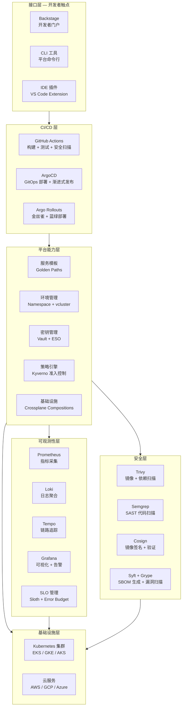
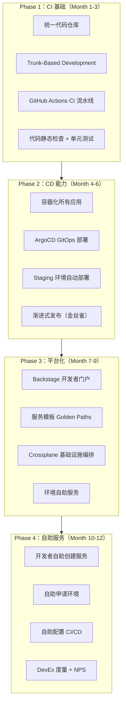

# 实践案例：企业级持续交付平台构建

## 背景与问题定义

前面 36 篇文章从基础概念、配置管理、构建系统、测试策略、部署发布、环境管理、平台工程、可观测性、安全合规等维度，分别阐述了持续交付的理论与实践。这一讲把它们综合成一个端到端的实践案例，看如何从零构建一个企业级持续交付平台。

核心问题：**如何将前述各模块的最佳实践整合为一个可落地的企业级持续交付平台？**

## 核心概念

### 平台选型决策

| 组件 | 选型 | 关键决策记录（ADR） |
|------|------|-------------------|
| 开发者门户 | Backstage | ADR-01：选 Backstage 而非自建——CNCF 孵化项目，200+ 插件生态，Spotify/Expedia/NASA 验证 |
| CI 引擎 | GitHub Actions | ADR-02：选 GitHub Actions 而非 Jenkins——云原生、无需维护、Reusable Workflows 支持平台化 |
| CD 引擎 | ArgoCD | ADR-03：选 ArgoCD 而非 Flux——CNCF 毕业项目、UI 更完善、ApplicationSet 多集群支持 |
| 基础设施编排 | Crossplane | ADR-04：选 Crossplane 而非 Terraform——K8s 原生、GitOps 兼容、Composition 复用模式 |
| 可观测性 | Grafana Stack | ADR-05：选 Grafana Stack（Prometheus+Loki+Tempo）而非 Datadog——开源、成本可控 |
| 密钥管理 | Vault + ESO | ADR-06：选 Vault + External Secrets Operator——Vault 功能全面，ESO 实现 K8s 原生同步 |
| 策略引擎 | Kyverno | ADR-07：选 Kyverno 而非 OPA——K8s 原生、策略即资源、无需学习 Rego |

### 平台架构全景图



## 架构设计

### 平台实施路线图



### 度量体系设计

| 度量维度 | 指标 | 采集方式 | Phase 1 基线 | Phase 4 目标 |
|---------|------|---------|-------------|-------------|
| DORA - 部署频率 | 次/周 | 部署系统日志 | 1 次/周 | 按需 |
| DORA - 变更前置时间 | 小时 | Git + 部署系统 | 168h | < 1h |
| DORA - 变更失败率 | % | 事故系统 | 15% | < 5% |
| DORA - MTTR | 小时 | 监控系统 | 24h | < 1h |
| DevEx - 新服务上线时间 | 小时 | 平台日志 | 72h | < 1h |
| DevEx - 环境就绪时间 | 小时 | 平台日志 | 48h | < 15min |
| 平台 - 采纳率 | % | 服务目录统计 | 0% | > 70% |
| 平台 - 自助服务率 | % | 操作日志 | 0% | > 80% |
| 平台 - 开发者 NPS | 分 | 季度调查 | N/A | > 30 |

## 实现方案

### Backstage 集成配置

Backstage 作为开发者门户的核心，集成所有平台能力：

```yaml
# app-config.yaml — Backstage 核心配置
app:
  title: Engineering Platform
  baseUrl: https://portal.example.com

organization:
  name: Example Corp

catalog:
  rules:
    - allow: [Component, System, API, Resource, Location, Template]
  locations:
    # 组织定义
    - type: url
      target: https://github.com/platform/org-catalog/blob/main/catalog-info.yaml
      rules:
        - allow: [User, Group]

    # 模板定义
    - type: url
      target: https://github.com/platform/templates/blob/main/template-index.yaml
      rules:
        - allow: [Template]

    # 自动发现所有服务的 catalog-info.yaml
    - type: url
      target: https://github.com/platform/service-catalog/blob/main/all-services.yaml

auth:
  environment: production
  providers:
    github:
      production:
        clientId: ${GITHUB_CLIENT_ID}
        clientSecret: ${GITHUB_CLIENT_SECRET}

# Kubernetes 集成
kubernetes:
  serviceLocatorMethod:
    type: multiTenant
  clusterLocatorMethods:
    - type: config
      clusters:
        - name: production
          url: https://k8s-api.example.com
          authProvider: serviceAccount
          skipTLSVerify: false
          caData: ${K8S_CA_DATA}
          serviceAccountToken: ${K8S_SA_TOKEN}
        - name: staging
          url: https://k8s-api-staging.example.com
          authProvider: serviceAccount
          caData: ${K8S_STAGING_CA_DATA}
          serviceAccountToken: ${K8S_STAGING_SA_TOKEN}

# ArgoCD 集成
argocd:
  appLocatorMethods:
    - type: config
      instances:
        - name: production
          url: https://argocd.example.com
          token: ${ARGOCD_TOKEN}
        - name: staging
          url: https://argocd-staging.example.com
          token: ${ARGOCD_STAGING_TOKEN}
```

### 标准化 CI/CD 模板

通过 GitHub Actions Reusable Workflows 实现平台级的标准化流水线模板：

```yaml
# .github/workflows/platform-ci.yml — 平台级 CI 模板
name: Platform CI Template

on:
  workflow_call:
    inputs:
      service-name:
        required: true
        type: string
      language:
        required: true
        type: string
        description: "go | node | python | java"
      run-integration-tests:
        required: false
        type: boolean
        default: false

jobs:
  # 阶段一：代码检查
  lint:
    runs-on: ubuntu-latest
    steps:
      - uses: actions/checkout@v4
      - name: Run linter
        uses: ./.github/actions/lint
        with:
          language: ${{ inputs.language }}

  # 阶段二：测试
  test:
    runs-on: ubuntu-latest
    needs: lint
    steps:
      - uses: actions/checkout@v4
      - name: Run unit tests
        uses: ./.github/actions/test
        with:
          language: ${{ inputs.language }}
      - name: Run integration tests
        if: inputs.run-integration-tests
        uses: ./.github/actions/integration-test

  # 阶段三：安全扫描
  security:
    runs-on: ubuntu-latest
    needs: test
    container:
      image: semgrep/semgrep
    steps:
      - uses: actions/checkout@v4
      - name: SAST scan
        run: semgrep scan --config auto --sarif --output semgrep.sarif
      - name: Generate SBOM（依赖可见性）
        uses: anchore/sbom-action@v0
        with:
          image: ${{ inputs.service-name }}
      - name: Container scan
        uses: aquasecurity/trivy-action@master

  # 阶段四：构建
  build:
    runs-on: ubuntu-latest
    needs: security
    permissions:
      packages: write
      id-token: write  # Cosign keyless 签名需要
    steps:
      - uses: actions/checkout@v4
      - name: Build and push container image
        uses: ./.github/actions/build
        with:
          service-name: ${{ inputs.service-name }}
          registry: ghcr.io
      - name: Install Cosign
        uses: sigstore/cosign-installer@v3
      - name: Sign image
        run: cosign sign --yes ghcr.io/${{ github.repository }}:${{ github.sha }}

  # 阶段五：部署到 Staging
  deploy-staging:
    needs: build
    runs-on: ubuntu-latest
    environment: staging
    steps:
      - name: ArgoCD sync (staging)
        run: |
          argocd app sync ${{ inputs.service-name }}-staging
          argocd app wait ${{ inputs.service-name }}-staging --health

  # 阶段六：部署到 Production（金丝雀）
  deploy-production:
    needs: deploy-staging
    runs-on: ubuntu-latest
    environment: production
    steps:
      - name: Argo Rollouts promote
        run: |
          kubectl argo rollouts promote ${{ inputs.service-name }} -n production
```

### 服务团队使用示例

服务团队只需一行配置即可使用平台标准流水线：

```yaml
# 服务团队的 .github/workflows/ci.yml — 仅需一行
name: CI
on:
  push:
    branches: [main]
  pull_request:

jobs:
  ci:
    uses: platform-org/platform-workflows/.github/workflows/platform-ci.yml@v1
    with:
      service-name: orders-service
      language: go
      run-integration-tests: true
    secrets: inherit
```

### Kyverno 平台策略集

```yaml
# 平台级策略：强制标准标签
apiVersion: kyverno.io/v1
kind: ClusterPolicy
metadata:
  name: platform-standard-labels
spec:
  # Kyverno 1.13+ 使用 failurePolicy（旧字段已废弃）
  failurePolicy: enforce
  rules:
    - name: require-standard-labels
      match:
        resources:
          kinds: [Deployment, StatefulSet]
      validate:
        message: "所有部署必须包含平台标准标签"
        pattern:
          metadata:
            labels:
              app.kubernetes.io/name: "?*"
              app.kubernetes.io/team: "?*"
              app.kubernetes.io/version: "?*"
              environment: "?*"
---
# 平台级策略：禁止 latest 标签
apiVersion: kyverno.io/v1
kind: ClusterPolicy
metadata:
  name: disallow-latest-tag
spec:
  # Kyverno 1.13+ 使用 failurePolicy（旧字段已废弃）
  failurePolicy: enforce
  rules:
    - name: require-image-digest
      match:
        resources:
          kinds: [Deployment]
      validate:
        message: "镜像必须使用 Digest 而非 Tag"
        pattern:
          spec:
            template:
              spec:
                containers:
                  - image: "!*:latest"
---
# 平台级策略：强制资源限制
apiVersion: kyverno.io/v1
kind: ClusterPolicy
metadata:
  name: require-resource-limits
spec:
  # Kyverno 1.13+ 使用 failurePolicy（旧字段已废弃）
  failurePolicy: enforce
  rules:
    - name: check-resource-limits
      match:
        resources:
          kinds: [Deployment]
      validate:
        message: "所有容器必须设置 CPU 和 Memory limits"
        pattern:
          spec:
            template:
              spec:
                containers:
                  - resources:
                      limits:
                        memory: "?*"
                        cpu: "?*"
                      requests:
                        memory: "?*"
                        cpu: "?*"
```

## 最佳实践

### 实施经验教训

| 经验 | 详情 | 适用阶段 |
|------|------|---------|
| 先 CI 后 CD | 先建立可靠的 CI 流水线，再构建 CD 能力 | Phase 1-2 |
| 先 Staging 后 Production | 先在 Staging 验证所有流程，再推广到 Production | Phase 2 |
| 先模板后自助 | 先提供标准化模板，再开放自助服务 | Phase 3-4 |
| 先采纳后优化 | 先追求团队采纳率，再优化平台能力 | Phase 3-4 |
| 度量先行 | 每个阶段开始前先建立基线度量 | 所有阶段 |

### 常见陷阱与规避

| 陷阱 | 表现 | 规避方法 |
|------|------|---------|
| 大爆炸上线 | 一次性迁移所有团队到新平台 | 渐进采纳，新项目优先 |
| 平台孤岛 | 平台团队不与开发团队沟通 | 定期用户访谈、NPS 调查 |
| 过度标准化 | 所有服务必须走同一条路径 | 黄金路径而非强制路径 |
| 忽视文档 | 平台功能强大但文档缺失 | 文档优先，Backstage TechDocs |
| 忘记度量 | 做了大量工作但无法证明效果 | 每个阶段建立度量基线和目标 |

## 效果度量

### 平台 ROI 估算

| 收益项 | 估算方法 | 年化收益 |
|--------|---------|---------|
| 新服务上线时间缩短 | 从 72h → 1h，50 个服务/年 | 节省 3,550 工程小时 |
| 环境就绪时间缩短 | 从 48h → 15min，200 次环境申请/年 | 节省 9,550 工程小时 |
| 发布频率提升 | 从 1 次/周 → 按需，更快市场响应 | 业务收益（难以量化） |
| 变更失败率降低 | 从 15% → 5%，减少生产事故 | 减少事故损失 |
| 运维工单减少 | 自助服务替代 50% 的运维工单 | 节省运维人力 |

## 总结

### 核心要点

1. 企业级持续交付平台的核心组件：Backstage（门户）+ GitHub Actions（CI）+ ArgoCD（CD）+ Crossplane（IaC）+ Grafana Stack（可观测性）
2. 实施路线图分四阶段：CI 基础 → CD 能力 → 平台化 → 自助服务，每阶段 3 个月
3. Reusable Workflows 实现流水线标准化——服务团队一行配置即可使用平台模板
4. Kyverno 策略集实现平台级治理——标准标签、禁止 latest 标签、强制资源限制
5. 度量体系覆盖 DORA + DevEx + 平台采纳三个维度，每个阶段建立基线和目标

### 延伸阅读

- Backstage. *Official Documentation*. https://backstage.io/docs/
- ArgoCD. *Official Documentation*. https://argo-cd.readthedocs.io/
- Crossplane. *Official Documentation*. https://docs.crossplane.io/
- CNCF. *Platform Engineering White Paper*. https://tag-app-delivery.cncf.io/whitepapers/platform-eng/
- Team Topologies. *Official Site*. https://teamtopologies.com/