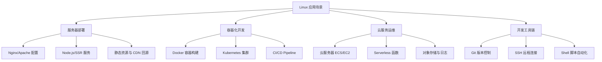
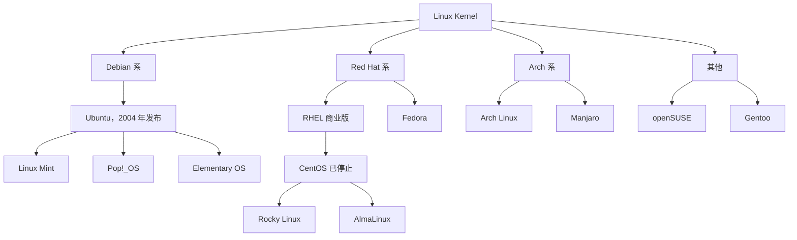
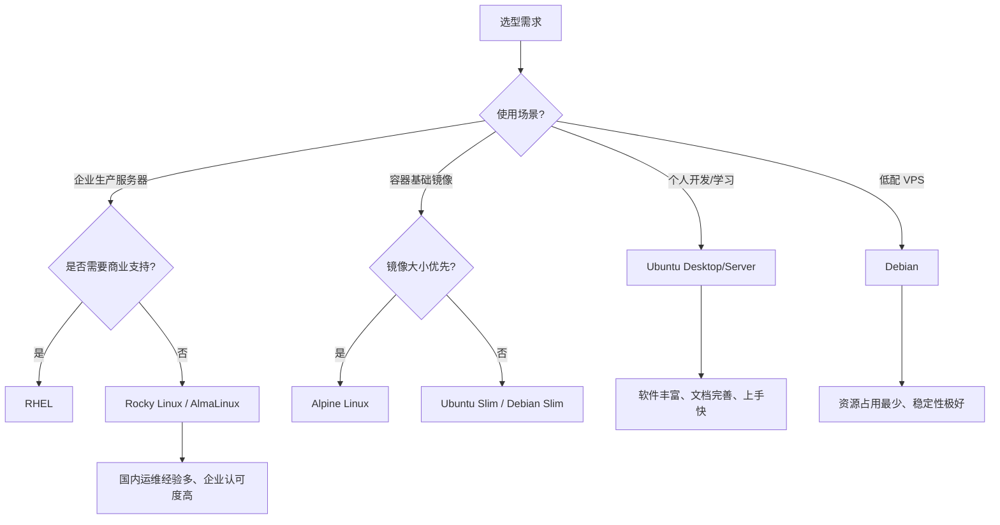
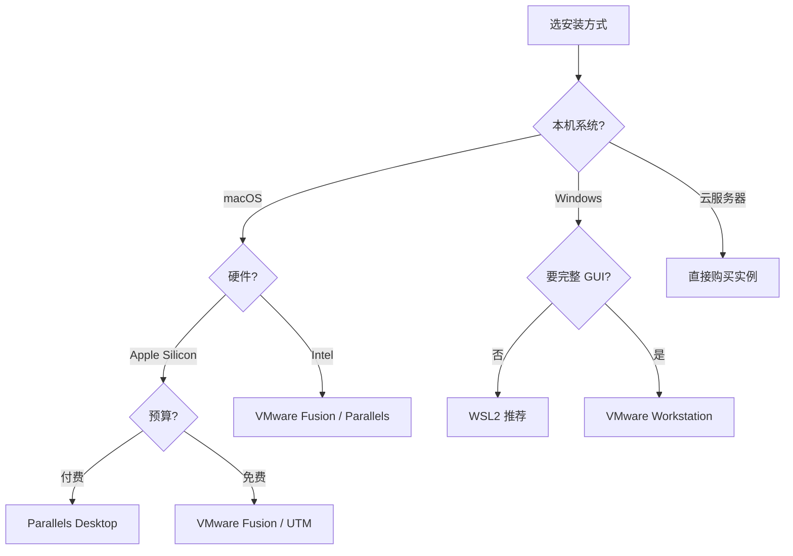

# Linux 发行版选型与生态全景

## 一、模块介绍

本模块系统梳理 Linux 发行版家族谱系、核心差异与选型决策模型，帮助开发者建立服务器端操作系统的全局认知。

### 1.1 前置知识

- 了解操作系统的基本概念（内核、Shell、文件系统）
- 有云服务器或虚拟机使用经验者更佳

### 1.2 学习目标

- 理解 Linux 内核（Kernel）与发行版（Distribution）的关系
- 掌握 Debian 系 / Red Hat 系 / Arch 系三大阵营的差异
- 能根据业务场景做出合理的发行版选型决策

### 1.3 为什么需要 Linux

| 场景 | Linux 占比 | 与开发工作的关联 |
|------|-----------|----------------|
| 服务器端 | 95%+ | Nginx 部署、Node.js 服务、静态资源托管 |
| 容器化环境 | 99%+ | Docker 镜像基于 Linux、K8s 集群调度 |
| CI/CD 流水线 | 90%+ | Jenkins/GitLab CI Runner 运行在 Linux |
| 云服务基础设施 | 95%+ | ECS/EC2/Serverless 底层均为 Linux |

### 图：Linux 应用场景图谱



上图展示了开发场景中 Linux 的四大落点：服务器部署、容器化开发、云服务运维与开发工具链。无论做前端构建、后端服务还是大数据处理，Linux 都是底层基础设施的事实标准，掌握发行版选型是开展后续运维工作的第一步。

### 1.4 Linux 核心优势（对比 Windows Server）

| 维度 | Linux | Windows Server |
|------|-------|---------------|
| 性能 | 相同硬件下资源占用更低 | GUI 开销大 |
| 稳定性 | 可连续运行数年不重启 | 需定期重启更新 |
| 安全性 | 权限模型严格，攻击面小 | 病毒和恶意软件多 |
| 成本 | 免费开源，无授权费 | 按核心数收费 |
| 自动化 | Shell/Ansible 原生支持 | PowerShell 生态较封闭 |
| 容器支持 | Docker/K8s 原生运行 | 需 WSL2 或 Hyper-V |

---

## 二、核心方法论

### 2.1 三大阵营架构

### 图：发行版家族谱系



上图给出了 Linux 发行版的核心谱系：所有发行版共享同一内核（Kernel），但在其上衍生出 Debian、Red Hat、Arch 三大主流阵营，外加 openSUSE、Gentoo 等分支。理解谱系有助于判断某发行版的软件生态、包管理器风格与支持周期。

### 2.2 关键时间线

| 年份 | 事件 | 影响 |
|------|------|------|
| 1991 | Linus Torvalds 发布 Linux 内核 | 开源操作系统诞生 |
| 1993 | Debian 发布 | 最古老的社区发行版，Ubuntu 的上游 |
| 1994 | Red Hat 成立 | 商业化 Linux 的开端 |
| 2004 | Ubuntu 发布 | 降低 Linux 桌面门槛，迅速占领开发者市场 |
| 2020 | CentOS 宣布停止维护 | 企业服务器格局重塑 |
| 2021 | Rocky Linux / AlmaLinux 兴起 | CentOS 社区替代品 |

### 2.3 主流发行版定位对比

#### Ubuntu

| 项目 | 说明 |
|------|------|
| 维护方 | Canonical 公司 |
| 基于 | Debian |
| 更新周期 | 每 6 个月一个版本，LTS 每 2 年（支持 5 年） |
| 包管理器 | apt / dpkg / snap |
| 默认桌面 | GNOME |

核心优势：软件源最丰富，PPA 第三方源生态完善；社区文档全球最大，问题排查效率高；云厂商（AWS/Azure/GCP）官方镜像支持最好；驱动自动识别，硬件兼容性最佳。适用场景：个人开发环境、云服务器、CI/CD Runner。

#### Rocky Linux / AlmaLinux（CentOS 替代）

| 项目 | 说明 |
|------|------|
| 维护方 | Rocky: CentOS 创始人 / Alma: CloudLinux |
| 基于 | RHEL 源码重编译 |
| 更新周期 | 与 RHEL 同步，10 年支持 |
| 包管理器 | yum / dnf / rpm |
| 默认桌面 | 通常无 GUI（Server 模式） |

核心优势：与 RHEL 二进制兼容，企业软件无缝迁移；国内运维经验积累最深（原 CentOS 生态）；稳定性优先，软件版本经过充分验证。适用场景：企业生产服务器、国内传统运维体系。

#### Debian

| 项目 | 说明 |
|------|------|
| 维护方 | Debian 社区（纯志愿者） |
| 基于 | 原生发行版 |
| 特点 | 极度稳定、最小安装仅 500MB |
| 包管理器 | apt / dpkg |

适用场景：低配 VPS（512MB 内存）、追求极致稳定的基础设施。

#### RHEL（商业版）

| 项目 | 说明 |
|------|------|
| 维护方 | Red Hat（IBM 子公司） |
| 授权 | 商业订阅制 |
| 特点 | 10 年技术支持、SELinux、认证生态 |

适用场景：金融/政府/大型企业核心系统。

---

## 三、关键流程

### 3.1 发行版选型决策流程

### 图：选型决策模型



上图为发行版选型的核心决策树：首先判断使用场景，个人开发选择 Ubuntu，企业生产看是否需要商业支持（需要则 RHEL，否则 Rocky/Alma），低配 VPS 选 Debian，容器基础镜像按体积需求在 Alpine 与 Slim 镜像间取舍。实际选型前先走一遍该流程，可避免踩到生态不匹配的坑。

### 3.2 前端团队典型选型建议

| 环境 | 推荐 | 理由 |
|------|------|------|
| 本地开发（macOS） | Docker Desktop + Ubuntu 容器 | 与生产环境一致 |
| 本地开发（Windows） | WSL2 + Ubuntu 24.04 LTS | 性能优于虚拟机 |
| CI/CD Runner | Ubuntu Server 24.04 LTS | 软件源丰富，Node.js/Docker 支持好 |
| 生产服务器（国内） | Rocky Linux 9 | 企业认可度高，运维人才多 |
| 生产服务器（海外） | Ubuntu Server 24.04 LTS | 云厂商支持最好 |
| Docker 基础镜像 | node:22-alpine | 镜像体积小（~130MB） |

### 3.3 安装方式对比

| 方式 | 优点 | 缺点 | 适用人群 |
|------|------|------|---------|
| WSL2 | 轻量、与 Windows 深度集成 | 非完整内核，部分功能受限 | Windows 开发者 |
| 虚拟机（VMware/UTM） | 完整隔离、可快照 | 性能损耗 10-20% | 需要完整 Linux 体验 |
| 双系统 | 性能完整 | 切换麻烦、磁盘分区风险 | 长期 Linux 用户 |
| 云服务器 | 真实生产环境 | 需付费 | 部署实战 |
| Docker | 秒级启动、环境一致 | 非完整 OS | 特定服务运行 |

### 图：安装方式决策



上图给出了安装方式的选择路径，兼顾宿主机系统（macOS/Windows）、硬件（Apple Silicon/Intel）、预算与完整性需求。macOS Apple Silicon 用户建议阅读下表的虚拟化软件对比。

#### macOS Apple Silicon 用户注意

| 虚拟化软件 | 推荐度 | 说明 |
|-----------|--------|------|
| VMware Fusion | 高 | 个人与商用均已免费，ARM 支持好 |
| Parallels Desktop | 高 | 性能最佳，需付费 |
| UTM | 中 | 免费开源，功能较简单 |
| VirtualBox | 低 | ARM 支持成熟度有限 |

---

## 四、工具与实践

### 4.1 包管理器差异

#### 命令对照表

| 操作 | Ubuntu (APT) | Rocky/CentOS (YUM/DNF) |
|------|-------------|----------------------|
| 更新源索引 | `apt update` | `yum makecache` |
| 安装软件 | `apt install -y pkg` | `yum install -y pkg` |
| 卸载软件 | `apt remove pkg` | `yum remove pkg` |
| 升级全部 | `apt upgrade` | `yum update` |
| 搜索软件 | `apt search keyword` | `yum search keyword` |
| 查看已安装 | `dpkg -l` | `rpm -qa` |
| 安装本地包 | `dpkg -i pkg.deb` | `rpm -ivh pkg.rpm` |

#### 软件源配置

```bash
# Ubuntu: /etc/apt/sources.list
# 替换为阿里云镜像
deb http://mirrors.aliyun.com/ubuntu/ jammy main restricted universe multiverse
deb http://mirrors.aliyun.com/ubuntu/ jammy-updates main restricted universe multiverse

# CentOS/Rocky: /etc/yum.repos.d/
# 替换 baseurl 为国内镜像
baseurl=https://mirrors.aliyun.com/rockylinux/$releasever/BaseOS/$basearch/os/
```

#### 国产系统与桌面环境

国产桌面多基于 Linux：麒麟系统（政务办公）、统信 UOS（Deepin 商业版）、深度 Deepin（界面美观、生态好）。主流桌面环境包括 GNOME（类 macOS）、KDE Plasma（类 Windows）、Cinnamon（经典简洁）、Xfce（极简轻量，适合老旧硬件）。

#### 学习路线建议

按阶段递进，避免一上来就啃生产环境：

- **入门**：选 Ubuntu Desktop，装虚拟机或 WSL2，熟悉 GUI 与基础命令
- **进阶**：Ubuntu Server，练习服务配置（Nginx、MySQL）与 Shell 脚本
- **生产**：CentOS/Rocky Linux，学习企业运维、防火墙与安全加固
- **扩展**：Debian 底层原理、容器化（Docker/K8s）、CI/CD 与监控告警

| 阶段 | 系统 | 学习重点 |
| --- | --- | --- |
| 入门 | Ubuntu Desktop | GUI 操作、基础命令 |
| 进阶 | Ubuntu Server | 服务配置、脚本编写 |
| 生产 | CentOS/Rocky | 企业运维、稳定性 |
| 扩展 | Debian | 底层原理、优化 |

---

## 五、常见坑点

| 问题 | 原因 | 解决方案 |
|------|------|---------|
| Ubuntu 软件版本过旧 | LTS 稳定优先策略 | 使用 PPA 或 snap 获取新版 |
| CentOS/Rocky 找不到包 | EPEL 源未配置 | `yum install -y epel-release` |
| 新硬件驱动不兼容 | 内核版本过低 | 选择 Ubuntu（驱动支持最全） |
| 虚拟机内存不足 | 桌面环境占用大 | 使用 Server 版或 Debian 最小安装 |
| M1/M2 虚拟机性能差 | x86 模拟开销 | 使用 ARM 版镜像（aarch64） |

---

## 六、进阶扩展与参考

### 6.1 最佳实践

1. **开发-生产一致性**：本地 Docker 容器与生产服务器使用相同基础镜像
2. **LTS 优先**：生产环境永远选择 LTS/长期支持版本
3. **国内镜像源**：首次安装后立即替换为阿里云/清华镜像，避免下载超时
4. **最小化安装**：服务器不需要 GUI，选择 Minimal Install 减少攻击面
5. **及时跟进 CentOS 替代**：新项目直接使用 Rocky Linux 10 或 AlmaLinux 10（基于 RHEL 10 源码重编译）

### 6.2 延伸阅读

- [Ubuntu 官方文档](https://ubuntu.com/server/docs)
- [Rocky Linux 官方文档](https://docs.rockylinux.org/)
- [Linux 发行版家族树（维基百科）](https://en.wikipedia.org/wiki/Linux_distribution)
- [Docker 官方镜像库](https://hub.docker.com/_/ubuntu)