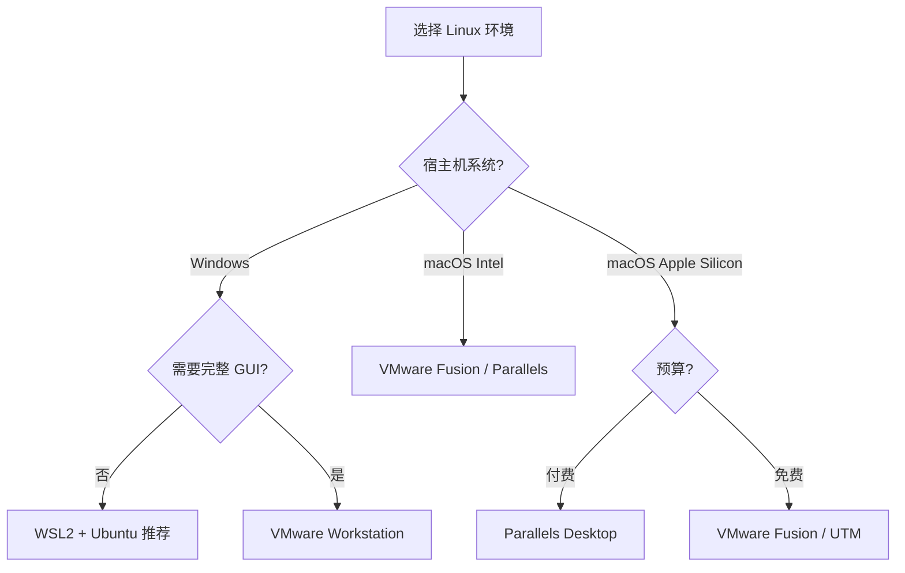
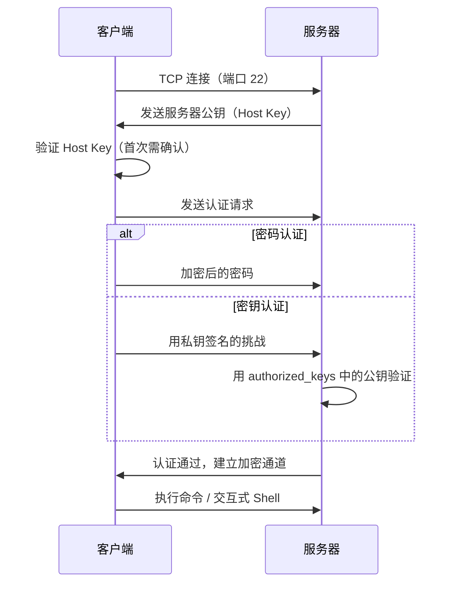
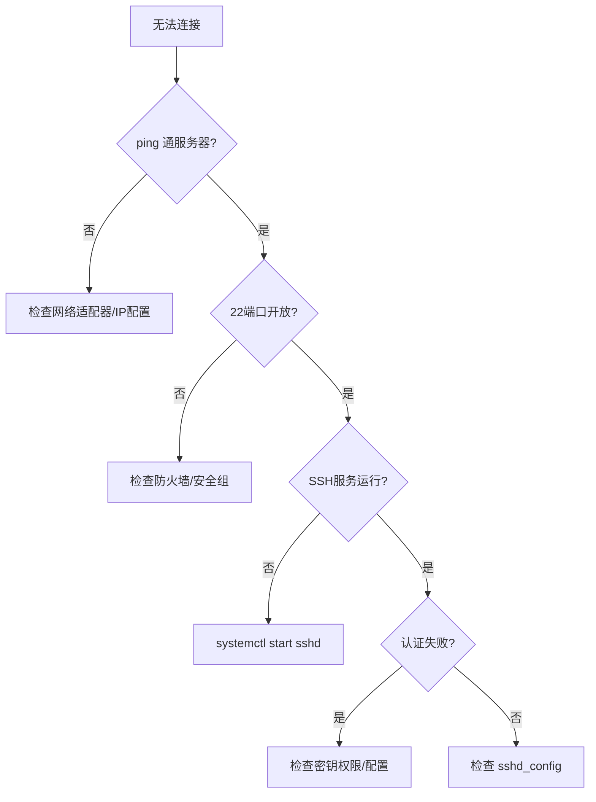

# Linux 环境搭建与 SSH 远程连接

## 一、模块介绍

本模块讲解如何从零搭建 Linux 开发环境（虚拟机/WSL2/云服务器），并配置 SSH（Secure Shell，安全外壳协议）远程连接与密钥认证，建立高效的远程开发工作流。

### 1.1 前置知识

- 了解虚拟化基本概念（宿主机、Guest OS 客户机操作系统）
- 具备基本的终端/命令行操作能力

### 1.2 学习目标

- 掌握主流虚拟化方案的选型与安装
- 完成 Ubuntu Server / Rocky Linux 的系统安装
- 配置 SSH 密钥（Key）认证实现免密登录
- 排查网络连接与 SSH 服务的常见问题

---

## 二、核心方法论

### 2.1 环境方案选型

### 图：环境方案决策



上图给出了本地环境搭建的核心分叉逻辑：Windows 用户优先考虑 WSL2（按需是否要完整图形界面），macOS 用户则按硬件架构与预算在 Parallels、VMware Fusion 与 UTM 之间选择。方法上先定宿主机，再定虚拟化形态，避免盲目安装。

| 方案 | 性能 | 隔离性 | 适用场景 |
|------|------|--------|---------|
| WSL2 | 接近原生 | 中（共享内核） | Windows 日常开发 |
| 虚拟机 | 损耗 10-20% | 高（完整隔离） | 需要快照/多系统 |
| 云服务器 | 原生 | 完全隔离 | 生产环境模拟 |
| Docker | 接近原生 | 中（共享内核） | 服务级隔离 |

### 2.2 虚拟机资源配置建议

| 用途 | CPU | 内存 | 磁盘 | 网络模式 |
|------|-----|------|------|---------|
| 学习/开发 | 2 核 | 2-4 GB | 40 GB | NAT |
| 模拟生产 | 4 核 | 8 GB | 100 GB | 桥接 |
| CI/CD 测试 | 2 核 | 4 GB | 60 GB | NAT |

### 2.3 虚拟机网络模式

| 模式 | 说明 | 适用场景 |
|------|------|---------|
| NAT | 虚拟机通过宿主机上网，外部不可访问 | 学习开发（推荐） |
| 桥接 | 虚拟机获得独立 IP，与宿主机同网段 | 模拟真实服务器 |
| Host-Only | 仅宿主机可访问虚拟机 | 安全隔离测试 |

---

## 三、关键流程

### 3.1 Ubuntu Server 安装流程

### 图：Ubuntu 安装流程


上图展示了 Ubuntu Server 的完整安装链路。关键节点有两个：一是网络配置选择 DHCP（Dynamic Host Configuration Protocol，动态主机配置协议）自动获取，二是务必勾选 OpenSSH Server 组件，否则安装后无法远程连接。整个流程环环相扣，任一节点配置缺失都会影响后续远程运维。

关键配置项：

| 步骤 | 配置 | 说明 |
|------|------|------|
| 网络 | DHCP 自动获取 | 避免手动配置出错 |
| 镜像源 | 阿里云/清华 | 国内环境加速下载 |
| 存储 | Use an entire disk | 自动分区（/、/boot、swap） |
| SSH | Install OpenSSH server | **必选**，否则无法远程连接 |

安装后验证：

```bash
# 登录系统
ubuntu login: username
Password: ********

# 查看 IP 地址
ip addr show
# 关注 eth0/ens33 的 inet 字段

# 确认 SSH 服务运行
systemctl status ssh
# 应显示 active (running)
```

### 3.2 Rocky Linux / CentOS 安装要点

#### 与 Ubuntu 的差异

| 配置项 | Ubuntu Server | Rocky Linux |
|--------|--------------|-------------|
| 安装界面 | Subiquity（现代） | Anaconda（传统） |
| 软件选择 | 默认最小安装 | 需手动选 Minimal Install |
| 网络 | 自动启用 | 需手动开启 ONBOOT=yes |
| SSH | 安装时勾选 | 默认已安装 |
| 防火墙 | ufw（默认关闭） | firewalld（默认开启） |

网络配置（关键差异）：

```bash
# Rocky Linux 9 默认使用 NetworkManager 管理网络
# （RHEL 8 及更早版本的 network-scripts / ifcfg-ens33 方式已废弃）

# 查看网卡与连接名
nmcli device status

# 确保网卡开机自动连接（等价于旧版 ONBOOT=yes）
sudo nmcli connection modify ens33 connection.autoconnect yes

# 应用配置
sudo nmcli connection up ens33

# 验证
ip addr show
```

防火墙放行 SSH：

```bash
# Rocky Linux 默认开启防火墙，需放行 22 端口
sudo firewall-cmd --add-port=22/tcp --permanent
sudo firewall-cmd --reload

# 验证
sudo firewall-cmd --list-ports
```

### 3.3 SSH 连接与密钥认证流程

### 图：SSH 密钥认证建立流程


上图为免密登录的标准落地流程：先在本地生成密钥对，再把公钥（Public Key）追加到服务器的 `authorized_keys`，随后必须设置正确的目录与文件权限，否则 SSH 会拒绝使用密钥。测试通过后再考虑在服务端禁用密码登录（PasswordAuthentication no），务必先测后禁，避免锁死自己。

### 3.4 SSH 协议工作原理

### 图：SSH 连接时序



上图描述了 SSH 的加密与认证时序：客户端先建立 TCP（Transmission Control Protocol，传输控制协议）连接并验证服务器公钥（Host Key），随后选择密码或密钥方式完成认证，认证通过后建立全加密的通信通道。理解这个时序，能帮助你顺着环节排查"连不上"到底发生在哪一步。

---

## 四、工具与实践

### 4.1 基本连接

```bash
# 基本语法
ssh username@ip_address

# 指定端口
ssh -p 2222 username@ip_address

# 首次连接会提示确认 Host Key
# Are you sure you want to continue connecting (yes/no)?
# 输入 yes 后，Host Key 保存到 ~/.ssh/known_hosts
```

### 4.2 SSH 客户端配置（简化登录）

```bash
# ~/.ssh/config
Host dev
    HostName 192.168.31.77
    User tommark
    Port 22
    IdentityFile ~/.ssh/id_ed25519

Host production
    HostName api.example.com
    User deploy
    Port 2222
    IdentityFile ~/.ssh/production_key
    ServerAliveInterval 60

# 使用别名连接
ssh dev
# 等价于: ssh -i ~/.ssh/id_ed25519 tommark@192.168.31.77
```

### 4.3 常用 SSH 客户端工具

| 工具 | 平台 | 特点 |
|------|------|------|
| Terminal / iTerm2 | macOS | 原生体验，iTerm2 支持分屏 |
| Windows Terminal | Windows | 微软官方，支持 WSL/PowerShell |
| Termius | 全平台 | 跨设备同步，团队共享 |
| Xshell | Windows | 功能丰富，个人免费 |
| MobaXterm | Windows | 集成 SFTP/X11 |
| PuTTY | Windows | 经典免费 |

### 4.4 生成密钥对

```bash
# 推荐 Ed25519（更安全、更快）
ssh-keygen -t ed25519 -C "your_email@example.com"

# 或 RSA 4096（兼容性更好）
ssh-keygen -t rsa -b 4096 -C "your_email@example.com"

# 生成文件：
# ~/.ssh/id_ed25519      ← 私钥（绝不泄露）
# ~/.ssh/id_ed25519.pub  ← 公钥（可公开）
```

### 4.5 上传公钥

```bash
# 方式一：ssh-copy-id（推荐）
ssh-copy-id username@192.168.31.77

# 方式二：手动复制
cat ~/.ssh/id_ed25519.pub | ssh username@192.168.31.77 \
  "mkdir -p ~/.ssh && cat >> ~/.ssh/authorized_keys"
```

### 4.6 服务器端权限设置

```bash
# 权限必须正确，否则 SSH 会拒绝使用密钥
chmod 700 ~/.ssh
chmod 600 ~/.ssh/authorized_keys

# 确认所有者
chown -R $USER:$USER ~/.ssh
```

### 4.7 禁用密码登录（生产环境推荐）

```bash
# /etc/ssh/sshd_config
PubkeyAuthentication yes
PasswordAuthentication no
PermitEmptyPasswords no
PermitRootLogin prohibit-password    # 禁止 root 密码登录

# 重启 SSH 服务
sudo systemctl restart ssh    # Ubuntu
sudo systemctl restart sshd   # Rocky/CentOS

# 验证配置语法
sudo sshd -t
```

> **警告**：禁用密码登录前，务必先确认密钥登录可用，否则可能锁死自己。

### 4.8 常用排查命令

```bash
# 查看 IP 地址
ip addr show

# 测试网络连通性
ping -c 4 192.168.31.77

# 检查 SSH 服务状态
systemctl status ssh

# 检查端口监听
ss -tlnp | grep 22

# 查看 SSH 日志（排查认证失败）
sudo tail -f /var/log/auth.log    # Ubuntu
sudo tail -f /var/log/secure      # Rocky/CentOS

# 检查防火墙
sudo ufw status                   # Ubuntu
sudo firewall-cmd --list-all      # Rocky/CentOS
```

---

## 五、常见坑点

### 5.1 网络问题排查流程

### 图：无法连接排查流程



上图给出了"无法连接"问题的分步排查路径：从连通性（ping）逐层向下，依次检查端口开放、SSH 服务状态与认证环节。依照该树状图逐级排查可快速收敛问题根因，避免在错误层面反复试错。

### 5.2 典型问题清单

| 问题 | 原因 | 解决方案 |
|------|------|---------|
| 启动卡在 "wait for network" | 网络适配器未连接 | 虚拟机设置中勾选"连接网络适配器" |
| SSH 连接被拒绝 | sshd 未启动 | `sudo systemctl start sshd` |
| Permission denied (publickey) | 密钥权限过大 | `chmod 600 ~/.ssh/id_*` |
| Host key verification failed | 服务器重装后 IP 复用 | 删除 `~/.ssh/known_hosts` 中对应行 |
| 云服务器无法连接 | 安全组未放行 22 端口 | 云控制台添加入站规则 |
| 连接超时 | 防火墙阻止 | 检查 ufw/firewalld/安全组 |

---

## 六、进阶扩展与参考

### 6.1 最佳实践

1. **密钥认证优先**：生产环境禁用密码登录，仅允许 Ed25519 密钥
2. **修改默认端口**：将 SSH 端口改为非标准值（如 2222），减少扫描攻击
3. **限制来源 IP**：安全组/防火墙仅允许办公网 IP 访问 22 端口
4. **使用 SSH Config**：为每台服务器配置别名，避免记忆 IP 和参数
5. **定期轮换密钥**：团队共享密钥应定期更换，离职人员立即移除公钥

### 6.2 安装后验证小结

登录后确认环境可用：

```bash
ip addr show              # 确认 IP
ping -c 4 www.baidu.com   # 确认外网通畅
```

虚拟机快捷键：VMware Fusion 释放鼠标 `Ctrl+Cmd`、快照 `Ctrl+Cmd+S`；VirtualBox 主机键为右 Ctrl。

### 6.3 延伸阅读

- [OpenSSH 官方文档](https://www.openssh.com/manual.html)
- [SSH 密钥认证原理（DigitalOcean）](https://www.digitalocean.com/community/tutorials/understanding-the-ssh-encryption-and-connection-process)
- [Ubuntu Server 安装指南](https://ubuntu.com/tutorials/install-ubuntu-server)
- [Rocky Linux 官方文档](https://docs.rockylinux.org/)