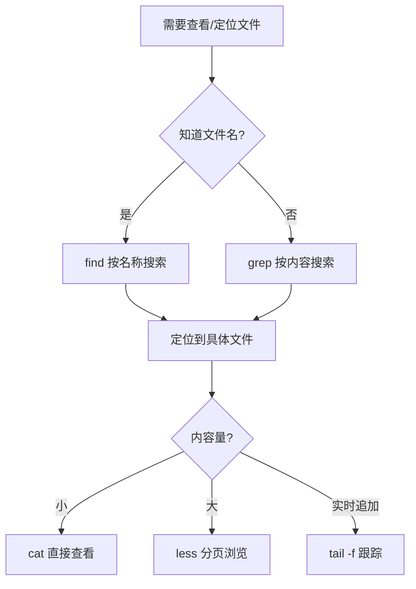

# Linux 文件系统与核心命令

## 一、模块介绍

本模块系统讲解 Linux 文件系统层次结构、文件操作命令、权限（Permission）模型与包管理体系，建立服务器端命令行操作的核心能力。

### 1.1 前置知识

- 已完成 Linux 环境搭建（虚拟机/WSL2/云服务器）
- 能通过 SSH 连接到 Linux 系统

### 1.2 学习目标

- 理解 Linux 文件系统层次结构（FHS，Filesystem Hierarchy Standard）
- 掌握文件查看、搜索、管理的核心命令
- 理解权限模型（rwx / 数字表示法）
- 熟练使用 APT/YUM 包管理器

---

## 二、核心方法论

### 2.1 文件系统层次结构（FHS）

### 图：目录树全景

```mermaid
graph TB
    Root[/ 根目录] --> bin[/bin 基本命令]
    Root --> etc[/etc 配置文件]
    Root --> home[/home 用户目录]
    Root --> var[/var 可变数据]
    Root --> tmp[/tmp 临时文件]
    Root --> usr[/usr 用户程序]
    Root --> proc[/proc 虚拟文件系统]
    Root --> dev[/dev 设备文件]
    Root --> opt[/opt 第三方软件]
    Root --> boot[/boot 启动文件]

    var --> varlog[/var/log 系统日志]
    var --> varwww[/var/www Web 根目录]
    etc --> etcssh[/etc/ssh SSH 配置]
    etc --> etcapt[/etc/apt 软件源]
    home --> homeuser[/home/username 用户空间]
```

上图为 FHS（文件系统层次标准）下的统一目录树。所有路径都从根目录 `/` 出发，`/etc` 存配置、`/var` 存可变数据（含日志）、`/home` 存用户空间、`/proc` 与 `/dev` 是特殊虚拟文件系统。理解该结构是高效操作文件、定位配置与排查问题的基石。

### 2.2 高频目录

| 目录 | 用途 | 典型操作 |
|------|------|---------|
| `/home/user/` | 用户主目录 | 项目代码、.ssh 密钥 |
| `/etc/11-Nginx基础概述/` | Nginx 配置 | 修改站点配置、反向代理 |
| `/var/log/` | 系统/应用日志 | 排查部署问题 |
| `/var/www/` | Web 根目录 | 前端构建产物部署 |
| `/usr/local/bin/` | 用户级可执行文件 | Node.js、pnpm 安装位置 |
| `/etc/apt/` 或 `/etc/yum.repos.d/` | 软件源配置 | 替换国内镜像 |

### 2.3 权限模型

#### 权限结构

```
-rwxr-xr-x  1 user group 4096 Jan 10 10:00 filename
│││││││││
││││││││└── 其他人: x (执行)
│││││││└─── 其他人: r (读)
││││││└──── 其他人: - (无写)
│││││└───── 组: x
││││└────── 组: r
│││└─────── 组: - (无写)
││└──────── 所有者: x
│└───────── 所有者: w
└────────── 所有者: r
```

#### 数字表示法

| 权限 | 数字 | 组合示例 |
|------|------|---------|
| r (读) | 4 | rwx = 7 |
| w (写) | 2 | r-x = 5 |
| x (执行) | 1 | r-- = 4 |

#### 权限修改

```bash
# 修改权限
chmod 755 script.sh      # 所有者 rwx，其他人 r-x
chmod 600 ~/.ssh/id_rsa  # 仅所有者读写

# 修改所有者
sudo chown www-data:www-data /var/www/html

# 递归修改
chmod -R 755 /var/www/
```

---

## 三、关键流程

### 3.1 文件内容查看与搜索基本流程

### 图：文件定位与排查流程



上图为文件定位与查看的基本套路：先判断按名称还是按内容搜索（find 按名称、grep 按内容），定位到具体文件后再根据内容量选择 cat（少量）、less（分页）或 tail -f（实时跟踪）。掌握这一流程可以显著提升日常排障效率。

---

## 四、工具与实践

### 4.1 文件内容查看

| 命令 | 用途 | 典型场景 |
|------|------|---------|
| `cat` | 输出全部内容 | 查看短配置文件 |
| `less` | 分页浏览（支持上下翻页） | 查看长日志/配置 |
| `head -n 20` | 查看前 N 行 | 快速预览文件头部 |
| `tail -f` | 实时跟踪文件追加 | 监控应用日志 |

```bash
# 实时监控 Nginx 访问日志
tail -f /var/log/11-Nginx基础概述/access.log

# 查看 SSH 配置（分页）
less /etc/ssh/sshd_config

# 查看文件前 5 行
head -n 5 package.json
```

### 4.2 内容搜索（grep）

```bash
# 在文件中搜索
grep "listen" /etc/11-Nginx基础概述/11-Nginx基础概述.conf

# 递归搜索目录
grep -r "proxy_pass" /etc/11-Nginx基础概述/

# 忽略大小写 + 显示行号
grep -in "error" /var/log/syslog

# 管道过滤
ip addr show | grep "inet"
ps aux | grep node
```

grep 常用选项速查：

| 选项 | 说明 |
|------|------|
| `-i` | 忽略大小写 |
| `-n` | 显示行号 |
| `-r` | 递归搜索目录 |
| `-v` | 反向匹配（排除） |
| `-c` | 只输出匹配行数 |
| `-l` | 只输出包含匹配的文件名 |
| `-E` | 使用扩展正则（等同 egrep） |

### 4.3 文件查找（find）

```bash
# 按名称查找
find /home -name "*.conf"

# 按类型 + 大小
find / -type f -size +100M

# 按修改时间（7天内）
find /var/log -mtime -7

# 组合条件
find /home -name "*.js" -user deploy -mtime -1
```

### 4.4 文件与目录操作

| 操作 | 命令 | 关键参数 |
|------|------|---------|
| 创建目录 | `mkdir -p a/b/c` | `-p` 递归创建 |
| 复制文件 | `cp src dest` | |
| 复制目录 | `cp -r src/ dest/` | `-r` 必须 |
| 移动/重命名 | `mv old new` | |
| 删除文件 | `rm file` | |
| 删除目录 | `rm -rf dir/` | 不可恢复 |
| 查看目录 | `ls -lah` | `-a` 隐藏文件 |
| 切换目录 | `cd /path` | `cd -` 回上一个 |

### 4.5 系统信息查看

```bash
# 内核版本
uname -r
# 输出: 5.15.0-91-generic

# 硬件架构
uname -m
# 输出: x86_64 或 aarch64

# 发行版信息（通用）
cat /etc/os-release

# Ubuntu 专用
lsb_release -a

# Rocky Linux 专用（CentOS 为 /etc/centos-release）
cat /etc/rocky-release
```

#### /proc 虚拟文件系统

```bash
cat /proc/cpuinfo     # CPU 型号、核心数
cat /proc/meminfo     # 内存总量、可用量
cat /proc/version     # 内核编译信息
cat /proc/filesystems # 支持的文件系统类型
```

### 4.6 包管理

#### APT（Ubuntu/Debian）

```bash
# 标准工作流
sudo apt update                    # 更新源索引
sudo apt install -y 11-Nginx基础概述          # 安装
sudo apt remove 11-Nginx基础概述              # 卸载（保留配置）
sudo apt purge 11-Nginx基础概述               # 卸载（删除配置）
sudo apt autoremove                # 清理孤立依赖
sudo apt upgrade                   # 升级所有包

# 搜索与查看
apt search keyword
apt show package-name
apt list --installed
```

#### YUM/DNF（Rocky/CentOS）

```bash
# 标准工作流
sudo yum makecache                 # 更新源缓存
sudo yum install -y 11-Nginx基础概述          # 安装
sudo yum remove 11-Nginx基础概述              # 卸载
sudo yum update                    # 升级所有包

# 搜索与查看
yum search keyword
yum info package-name
yum list installed
```

#### 前端开发环境安装示例

```bash
# 安装 Node.js 22.x（LTS，通过 NodeSource）
# Ubuntu
curl -fsSL https://deb.nodesource.com/setup_22.x | sudo -E bash -
sudo apt install -y nodejs

# Rocky Linux
curl -fsSL https://rpm.nodesource.com/setup_22.x | sudo bash -
sudo yum install -y nodejs

# 验证
node -v    # v22.x.x
npm -v

# 安装常用工具
sudo apt install -y git curl wget vim unzip
```

### 4.7 Vim 编辑器速查

### 图：Vim 模式状态机

```mermaid
stateDiagram-v2
    [*] --> Normal: 打开文件
    Normal --> Insert: i / a / o
    Insert --> Normal: Esc
    Normal --> Command: :
    Command --> Normal: Esc
    Command --> [*]: :wq / :q!
```

上图为 Vim 的模式状态机：Normal（普通）、Insert（插入）、Command（命令行）三种模式相互切换。默认进入 Normal 模式，按键 i/a/o 进入插入编辑，Esc 返回，冒号进入命令行模式可保存退出。

Vim 高频操作：

| 操作 | 命令 |
|------|------|
| 保存退出 | `:wq` 或 `:x` |
| 强制退出 | `:q!` |
| 显示行号 | `:set nu` |
| 跳到行 N | `:N` |
| 搜索 | `/keyword` → `n` 下一个 |
| 删除行 | `dd` |
| 复制行 | `yy` → `p` 粘贴 |
| 撤销 | `u` |

---

## 五、常见坑点

| 问题 | 原因 | 解决方案 |
|------|------|---------|
| `Unable to locate package` | 源索引过期 | `sudo apt update` |
| `Permission denied` | 权限不足 | 加 `sudo` 或修改文件权限 |
| `cp: omitting directory` | 复制目录未加 `-r` | `cp -r src/ dest/` |
| `No such file or directory` | 路径错误 | `pwd` 确认位置，`ls` 确认文件存在 |
| 磁盘空间不足 | 日志/缓存占满 | `du -sh /var/log/*` 定位大文件 |

### 5.1 安全删除建议

```bash
# 危险操作前确认
ls target_dir/          # 先看看里面有什么
rm -ri target_dir/      # -i 交互确认

# 生产环境替代方案：移动到临时目录
mv /data/old_build /tmp/old_build_$(date +%Y%m%d)
# 确认无问题后再清理 /tmp
```

### 5.2 前端部署常见权限设置

```bash
# Nginx 静态文件
sudo chown -R www-data:www-data /var/www/app
chmod -R 755 /var/www/app

# SSH 密钥（权限错误会导致认证失败）
chmod 700 ~/.ssh
chmod 600 ~/.ssh/id_ed25519
chmod 644 ~/.ssh/id_ed25519.pub
chmod 600 ~/.ssh/authorized_keys
```

---

## 六、进阶扩展与参考

### 6.1 最佳实践

1. **Tab 补全**：输入部分路径后按 Tab，避免拼写错误
2. **管道组合**：`command | grep | sort | head` 层层过滤
3. **man 手册**：`man command` 查看完整文档，`/keyword` 搜索
4. **历史命令**：`history | grep keyword` 找回之前执行过的命令
5. **别名**：在 `~/.bashrc` 中定义常用别名（如 `alias ll='ls -lah'`）

### 6.2 延伸阅读

- [Linux 文件系统层次结构标准（FHS 3.0）](https://refspecs.linuxfoundation.org/FHS_3.0/fhs-3.0.html)
- [GNU Coreutils 手册](https://www.gnu.org/software/coreutils/manual/)
- [APT 用户指南](https://www.debian.org/doc/manuals/apt-guide/)
- [Vim 官方教程](https://www.vim.org/docs.php)