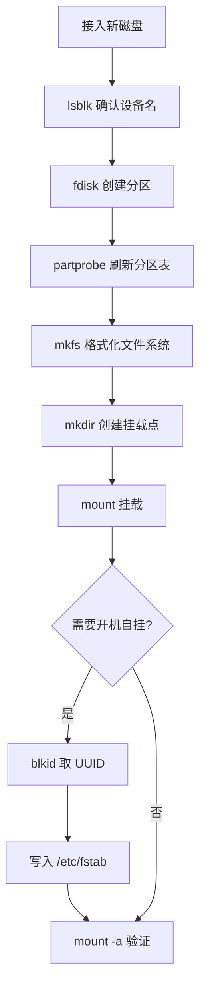
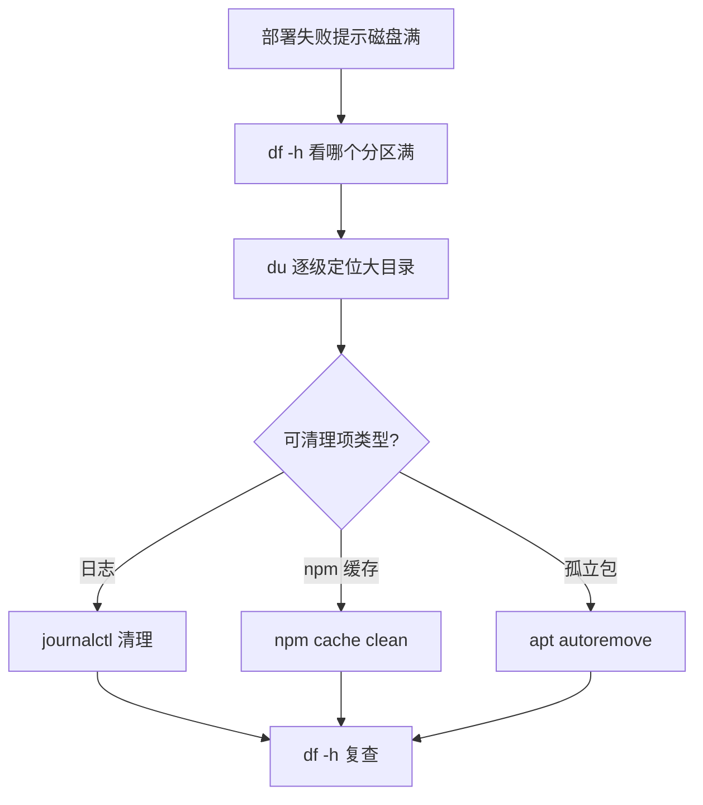

# 磁盘管理与存储运维

## 一、模块介绍

本模块讲解如何在 Linux 中监控磁盘空间、管理分区、格式化文件系统并配置挂载，为服务器存储运维（Storage Operations）建立完整操作能力。

### 1.1 前置知识

- 熟悉 Linux 基本命令（ls、cd、cat）
- 理解块设备（Block Device）、分区（Partition）、文件系统的基本概念

### 1.2 学习目标

- 使用 df/du/lsblk 监控磁盘使用情况
- 理解 MBR/GPT 分区表与 fdisk 操作
- 掌握文件系统格式化与挂载/卸载
- 配置 /etc/fstab 实现开机自动挂载

---

## 二、核心方法论

### 2.1 磁盘监控三件套

#### df — 文件系统级空间

```bash
# 人性化显示所有挂载点
df -h

# 输出示例
Filesystem      Size  Used Avail Use% Mounted on
/dev/vda1        20G  5.2G   14G  28% /
tmpfs           992M     0  992M   0% /dev/shm
/dev/vdb1       100G   30G   70G  30% /data
```

| 字段 | 含义 |
|------|------|
| Filesystem | 设备名称（/dev/vda1 = 第一块虚拟磁盘第一分区） |
| Size / Used / Avail | 总容量 / 已用 / 可用 |
| Use% | 使用百分比（超过 80% 需关注） |
| Mounted on | 挂载点 |

```bash
# 显示文件系统类型
df -T

# 查看 inode 使用情况（小文件过多时 inode 先耗尽）
df -i

# 只看某个目录所在分区
df -h /home
```

#### du — 目录级空间

```bash
# 查看目录总大小
du -sh /home/deploy

# 列出子目录大小并排序（找大文件）
du -h --max-depth=1 /home | sort -hr | head -10

# 输出示例
15G     /home/deploy
10G     /home/deploy/node_modules
3G      /home/deploy/.npm
2G      /home/deploy/projects
```

#### lsblk — 块设备拓扑

```bash
lsblk -f

# 输出示例
NAME                      FSTYPE  LABEL  MOUNTPOINT
vda
├─vda1                    ext4           /
└─vda2                    swap           [SWAP]
vdb
└─vdb1                    ext4           /data
```

### 2.2 分区表类型

| 类型 | 最大分区数 | 单分区上限 | 适用场景 |
|------|-----------|-----------|---------|
| MBR | 4 主分区 | 2 TB | 旧系统、小磁盘 |
| GPT | 128+ | 18 EB | 现代系统（推荐） |

### 2.3 文件系统选型

| 文件系统 | 特点 | 适用场景 |
|----------|------|---------|
| ext4 | Linux 标准，稳定可靠 | 通用场景（默认选择） |
| xfs | 大文件高性能，并行 I/O | 数据库、视频存储 |
| btrfs | 快照、压缩、自修复 | 需要快照的存储 |
| overlay2 | 联合文件系统 | Docker 容器存储 |

### 2.4 设备命名规则

| 前缀 | 含义 | 示例 |
|------|------|------|
| `/dev/sd*` | SATA/SCSI 物理磁盘 | `/dev/sda`, `/dev/sdb` |
| `/dev/vd*` | 虚拟磁盘（KVM/云） | `/dev/vda`, `/dev/vdb` |
| `/dev/nvme*` | NVMe SSD | `/dev/nvme0n1` |
| `/dev/mapper/*` | LVM 逻辑卷 | `/dev/mapper/vg-lv` |

---

## 三、关键流程

### 3.1 新磁盘上线全流程

### 图：新磁盘分区-格式化-挂载流程



上图为新磁盘从接入到上线的标准链路：先用 lsblk 确认设备名，fdisk 分区后用 partprobe 刷新分区表（无需重启），再 mkfs 格式化、mkdir 建挂载点、mount 挂载。若需开机自动挂载，则取 UUID 写入 /etc/fstab 并执行 `mount -a` 校验。流程图准确覆盖了"分区 → 格式化 → 挂载"三大阶段。

### 3.2 空间排查流程

### 图：磁盘空间耗尽排查流程



上图给出"磁盘满"的标准排障思路：先 `df -h` 定位哪个分区满，再用 `du` 逐级定位大目录，最后按类型（日志/缓存/孤立包）执行清理并复查。若同时 `df -i` 看 inode，可区分"空间满"与"inode 耗尽"两类不同根因。

---

## 四、工具与实践

### 4.1 磁盘分区操作

#### fdisk 分区操作

```bash
# 查看所有磁盘分区
sudo fdisk -l

# 对新磁盘创建分区
sudo fdisk /dev/vdb
```

fdisk 交互命令：

| 命令 | 说明 |
|------|------|
| `n` | 新建分区 |
| `p` | 主分区 |
| `d` | 删除分区 |
| `t` | 修改分区类型（8e = LVM） |
| `w` | 写入并退出 |
| `q` | 不保存退出 |

```bash
# 完整操作序列（创建 LVM 分区）
sudo fdisk /dev/vdb
# n → p → 1 → 回车 → 回车 → t → 8e → w

# 刷新分区表（无需重启）
sudo partprobe

# 验证
lsblk /dev/vdb
```

### 4.2 文件系统格式化

```bash
# 格式化为 ext4（最常用）
sudo mkfs.ext4 /dev/vdb1

# 格式化为 xfs
sudo mkfs.xfs /dev/vdb1

# 查看已有文件系统类型
sudo blkid /dev/vdb1
# 输出: /dev/vdb1: UUID="xxx" TYPE="ext4"
```

> **警告**：格式化会清除分区上所有数据。操作前务必用 `lsblk` 确认目标设备。

### 4.3 挂载与卸载

```bash
# 创建挂载点
sudo mkdir -p /data

# 挂载分区
sudo mount /dev/vdb1 /data

# 验证
df -h /data
mount | grep vdb1

# 卸载（确保无进程占用）
sudo umount /data
# 如果提示 "target is busy"
sudo fuser -mv /data    # 查看占用进程
sudo umount -l /data    # 懒卸载（最后手段）
```

### 4.4 开机自动挂载（/etc/fstab）

```bash
# 查看当前挂载配置
cat /etc/fstab

# 格式: <设备>  <挂载点>  <类型>  <选项>  <dump>  <fsck>
# 推荐使用 UUID（设备名可能变化）
sudo blkid /dev/vdb1
# 输出 UUID="a1b2c3d4-..."

# 编辑 fstab
sudo vim /etc/fstab
# 添加:
UUID=a1b2c3d4-...  /data  ext4  defaults,noatime  0  2

# 测试配置是否正确（不重启）
sudo mount -a
# 无报错即成功
```

fstab 选项说明：

| 选项 | 含义 |
|------|------|
| `defaults` | rw,suid,dev,exec,auto,nouser,async |
| `noatime` | 不更新访问时间（提升性能） |
| `nofail` | 设备不存在时不阻止启动 |
| `ro` | 只读挂载 |

> **警告**：fstab 配置错误可能导致系统无法启动。修改后务必执行 `sudo mount -a` 验证。

### 4.5 磁盘健康检查

```bash
# 检查文件系统一致性（需先卸载）
sudo umount /dev/vdb1
sudo fsck /dev/vdb1

# 查看磁盘 I/O 统计
iostat -x 1 5

# 查看磁盘健康状态（需安装 smartmontools）
sudo smartctl -a /dev/sda

# 查看坏块
sudo badblocks -v /dev/vdb
```

### 4.6 前端部署空间排查场景

```bash
# 场景：部署失败提示 "No space left on device"

# 1. 确认哪个分区满了
df -h

# 2. 定位大目录
du -h --max-depth=1 / | sort -hr | head -10

# 3. 常见空间杀手
du -sh /var/log/           # 日志
du -sh /tmp/               # 临时文件
du -sh /home/*/.npm/       # npm 缓存
du -sh /home/*/node_modules/  # 依赖目录

# 4. 清理
sudo journalctl --vacuum-size=100M   # 清理 systemd 日志
npm cache clean --force              # 清理 npm 缓存
sudo apt autoremove                  # 清理孤立包
```

---

## 五、常见坑点

| 问题 | 原因 | 解决方案 |
|------|------|---------|
| `No space left on device` | 磁盘/inode 满 | `df -h` + `df -i` 定位 |
| `mount: unknown filesystem` | 缺少驱动 | 安装 `exfatprogs`/`ntfs-3g` |
| `umount: target is busy` | 有进程占用 | `fuser -mv /path` 找到并关闭 |
| fstab 错误导致无法启动 | 配置语法错误 | 进入 recovery mode 修复 |
| 新磁盘 `fdisk -l` 看不到 | 未刷新/未热插拔 | `sudo partprobe` 或重启 |

---

## 六、进阶扩展与参考

### 6.1 最佳实践

1. **UUID 挂载**：fstab 中使用 UUID 而非设备名，避免设备名漂移
2. **noatime 选项**：所有数据分区加 `noatime`，减少不必要的写操作
3. **监控告警**：磁盘使用率超过 80% 触发告警，90% 触发自动清理
4. **日志轮转**：配置 logrotate 防止日志撑满磁盘
5. **操作前确认**：格式化/分区前执行 `lsblk` 三次确认目标设备

### 6.2 延伸阅读

- [Linux 文件系统层次结构标准](https://refspecs.linuxfoundation.org/FHS_3.0/fhs-3.0.html)
- [fstab 配置详解（Arch Wiki）](https://wiki.archlinux.org/title/Fstab)
- [ext4 文件系统文档](https://www.kernel.org/doc/html/latest/filesystems/ext4/index.html)
- [smartmontools 磁盘健康监控](https://www.smartmontools.org/)