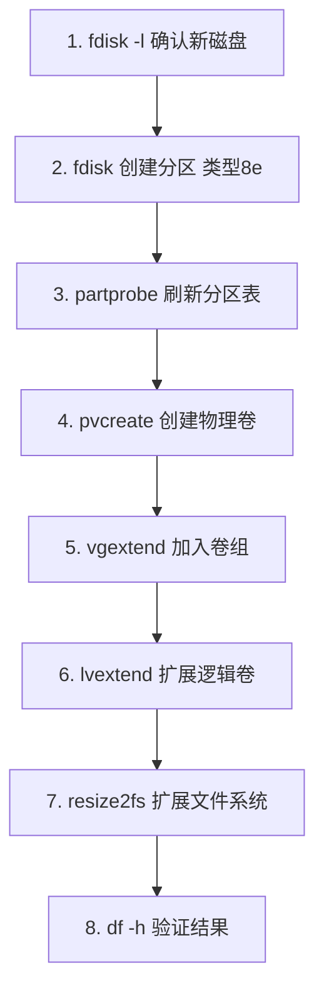
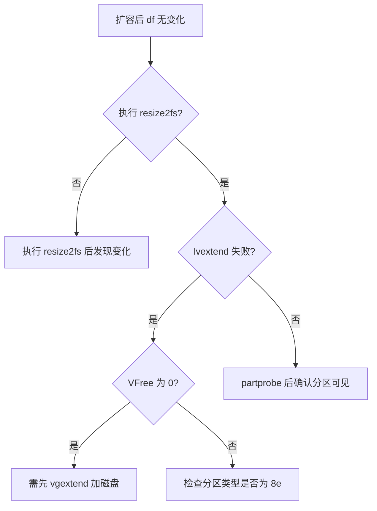

# LVM 逻辑卷管理与在线扩容

## 一、模块介绍

本模块深入讲解 LVM（Logical Volume Manager，逻辑卷管理器）的三层抽象模型，掌握不停机在线扩容的完整操作流程，解决云服务器磁盘空间不足的生产问题。

### 1.1 前置知识

- 熟悉 fdisk 分区操作与 mkfs 格式化
- 理解物理磁盘、分区、文件系统的基本概念
- 了解 df/du 磁盘监控命令

### 1.2 学习目标

- 理解 PV → VG → LV 三层抽象架构
- 掌握新磁盘加入 LVM 的完整流程
- 实现在线扩展逻辑卷与文件系统
- 能独立完成云服务器磁盘扩容

---

## 二、核心方法论

### 2.1 三层抽象模型

### 图：PV → VG → LV 三层抽象

```mermaid
graph TB
    subgraph Physical Layer
        PV1[/dev/vda1 20GB]
        PV2[/dev/vdb1 10GB]
    end

    subgraph Volume Group
        VG[ubuntu-vg 30GB]
    end

    subgraph Logical Volumes
        LV1[ubuntu-lv 25GB → 挂载 /]
        LV2[data-lv 5GB → 挂载 /data]
    end

    PV1 --> VG
    PV2 --> VG
    VG --> LV1
    VG --> LV2
```

上图为 LVM 的核心抽象：底层是多个物理卷（PV），汇聚到一个卷组（VG）形成一个可弹性分配的资源池，再由卷组切分出若干个逻辑卷（LV）挂载给文件系统使用。这一"物理 → 聚合 → 裁剪"三层结构，正是 LVM 能实现动态扩容的根本原因。

### 2.2 核心概念

| 概念 | 缩写 | 说明 | 类比 |
|------|------|------|------|
| Physical Volume | PV | 物理卷（分区或整盘） | 一块砖 |
| Volume Group | VG | 卷组（多个 PV 的池） | 砖堆 |
| Logical Volume | LV | 逻辑卷（从 VG 切出） | 从砖堆取砖砌墙 |
| Physical Extent | PE | 最小分配单元（默认 4MB） | 砖的尺寸 |

### 2.3 为什么用 LVM

| 传统分区 | LVM |
|---------|-----|
| 分区大小固定，扩容需停机 | 在线扩容，无需卸载 |
| 跨磁盘困难 | 多磁盘合并为一个逻辑空间 |
| 缩容风险高 | 灵活调整（需文件系统支持） |
| 无快照能力 | 支持 LV 快照备份 |

---

## 三、关键流程

### 3.1 新磁盘加入 LVM 完整流程

### 图：磁盘加入 LVM 并在线扩容流程



上图为新磁盘从识别到生效的标准链路：分为"物理侧"（fdisk 分区、partprobe 刷新、pvcreate 建物理卷、vgextend 入组）与"逻辑侧"（lvextend 扩展逻辑卷、resize2fs 扩展文件系统）两段。整个过程无需卸载挂载点，真正实现在线扩容。

### 3.2 两步扩容原则

> **两步扩容缺一不可**：
> 1. `lvextend` — 扩展逻辑卷（块设备层）
> 2. `resize2fs` — 扩展文件系统（让 OS 识别新空间）
>
> 只执行第一步，`df -h` 不会显示变化。

---

## 四、工具与实践

### 4.1 查看 LVM 状态速查

```bash
# 物理卷概览
sudo pvs
# PV         VG        Fmt  Attr PSize   PFree
# /dev/vda1  ubuntu-vg lvm2 a--  19.50g  7.30g

# 卷组概览
sudo vgs
# VG        #PV #LV #SN Attr   VSize  VFree
# ubuntu-vg   1   1   0 wz--n- 19.50g 7.30g

# 逻辑卷概览
sudo lvs
# LV        VG        Attr       LSize
# ubuntu-lv ubuntu-vg -wi-ao---- 12.00g
```

详细信息：

```bash
sudo pvdisplay    # 物理卷详情（大小、所属VG、PE）
sudo vgdisplay    # 卷组详情（总PE、空闲PE）
sudo lvdisplay    # 逻辑卷详情（路径、大小、挂载点）
```

确认逻辑卷路径：

```bash
# 关键：确认 LV 的设备路径
sudo lvdisplay | grep "LV Path"
# LV Path    /dev/ubuntu-vg/ubuntu-lv

# 确认当前挂载
df -h /
# Filesystem                      Size  Used Avail Use% Mounted on
# /dev/mapper/ubuntu--vg-ubuntu--lv  12G  5.2G  6.1G  47% /
```

### 4.2 实战：云服务器新增 10GB 磁盘

```bash
# ===== 步骤 1：确认新磁盘 =====
sudo fdisk -l
# 发现 /dev/vdb: 10 GiB（新磁盘，无分区）

# ===== 步骤 2：创建分区 =====
sudo fdisk /dev/vdb
# 操作序列: n → p → 1 → 回车 → 回车 → t → 8e → w

# ===== 步骤 3：刷新分区表 =====
sudo partprobe
lsblk /dev/vdb
# 确认 vdb1 出现

# ===== 步骤 4：创建物理卷 =====
sudo pvcreate /dev/vdb1
# Physical volume "/dev/vdb1" successfully created.

# ===== 步骤 5：加入卷组 =====
sudo vgextend ubuntu-vg /dev/vdb1
# Volume group "ubuntu-vg" successfully extended

# 验证
sudo pvs
# 应看到两个 PV 都属于 ubuntu-vg

# ===== 步骤 6：扩展逻辑卷 =====
# 方式 A：使用全部空闲空间（推荐）
sudo lvextend -l +100%FREE /dev/ubuntu-vg/ubuntu-lv

# 方式 B：指定大小
sudo lvextend -L +10G /dev/ubuntu-vg/ubuntu-lv

# ===== 步骤 7：扩展文件系统 =====
# ext4 文件系统
sudo resize2fs /dev/ubuntu-vg/ubuntu-lv

# 如果是 xfs 文件系统
# sudo xfs_growfs /

# ===== 步骤 8：验证 =====
df -h /
# 容量应增加约 10GB
```

### 4.3 LVM 管理命令速查

#### 创建类

| 命令 | 说明 | 示例 |
|------|------|------|
| `pvcreate` | 创建物理卷 | `pvcreate /dev/vdb1` |
| `vgcreate` | 创建卷组 | `vgcreate my-vg /dev/vdb1` |
| `lvcreate` | 创建逻辑卷 | `lvcreate -L 50G -n my-lv my-vg` |

#### 扩展类

| 命令 | 说明 | 示例 |
|------|------|------|
| `vgextend` | 卷组加入新 PV | `vgextend my-vg /dev/vdc1` |
| `lvextend` | 扩展逻辑卷 | `lvextend -l +100%FREE /dev/my-vg/my-lv` |
| `resize2fs` | 扩展 ext4 文件系统 | `resize2fs /dev/my-vg/my-lv` |
| `xfs_growfs` | 扩展 xfs 文件系统 | `xfs_growfs /mountpoint` |

#### lvextend 参数详解

```bash
-L +5G          # 增加 5GB
-L 30G          # 扩展到 30GB（绝对值）
-l +100%FREE    # 使用卷组全部空闲空间
-l +50%FREE     # 使用卷组一半空闲空间
```

---

## 五、常见坑点

| 问题 | 原因 | 解决方案 |
|------|------|---------|
| `partprobe` 后看不到新分区 | 内核未刷新 | 重启系统 `sudo reboot` |
| `pvcreate` 提示已有数据 | 磁盘有旧分区表 | `pvcreate -ff /dev/vdb1` 强制 |
| `df -h` 扩容后未变化 | 未执行 resize2fs | `sudo resize2fs /dev/vg/lv` |
| `vgextend` 失败 | 分区类型非 8e | fdisk 中 `t → 8e → w` 重新设置 |
| `lvextend` 提示空间不足 | VG 无空闲 PE | `sudo vgs` 确认 VFree 列 |

### 5.1 误操作恢复

```bash
# 格式化了错误的磁盘
#  无法恢复，只能从备份还原

# 预防措施：操作前执行
lsblk -f    # 确认 FSTYPE 和 MOUNTPOINT
sudo blkid  # 确认 UUID 和类型

# 永远不要对已挂载的分区执行 mkfs
```

### 图：LVM 扩容故障排查流程



上图给出扩容后容量不变化的常见排查路径：优先检查是否漏执行文件系统扩展（resize2fs/xfs_growfs），其次排查逻辑卷扩展是否失败，再顺着 VFree 是否耗尽、分区类型是否 8e、内核是否刷新分区表逐层定位。

---

## 六、进阶扩展与参考

### 6.1 最佳实践

1. **生产环境备份先行**：扩容前对关键数据做快照/备份
2. **维护窗口操作**：虽然 LVM 支持在线扩容，生产环境仍建议在低峰期进行
3. **分区类型必须 8e**：fdisk 中 `t → 8e` 设置为 Linux LVM，否则无法加入 VG
4. **使用 UUID 引用**：fstab 中用 UUID 而非 `/dev/mapper/...`（更稳定）
5. **预留 VG 空间**：不要一次性用尽所有 PE，预留 10-20% 应对突发需求
6. **监控 VFree**：`vgs` 中 VFree 为 0 时无法再扩容，需提前规划

### 6.2 延伸阅读

- [LVM HOWTO（TLDP）](https://tldp.org/HOWTO/LVM-HOWTO/)
- [Red Hat LVM 管理指南](https://access.redhat.com/documentation/en-us/red_hat_enterprise_linux/9/html/configuring_and_managing_logical_volumes)
- [Ubuntu 磁盘扩容文档](https://help.ubuntu.com/community/ResizeEncryptedPartitions)
- [fdisk 命令详解（TecMint）](https://www.tecmint.com/fdisk-commands-to-manage-linux-disk-partitions/)