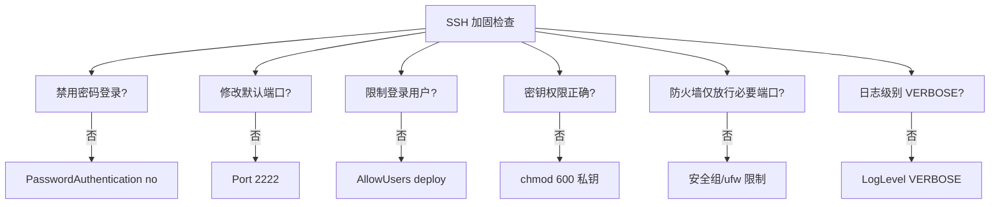
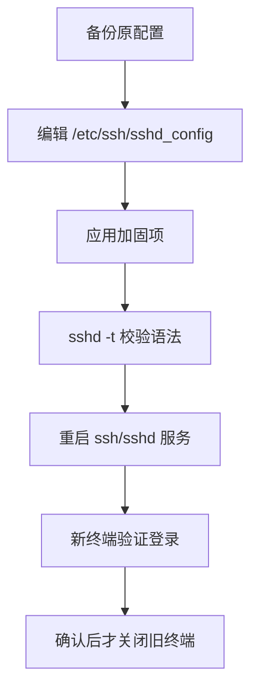
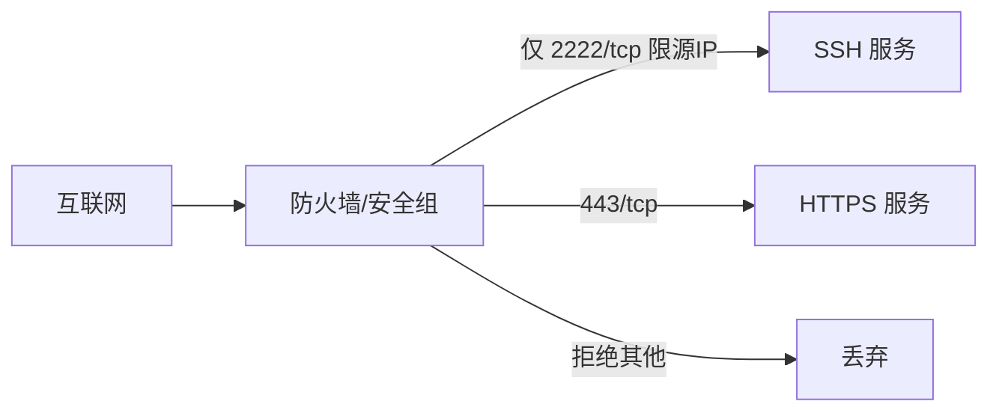
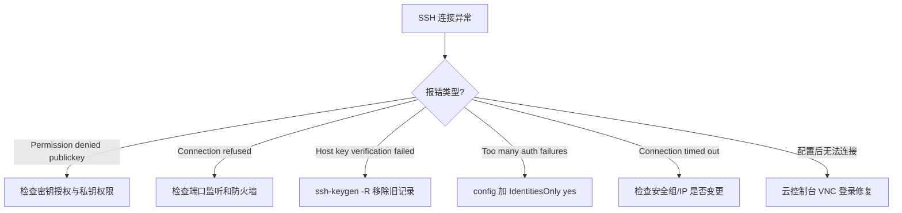

# SSH 安全加固与远程运维

## 一、模块介绍

本模块从密钥认证、服务端加固、防火墙策略到跳板机方案，构建生产级 SSH 安全体系，覆盖日常远程运维的全部场景。

### 1.1 前置知识

- 已完成 SSH（Secure Shell，安全外壳协议）基本连接配置（参见 02 篇）
- 理解公钥/私钥非对称加密的基本原理
- 有云服务器或虚拟机环境

### 1.2 学习目标

- 掌握 sshd_config 安全加固配置
- 实现多服务器密钥管理与跳板机方案
- 配置防火墙与安全组的最小暴露原则
- 建立 SSH 安全审计与应急响应能力

### 1.3 SSH 认证机制对比

| 认证方式 | 安全等级 | 适用场景 | 风险 |
|---------|---------|---------|------|
| 密码认证 | 低 | 临时测试 | 暴力破解、钓鱼 |
| RSA 密钥（2048位） | 中 | 兼容旧系统 | 密钥长度已不够安全 |
| RSA 密钥（4096位） | 高 | 通用生产环境 | 签名速度较慢 |
| Ed25519 密钥 | 最高 | 新项目首选 | 极老系统不支持 |

---

## 二、核心方法论

### 2.1 密钥算法选型

```bash
# 新项目：Ed25519（推荐）
ssh-keygen -t ed25519 -C "deploy@company.com"

# 需要兼容旧系统：RSA 4096
ssh-keygen -t rsa -b 4096 -C "deploy@company.com"

# 查看已有密钥类型
ssh-keygen -l -f ~/.ssh/id_ed25519.pub
# 输出: 256 SHA256:xxx deploy@company.com (ED25519)
```

上文的选型原则是：新项目优先 Ed25519（安全与性能最佳），仅当需要兼容老旧系统时才退而选择 RSA 4096。SSH 安全加固的总体方法论可概括为"默认拒绝 + 最小暴露 + 全链路审计"。

### 图：SSH 安全加固检查清单



以上加固清单逐项自检：每一项如果未达标，右侧给出对应的加固动作。对照该清单可以系统化地补齐 SSH 安全短板，避免遗漏关键项。

---

## 三、关键流程

### 3.1 服务端加固配置流程

### 图：sshd_config 加固流程



上图给出服务端加固的安全操作顺序：先备份，再按清单修改配置，随后用 `sshd -t` 校验语法、重启服务，最后一定是在**新终端验证登录成功后再关闭旧终端**。这样可有效避免因配置错误把唯一的管理通道锁死。

### 3.2 最小暴露原则（防火墙 / 安全组）

### 图：最小暴露访问模型



上图为最小暴露原则的核心：互联网流量进入防火墙后，只对 SSH（限定来源 IP 与自定义端口）和 HTTPS（443）放行，其余一律丢弃。这一"白名单"式策略能大幅缩小攻击面。

---

## 四、工具与实践

### 4.1 sshd_config 加固配置

```bash
sudo vim /etc/ssh/sshd_config
```

**生产环境推荐配置**：

```bash
# /etc/ssh/sshd_config — 安全加固版

# === 基础 ===
Port 2222                      # 修改默认端口（减少扫描）
ListenAddress 0.0.0.0

# === 认证 ===
PubkeyAuthentication yes       # 启用密钥认证
PasswordAuthentication no      # 禁用密码登录
PermitEmptyPasswords no        # 禁止空密码
KbdInteractiveAuthentication no   # 禁用键盘交互认证（旧名 ChallengeResponseAuthentication）

# === 访问控制 ===
PermitRootLogin prohibit-password  # 禁止 root 密码登录
MaxAuthTries 3                 # 最多 3 次认证尝试
LoginGraceTime 30              # 30 秒内未完成认证则断开
AllowUsers deploy admin        # 仅允许指定用户登录

# === 会话 ===
ClientAliveInterval 300        # 5 分钟心跳
ClientAliveCountMax 2          # 2 次无响应断开
MaxSessions 5                  # 最大并发会话数

# === 安全 ===
X11Forwarding no               # 禁用 X11 转发
AllowTcpForwarding no          # 禁用 TCP 转发（按需开启）
UsePAM yes

# === 日志 ===
SyslogFacility AUTH
LogLevel VERBOSE               # 详细日志（审计用）
```

配置验证与重启：

```bash
# 验证配置语法（不会中断现有连接）
sudo sshd -t

# 重启服务
sudo systemctl restart ssh     # Ubuntu
sudo systemctl restart sshd    # Rocky/CentOS

# 确认服务正常
sudo systemctl status ssh
ss -tlnp | grep 2222
```

> **关键原则**：修改 sshd_config 后，先开一个新终端测试连接成功，再关闭旧终端。避免配置错误锁死自己。

### 4.2 多服务器密钥管理

#### SSH Config 多环境配置

```bash
# ~/.ssh/config

# 开发环境
Host dev
    HostName 192.168.31.77
    User deploy
    Port 2222
    IdentityFile ~/.ssh/id_ed25519

# 生产环境
Host prod
    HostName 10.0.1.100
    User deploy
    Port 2222
    IdentityFile ~/.ssh/prod_ed25519
    ServerAliveInterval 60
    ServerAliveCountMax 3

# 跳板机
Host jump
    HostName jump.company.com
    User admin
    Port 2222
    IdentityFile ~/.ssh/id_ed25519

# 通过跳板机访问内网服务器
Host prod-via-jump
    HostName 10.0.1.100
    User deploy
    Port 2222
    IdentityFile ~/.ssh/prod_ed25519
    ProxyJump jump
```

#### 密钥文件权限

```bash
# 正确的权限设置
chmod 700 ~/.ssh
chmod 600 ~/.ssh/id_ed25519          # 私钥
chmod 644 ~/.ssh/id_ed25519.pub      # 公钥
chmod 600 ~/.ssh/config              # 配置
chmod 600 ~/.ssh/authorized_keys     # 服务器端

# 权限错误会导致的问题
# "Permissions 0644 for '~/.ssh/id_ed25519' are too open"
# → SSH 拒绝使用该密钥
```

#### 团队密钥管理

```bash
# 服务器端：查看已授权的公钥
cat ~/.ssh/authorized_keys

# 添加新成员公钥
echo "ssh-ed25519 AAAA... new-member@company.com" >> ~/.ssh/authorized_keys

# 移除离职成员
# 编辑 authorized_keys，删除对应行
vim ~/.ssh/authorized_keys

# 批量部署公钥（Ansible）
# ansible all -m authorized_key -a "user=deploy key='{{ item }}' state=present"
```

### 4.3 防火墙与安全组

#### Ubuntu UFW 配置

```bash
# 启用防火墙
sudo ufw enable

# 放行 SSH（自定义端口）
sudo ufw allow from 203.0.113.0/24 to any port 2222 proto tcp

# 放行 HTTPS
sudo ufw allow 443/tcp

# 默认拒绝所有入站
sudo ufw default deny incoming
sudo ufw default allow outgoing

# 查看规则
sudo ufw status verbose
```

#### Rocky Linux firewalld 配置

```bash
# 放行自定义 SSH 端口
sudo firewall-cmd --permanent --add-rich-rule='
  rule family="ipv4"
  source address="203.0.113.0/24"
  port protocol="tcp" port="2222"
  accept'

# 移除默认 22 端口
sudo firewall-cmd --permanent --remove-service=ssh

# 重载生效
sudo firewall-cmd --reload

# 验证
sudo firewall-cmd --list-all
```

#### 云服务商安全组

| 云厂商 | 配置路径 | 关键设置 |
|--------|---------|---------|
| 阿里云 | ECS → 安全组 → 入方向 | 端口 2222，源 IP 限制 |
| 腾讯云 | CVM → 安全组 → 入站规则 | 类型自定义 TCP，端口 2222 |
| AWS | EC2 → Security Groups → Inbound | Custom TCP, Port 2222, Source CIDR |

**安全组最佳实践**：
- 源 IP 限制为办公网/VPN 网段，禁止 `0.0.0.0/0`
- 仅开放必要端口（22/2222 + 443）
- 定期审计规则，移除过期条目

### 4.4 SSH 审计与监控

#### 登录日志分析

```bash
# Ubuntu: 认证日志
sudo grep "sshd" /var/log/auth.log | tail -50

# Rocky/CentOS: secure 日志
sudo grep "sshd" /var/log/secure | tail -50

# 查看成功登录
sudo grep "Accepted" /var/log/auth.log

# 查看失败尝试（暴力破解检测）
sudo grep "Failed password" /var/log/auth.log | awk '{print $11}' | sort | uniq -c | sort -rn

# 输出示例（IP 攻击次数排序，已脱敏）
#  152 192.0.2.15
#   89 198.51.100.87
#   23 203.0.113.42
```

#### 防暴力破解（fail2ban）

```bash
# 安装
sudo apt install -y fail2ban    # Ubuntu
sudo yum install -y fail2ban    # Rocky

# 配置 /etc/fail2ban/jail.local
[sshd]
enabled  = true
port     = 2222
maxretry = 3
bantime  = 3600
findtime = 600

# 启动
sudo systemctl enable --now fail2ban

# 查看被封禁的 IP
sudo fail2ban-client status sshd
```

### 4.5 高级场景：端口转发与文件传输

#### 端口转发（开发调试）

```bash
# 本地端口转发：将远程 3000 映射到本地 3000
ssh -L 3000:localhost:3000 dev

# 远程端口转发：将本地 8080 暴露给远程
ssh -R 8080:localhost:8080 dev

# 动态 SOCKS 代理
ssh -D 1080 dev
```

#### SCP/SFTP 文件传输

```bash
# 上传文件
scp -P 2222 dist.tar.gz dev:/var/www/

# 下载文件
scp -P 2222 dev:/var/log/11-Nginx基础概述/error.log ./

# 递归上传目录
scp -r -P 2222 ./build/ dev:/var/www/app/

# SFTP 交互式
sftp -P 2222 dev
# sftp> put dist.tar.gz
# sftp> get /var/log/app.log
```

#### SSH Agent 转发

```bash
# 在跳板机上使用本地密钥访问内网（无需在跳板机存私钥）
ssh -A jump
# 在 jump 上可以直接 ssh 内网服务器

# 注意：Agent 转发有安全风险，仅对可信跳板机使用
```

---

## 五、常见坑点

### 图：SSH 连接失败排查流程



上图将常见的 SSH 故障按报错类型分支定位：publickey 失败查密钥授权与权限，Connection refused 查端口与防火墙，Host key 变化移除旧记录，超时则检查安全组规则。先按报错分类，再对症处理，可大幅缩短排障时间。

### 5.1 常见问题清单

| 问题 | 原因 | 解决方案 |
|------|------|---------|
| `Permission denied (publickey)` | 密钥未授权/权限错误 | 检查 authorized_keys 内容和权限 |
| `Connection refused` | 端口未监听/防火墙 | `ss -tlnp | grep 2222` + 检查防火墙 |
| `Host key verification failed` | 服务器重装后 Host Key 变化 | `ssh-keygen -R hostname` 移除旧记录 |
| `Too many authentication failures` | 尝试密钥过多 | config 中指定 `IdentitiesOnly yes` |
| 修改配置后无法连接 | sshd_config 语法错误 | 通过云控制台 VNC 登录修复 |
| `Connection timed out` | 安全组未放行/IP 变更 | 检查云安全组规则 |

---

## 六、进阶扩展与参考

### 6.1 最佳实践总结

1. **Ed25519 优先**：新项目统一使用 Ed25519，兼顾安全与性能
2. **禁用密码**：生产环境 `PasswordAuthentication no`，杜绝暴力破解
3. **非标准端口**：改为 2222 等非常见端口，可大幅减少自动化扫描攻击
4. **源 IP 限制**：安全组/防火墙仅允许办公网段访问
5. **fail2ban 兜底**：即使端口暴露，3 次失败即封禁 1 小时
6. **密钥不入仓库**：私钥永远不提交到 Git，使用 `.gitignore` 排除
7. **定期轮换**：团队密钥每 6 个月轮换，离职即时移除
8. **审计日志**：`LogLevel VERBOSE` + 定期检查异常登录

### 6.2 Windows 用户配置

Windows 10/11 内置 SSH 客户端，PowerShell 直接 `ssh user@host`。密钥位于 `C:\Users\用户名\.ssh\`，config 示例：

```
Host ubuntu
    HostName 192.168.31.77
    User root
    Port 22
    IdentityFile C:\Users\Username\.ssh\id_rsa
```

### 6.3 延伸阅读

- [OpenSSH 安全最佳实践（Mozilla）](https://infosec.mozilla.org/guidelines/openssh)
- [SSH 配置详解（ssh_config man page）](https://man.openbsd.org/ssh_config)
- [fail2ban 官方文档](https://www.fail2ban.org/wiki/index.php/Main_Page)
- [云服务器安全组配置（阿里云）](https://help.aliyun.com/document_detail/25475.html)