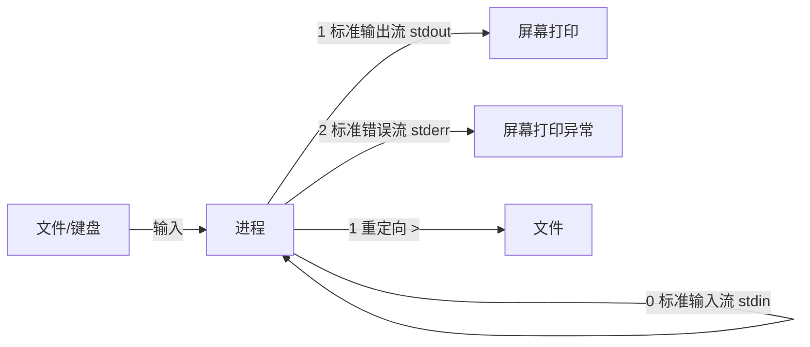

# 进程、重定向和管道指令：xargs 指令的作用是？

## 一、模块介绍

本模块以高频面试题"`xargs` 指令的作用是什么？"为引子，系统讲解进程、标准流、重定向与管道（Pipeline）的相关知识。`xargs` 通常与管道一起使用，因此学习前需要掌握进程与标准输入输出流的基本概念。

### 1.1 前置知识

- 理解可执行文件与内存的关系
- 熟悉基本 Linux 指令（ls、cat、echo）

### 1.2 学习目标

- 理解进程（Process）的概念，掌握 ps/top 的使用
- 掌握标准输入流、标准输出流、标准错误流
- 理解重定向符 `>`、`>>`、`2>&1` 的语义
- 掌握匿名管道、命名管道与 xargs 的典型用法

---

## 二、核心方法论

### 2.1 进程（Process）

应用的可执行文件放在文件系统中；把可执行文件启动，就会在操作系统（尤其是内存中）形成一个应用的副本，这个副本就是进程。

> 面试技巧：**进程是应用的执行副本**（这是定义），而不是"进程是操作系统分配资源的最小单位"（这是作用）。

#### ps 查看进程

`ps`：process status（进程状态）的缩写，像拍照一样查看某一时刻的进程快照。不带参数的 `ps` 只显示同一 TTY（电传打字机/输入输出终端）上的进程。TTY 是历史概念，现在表现为用户打开 bash 时系统分配的一个输入输出终端。

```bash
# 查看当前 TTY 的进程
ps

# 查看所有进程（-e 与 -A 等价）
ps -e

# ps -ef：-f 带上更多描述字段
ps -ef
# UID 进程所有者; PID 进程唯一标识; PPID 父进程ID; C CPU利用率
# STIME 开始时间; TTY 所在终端(?表示无); CMD 启动命令(方括号=系统/内核进程)

# BSD 风格，能力与 ps -ef 相当
ps aux
```

#### top 实时查看

`top` 与 `ps` 能力类似，但显示的是实时更新数据而非快照。更多进程的底层内容（进程与线程）可在相关模块深入学习；`htop` 是体验更好的替代工具。

### 2.2 管道（Pipeline）

管道的作用是在命令与命令之间传递数据——一个命令的输出可作为另一个命令的输入。更准确地说，管道在进程间传递数据。

### 图：进程三标准流模型



上图展示了进程的标准流模型：进程拥有标准输入流（fd 0）、标准输出流（fd 1）、标准错误流（fd 2），它们本质上都是文件。输入流作为执行上下文供进程取数，输出流写入后被打印到屏幕，异常信息则进入错误流。重定向可改变流向。

#### 重定向

- **标准输入流**（0）：可作为进程执行的上下文，进程执行可从输入流获取数据；
- **标准输出流**（1）：写入的结果被打印到屏幕；
- **标准错误流**（2）：执行异常时异常信息被记录其中。

```bash
# 覆盖重定向：> 每次覆盖目标文件
ls -l > out

# 追加重定向：>> 在目标文件追加
start.sh >> /var/log/somelogfile   # 每次启动程序日志不会被覆盖

# 标准错误流也重定向：把错误流重定向到输出流，再一起写文件
ls1 &> out                         # 简写
ls1 > out 2>&1                     # 等价写法，&1 代表引用标准输出流
```

### 2.3 管道的作用与分类

管道将一个进程的输出流定向到另一个进程的输入流，像水管一样把两个文件接起来。若一个进程输出字符 X，另一个进程就会获得 X 作为输入。

> 区分：**管道是一个接一个进行计算；重定向是将一个文件的内容定向到另一个文件**。二者经常结合使用。

Linux 中的管道也是文件，分为两类：

- **匿名管道（Unnamed Pipeline）**：在文件系统中但只是存储节点、不属于任何目录，说白了就是没有路径。
- **命名管道（Named Pipeline）**：像一个普通文件，拥有自己的路径。

管道遵循 **FIFO**（First In First Out，先入先出），与排队场景一致，先流入管道的数据先流出给下游进程。

---

## 三、关键流程

### 3.1 xargs 构造指令流程

### 图：xargs 构造并执行指令流程


上图展示 xargs 的典型工作流：先由 `ls` 得到文件列表，经管道流入 xargs 的标准输入流；xargs 按空白、换行等切割字符串，并用 `-I` 查找替换符构造模板指令；先加 `echo` 预览检查，确认无误后去掉 echo 真正执行。以 `echo` 为安全缓冲是该流程的关键习惯。

---

## 四、工具与实践

### 4.1 管道使用场景

#### 排序

```bash
# 匿名管道：将 ls 结果传给 sort 排序（倒序）
ls | sort -r
```

#### 去重

`uniq` 只对相邻重复行去重；若重复行交替出现，需先 `sort` 再去重：

```bash
sort dict.txt | uniq
```

#### 筛选

```bash
# 找出文件名含 Spring 的文件
find ./ | grep Spring

# 包含 Spring 但不含 MyBatis
find ./ | grep Spring | grep -v MyBatis
# grep -v 匹配不包含 MyBatis 的结果
```

#### 数行数

```bash
# wc -l 统计行数
wc -l Service.java

# 当前目录下有多少文件
ls | wc -l

# 思考：如何知道 Java 项目目录下有多少行代码？
find ./ -name "*.java" | xargs wc -l
```

#### 中间结果（tee）

管道一个接一个，是计算逻辑；需要保存中间结果时用 `tee`。`tee` 从标准输入流读取数据输出到标准输出流，同时把读到的数据存入文件（此时"存文件"就是函数式编程中所说的副作用，如同字母 T 在管道下方开口）：

```bash
find ./ -name "*.java" | tee JavaList | grep Spring
# tee 不影响指令执行，但会把 find 结果保存到 JavaList 文件
```

### 4.2 xargs 批量处理

```bash
# 场景：给当前目录下所有 .a 文件加 prefix_ 前缀
ls x.a y.a z.a

# 用 -I GG 构造模板指令；先用 echo 预览
ls | xargs -I GG echo mv GG prefix_GG
# 输出: mv x.a prefix_x.a / mv y.a prefix_y.a / mv z.a prefix_z.a

# 检查无误后去掉 echo 真正执行
ls | xargs -I GG mv GG prefix_GG
```

> 说明：`-I` 是查找替换符，`-I GG` 后的字符串 GG 会被替换为 `x.a`、`y.a`、`z.a`。若不使用 xargs 逐条手敲 mv 命令，就构成了样板代码。

### 4.3 命名管道（Named Pipeline）

命名管道需要挂到文件夹中并创建，用 `mkfifo` 创建：

```bash
# 创建命名管道 pipe1
mkfifo pipe1

# 读取（两端未就绪会阻塞等待）
cat pipe1

# 在另一个终端写入，cat pipe1 会返回并打印内容
echo "XXX" > pipe1
# & 使指令后台执行，不阻塞用户继续输入
cat pipe1 &
```

命名管道与匿名管道能力类似，同样遵循 FIFO，可连接一个输出流到另一个输入流，让多个程序之间方便通信。

---

## 五、常见坑点

### 5.1 重定向易错点

| 常见写法 | 结果 | 说明 |
|---------|------|------|
| `ls -l > out` | 覆盖写入 out | 屏幕上不再打印 |
| `start.sh >> log` | 追加写入 log | 日志不会被覆盖 |
| `ls1 > out` | out 为空 | `ls1` 不存在，报错进入标准错误流仍打印屏幕 |
| `ls1 &> out` | 正确 | 错误流重定向到输出流再写文件 |
| `ls1 > out 2>&1` | 同 `&>` | 等效写法 |

### 5.2 管道使用注意

- `uniq` 只去重相邻重复行，跨行去重前必须 `sort`；
- `xargs` 会按空白/换行切割，文件名含空格时需谨慎（可考虑 `-0` 配合）。
- 匿名管道与重定向容易混淆：管道是进程间"一个接一个"的计算传递，重定向是把内容定向到文件。

---

## 六、进阶扩展与参考

### 6.1 面试题解析：xargs 的作用是？

`xargs` 将标准输入流中的字符串分割成一条条子字符串，再按照我们想要的方式构造成一条条指令，从而大大拓展 Linux 指令的能力。例如可按特定方式逐个处理一个目录下所有文件，或根据 IP 地址列表逐个 ping 并收集延迟数据。

### 6.2 思考题

请分析下面这段 Shell 程序的作用：

```bash
mkfifo pipe1
mkfifo pipe2
echo -n run | cat - pipe1 > pipe2 &
cat <pipe2 > pipe1
```

> 提示：该程序利用两个命名管道 `pipe1`、`pipe2` 构建一条双向数据通道，实现了进程间交互式通信（echo 写入、cat 读回）。

### 6.3 延伸阅读

- 手册：`man ps`、`man xargs`、`man mkfifo`、`man bash`
- 管道与进程的底层实现，可参考本目录后续文件系统与进程相关篇目
- 实际抓包/日志场景中管道常与 grep、awk、sort 组合，参看 02-实战与排障 分类的《日志分析实战》一篇