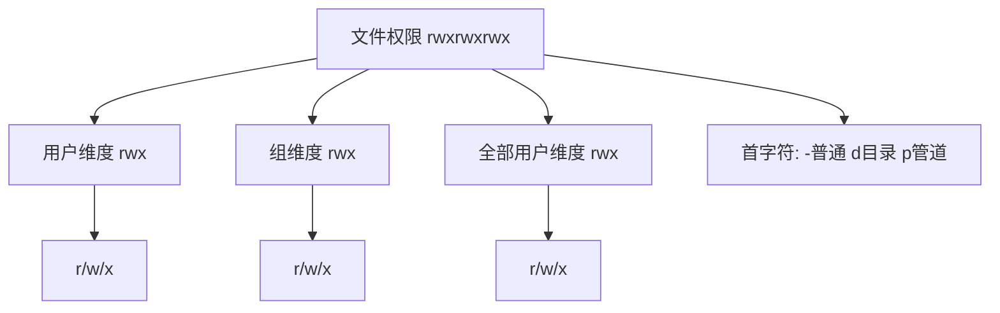
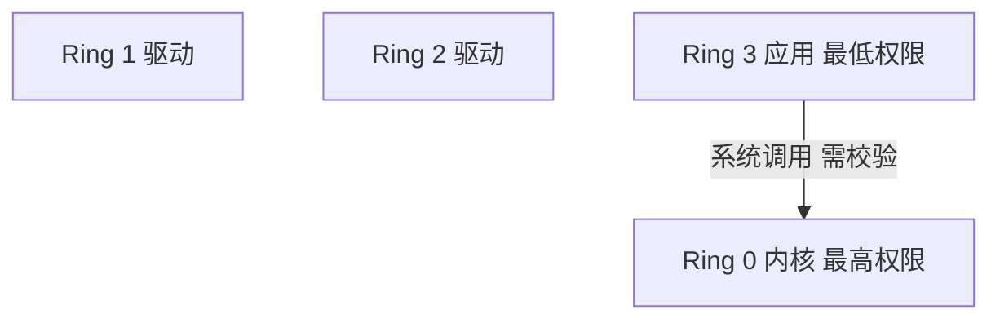
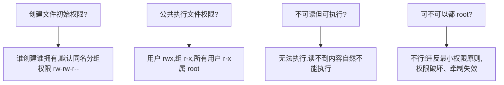

# 用户和权限管理指令：请简述 Linux 权限划分的原则？

## 一、模块介绍

本模块以一道高频面试题"**请简述 Linux 权限划分的原则？**"为引子，系统讲解 Linux 的权限抽象、权限架构思想（最小权限原则、分级保护、权限包围）以及用户分组与文件权限管理的具体指令。

这类题目不仅考察具体指令，更考察候选人对技术层面的认知；认知清晰的程序员能把 Linux 权限管理的知识迁移到其他系统设计中。

### 1.1 前置知识

- 熟悉 Linux 基本指令（ls、chmod）
- 理解文件类型与目录概念

### 1.2 学习目标

- 理解用户、组、文件、系统调用的权限抽象
- 掌握最小权限原则、分级保护（Ring）与权限包围思想
- 熟练使用用户分组指令（groups/id/useradd/groupadd/usermod）
- 熟练使用文件权限指令（chmod/chown）
- 能用规范表述回答"Linux 权限划分的原则"

---

## 二、核心方法论

### 2.1 权限抽象

一个完整的权限管理体系，要有对用户、进程、文件、内存、系统调用等合理的抽象。

#### 用户与组

Linux 是多用户平台，允许多个用户同时登录。Linux 将用户抽象成账户，账户可登录系统（密码或证书认证方式）。为方便分配权限，还支持**组（Group）账户**——多个账户的集合。组可为成员分配某一类权限；每个用户可属于多个组，从而快速借用组的权限。

组的概念类似于微信群：一个用户可在多个群中。若某群分配了 10 个目录的权限，新建用户时将其加入该组即可，不必逐目录分配权限。而 **Root 账户也叫超级管理员（Superuser）**，相当于群主，对系统拥有完全掌控，可使用系统提供的全部能力。

#### 文件权限（目录也是一种文件）

Linux 中一个文件可设置三种权限：

- 读权限（r，read）：控制读取文件；
- 写权限（w，write）：控制写入文件；
- 执行权限（x，execute）：控制执行文件（脚本、应用程序等）。

每个文件从三个维度配置上述权限：

- 用户维度：每个文件所属 1 个用户，用户维度 rwx 在用户维度生效；
- 组维度：每个文件所属 1 个分组，组维度 rwx 在组维度生效；
- 全部用户维度：设置对所有用户的权限。

### 图：文件权限 9 字符模型



上图展示 Linux 文件权限的 9 字符模型：三组 `rwx` 分别对应用户、组、全部用户三个维度，`-` 代表无权限。用 `ls -l` 查看时共 10 个字符，首字符代表文件类型（`-` 普通文件、`d` 目录、`p` 管道）。例如 `rwxrwxrwx` 表示所有维度可读写执行；`rw--wxr-x` 表示用户维度不可执行、组维度不可读、全部用户维度不可写。

### 2.2 内核与系统调用权限

内核是连接硬件、提供最核心能力的程序，拥有直接操作全部内存的权限，因此不能把全部能力都提供给用户，也不允许用户直接通过 shell 进行系统调用。Linux 把部分进程需要的系统调用（System Call）以 C 语言 API 形式提供出来，部分系统调用带权限检查（如设置系统时间）。

### 2.3 权限架构思想

优秀权限架构的目标是让系统安全稳定、用户与程序之间相互制约、相互隔离，要求权限划分足够清晰、分配成本足够低。

#### 最小权限原则（Least Privilege）

**每一个成员拥有的权限应该足够小，每段特权程序执行的过程应该足够短。** 安全级别较高时还需成员权限互相牵制，比如金融领域登录线上数据库需两次登录、两个密码分属两个角色——即便一个成员出问题，系统整体仍安全。同样，每个程序也应只拥有少量目录读写权限与少量系统调用权限。

#### 权限划分边界

权限划分边界应足够清晰、尽量相互隔离。通常服务器上重要应用由不同账户执行，例如 Nginx、Web 服务器、数据库不会跑在同一个账户下。随着容器化（Containerization）发展，甚至希望每个应用独享一个虚拟空间，就像运行在独立操作系统中，互不干扰。

> 为什么不用 root 账户执行程序？假设 MySQL 跑在 root（最大权限）账户上，若黑客攻破 MySQL 服务获得执行 SQL 的权限，整个系统都将暴露；黑客可利用 MySQL 相关指令备份并删除关键文件以要挟勒索。遵循最小权限原则，黑客即便攻破 MySQL 也只能获得最小权限，损失大幅缩小。

#### 分级保护（Ring）

### 图：环形保护层级



上图展示操作系统的环状保护层级：内核在最内层（Ring 0），驱动在中间（Ring 1/2），应用在最外层（Ring 3）。相邻两层中内层权限更高，可改变外层；外层想使用内层资源时，由专门程序（或硬件）保护。例如 Ring 3 的应用需要内核时，向内核发送系统调用，由内核验证用户权限与行为安全性。

#### 权限包围（Privilege Bracketing）

为防止所有应用长期以 root 运行，Linux 提供权限包围能力：应用临时需要高级权限时，通过交互界面（如让用户输入 root 密码）验证身份，执行完高级权限操作后立即恢复普通权限。这样减少应用处于高级权限的时间、做到专权专用，防止被恶意程序利用。

---

## 三、关键流程

### 3.1 权限设置的认知四问

### 图：文件权限设置与认知推演流程



上图为文件权限四大认知问题的推演结果：创建文件时"谁创建谁拥有"且归属同名分组、初始权限 `rw-rw-r--`；公共执行文件（如 `ls`）采取用户可读写执行、组与其他用户只读执行的策略；一个文件不可读则无法执行（读不到内容自然不能执行）；"都 root"则违背最小权限与互相牵制原则，不可取。

---

## 四、工具与实践

### 4.1 用户分组指令

#### 查看

```bash
# 查看当前用户的所有分组（第一个是主要分组，其后为次级分组）
groups

# 查看当前用户身份
id
# uid 用户id; gid 组id; groups 分组及其id

# 查看所有用户（/etc/passwd 存储全部用户信息）
cat /etc/passwd
```

常用分组说明：

- `adm` 分组用于系统监控，`/var/log` 中的部分日志属于 adm 分组；
- `sudo` 分组用户可通过 `sudo` 指令提升权限。

#### 创建用户

```bash
# useradd 创建用户（需管理员身份）
sudo useradd foo
```

> `sudo` 原意是 superuser do，后来演变为以另一个用户的身份执行某指令。未指定用户时以超级管理员身份执行，会触发权限提升并弹出输入管理员密码的界面。

#### 创建分组

```bash
sudo groupadd hello
```

#### 为用户增加次级分组

组分成主要分组（Primary Group）与次级分组（Secondary Group）。主要分组只有 1 个，次级分组可有多个。用 `usermod` 添加次级分组，`-a` 代表 append，`-G` 后接次级分组清单：

```bash
# 将 foo 添加进 sudo 组，使 foo 拥有 sudo 权限
sudo usermod -a -G sudo foo
```

#### 修改用户主要分组

```bash
# 小写 -g 修改主要分组
sudo usermod -g somegroup foo
```

### 4.2 文件权限管理指令

#### 修改文件权限（chmod）

`chmod`（change file mode bits）修改文件权限。rwx 在 Linux 中用三个连在一起的二进制位表示，如 `111` 代表 `rwx`、`101` 代表 `r-x`。三组共 9 位（`111111111` = `rwxrwxrwx`），因 `111` 十进制为 7，故常用数字表示。

```bash
# 设置 foo 可执行
chmod +x ./foo
# 不允许 foo 执行
chmod -x ./foo
# 同时设置多个权限
chmod +rwx ./foo

# 数字表示：一次设置用户、组、全部用户权限
chmod 777 ./foo   # rwxrwxrwx (111111111)
chmod 666 ./foo   # rw-rw-rw- (110110110)
```

#### 修改文件所属用户（chown）

```bash
# 修改 foo 文件所属用户为 bar
chown bar ./foo

# 同时修改所属用户和分组
chown g:u ./foo   # 修改所属用户为 g、所属分组为 u
```

---

## 五、常见坑点

### 5.1 权限相关高频踩坑点

| 场景 | 说明 | 处理建议 |
|------|------|---------|
| 文件不可读但可执行 | 无法执行（读不到内容） | 保证可执行文件至少具备读权限 |
| 所有应用都用 root | 被攻破后波及全系统 | 遵循最小权限原则，专用账户运行 |
| 初始权限不合理 | 新文件归创建者与同名分组 | 按需用 chmod 收紧 |
| 忘记软链接与目录类型 | 权限首字符易误读 | 先 `ls -l` 确认类型再操作 |
| 跨目录写文件无权限 | 至少需目录写+执行权限 | 结合 x 权限判断能否穿越目录 |

### 5.2 权限架构实践要点

- 对每个成员、每个组，权限应足够小；
- 每段特权程序执行过程应足够短（权限包围）；
- 希望隔离的应用分账户/分容器运行；
- 提升权限用 sudo 后立即释放；尽量少用 root。

---

## 六、进阶扩展与参考

### 6.1 面试题解析：请简述 Linux 权限划分的原则？

Linux 遵循**最小权限原则（Least Privilege）**：

- 每个用户掌握的权限应该足够小，每个组掌握的权限也足够小。实际生产过程中，管理员权限最好拆分、互相牵制以防止问题。
- 每个应用应尽可能使用小的权限。最理想是每个应用单独占一个容器（如 Docker），互不影响；即便应用被攻破也无法轻易突破容器保护层。
- 尽可能少用 `root`。需要 root 能力时应进行权限包围（privilege bracketing）——立即提升权限（如 sudo），处理后马上释放权限。
- 系统层面进行分级保护，将系统权限分成一个个 Ring，外层 Ring 调用内层 Ring 时需内层 Ring 做权限校验。

### 6.2 思考题

如果一个目录是只读权限，那么这个目录下面的文件还可写吗？

> 提示：目录的"写权限"控制的是能否在目录中新建/删除文件条目，与文件自身的写权限相互独立。目录只读时无法新增或删除条目，但已有文件若自身具备写权限，其内容仍可被改写。

### 6.3 延伸阅读

- 手册：`man chmod`、`man chown`、`man useradd`、`man usermod`、`man groups`
- 用户态与内核态、系统调用细节，可参考相关操作系统内核篇目
- 容器化隔离与权限模型，可结合 Docker/Kubernetes 相关文档学习