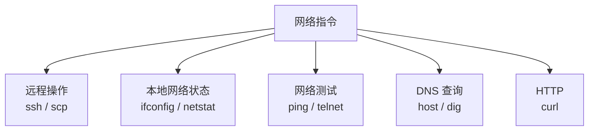
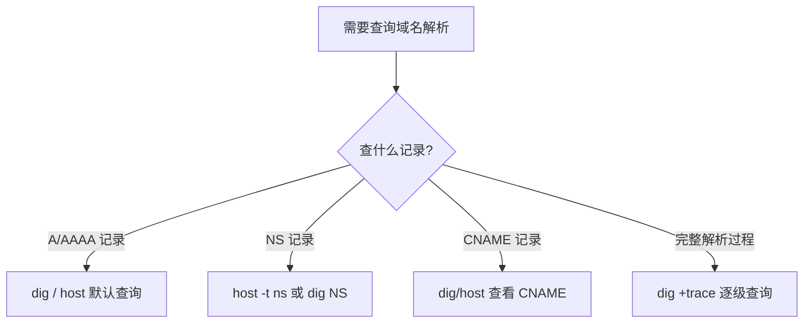

# Linux 中的网络指令：如何查看一个域名有哪些 NS 记录？

## 一、模块介绍

本模块以一道面试题"**如何查看一个域名有哪些 NS 记录？**"为引子，从远程操作、本地网络状态、网络测试、DNS 查询、HTTP 五个维度系统梳理 Linux 常用的网络指令，帮助你在远程操作、开发、联调、线上 Debug 时熟练运用。

网络问题常与 TCP/IP、UDP 等计算机网络知识关联，这些将在计算机网络相关模块深入讲解。

### 1.1 前置知识

- 熟悉命令行与 SSH 基本概念
- 了解 IP 地址、域名与 DNS 的基本概念更佳

### 1.2 学习目标

- 掌握远程操作指令 ssh/scp
- 掌握本地网络状态查看 ifconfig/netstat
- 掌握网络测试 ping/telnet
- 掌握 DNS 查询 host/dig
- 掌握 HTTP 请求指令 curl，并回答"如何查看 NS 记录"

---

## 二、核心方法论

### 2.1 网络指令按场景分类

Linux 提供了不少网络相关指令，本文按使用场景划分为五类：远程操作（ssh/scp）、本地网络状态（ifconfig/netstat）、网络测试（ping/telnet）、DNS 查询（host/dig）、HTTP（curl）。按场景记忆更利于工作中快速定位所需指令。

### 2.2 网络指令定位视图

### 图：本地网络指令定位视图



上图为网络指令的全景分类：查询本机状态用 ifconfig/netstat，测试连通性用 ping/telnet，解析域名用 host/dig，收发请求用 curl，跨机操作用 ssh/scp。理解每个场景对应的"主力指令"，即可快速接入日常排障。

---

## 三、关键流程

### 3.1 域名 DNS 解析排查流程

### 图：DNS 查询与 NS 记录排查流程



上图为 DNS 排查的基本路径：需查询 A/AAAA（地址）记录时用 host/dig 默认查询；查询 NS（Name Server，名称服务器）记录时用 `host -t ns` 或 `dig NS`；查看 CNAME（别名）记录看 dig 结果的别名字段；需要完整解析过程可用 `dig +trace` 逐级查看。

---

## 四、工具与实践

### 4.1 远程操作指令

`ssh` 允许远程登录目标计算机并进行远程操作与管理；`scp` 帮助远程传送文件。

```bash
# ssh 远程登录
ssh user@ip

# scp 拷贝文件到远程（家目录简写为 ~）
scp a.txt u2:~/
# u2 为 /etc/hosts 中配置的主机别名
```

> `/etc/hosts` 文件可设置 IP 地址对应的域名，例如在小集群中为两台机器设置便于记忆的名字（u1、u2），从而用 `scp a.txt u2:~` 这样的简写操作。

### 4.2 查看本地网络状态

> 注：`ifconfig`/`netstat` 属于 net-tools 工具包，上游已停止维护多年，现代发行版分别推荐 `ip addr`（iproute2）与 `ss` 作为替代。下文沿用老命令讲解原理，两者对照更利于理解。

#### ifconfig

想了解本地 IP 与网络接口时使用 `ifconfig`。网络接口可以理解成网卡，虚拟机会装软件模拟的虚拟网卡（如 VMware 为每个虚拟机创建虚拟网卡接入虚拟网络）。

```bash
ifconfig
# ens33 连接真实网络的虚拟网卡; lo 本地回路(local loopback)，发往 lo 相当于发给本机
```

#### netstat

查看当前本机网络使用情况用 `netstat`：

- 默认行为：查询本地所有 socket（网络插槽被抽象成文件，负责客户端/服务器间收发数据）。

```bash
# 默认查看所有本地 socket
netstat | less

# 数一数有多少个 socket
netstat | wc -l
# 示例: 615。大量 socket 用于进程间通信，并非都有真实互联网连接

# 查看 TCP 连接（-t）
netstat -t

# 查看端口占用（常见场景：找谁占用了某端口）
netstat -ntlp
# -n 端口号用数字显示; -t 看 TCP; -l 只看监听中的连接; -p 显示程序名称
# 示例: 22 端口被 sshd 占用
```

### 4.3 网络测试

#### ping

测试本机到某网站的网络延迟用 `ping`，使用 ICMP（Internet Control Message Protocol，互联网控制报文协议）协议：

```bash
ping <网站>
# time 为往返一次的时间
# ttl (time to live) 为封包生存时间，途中超时将被丢弃并计入丢包率
# ping 可顺带看到网站 IP（利用了 DNS Lookup，但未显示全部解析结果）
```

#### telnet

要知道本机到"某 IP + 端口"是否通畅、对方是否在该端口提供服务，可用 `telnet`：

```bash
telnet <ip> <port>
# 进入交互式界面后可发送 HTTP 请求
# 例如输入 GET / 与 Host 头，可看到服务器返回 301/200 等状态
```

### 4.4 DNS 查询

#### host

`host` 是 DNS 查询工具：

```bash
# 查询域名的解析结果（可看到 CNAME 别名与 A 记录）
host www.lagou.com
# 结果含别名(CNAME)与多个 IP，可能是 CDN 分发

# 指定记录类型查询，例如 AAAA 记录
host -t aaaa www.lagou.com

# 查询 NS 记录（核心题目答案）
host -t ns <网址>
```

> 若某域名返回别名（CNAME）指向 lgmain 开头的域名，说明该站点可能在用 CDN（Content Delivery Network，内容分发网络）分发内容。

#### dig

`dig` 也是 DNS 查询工具，但显示更详细：

```bash
dig www.lagou.com
# 可看到 CNAME 别名记录与多条 A 记录（用于负载均衡或分发内容）

# 查询 NS 记录
dig NS <网址>
```

### 4.5 HTTP 相关

#### curl

在命令行请求网页或接口用 `curl`，支持 LDAP、SMTP、FTP、HTTP 等多种协议：

```bash
# 请求一个网址获取资源
curl http://example.com

# 只看 HTTP 返回头
curl -I http://example.com

# 发送 POST 请求
curl -d '{"x" : 1}' -H "Content-Type: application/json" -X POST http://localhost:3000/api
# -d 附带要发送的数据; -X 指定 HTTP 方法; -H 指定自定义请求头
```

---

## 五、常见坑点

### 5.1 网络指令使用注意

| 场景 | 常见坑 | 处理建议 |
|------|-------|---------|
| 看本地网络 | 只记 IP 忘了网卡 | 结合 `ifconfig` 看接口与 IP |
| 端口占用 | 忘记 `-t`/`-n`/`-l`/`-p` 组合 | 用 `netstat -ntlp` 一次到位 |
| ping 不通 | 混淆"不可达"与"丢包" | 结合 time 与丢包率综合判断 |
| DNS 解析 | 想查记录类型却用默认查询 | 用 `host -t <type>` 或 `dig <type>` 指定记录类型 |
| 大流量排查 | 用 cat 打满终端 | 用 `netstat | less` 分页 |

### 5.2 关键指令速查表

| 类别 | 指令 | 用途 |
|------|------|------|
| 远程操作 | `ssh` / `scp` | 远程登录 / 远程拷贝文件 |
| 本地网络状态 | `ifconfig` / `netstat` | 查看网络接口 / 网络状态与端口占用 |
| 网络测试 | `ping` / `telnet` | 测试网络延迟 / 测试端口连通性 |
| DNS 查询 | `host` / `dig` | 域名解析查询（含 NS 记录） |
| HTTP | `curl` | 发送各种请求，支持 HTTPS |

---

## 六、进阶扩展与参考

### 6.1 面试题解析：如何查看一个域名有哪些 NS 记录？

`host` 提供了 `-t` 参数用于指定查找的记录类型。使用 `host -t ns <网址>` 即可查看某域名的 NS（Name Server，名称服务器）记录。`dig` 也提供了同样的能力（`dig NS <网址>`）。此外可结合 `man` 深入学习各指令的参数。

### 6.2 思考题

如何查看正在 TIME_WAIT 状态的连接数量？

> 提示：可用 `netstat -an | grep TIME_WAIT | wc -l` 统计处于 TIME_WAIT 状态的连接数量；更现代的替代是 `ss -nat`。TIME_WAIT 属于 TCP 四次挥手后的等待状态，相关细节可参考 02-实战与排障 分类的《典型网络故障：选择长连接 or 短连接，大量 Timewait 的产生时如何处理？》一篇。

### 6.3 延伸阅读

- 手册：`man ifconfig`、`man netstat`、`man dig`、`man curl`
- 网络状态与抓包分析，参看 02-实战与排障 分类的《网络故障分析（ping、mtr、traceroute）与抓包分析（tcpdump）诊断》一篇
- 域名系统与 CDN、TCP/IP 协议细节，可结合计算机网络类资料深入学习