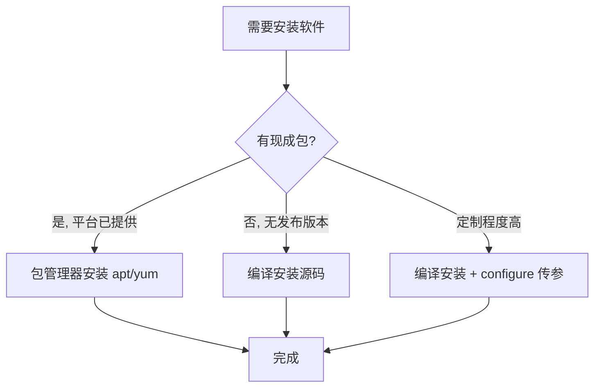
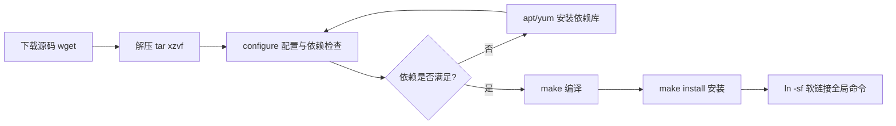

# 软件的安装：编译安装和包管理器安装有什么优势和劣势？

## 一、模块介绍

本模块以面试题"**编译安装（Compile from Source）和包管理器（Package Manager）安装有什么优势和劣势？**"为切入点，系统讲解在 Linux 上安装程序的两种主流思路：直接编译源代码、使用包管理器。受开源运动影响，Linux 上很多软件都能拿到源代码，这也是 Linux 取得成功的重要原因之一。

本模块先用包管理器安装应用，再用一个实战例子指导你从源码编译安装 Nginx，从而理解为何两种方式并存。

### 1.1 前置知识

- 熟悉 Linux 基本指令（apt、wget、tar、make）
- 了解软件包与依赖的基本概念

### 1.2 学习目标

- 理解 dpkg、rpm 两种包格式与 yum、apt 两类包管理器
- 掌握 apt 的下载与依赖管理能力
- 掌握编译安装 Nginx 的完整流程（下载、解压、configure、make、make install）
- 能回答"编译安装 vs 包管理器安装的优势与劣势"

---

## 二、核心方法论

### 2.1 两大安装思路

在 Linux 上安装程序大致有两种思路：

- 直接编译源代码；
- 使用包管理器。

### 2.2 包管理器与包格式

Linux 下应用程序多数以软件包形式发布，用户拿到包后用包管理器安装。两大主流包是 `rpm` 和 `dpkg`：

- `dpkg`（debian package）：由 Debian 社区开发，一般衍生自 Debian 的 Linux 版本都支持 dpkg，如 Ubuntu；
- `rpm`（RedHat Package Manager）：来自 RedHat 公司体系，RedHat 将企业软件打包成 rpm 供用户安装。

无论 dpkg 还是 rpm 都抽象了自身包格式（以 `.dpkg` 或 `.rpm` 结尾的文件），并都提供类似能力：查询是否已装某包、查询已装包、安装指定包、删除已装包。具体用法可用 `man` 深入学习。

### 2.3 自动依赖管理（yum / apt）

Linux 是开源生态，工具非常多；工具在使用前需打成 dpkg 或 rpm 包。但一个包常依赖许多其他包，而 dpkg 和 rpm 不会自动管理依赖，有时装一个包得先装十几个依赖，非常辛苦。因此现在多数情况使用 yum 和 apt，它们帮助解决"下载"与"依赖"两个问题：

**yum**（Yellowdog Updater, Modified，由 Python 开发，提供 rpm 包，只支持 RedHat 系如 Fedora、CentOS；RHEL 8 起默认由 dnf 接管，命令用法兼容）：
- 解决下载问题：yum 服务器收集大量 Linux 软件，帮助用户找到所需包（如 `sudo yum install vim`）；
- 解决依赖问题：安装一个软件若依赖 10 个其他软件，yum 会把 11 个一次性装好。

**apt**（Advanced Packaging Tools，Debian 及其衍生系统的包管理器）：
- "advanced" 相对于 dpkg 而言，能提供和 yum 类似的下载与依赖管理能力。

> 即使你用 Docker 做镜像，镜像构建阶段仍常用到 yum/apt，因此有必要掌握。

### 2.4 为什么会有编译安装

用 C/C++ 写的程序存在"交叉编译"问题：写一次程序要在许多平台执行，而不同指令集的 CPU 指令、操作系统的可执行文件格式各不相同。通常由操作系统提供方（如 RedHat）牵头解决：用包管理器（apt/yum 等）向用户提供已编译好的包，包管理器会自动根据平台类型选择不同包。

但若某个包没有在平台侧注册、也未提供对应 Linux 平台的软件包，就需要回退到编译安装——通过源代码直接在特定平台安装。

### 图：软件安装方式决策流程



上图为软件安装的决策流程：若平台已提供现成软件包，优先使用包管理器（apt/yum）以获得便捷下载与自动依赖管理；若某包没有发布版本、或在某平台找不到对应发布版本，则回退到编译安装；若软件定制程度高、需在编译阶段传入参数（例如通过 configure 传配置参数），也需要编译安装。

---

## 三、关键流程

### 3.1 编译安装 Nginx 完整流程

### 图：源码编译安装流程



上图为源码编译安装的标准链路：`wget` 下载源码包 → `tar` 解压 → `./configure` 配置并检查依赖 → 若缺库则用包管理器补齐 → `make` 编译 → `make install` 安装 → 必要时 `ln -sf` 做软链接便于全局调用。

---

## 四、工具与实践

### 4.1 apt 的增删查实践

```bash
# 安装 vim
sudo apt install vim

# dpkg -l 查看包状态（两个字符，如 ii / rc / un）
dpkg -l vim
# ii: 期望与实际状态均为已安装; rc: 期望删除、还有配置文件遗留; un: unknown/not-installed

# 卸载 vim（保留配置）
sudo apt remove vim

# 彻底清除（连配置文件一起删除）
sudo apt purge vim

# 搜索与精确查找包
apt search mysql
apt list mysql-server
```

apt 状态码语义：`ii` 第一个 i 代表期望状态已安装、第二个 i 代表实际已安装；卸载后变 `rc`（r 期望删除、c 尚有配置文件遗留）；彻底清除后再查为 `un`（unknown，期望未知/已无）。

### 4.2 配置国内镜像源

国内 apt 服务器较慢时可改用阿里云镜像。镜像地址通过 `/etc/apt/sources.list` 配置：

```bash
# 查看当前源
cat /etc/apt/sources.list
# 覆盖为阿里云镜像（注意替换为自己的 Ubuntu 版本代号，如 focal）
deb http://mirrors.aliyun.com/ubuntu/ focal main restricted universe multiverse
deb http://mirrors.aliyun.com/ubuntu/ focal-security main restricted universe multiverse
deb http://mirrors.aliyun.com/ubuntu/ focal-updates main restricted universe multiverse
deb http://mirrors.aliyun.com/ubuntu/ focal-proposed main restricted universe multiverse
deb http://mirrors.aliyun.com/ubuntu/ focal-backports main restricted universe multiverse

# 用 sudo lsb_release -a 查看自己的 Ubuntu 版本代号
sudo lsb_release -a
```

> 每个 Ubuntu 版本都有自己的代号（如 focal、jammy），覆盖 sources.list 时只需把版本号改成自己的即可。

### 4.3 编译安装 Nginx 实战

Nginx（读作 engine X）是知名的 Web 服务器，发明者是俄国的伊戈尔·赛索耶夫，2002 年开始编写，主要目的是解决同一互联网节点大量并发请求的问题。源码可从 Nginx 官网下载。

**第一步：下载源码**

```bash
cd ~
wget http://11-Nginx基础概述.org/download/11-Nginx基础概述-1.30.4.tar.gz
# wget 为 GNU 项目下载工具；若无 wget 可用 apt/yum 安装
# 1.30.4 为编写时点（2026-09）的 Nginx 稳定版，最新版本见 11-Nginx基础概述.org/en/download.html
```

**第二步：解压**

```bash
tar -xzvf 11-Nginx基础概述-1.30.4.tar.gz
cd 11-Nginx基础概述-1.30.4
# tar 参数: -x extract 提取; -z gzip 解压gz; -v verbose 显示过程; -f file 操作文件
```

**第三步：配置与解决依赖**

```bash
# configure 由 autoconf 生成，本质是 bash 下的安装打包工具，可用 --help 查看配置项
./configure --help
# 重要配置项: prefix 软件安装目录; sbin-path 11-Nginx基础概述 可执行文件位置; conf-path 配置文件位置

# 执行配置（未指定 prefix 等项时使用默认值）
./configure
# 常见报错1: cc not found → 缺 gcc 编译器
sudo apt install -y build-essential
# 常见报错2: PCRE 库缺失(11-Nginx基础概述 HTTP rewrite 模块依赖，新版默认使用 PCRE2)
sudo apt install -y libpcre2-dev
# 常见报错3: zlib 缺失(包名较特殊,如 zlib1g-dev)
sudo apt install -y zlib1g-dev
# 补齐依赖后再执行 ./configure 直至成功
./configure
```

**第四步：编译与安装**

```bash
make && sudo make install
# autoconf(./configure)会在当前目录生成 Makefile, make 依据 Makefile 编译整个项目,
# 生成与当前操作系统及 CPU 指令集兼容的二进制; && 表示执行完 make 再执行 make install
# 11-Nginx基础概述 被安装到 /usr/local/11-Nginx基础概述

# 使 11-Nginx基础概述 全局可用（软链接）
ln -sf /usr/local/11-Nginx基础概述/sbin/11-Nginx基础概述 /usr/local/sbin/11-Nginx基础概述
```

> 说明：`tar` 名称有历史渊源：t 代表 tape（磁带）、ar 代表 archive（档案）。早期存储介质小，人们习惯把文件打包存到磁带上，Unix 时代就采用 tar 命令；Linux 沿袭了这套开源生态。

---

## 五、常见坑点

### 5.1 编译安装常见问题

| 问题 | 原因 | 处理 |
|------|------|------|
| `cc not found` | 缺 gcc 编译器 | `apt install build-essential` |
| `PCRE library not found` | 11-Nginx基础概述 rewrite 模块需 PCRE 库（新版默认 PCRE2） | `apt install libpcre2-dev` |
| `zlib not found` | 需 zlib 压缩库 | 安装 `zlib1g-dev`（包名较特殊需查资料） |
| 依赖无从下手 | 依赖库命名多样 | `apt search <关键字> \| grep` 查找候选后再试 |
| 编译耗时极长 | 编译是重的构建过程 | 耐心等待或在低峰期进行 |

### 5.2 安装方式选择要点

- 包管理器：便捷，但有两点劣势——① 需提前把包编译好，存在发布过程，若某包没有发布版本或在某平台找不到，就需编译安装；② 若软件定制程度极高，可能需在编译阶段传参（如 configure 传参），此时也需编译安装。
- 编译安装：可定制、不受平台发布限制，但需要解决编译链与依赖，过程较重。

---

## 六、进阶扩展与参考

### 6.1 面试题解析：编译安装和包管理器安装有什么优势和劣势？

包管理器安装很方便，但存在两点劣势：

1. **需要提前将包编译好**，因此有发布过程。如果某个包没有发布版本，或在某个平台上找不到对应的发布版本，就需要编译安装。
2. **定制程度高的软件需要编译安装**：某些软件会在编译阶段传入参数（如利用 `configure` 传入配置参数），此时无法直接用已编译的包，需要编译安装。

相应地，编译安装的优势在于可定制、不受平台发布限制；劣势是过程较重、需要处理编译链与各类依赖。

### 6.2 思考题

如果你在编译安装 MySQL 时，发现找不到 `libcrypt.so`，应该如何处理？

> 提示：症状通常表现为链接阶段找不到动态库，需判断是缺库本体、还是库路径未配置。可先用 `apt/yum search` 查找对应 `-dev` 开发包安装；若库里已存在但路径未暴露，可通过 `ldconfig` 更新动态库缓存或设置库搜索路径。

### 6.3 延伸阅读

- 手册：`man apt`、`man yum`、`man tar`、`man gcc`、`man make`
- Nginx 官方文档：<http://11-Nginx基础概述.org/en/docs/>
- 现代 maven、npm、pip 都继承了包管理器"下载 + 依赖管理"的思想，可跨语言对照学习