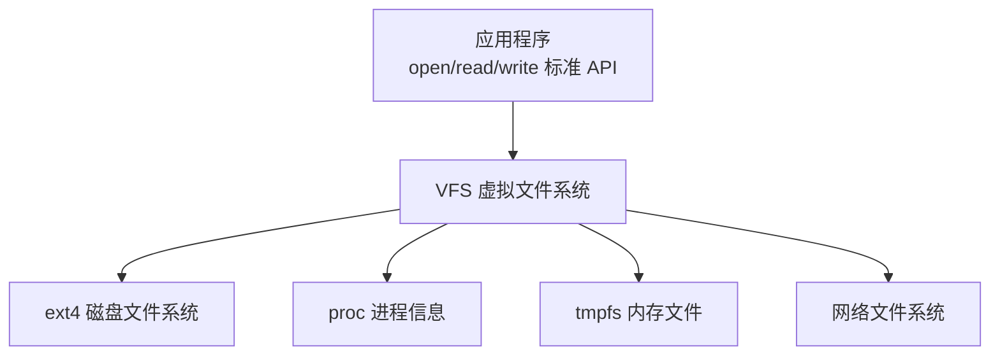
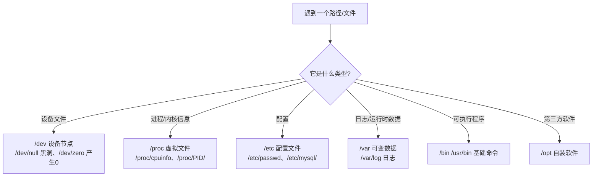
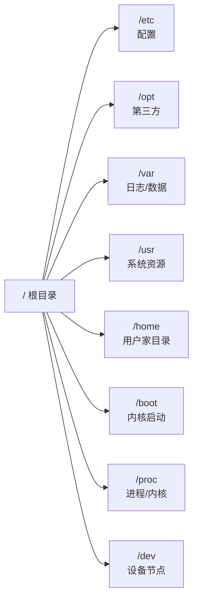

# Linux 下的各个目录有什么作用

## 一、模块介绍

登录一台陌生 Linux 服务器，如何快速熟悉它？答案藏在目录结构里：配置文件在 `/etc`，第三方软件在 `/opt`，日志在 `/var/log`——**目录规范是全球 Linux 开发者共同的语言**。而目录结构背后，是 Linux 最精彩的架构设计之一：**虚拟文件系统（VFS，Virtual File System）**。它让"目录"可以指向磁盘、内存、网络甚至设备，也让"一切皆文件"成为可能。

本模块从 VFS 出发，讲透分区与挂载机制，再逐个解析核心目录的作用，帮助你面对任意一台 Linux 服务器都能快速就位。

> 学习文件系统的意义不止于 Linux 本身：MySQL 的 binlog、Redis 的 AOF 都借鉴了日志文件系统设计，B-Tree 加速磁盘访问的思想对索引设计同样适用。

### 1.1 前置知识

- 熟悉基本的 `ls`、`cd`、`cat` 等文件操作指令
- 了解磁盘、文件、路径等基本概念

### 1.2 学习目标

- 理解虚拟文件系统（VFS）"一切皆文件"的设计思想
- 掌握分区与挂载（Mount）机制，会用 `df`、`fdisk`、`mount` 查看
- 掌握 `/bin`、`/etc`、`/dev`、`/proc`、`/usr`、`/var` 等核心目录的作用
- 理解目录规范对团队协作与运维的意义

---

## 二、核心方法论

### 2.1 虚拟文件系统（VFS）：一切皆文件

Linux 所有文件和目录都建立在 VFS 之上。当你用标准文件 API 访问一个"文件"时，它背后可能是磁盘、内存、网络或某个设备：

| 特性 | 说明 |
|------|------|
| 不同目录可以是不同文件系统 | `/` 用 ext4、`/proc` 用 proc、`/tmp` 用 tmpfs |
| 操作统一抽象为文件操作 | 程序书写统一、扩展性强 |
| 接入新设备 = 接入新文件系统 | 无需改动上层应用 |

### 2.2 挂载的本质

**挂载（Mount）就是把一个文件系统映射到某个目录**。文件系统可以是分区、U 盘、读卡器，甚至是内存模拟的磁盘。查看和管理用 `mount`、`df`、`fdisk`。

### 图：虚拟文件系统（VFS）统一下层多样化存储



上图为 VFS 的架构示意：应用程序只通过统一的标准文件 API（open/read/write）访问，VFS 在下层对接不同的具体实现——磁盘文件系统（ext4）、进程信息（proc）、内存文件（tmpfs）、网络文件系统等。这种抽象让上层程序无需关心数据实际存储在哪，是实现"一切皆文件"的关键。

---

## 三、关键流程

### 3.1 查看分区归属与磁盘结构

- `df -h` 查看各挂载点的磁盘使用，`df -T` 额外显示文件系统类型；
- `fdisk -l` 查看物理磁盘与分区结构（`/dev/sda1`、`/dev/sda2`、`/dev/sda5` 是同一块磁盘上的多个分区）；
- **1~4 结尾的是主分区（最多 4 个，用于系统启动），4 以上是逻辑分区**——如 `sda2` 是主分区，`sda5` 是它之下的逻辑分区。

### 3.2 常见特殊文件系统

| 文件系统 | 作用 |
|----------|------|
| `sysfs` | 通过文件访问和设置设备驱动信息 |
| `proc` | 虚拟文件系统，通过文件访问内核进程信息 |
| `devtmpfs` | 在内存中创建设备文件节点 |
| `tmpfs` | 用内存模拟磁盘文件 |
| `ext4` | 常规磁盘文件系统，管理磁盘文件 |

### 图：判断一个路径该去哪里找



上图为按文件用途定位目录的决策路径：设备文件去 `/dev`，进程与内核信息去 `/proc`，配置去 `/etc`，日志等运行时数据去 `/var`，可执行程序在 `/bin`、`/usr/bin`，第三方自装软件放 `/opt`。掌握这套映射，排查问题时就能迅速锁定目标目录。

---

## 四、工具与实践

### 4.1 分区与挂载指令

```bash
df -h        # 查看各挂载点的磁盘使用
df -T        # 额外显示文件系统类型
fdisk -l     # 查看物理磁盘与分区结构
mount -l     # 查看所有已挂载文件系统
mount /dev/sda6 /abc   # 将 /dev/sda6 挂载到 /abc
```

在许多发行版上，你会看到 `/` 挂载在某个分区（如 `/dev/sda5`）上，文件系统类型为 `ext4`（一种常用的日志文件系统）。

### 4.2 核心目录详解

| 目录 | 作用 | 关键子项/示例 |
|------|------|----------------|
| `/bin` | 所有用户可访问的基础可执行文件 | `ls`、`cp`、`cd` |
| `/sbin` | 系统启动必需或管理员专用指令 | 系统初始化命令 |
| `/dev` | 设备文件节点（devtmpfs，内存映射） | `/dev/null` 销毁输出、`/dev/zero` 产生 0、`/dev/random` 随机数 |
| `/etc` | 程序配置文件（"and so on"） | `/etc/passwd` 用户信息、`/etc/mysql/` |
| `/proc` | 运行中进程与内核信息 | `/proc/1122/` 进程信息、`/proc/cpuinfo` |
| `/tmp` | 临时文件（tmpfs 内存盘） | 重启即清空，**禁放重要数据** |
| `/var` | 运行时可变数据 | `/var/log` 日志、缓存、登录记录 |
| `/boot` | 内核文件与启动镜像 | 位于磁盘头部，启动时加载 |
| `/home` | 普通用户家目录 | `/home/lagou`，登录后默认工作目录 |
| `/root` | root 用户家目录 | 刻意避开 `/home/root`，防止误操作 |
| `/usr` | Unix System Resource 系统资源 | `/usr/bin`、`/usr/sbin`、`/usr/lib`（`.so` 动态库）、`/usr/share/man` 文档 |

### 4.3 三个虚拟设备小抄

- **`/dev/null`**：销毁一切输出的"黑洞"，`command > /dev/null` 丢弃输出；
- **`/dev/zero`**：无限产生 0 的虚拟设备，常用于填充文件；
- **`/dev/random`**：产生随机数的虚拟设备，无限读取得到随机序列。

### 4.4 其他常用目录

| 目录 | 作用 | 实践建议 |
|------|------|----------|
| `/opt` | Optional Software，第三方软件 | 自装软件优先放这里 |
| `/media` | 自动挂载的设备（U 盘等） | 新版本 Linux 自动挂载于此 |
| `/mnt` | 手动挂载的临时设备 | 手动 `mount` 的默认落点 |
| `/srv` | 服务数据（网站资源等） | 团队习惯不一，有的用 `/www`、`/data` |

#### 图：常用二级目录速查



上图为常用一级目录速查图：`/etc` 存放配置、`/opt` 放第三方软件、`/var` 存日志与运行数据、`/usr` 保存系统资源、`/home` 是普通用户家目录、`/boot` 存内核启动镜像、`/proc` 反映进程与内核信息、`/dev` 提供设备节点。抓住这组映射即可快速定位文件。

---

## 五、常见坑点

- **把重要数据放 `/tmp`**：`/tmp` 多为 tmpfs 内存盘，重启即清空，绝不能存放重要数据。
- **两个常见反模式**：把程序装到 `/home`、把数据放到 `/root`——不致命，但会给同事带来困扰。遵循通用规范，登录任何一台服务器都能快速就位。
- **混淆主分区与逻辑分区**：分区编号 1~4 为主分区（系统启动用），4 以上为逻辑分区，排查磁盘结构时需区分。
- **误认 `/dev` 为真实磁盘**：`/dev` 节点由内存映射（devtmpfs）创建，代表的是设备接口而非直接存储内容。

---

## 六、进阶扩展与参考

- **思考题**：socket 文件都存放在哪里？（提示：socket 是一种特殊的文件类型，多为进程间通信所用，常见存放位置与 `/tmp` 或 `/var/run` 有关。）
- **相关标准**：可查阅 Filesystem Hierarchy Standard（FHS，文件系统层次结构标准）了解各目录的权威定义。

---

## 小结

- **VFS 是根**：不同目录可以是不同文件系统（磁盘/内存/网络/设备），"一切皆文件"由此而来；
- **分区→挂载→目录**：`fdisk -l` 看盘、`df -h` 看归属、`mount` 建立映射；
- **快速熟悉服务器的路线**：`/etc` 看配置、`/opt` 看自装软件、`/var/log` 看日志、`/usr` 看资源；