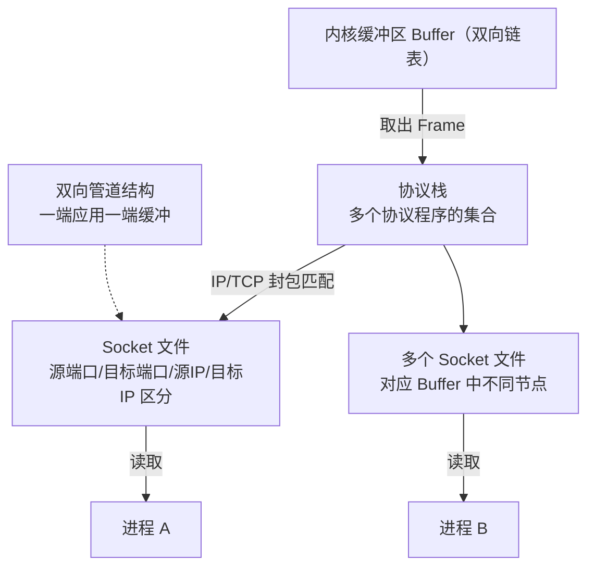
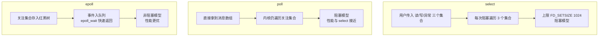

# Linux 的 IO 模式：select、poll 和 epoll 有什么区别？

## 一、模块介绍

我们总是想方设法地提升系统性能。操作系统层面不能给予处理业务逻辑太多帮助，但对于 I/O 性能，操作系统可以通过底层的优化，帮助应用做到极致。

本模块将和读者一起讨论 I/O 模型。为引发更多思考，同步/异步、阻塞/非阻塞等概念将滞后讲解。**我们先回到一个最基本的问题：如果有一台服务器需要响应大量请求，操作系统如何去架构以适应高并发的诉求？**

说到架构，就离不开操作系统提供给应用程序的系统调用。本文要介绍的 select/poll/epoll 恰好是操作系统提供给应用的三类处理 I/O 的系统调用，具有非常强的代表性。本模块围绕它们，以及并发和 I/O 多路复用，深入讲解操作系统的 I/O 模型。

### 1.1 前置知识

- 熟悉 Socket 编程与文件描述符（File Descriptor）的基本概念
- 了解网卡、缓冲区、DMA 等硬件与内核交互的基础知识更佳

### 1.2 学习目标

- 理解数据从网卡到达操作系统的处理路径（DMA、缓冲区、协议栈）
- 理解 Socket 编程模型与服务端/客户端 Socket
- 理解 I/O 多路复用问题
- 掌握 select、poll、epoll 的原理与区别
- 厘清阻塞/非阻塞、同步/异步两组概念

---

## 二、核心方法论

### 2.1 从网卡到操作系统

为了弄清楚高并发网络场景如何处理，先看最基本内容：**当数据到达网卡之后，操作系统会做哪些事情？**

网络数据到达网卡后，首先需要把数据拷贝到内存。拷贝到内存的工作往往不需要消耗 CPU 资源，而是通过 **DMA（Direct Memory Access，直接内存存取）** 模块直接进行内存映射。之所以这样，是因为网卡没有大量内存空间，只能做简单缓冲，所以必须尽快把数据保存下来。

Linux 中用一个双向链表作为缓冲区（Buffer）。传入网卡的数据被称为 **Frame**（一帧，数据链路层的传输单位）。现代网卡通常用 DMA 将 Frame 写入缓冲区，然后触发 CPU 中断交给操作系统处理。操作系统不断从 Buffer 中取出 Frame，通过协议栈（很多协议程序的集合）进行还原，数据封包在协议栈中按对应协议处理完后形成 Socket 文件。

> **拒绝服务攻击（Denial of Service）原理**：如果高并发的请求量级太大，有可能把 Buffer 占满，此时操作系统就会拒绝服务。操作系统拒绝服务实际上是一种保护策略，通过拒绝服务避免系统内部应用因并发量太大而雪崩。

### 2.2 Socket 编程模型

在 UNIX 系操作系统中，一个 Socket 文件内部类似一个双向的管道，非常适用于进程间通信（Interprocess Communication，IPC）。网络中，Socket 一端连接 Buffer、一端连接应用（进程）。对于 TCP 协议，Socket 文件可用源端口、目标端口、源 IP、目标 IP 进行区分，不同 Socket 文件对应 Buffer 中的不同节点，进程可通过 Socket 文件快速定位到自己对应的节点。

对于进程而言，Socket 更是一个编程模型：**服务端应用创建一个服务端 Socket 文件，它存在于内核中并绑定到某个 IP 地址和端口**。凡是发送到该目标连接请求形成的客户端 Socket 文件，其文件描述符都会被写入服务端的 Socket 文件。应用只要调用 `accept()` 方法，就可以读到客户端 Socket 的文件描述符，从而知道有哪些客户端连接进来。每个客户端对应用而言都是一个文件描述符。

### 图：数据从网卡到进程的完整路径


上图为数据从网卡到进程的路径：网卡收到 Frame 后经 DMA 直接写入内核缓冲区，触发 CPU 中断交给操作系统；数据经协议栈解析还原后形成 Socket 文件；应用进程通过 `accept()` 取出客户端连接的文件描述符并进行后续读写。

---

## 三、关键流程

### 3.1 I/O 多路复用（I/O Multiplexing）问题

进程拿到了它关注的所有 Socket，也称关注的集合（Interesting Set），但还有一个问题：**进程如何监听关注集合的状态变化，比如有数据进来时如何通知到进程？**

更准确地说，**一个线程需要处理所有关注的 Socket 产生的变化，构成 I/O 的多路复用问题**。处理 I/O 多路复用需要操作系统提供内核级支持，Linux 下有三种 API：`select`、`poll`、`epoll`。

内核了解网络状态，但进程和 Socket 之间是多对多关系，且一个 Socket 也有不同事件类型。因此**进程内部需要一个数据结构描述自己关注哪些 Socket 文件的哪些事件（读、写、异常等）**：

- **线性结构**（数组、链表）：查询需要遍历，每次内核产生一个消息就遍历这个线性结构，看它是否是进程关注的；
- **索引结构**：内核发生了消息可通过索引结构马上知道该消息进程是否关注。

### 图：Frames 通过协议栈还原为 Socket



上图为缓冲区中的数据经协议栈还原为 Socket 文件的示意图：Buffer 中的 Frame 被逐个取出，经协议栈按协议解析后形成多个 Socket 文件，不同 Socket 以源端口、目标端口、源 IP、目标 IP 区分；进程通过读写各自的 Socket 文件与对应的网络节点交互。Socket 文件类似双向管道，一端连接应用、一端连接缓冲区。

### 3.2 select / poll / epoll 工作机制对比

**select()**：采用线性结构，允许用户传入 3 个集合（可读、可写、异常）。**每次 select 操作会阻塞当前线程，在阻塞期间所有操作系统产生的每个消息，都会通过遍历手段判断是否在 3 个集合中**。`FD_SETSIZE` 是系统默认设置，通常是 1024，因此 select 能一次处理的文件描述符有上限，并发超多时 select 无能为力。

**poll()**：对程序员更友好，直接抽象成消息，用户可通过 API 直接拿到对应消息从而处理对应文件描述符。`poll` 是阻塞调用，把一段时间内操作系统发生的、进程关注的消息告知用户。但从性能分析它与 select 差距不大，因为内核产生一个消息后仍需要遍历 poll 关注的所有文件描述符来确定是否相关。

**epoll()**：**通过更好的方案实现了从操作系统订阅消息**。epoll 将进程关注的文件描述符存入一棵二叉搜索树（通常为红黑树），Key 是 Socket 编号、值是该 Socket 关注的消息。内核发生事件时可马上从红黑树找到进程是否关注。有关注事件发生时，epoll 先放入一个队列；用户调用 `epoll_wait` 时从队列返回一个消息。`epoll` 函数只是构造函数，用来创建红黑树和队列结构；`epoll_wait` 若无消息也可立即返回，因此 **epoll 是非阻塞模型**。

> 总结：**select/poll 是阻塞模型，epoll 是非阻塞模型**。并非非阻塞性能就一定更好，多数情况下 epoll 性能更好是因为内部有红黑树实现。

### 3.3 阻塞/非阻塞 与 同步/异步

- select/poll 是**阻塞（Blocking）**模型、epoll 是**非阻塞（Non-Blocking）**模型。阻塞/非阻塞强调线程状态：阻塞触发线程的阻塞状态，线程停止执行并切换，直到中断再回来。
- select/poll/epoll 三者都是**同步（Synchronous）**调用。同步强调顺序：可确定程序执行顺序的调用。异步（Asynchronous）调用不明确执行顺序（如回调函数），因此我们用协程的 yield、迭代器等把异步程序转为同步程序。
- **非阻塞不一定是异步，阻塞也未必就是同步**。例如一个带回调方法的方法阻塞线程 100ms 又提供回调，那就是"异步阻塞"。

### 图：I/O 多路复用三种模型对比



上图为三种 I/O 复用模型的对比：select 靠遍历 3 个集合且受 FD_SETSIZE 上限约束，poll 改善了编程模型但内核仍需遍历关注集合（都是阻塞模型）；epoll 用红黑树索引 + 事件队列，`epoll_wait` 无消息时立即返回，是非阻塞模型且性能更优。

---

## 四、工具与实践

### 4.1 select 的编程要点

```c
fd_set read_fd_set, write_fd_set, error_fd_set;
while(true) {
  select(..., &read_fd_set, &write_fd_set, &error_fd_set);
  for (i = 0; i < FD_SETSIZE; ++i)
        if (FD_ISSET (i, &read_fd_set)) {
          // Socket 可以读取
        } else if(FD_ISSET(i, &write_fd_set)) {
          // Socket 可以写入
        } else if(FD_ISSET(i, &error_fd_set)) {
          // Socket 发生错误
        }
}
```

- `read_fd_set` 放数据可读时进程关心的 Socket，`write_fd_set` 放可写时关心的 Socket，`error_fd_set` 放发生异常时关心的 Socket；
- `FD_SET` 把 Socket 加入集合，`FD_ISSET` 判断某个 Socket 是否在某个集合中，`FD_ZERO` 清空集合，`FD_CLR` 从集合移除。

一个完整的 select 服务端参考程序（监听 `PORT` 5555 端口，处理多个连接的读写）：

```c
#include <stdio.h>
#include <errno.h>
#include <stdlib.h>
#include <unistd.h>
#include <sys/types.h>
#include <sys/socket.h>
#include <netinet/in.h>
#define PORT    5555
#define MAXMSG  512

int read_from_client (int filedes) {
  char buffer[MAXMSG];
  int nbytes = read (filedes, buffer, MAXMSG);
  if (nbytes < 0) { perror ("read"); exit (EXIT_FAILURE); }
  else if (nbytes == 0) return -1;   // End-of-file
  else { fprintf (stderr, "Server: got message: `%s'\n", buffer); return 0; }
}

int make_socket (uint16_t port) {
  int sock;
  struct sockaddr_in name;

  sock = socket (PF_INET, SOCK_STREAM, 0);
  if (sock < 0) { perror ("socket"); exit (EXIT_FAILURE); }

  name.sin_family = AF_INET;
  name.sin_port = htons (port);
  name.sin_addr.s_addr = htonl (INADDR_ANY);
  if (bind (sock, (struct sockaddr *) &name, sizeof (name)) < 0) {
    perror ("bind");
    exit (EXIT_FAILURE);
  }
  return sock;
}

int main (void) {
  int sock;  fd_set active_fd_set, read_fd_set;  int i;
  sock = make_socket (PORT);
  if (listen (sock, 1) < 0) { perror ("listen"); exit (EXIT_FAILURE); }
  FD_ZERO (&active_fd_set);
  FD_SET (sock, &active_fd_set);
  while (1) {
    read_fd_set = active_fd_set;
    if (select (FD_SETSIZE, &read_fd_set, NULL, NULL, NULL) < 0) { perror ("select"); exit(1); }
    for (i = 0; i < FD_SETSIZE; ++i)
      if (FD_ISSET (i, &read_fd_set)) {
        if (i == sock) {             // 新连接请求
          int new = accept (sock, NULL, NULL);
          FD_SET (new, &active_fd_set);
        } else {                     // 已有连接有数据
          if (read_from_client (i) < 0) { close (i); FD_CLR (i, &active_fd_set); }
        }
      }
  }
}
```

### 4.2 poll 的编程要点

poll 是阻塞调用，第一个参数告知内核 poll 关注哪些 Socket 及消息类型；调用后等待一段时间（阻塞）拿到一个消息数组；遍历该数组可得知关联的文件描述符和消息类型；通过消息类型判断读或写，通过文件描述符进行实际的读、写、错误处理。

```c
while(true) {
  events = poll(fds, ...)
  for(evt in events) {
    fd = evt.fd;
    type = evt.revents;
    if(type & POLLIN ) {
       // 有数据需要读，读取fd中的数据
    } else if(type & POLLOUT) {
       // 可以写入数据
    }
    else ...
  }
}
```

### 4.3 epoll 的编程要点

epoll 有 2 个最大优势：

- 内部使用红黑树减少了内核的比较操作；
- 对程序员而言非阻塞模型更容易处理各种情况——习惯于每写一条语句就马上得到结果，更不容易出 Bug。

epoll 服务端参考程序的核心逻辑（源自公有领域 Public Domain 代码）：

```cpp
#include <sys/epoll.h>
#define MAXFDS (16 * 1024)

int epollfd = epoll_create1(0);
// 将监听 Socket 加入 epoll，关注可读事件
struct epoll_event accept_event;
accept_event.data.fd = listener_sockfd;
accept_event.events = EPOLLIN;
epoll_ctl(epollfd, EPOLL_CTL_ADD, listener_sockfd, &accept_event);

struct epoll_event *events = calloc(MAXFDS, sizeof(struct epoll_event));
while (1) {
  int nready = epoll_wait(epollfd, events, MAXFDS, -1);
  for (int i = 0; i < nready; i++) {
    if (events[i].events & EPOLLERR) perror("epoll_wait returned EPOLLERR");
    if (events[i].data.fd == listener_sockfd) {
      // 监听 Socket 就绪，有新客户端连接
      int newsockfd = accept(listener_sockfd, NULL, NULL);
      make_socket_non_blocking(newsockfd);
      struct epoll_event event = {0};
      event.data.fd = newsockfd;
      event.events = EPOLLIN | EPOLLOUT;   // 按关注读/写设置
      epoll_ctl(epollfd, EPOLL_CTL_ADD, newsockfd, &event);
    } else {
      // 已有客户端 Socket 就绪，按 EPOLLIN/EPOLLOUT 处理读写，
      // 不再需要时 epoll_ctl(EPOLL_CTL_DEL) 删除并 close(fd)
      if (events[i].events & EPOLLIN)  on_peer_ready_recv(events[i].data.fd);
      else if (events[i].events & EPOLLOUT) on_peer_ready_send(events[i].data.fd);
    }
  }
}
```

- `epoll_create1` 创建红黑树与队列结构；
- `epoll_ctl`（EPOLL_CTL_ADD / MOD / DEL）把客户端的文件描述符和关注的消息类型放入红黑树；
- `epoll_wait` 从队列取出就绪事件；无消息也可马上返回（非阻塞）。

---

## 五、常见坑点

- **把并发能力等同于模型优劣**：I/O 模型并不是在选择效率，而是选择编程的手段。试想一个所有资源都跑满的服务器，并不会因为异步或非阻塞模型就获得更高的吞吐量。
- **误以为非阻塞一定性能更好**：真正高并发来临时，所有 CPU、网络资源都可能被用完，无论阻塞还是非阻塞结果差别不大（前提是程序没写错）。
- **混淆两组概念**：非阻塞 ≠ 异步，阻塞 ≠ 同步。阻塞/非阻塞强调线程状态，同步/异步强调执行顺序，需分开判断。
- **忽略 FD_SETSIZE 上限**：select 一次处理的文件描述符上限为 1024，并发过高时需升级到 poll/epoll。
- **把内核监听误当作应用察觉**：select/poll/epoll 都只是内核通知机制，应用仍需在拿到就绪事件后自行 read/write。

---

## 六、进阶扩展与参考

- **非阻塞模型的价值**：非阻塞模型的核心价值并不是性能更好，而是对程序员更友好、更易写出低 Bug 的并发代码；同时非阻塞 + 同步的编程模型省去了许多并发控制的思考。
- **红黑树与事件队列**：epoll 内核用红黑树作为索引（Key 为 Socket 编号、值为关注事件），并用事件队列缓存就绪事件，这是其与 select/poll 性能差异的根本原因。
- **编程范式与并发**：多线程、并发编程仍是程序员必修课。思考 I/O 模型时要结合自身业务特性与系统架构特点进行选择。
- **面试解析**：select/poll 是阻塞模型，内部用线性结构存储关注集合，每次判断需遍历；epoll 是非阻塞模型，内部用二叉搜索树（红黑树）以 Socket 编号为索引、关注事件为值，可快速判断消息归属。
- **思考题**：如果要用 epoll 架构一个 Web 服务器，应该是一个怎样的架构？（可参考事件驱动模型 EventLoop 与 Reactor 模式。）

---

## 小结

- **数据路径**：网卡 → DMA → 内核缓冲区 → 协议栈还原 → Socket 文件 → 进程读写；
- **Socket 模型**：服务端 Socket 绑定 IP/端口，客户端连接的文件描述符写入服务端 Socket，应用用 `accept` 取连接；
- **I/O 多路复用**：select/poll 阻塞模型、线性结构遍历；epoll 非阻塞模型、红黑树索引 + 事件队列；
- **两组概念**：阻塞/非阻塞强调线程状态，同步/异步强调执行顺序，二者互相独立。