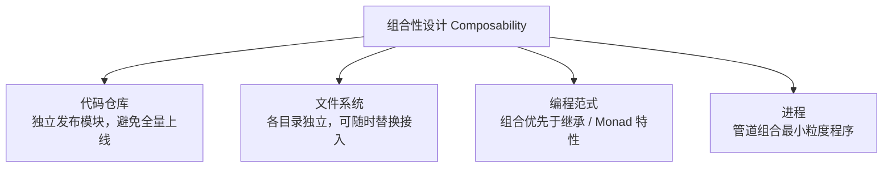
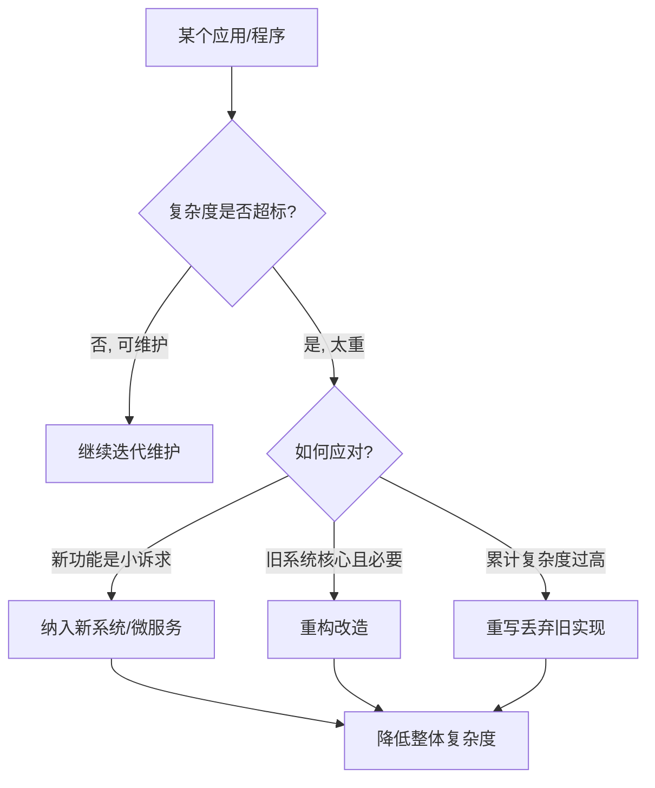
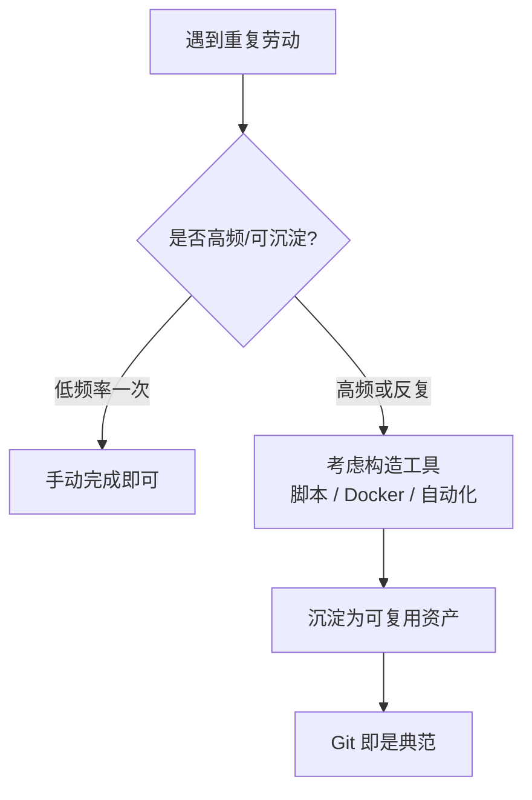

# Linux 架构优秀在哪里

## 一、模块介绍

架构不是玄学，**架构领域也有通用的语言和词汇**。这些语言很大一部分来自早期黑客对编译器实现、操作系统方案与计算机网络应用的探索，至今仍深刻影响着面向对象、函数式编程与微服务设计。其中最重要的一支，被 Unix 代码贡献者 Douglas McIlroy 誉为 **Unix 哲学**（Unix Philosophy）——Linux 正是遵循这套设计思想的产物。

本模块提炼出其中的六大思想，它们既是理解 Linux 的钥匙，也是与架构师沟通的通用语言，并映射到面向对象、微服务与工程实践中。

### 1.1 前置知识

- 对 Linux 的管道、进程、文件系统有基本认识
- 了解面向对象、微服务等软件工程概念更佳

### 1.2 学习目标

- 理解组合性设计、管道、重构与丢弃等 Unix 六大思想
- 掌握这些思想在编程范式与工程实践中的映射
- 能用 Unix 哲学的语言与架构师顺畅沟通

---

## 二、核心方法论

### 2.1 组合性设计（Composability）

**Unix 系设计哲学，都在和单体设计（Monolithic Design）与中心化唱反调**。Linux 是社区产品，开发者来自全世界，天然反对中心化——一个由巨大开发团队管理的东西，一定不能是 Mono（单体）的：

- **代码仓库**：如果所有代码都进一个仓库，上线一个功能就要全量上线，一处出错影响全局。应允许不同模块通过独立仓库发布；
- **文件系统**：每个目录可以有不同文件系统，随时替换、随时接入新系统（网络盘、内存文件系统）；
- **代码组织**：与其自己维护所有工具模块，不如把权利分发给需要的人，让更多小团队把工具做到极致。

这个思想在编程范式中的映射：**面向对象用组合替代继承**（继承是 Mono 的强耦合，组合是轻量级复用）；**函数式编程的 Monad** 让对象与计算函数可组合，实现最小粒度复用；而 Unix 用**管道**组合进程，同样是"最小粒度复用程序"。

### 图：组合性设计思想在各层级的体现



上图为组合性设计思想的体现：无论是代码仓库的独立发布、文件系统各目录可替换、编程范式上用组合替代继承，还是用管道组合进程，其核心都是"反对单体、反对中心化，以最小粒度实现复用"。这是 Unix 哲学的基石。

### 2.2 管道设计（Pipeline）

Douglas McIlroy 的著名论断：**一个应用的输出，应该是另一个应用的输入**——这句话道出了计算的本质。

计算就是"把一个过程的输出交给另一个过程作为输入"。这也解释了为什么在设计流计算、管道运算、Monad、泛型容器体系时，我们总希望计算过程间保持相似性（如统一的泛型类型）——只有输入输出形态一致，才能自由组合。

Linux 上 `ps aux | grep java`、`cat access.log | awk '{print $1}' | sort | uniq -c` 都是管道的日常实践。

### 图：管道设计的计算本质


上图为管道设计的核心：进程 1 的标准输出作为管道的输入，供给进程 2 的标准输入，进程间只需保持输入输出形态一致（统一的泛型类型）即可自由组合。这正是"一个应用的输出是另一个应用的输入"的直观体现。

---

## 三、关键流程

### 3.1 重构和丢弃：每个程序只做一件事

Unix 哲学中有一条非常"硬核"的准则：**每个应用只做一件事情，并且做到极致；当程序过于复杂时，就去重构甚至重写它，而不是在原应用上继续加功能**。

这与"大而全"的商业策略是否相悖？见仁见智，但事实给出了答案：短视频做成独立应用（抖音）、游戏做成独立应用（王者荣耀），都获得了巨大成功。

以大型系统开发的经验看：**宁愿重新做微服务，也不愿重构巨大的单体系统**——把新功能做进新系统，比在巨型系统上不断迭代更省成本、效果更好。这也是微服务时代不可逆的原因之一。

> 即使必须在原有系统上加功能，也应多多重构：重构能看到业务逻辑中的隐患，让程序员更熟悉系统。程序的复杂度不随需求线性增长，**需求超过临界值后复杂度呈指数上升**——控制复杂度是软件工程的核心问题。

### 图：重构与丢弃的决策路径



上图为"一事极致、复杂就重构/重写"的决策路径：当某个程序复杂度超标时，若新功能是独立诉求就做进新系统或微服务，若旧系统核心必要则进行重构，若累计复杂度实在过高则考虑重写；无论哪种，目标都是控制复杂度，避免在巨型单体上无限叠加功能。

### 3.2 写复杂的程序就是写错了

优秀的架构师常说：**程序写复杂了，就是写错了**。Unix 哲学的建议是：先用几周构造一个简单版本，发现复杂了就重写它。

- 用错工具、分错层、选错算法与数据结构、用错设计模式 → 大量调试、Bug 丛生；
- **优秀的程序往往思考时间长、调试时间短**，能快速测试上线；
- 当你发现一段逻辑很耗时间时，先想想是不是思维方式错了：是否缺少工具封装、遗漏了中间环节，或是架构设计本身有问题。

### 3.3 优先使用工具，而不是"熟练"

很多程序员宁愿长年累月"熟练"地重复劳动，也不愿把重复劳动工具化：

- 反复重新配置开发环境，却不肯做一个 Docker 镜像；
- 测试环境反复不够用，却不肯容器化管理；
- Git 提交后要人工点鼠标测试，却不肯接入自动化测试。

**Unix 哲学强调：即便是临时需要，也应该尽可能构造工具来减轻工作**。Git 本身就是这样的产物——Linux 内核团队的商业代码管理工具到期后，缔造者们自主研发了 Git，不仅推进了研发，还做成了巨大的开发者生态。

> 作为程序员，不仅要完成工作，还要重视**中间过程的工具缔造**——写小型的 ORM 框架、缓存引擎、业务容器，让开发效率越来越高。

### 图：工具化决策流程



上图为工具化决策路径：遇到重复劳动时，先判断是否高频、可沉淀；低频率一次性任务手动完成即可；高频或反复出现的任务则优先构造工具（脚本、Docker 镜像、自动化测试等）并沉淀为可复用资产——Git 正是工具缔造的典范。

### 3.4 数据主导与自证明代码

拿**数据主导规则**：数据结构足够好，计算方法自然反映系统逻辑；**编程的核心是构造好的数据结构，而不是算法**。文件描述符抽象文件、页表抽象内存、Socket 抽象连接——数据结构深刻反映系统本质（自证明代码）。

---

## 四、工具与实践

### 4.1 其他优秀原则速查

| 原则 | 含义 |
|------|------|
| 不要猜测瓶颈，要证明瓶颈 | 瓶颈总出现在意料之外的地方，多写性能测试、构造压测场景 |
| 业务规模小不用花哨算法 | 简单算法往往更快；规模大了再测试证明所需算法 |
| 数据主导规则 | 数据结构足够好，计算方法自然反映系统逻辑；**编程的核心是构造好的数据结构，而不是算法** |
| 自证明代码 | 文件描述符抽象文件、页表抽象内存、Socket 抽象连接——数据结构深刻反映系统本质 |

### 4.2 架构选型中的实际判断

时间复杂度只是增长关系，**一个算法在某个场景中是否可行，要以实际执行数据为准**——这是架构选型中常被忽视的一点：

```bash
# 用压测/实测数据证明瓶颈，而非猜测
ab -n 10000 -c 100 http://your-server/     # 简单压力测试
wrk -t4 -c200 -d30s http://your-server/    # 更细粒度压测
perf stat ./your-program                   # 观察真实执行指标
```

---

## 五、常见坑点

- **堆功能不重构**：在复杂度已超标的巨型单体上不断叠加功能，会导致需求超过临界值后复杂度指数上升。应重构甚至重写。
- **用"熟练"回避"工具"**：宁愿长年累月重复劳动，也不构造工具沉淀。应把临时也需要工具的思维内化，重视中间过程工具缔造。
- **猜瓶颈而不测瓶颈**：瓶颈总出现在意料之外的地方。应多写性能测试、构造压测场景，用数据证明而非猜测。
- **仅凭时间复杂度做选型**：一个算法在某个场景是否可行要看实际执行数据，不能只看增长关系。
- **一上来就用花哨算法**：业务规模不大时，简单算法往往更快；规模大了再测试证明所需算法。

---

## 六、进阶扩展与参考

- **相关参考**：Douglas McIlroy 关于管道与组合的论述。
- **映射到现代工程**：这些思想是面向对象组合优于继承、微服务去中心化、函数式 Monad、自动化 DevOps 的哲学源头。

---

## 小结

- **组合性设计**：反单体、反中心化，组合优于继承，工具交给社区共建；
- **管道**：输出即输入，最小粒度复用程序，道出计算本质；
- **重构与丢弃**：一事极致，复杂就重写，微服务是顺势而为；
- **保持简单**：思考长、调试短，复杂即错误；
- **优先工具**：把重复劳动工具化，Git 是最好的榜样；
- **数据主导**：先设计数据结构，算法自然浮现。

最后记住 Unix 设计者 Ken Thompson 的打破一切规则的规则：**搞不定就用蛮力——首先要把事情搞定**，否则一切哲学都毫无意义。