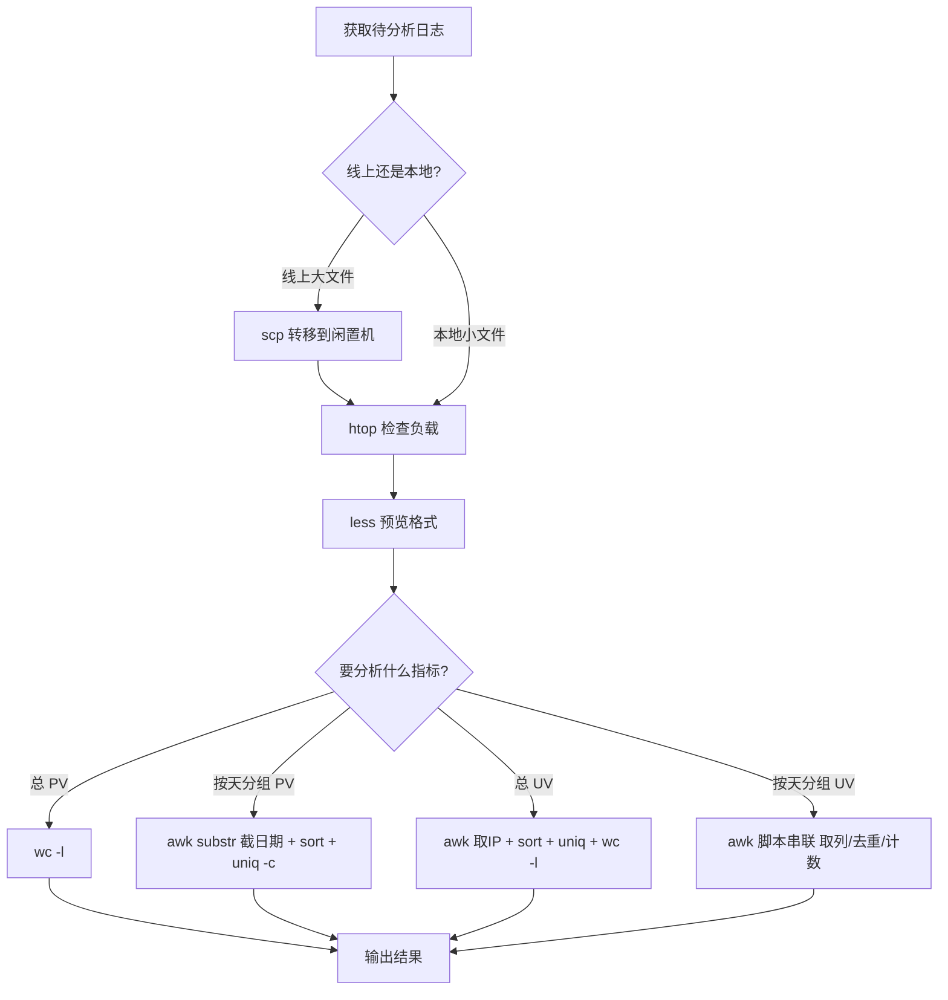

# 高级技巧之日志分析：利用 Linux 指令分析 Web 日志

## 一、模块介绍

著名的黑客、自由软件运动的先驱理查德·斯托曼说过："编程不是科学，编程是手艺。"**掌握日志（Log）分析，就是运维与开发最实用的手艺之一**。本模块结合真实工作场景：用一条 5 万多条记录的 Nginx 访问日志（可自 GitHub 下载），从环境评估、格式预览到 PV/UV 统计，完整走一遍"用 Linux 指令分析 Web 日志"的流程，掌握 `wc`、`awk`、`sort`、`uniq` 的组合用法。

日志分析是故障排错、性能调优、增长洞察的基石，几乎每个线上问题的定位都始于对日志文件的正确解读。

### 1.1 前置知识

- 熟悉 Linux 基本命令（wc、awk、sort、uniq、less）的初步概念
- 了解标准输入输出与管道（pipeline）的基本机制更佳

### 1.2 学习目标

- 掌握分析前对线上机器的负载评估方法，避免分析拖垮生产
- 学会用 `less` 而非 `cat` 预览大日志文件
- 掌握用 `wc -l` 统计 PV、用 `awk|sort|uniq|wc -l` 统计 UV
- 掌握按天分组的 PV 与 UV 统计技巧（awk 脚本实战）
- 能迁移"取列 → 排序 → 去重 → 计数"这套组合拳到任意文本日志

---

## 二、核心方法论

### 2.1 日志（Log）分析的本质

日志本质上是**按行记录的文本**，每一行是一次事件。对 Nginx 的 `access_log`（访问日志）而言，**每一行就是一次用户访问**。因此几乎所有分析都可抽象为对文本行的"裁剪、分组、计数"。

### 2.2 核心指令的分工

分析日志主要靠四条指令的组合，各司其职：

| 指令 | 作用 |
|------|------|
| `wc`（word count）| 行/词/字节计数，`wc -l` 用于统计总行数 |
| `awk` | 按列切分、逐行处理文本（领域专用语言 DSL）|
| `sort` | 对文本行排序，为去重做准备 |
| `uniq` | 去除相邻重复行，配合 `-c` 计数 |

### 2.3 方法论：先看资源，再动手

分析线上日志前，先评估机器负载，避免分析动作本身拖垮生产：

- 用 `htop` 查看 CPU 与内存负载（未安装可用 `yum install htop` 或 `apt install htop`）；
- 用 `wget` 下载日志文件到本地，`ls -lh --block-size=M` 查看文件大小；
- **大文件先 `scp` 到闲置服务器再分析**，绝不在生产核心机上直接跑重分析。

> 原则：**先看资源，再动手**。7M 的日志对线上影响可忽略，GB 级日志必须转移战场。

### 图：日志分析流水线（取列 → 排序 → 去重 → 计数）


上图为日志分析的通用流水线：先用 `awk` 从每一行中取出目标列，再经 `sort` 排序为相邻序列，随后用 `uniq` 去重或 `uniq -c` 计数，最终 `wc -l` 汇总得到 PV/UV 等结论。这套流水线可复用于几乎所有文本型日志。

---

## 三、关键流程

### 3.1 线上日志分析完整流程

### 图：Web 日志分析操作流程



上图为日志分析的完整操作路径：先判断是线上还是本地，线上大文件用 `scp` 转移战场并用 `htop` 检查负载；随后用 `less` 预览格式确认列位置；再按目标指标（PV、按天分组、UV、按天分组 UV）选择对应的指令组合执行，最终得到结果。

### 3.2 Nginx 日志字段定位（awk 列编号的依据）

预览日志时记住列位置很重要：`awk` 的 `$1`、`$4` 等编号正是从这里来的。Nginx 的 `access_log` 每一行从左到右字段大致为：

| 列位置 | 含义 |
|------|------|
| `$1` | 客户端 IP 地址 |
| `$4` | 访问时间（含时区）|
| `$5~$7` | HTTP 请求方法、路径、协议版本 |
| `$9` | 返回状态码 |
| 末尾 | User-Agent 等信息 |

---

## 四、工具与实践

### 4.1 分析前准备与预览

```bash
htop                          # 检查当前负载，避免分析拖垮生产
wget <日志下载地址>            # 下载示例 access.log（约 7M）
ls -lh --block-size=M access.log   # 查看文件大小
less access.log               # 用 less 预览日志格式（勿用 cat 打满内存）
```

**线上执行 `cat` 大文件是危险操作**，可能瞬间打满终端与内存，务必改用 `less`。

### 4.2 PV 分析（Page View，页面浏览量）

对 Nginx 日志而言，**行数就是 PV**：

```bash
wc -l access.log
# 示例输出：51462（即总 PV）
```

### 4.3 按天分组 PV：awk + sort + uniq

日志可能跨多天，按天聚合才能看出访问趋势。分三步走：

```bash
# 第一步：定位时间列（第 4 列为时间）
awk '{print $4}' access.log | less

# 第二步：截取日期 —— 从第 2 个字符起截 11 个字符，得到如 "17/May/2015"
awk '{print substr($4, 2, 11)}' access.log | less

# 第三步：分组统计 —— sort 排序后 uniq -c 统计相邻相同天数
awk '{print substr($4, 2, 11)}' access.log | sort | uniq -c
```

`sort` 排序 → `uniq -c` 统计相邻相同行数，得到每天的 PV 量（本例约每天 2000~3000 条，横跨 5 月 17 日至 6 月 4 日）。

### 4.4 UV 分析（Unique Visitor，独立访客数）

准确识别用户身份很复杂，**用 IP 近似 UV** 是标准做法：

```bash
awk '{print $1}' access.log | sort | uniq | wc -l
# 示例输出：2660（即 2660 个独立 IP）
```

管道语义：`$1` 取 IP → `sort` 排序 → `uniq` 去重 → `wc -l` 计数。

### 4.5 按天分组 UV：awk 脚本实战

按天统计 UV 需要"日期 + IP"组合去重，用脚本串联多步：

```bash
#!/bin/bash
awk '{print substr($4, 2, 11) " " $1}' access.log |\
        sort | uniq |\
        awk '{uv[$1]++; next} END {for (ip in uv) print ip, uv[ip]}'
```

| 步骤 | 命令 | 作用 |
|------|------|------|
| 1 | 第一次 `awk` | 把日期与 IP 拼接成一行两列 |
| 2 | `sort` | 字典序排序（先日期后 IP）|
| 3 | `uniq` | 同日同 IP 只保留一行 |
| 4 | 第二次 `awk` | 按第一列日期累加计数，`END` 块在全部行处理完后输出 |

保存为 `sum.sh` 后执行：

```bash
chmod +x ./sum.sh
./sum.sh
```

### 图：xargs 与脚本化的按天 UV 统计流程


上图为按天 UV 统计的脚本化流程：先通过第一次 `awk` 把日期与 IP 拼接成两列，经 `sort` 排序、`uniq` 去重后，第二次 `awk` 按第一列（日期）累加计数，`END` 块在所有行处理完后汇总输出，从而得到每天的独立访客数。

这套"取列 → 排序 → 去重 → 计数"的组合拳，可以迁移到应用日志、前端日志、监控日志等任何文本日志分析中。

---

## 五、常见坑点

- **线上直接 `cat` 大文件**：瞬间打满终端与内存，甚至导致机器卡死。务必用 `less` 分段预览。
- **忽略生产负载就跑重分析**：在核心生产机上直接对 GB 级日志做 `awk|sort` 会抢占 CPU/IO。先 `htop` 看负载、大文件 `scp` 到闲置机。
- **日志列编号记错**：`awk` 的 `$1`、`$4` 依赖对日志字段顺序的准确认知，预览确认后再写命令。
- **`uniq` 不排序直接用**：`uniq` 只去重**相邻相同**行，若不先 `sort` 会导致重复行无法被正确合并计数。
- **UV 用 IP 近似**：同一用户用不同 IP（手机/NAT）会被高估，用 Cookie/会话标识更准确，但要权衡成本。

---

## 六、进阶扩展与参考

- **更强大的文本分析工具**：`grep`（按匹配行筛选）、`awk` 的连环 `NF`/`NR` 内建变量、`sed` 流编辑，以及 `rg`/`fzf` 等现代增强工具。
- **结构化日志与日志服务**：现代日志逐渐走向 JSON 结构（结构化日志，structured logging），配合 `jq` 解析与 ELK（Elasticsearch、Logstash、Kibana）栈做集中化检索与可视化。
- **对访问日志做多维分析**：按 User-Agent 分组可识别终端来源；按路径列分组可找出访问量 Top 3 的网页，用于指导 CDN 缓存与热点优化。
- **思考题**：① 分析日志中有哪些终端访问（按 User-Agent 分组）；② 找出访问量 Top 3 的网页（按路径列分组计数）。
- **相关参考**：`awk`、`sort`、`uniq`、`wc`、`less` 的 `man` 手册；Nginx 官方 `log_format` 日志格式文档。

---

## 小结

- **分析前**：先看负载（htop）、大文件转移战场（scp），线上绝不 `cat` 大文件；
- **PV**：`wc -l` 一行；**UV**：`awk|sort|uniq|wc -l` 四步；
- **分组统计**：`awk substr` 截日期 + `sort|uniq -c` 聚合，复杂场景用 awk 脚本接管道；

下一章讲解集群部署实战——利用 Linux 指令在多台机器上批量部署程序。