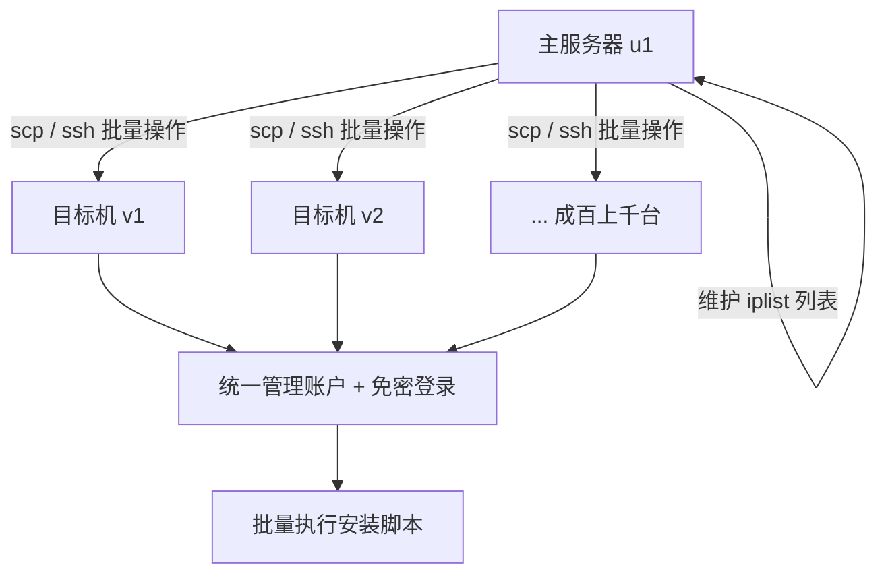
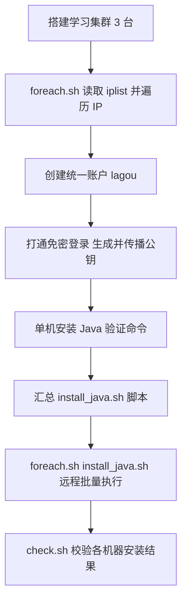

# 高级技巧之集群部署：利用 Linux 指令同时在多台机器部署程序

## 一、模块介绍

Linux 指令是由很多顶级程序员共同设计的，使用 Linux 指令解决问题的过程，就好像在体验一款优秀的产品。在这个过程中，我们不仅能学会一条指令，还能体会到软件设计的魅力：彼此独立，又互成一体——每个 Linux 指令都专注、高效，管道、awk、sort 都有着这种特质。

经过前面的学习，我们已经掌握了一些基础指令。本模块挑战一个更复杂的问题——**用 Linux 指令管理一个集群（Cluster）**。所谓高级技巧并不是要学习更多指令，而是把之前所学的指令进行排列组合。当你从最初只能写几条指令，成长到具备书写一个拥有几十行、甚至上百行 bash 脚本的能力时，就意味着你具备了解决复杂问题的能力。

本模块的目标是通过把简单指令组合起来、分层组织成多个脚本文件，解决一个复杂的工程问题：**在成百上千的集群中安装一个 Java 环境**。

### 1.1 前置知识

- 熟悉 ssh/scp、for 循环、数组、重定向等基础指令与脚本语法
- 了解环境变量（如 PATH）、免密登录的基本概念

### 1.2 学习目标

- 理解集群管理模型：主服务器维护 IP 列表，通过脚本批量操作目标机器
- 掌握用 `readarray` 读取 IP 列表 + `for` 循环遍历
- 掌握统一的集群管理账户的创建与免密登录打通
- 掌握把安装脚本通过 `bash -s` + 标准输入重定向分发到多台机器
- 掌握 `export` 设置环境变量并持久化到 `.bash_profile`

---

## 二、核心方法论

### 2.1 集群管理（Cluster Management）的模型

可以想象一个局域网中有很多服务器需要管理，它们彼此网络互通，我们通过一台主服务器对它们进行操作。管理的核心是"列表 + 循环 + 执行"：

- **IP 列表**：在主服务器上维护一个 `iplist` 文件，存放所有目标机器地址；
- **统一账户**：在所有的集群中使用统一的用户名管理集群，并打通免密登录；
- **批量执行**：用 `for` 循环遍历 IP 列表，逐台执行相同脚本。

### 2.2 关键指令

- `readarray`（读取数组）：bash 4.0 以后的能力，把文件的每一行读入一个数组；
- `scp`（Secure Copy，安全复制）：基于 SSH 的跨机文件拷贝；
- `ssh 'bash -s'`：通过标准输入执行远程脚本；
- `export` / `env`：设置 / 查看环境变量（Environment Variable）。

### 图：集群管理与批量部署总体模型



上图为集群管理的总体模型：主服务器 `u1` 维护一个 IP 列表，通过 `scp` 分发文件、`ssh` 批量执行命令，逐台操作目标机 `v1`、`v2` 乃至成百上千台机器。所有机器使用统一的集群管理账户并打通免密登录，从而实现脚本复用与高效批量部署。

---

## 三、关键流程

### 3.1 从单机到集群的部署流程

### 图：集群批量部署 Java 环境完整流程



上图为集群部署的完整流程：先搭建集群并遍历 IP 列表，创建统一管理账户并打通免密登录；随后在单机上验证 Java 安装命令，将其汇总成 `install_java.sh`；最后通过 `foreach.sh` 远程批量执行，并用 `check.sh` 校验各机器的安装结果。

### 3.2 免密登录（Passwordless Login）的关键流程

**打通从主服务器到所有目标机的权限**是免密批量操作的基础，其核心是公钥传播：

1. 在主服务器上用 `ssh-keygen` 生成公私钥对（`id_rsa.pub` 公钥 + `id_rsa` 私钥）；
2. 通过 `foreach.sh` 调用 `transfer_key.sh`，把公钥追加写入每台目标机对应账户的 `~/.ssh/authorized_keys` 中；
3. 设置 `.ssh` 目录权限 `chmod 700`、`authorized_keys` 文件权限 `chmod 600`；
4. 此后 SSH 登录任意一台机器都无需再输入密码。

---

## 四、工具与实践

### 4.1 搭建学习用的集群

简化模型：自己电脑上装一个 Ubuntu 桌面版虚拟机（命名为 `u1`），再装两个 Ubuntu 服务器版虚拟机（命名为 `v1`、`v2`）。服务器版对资源消耗远小于桌面版。这里只用 3 台，但后续脚本可在多台机器间复用。

### 4.2 遍历 IP 列表：foreach.sh

在主服务器上维护 `iplist` 文件，存放目标 IP。用脚本遍历：

```bash
#!/bin/bash
readarray -t ips < iplist
for ip in ${ips[@]}
do
    echo $ip
done
```

- 首行 `#!` 叫作 **Shebang**，Linux 程序加载器据此决定执行脚本的程序，这里用 `bash`（因为 `readarray` 是 bash 4.0 后增加的能力）；
- `readarray` 将 `iplist` 每一行读到数组 `ips` 中；`${ips[@]}` 中 `@` 取数组全部内容，`$` 是求值符号；
- `for` 循环遍历每个 IP 并打印。执行前用 `chmod +x foreach.sh` 增加执行权限，再利用 Shebang 用 bash 执行。

### 4.3 创建集群管理账户：create_lagou.sh

为了方便集群管理，通常用统一用户名管理集群，例如账号 `lagou`。完整创建过程可整理成脚本：

```bash
sudo useradd -m -d /home/lagou lagou    # 创建用户并指定家目录
sudo passwd lagou                       # 设置密码
sudo usermod -G sudo lagou              # 加入 sudo 分组，获得提权能力
sudo usermod --shell /bin/bash lagou    # 指定初始化 shell 为 bash
sudo cp ~/.bashrc /home/lagou/          # 拷贝基础配置（含终端配色）到家目录
sudo chown lagou:lagou /home/lagou/.bashrc   # 修正文件属主
sudo sh -c 'echo "lagou ALL=(ALL)  NOPASSWD:ALL">>/etc/sudoers'  # sudo 免密码
```

> `.bashrc` 是启动 bash 时默认执行的一个脚本文件；把平时设置（如终端颜色）拷给新用户，便于统一体验。可用 `userdel lagou` 删除测试账户后重新执行脚本，验证脚本可复现。

### 4.4 分发脚本到集群

在 `foreach.sh` 循环中用 `scp` 把脚本拷贝到每台机器：

```bash
#!/bin/bash
readarray -t ips < iplist

for ip in ${ips[@]}
do
    scp ~/remote/create_lagou.sh ramroll@$ip:~/create_lagou.sh
done
```

如果机器非常多，可远程执行脚本，或借助 `sshpass` 工具自动传递密码（感兴趣的读者可自行研究）。

### 4.5 打通免密登录：transfer_key.sh

```bash
#!/bin/bash
readarray -t ips < iplist
for ip in ${ips[@]}
do
    sh ./transfer_key.sh $ip
done
```

`transfer_key.sh` 内容如下：

```bash
ip=$1
pubkey=$(cat ~/.ssh/id_rsa.pub)
echo "execute on .. $ip"
ssh lagou@$ip "
mkdir -p ~/.ssh
echo $pubkey  >> ~/.ssh/authorized_keys
chmod 700 ~/.ssh
chmod 600 ~/.ssh/authorized_keys
"
```

- 在 `foreach.sh` 中执行 `transfer_key.sh` 并把 IP 作为参数 `$1` 传入；
- `mkdir -p` 当目录不存在时才创建且不报错；`~` 代表当前家目录；`.` 开头的文件为隐藏文件（如 `.ssh`）；
- 将公钥追加写入目标机 `~/.ssh/authorized_keys`；`chmod 700`/`chmod 600` 限制目录与文件权限，确保仅属主可读写，避免其他用户访问。

完成上述操作后将不再需要输入密码登录目标机。

### 4.6 单机安装 Java 环境

在远程部署前先在单机验证命令：

```bash
sudo apt install openjdk-11-jdk      # 安装 JDK
which java                           # 定位 java 可执行文件
java --version                       # 校验版本
```

根据最小权限原则，为执行 Java 程序单独创建用户 `ujava`：

```bash
sudo useradd -m -d /opt/ujava ujava   # 创建用户，家目录在 /opt/ujava
sudo usermod --shell /bin/bash ujava
```

Java 可执行文件会软链到 `/etc/alternatives/java`，再软链到 `/usr/lib/jvm/java-11-openjdk-amd64`。据此设置 `JAVA_HOME` 环境变量并持久化到用户的 `.bash_profile`，以便登录即有该变量：

```bash
export JAVA_HOME=/usr/lib/jvm/java-11-openjdk-amd64/   # 当前会话生效
sudo sh -c 'echo "export JAVA_HOME=/usr/lib/jvm/java-11-openjdk-amd64/" >> /opt/ujava/.bash_profile'
```

环境变量就好比全局可见的数据，用 `env` 可查看所有环境变量，其中 `PATH` 用 `:` 分割各目录，是 Linux 查找可执行文件的依据。

### 4.7 远程批量安装：foreach.sh install_java.sh

将单机步骤汇总成 `install_java.sh`，并让 `foreach.sh` 支持传入脚本参数：

```bash
sudo apt -y install openjdk-11-jdk
sudo useradd -m -d /opt/ujava ujava
sudo usermod --shell /bin/bash ujava
sudo sh -c 'echo "export JAVA_HOME=/usr/lib/jvm/java-11-openjdk-amd64/" >> /opt/ujava/.bash_profile'
```

> `apt` 后的 `-y` 是为了让执行过程不弹出确认提示。

改写后的 `foreach.sh`：

```bash
#!/bin/bash
readarray -t ips < iplist

script=$1
for ip in ${ips[@]}
do
    ssh $ip 'bash -s' < $script
done
```

- 第一个执行参数作为远程执行脚本文件；
- `bash -s` 提示使用标准输入流（stdin）作为命令输入；`< $script` 将脚本内容重定向到远程 bash 的标准输入流。

执行 `foreach.sh install_java.sh`，等待约 1 分钟后，用 `check.sh` 检测各机器安装情况：

```bash
sudo -u ujava -i /bin/bash -c 'echo $JAVA_HOME'
sudo -u ujava -i java --version
```

---

## 五、常见坑点

- **用错的 `shell` 执行脚本**：`readarray` 是 bash 4.0 才有的能力，用 `sh` 直接执行会报错。应通过 Shebang（`#!/bin/bash`）+ 执行权限运行。
- **忘记 `$` 导致变量不展开**：`${ips[@]}` 不写 `$` 会被当成普通字符串而非数组表达式。
- **免密登录失败**：常因 `authorized_keys` 文件或 `.ssh` 目录权限过宽（其他用户可读）。务必 `chmod 700 ~/.ssh`、`chmod 600 ~/.ssh/authorized_keys`。
- **环境变量重启后消失**：仅用 `export` 只对当前会话生效；持久化需写入 `.bash_profile` / `~/.bashrc` 等配置文件。
- **sudo 免密失效**：`/etc/sudoers` 需追加 `lagou ALL=(ALL) NOPASSWD:ALL`，改后用 `visudo` 语法检查更稳妥。

---

## 六、进阶扩展与参考

- **配置文件的区别**：课后思考题——`~/.bashrc`、`~/.bash_profile`、`~/.profile` 和 `/etc/profile` 的区别。大致上：`/etc/profile` 是系统级全局配置，`.bash_profile`/`.profile` 在交互登录 shell 时读，`.bashrc` 每次交互 bash 启动都读。
- **自动化运维的延伸**：本模块只是自动化运维的皮毛。可进一步掌握 `Ansible`、`SaltStack`、`Puppet` 等配置管理工具，它们把"IP 列表 + 脚本分发 + 状态管理"工程化为声明式（declarative）方案。
- **免密与安全加固**：结合前文 SSH 加固，公钥传播后应退用密码、限制 root 远程登录，并关注 `sshpass` 在日志中泄露密码的风险。
- **总结**：优秀的工程师善于积累和复用，`shell` 脚本就是积累和复用的利器。把今天的安装脚本保存下来，下次安装就能自动化完成。平时多用 `man` 熟悉各种指令用法，并用搜索引擎查阅资料。

---

## 小结

- **集群模型**：主服务器维护 `iplist`，用 `for` 循环 + `scp`/`ssh` 批量操作目标机器；
- **统一账户 + 免密登录**：创建统一管理账号、传播公钥，是免密批量执行的基石；
- **远程执行**：`ssh $ip 'bash -s' < $script` 通过标准输入批量执行脚本；
- **复用与积累**：把单机验证通过的命令汇总成脚本，即可在多台机器间复用。