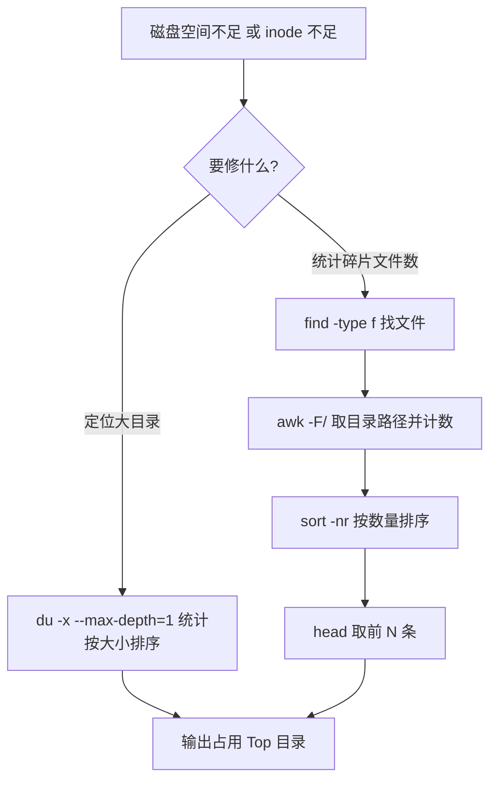

# 工作累积的最常用 Shell 命令合集及使用技巧

## 一、模块介绍

本模块讲解 Shell 命令合集与对控制台的使用技巧。这里的 Shell 命令合集不是简单的单一命令使用，而是**Shell 命令的组合使用**——它们平时可能很少用到，但当你遇到此类场景时能够得心应手，而不必临时查找或凭经验拼凑；同时通过组合命令的学习，你对基础命令的理解也能得到进一步提升。

在学习之前需要掌握两部分知识：一是需要熟悉掌握 Linux，二是需要了解 TCP 三次握手原理，因为本模块的命令合集包含对计算机进行网络分析的内容。

### 1.1 前置知识

- 熟悉掌握 Linux 基础指令
- 了解 TCP 三次握手原理与网络连接状态（ESTABLISHED、TIME_WAIT 等）

### 1.2 学习目标

- 掌握常用控制台与编辑器快捷键，提升操作效率
- 掌握空间分析、指定文件操作、链接状态分析与 IP 提取等命令组合
- 能理解管道的在组合命令中的串接作用
- 理解 Shell 的适用边界与常见问题答疑

---

## 二、核心方法论

### 2.1 组合命令的核心：管道

**管道符 `|` 的作用是将前一个命令的输出传递到下一个命令的输入**。几乎所有 Shell 组合命令都是围绕管道展开，把多个单一命令串接成一条分析流水线。

### 2.2 组合命令的分类

Shell 命令合集大体可按应用场景分类：

| 类别 | 典型场景 |
|------|----------|
| 空间分析 | 磁盘空间不足定位日志目录；碎片文件过多导致 inode 资源不足 |
| 指定文件操作 | 批量查找文件作内容替换；批量查找文件作拷贝打包 |
| 链接状态分析 | 了解用户请求所建立的网络连接状态 |
| IP 信息提取 | Shell 脚本中快速提取本机 IP |

### 图：组合命令的通用流水线结构


上图为 Shell 组合命令的通用结构：一个数据源命令（如 `du`、`find`、`netstat`、`ip a`）产生原始数据，经管道交给处理命令（`awk`、`grep`、`sort`）进行格式化、过滤与统计，再汇总排序（`sort -nr`、`uniq -c`），最后用 `head` 取前 N 条关键结果。理解这条流水线即可拆解各种复杂组合命令。

---

## 三、关键流程

### 3.1 空间分析：磁盘不足定位与 inode 统计

**场景 1**：磁盘空间不足，需快速定位哪一些目录或文件占用空间比较多：

```bash
du -x --max-depth=1 / | sort -k1 -nr
```

- `du` 执行磁盘统计，`sort` 对统计结果排序，中间用管道 `|` 传递数据；
- `du` 的 `-x` 跳过其他文件系统，只分析本文件系统内的文件，执行更快且减少干扰；`--max-depth=1` 统计根目录下第一级目录的所有文件大小；
- `sort` 的 `-k` 指明按哪一列排序，`-n` 只对数值排序，`-r` 反向排序。

**场景 2**：系统产生很多碎片文件导致 inode 资源不足（inode 用于存放文件系统中文件的元数据，过度使用会导致资源不足）。`du` 只能展示磁盘空间使用情况，不能分析出具体目录产生了多少碎片，需用命令组合对文件数统计分析：

```bash
find -type f | awk -F/ -v OFS=/ '{$NF="";dir[$0]++}END{for(i in dir)print dir[i]" "i}' | sort -k1 -nr | head
```

- `find -type f` 查找指定文件类型的文件，结果经管道传向 `awk`；
- `awk` 按行格式化并展示，`-F /` 指定以 `/` 分割处理，`-v OFS=/` 表示结果显示以 `/` 分割；
- `awk` 的 `{ } END { }` 格式中，前面的 `{ }` 是行处理操作，`END { }` 是行处理完成后整体输出；行处理中将 `$NF` 置空去除每行的文件名，只保留目录路径，`dir` 是一个自增数组用于统计；
- 最后 `for` 循环遍历输出 `dir` 关联数组的所有行信息，经 `sort -nr` 排序、`head` 取前 N 条。

### 图：空间分析与文件数统计的流程



上图为空间分析的流程：需要定位大目录时用 `du` 按大小排序；需要统计碎片文件数（inode 排障）时用 `find` 找出文件、`awk` 按目录路径归类计数、`sort` 排序、`head` 取前 N 条。两者都能快速输出占用/文件数靠前的目标。

### 3.2 指定文件操作：批量查找替换与打包拷贝

**场景 1**：目录下有多级子目录和大量文件，需对某个名称的文件批量的查找替换内容：

```bash
find ./ -type f -name consumer.xml -exec sed -i "s/aaaaaa/bbbbbb/g" {} \;
```

- `find` 通过 `-name` 指定要查找的文件名（如 `consumer.xml`）；
- `find` 自带参数 `-exec` 将查找到的结果传递给下一条命令 `sed` 进行处理；
- `sed` 对文件内容进行替换，将 consumer.xml 中的 `aaaaaa` 替换成 `bbbbbb`。这就是批量查找替换操作。

**场景 2**：对文件进行批量的打包、拷贝：

```bash
(find . -name "*.txt" | xargs tar -cvf test.tar) && cp -f test.tar /home/.
```

括号内包含两条命令，用管道连接，括号外通过 `&&` 与第三条命令连接：先执行括号中的组合命令查找所有 `.txt` 文件，结果传递给 `xargs` 进行打包；打包成功后才把压缩包传给 `cp` 进行拷贝。

---

## 四、工具与实践

### 4.1 控制台使用技巧

**操作快捷键**：

| 快捷键 | 作用 |
|--------|------|
| `Ctrl + r` | 快速查找历史命令 |
| `Ctrl + l` | 清理控制台屏幕 |
| `Ctrl + a` / `Ctrl + e` | 移动光标到命令行首 / 行尾 |
| `Ctrl + w` / `Ctrl + k` | 删除光标之前 / 之后的内容 |

**Vim 文件编辑快捷键**：`ZZ` 保存并退出文件。

**进程操作快捷键**：

| 快捷键 | 作用 |
|--------|------|
| `Ctrl + c` | 强制终止程序的执行 |
| `Ctrl + z` | 挂起一个进程 |
| `Ctrl + d` | 发送 EOF 结束输入（等同输入 exit 回车，退出会话） |

**top 命令的快捷键**：

| 快捷键 | 作用 |
|--------|------|
| `Shift + p` | 根据 CPU 使用率排序 |
| `Shift + m` | 根据内存占用排序 |

### 4.2 网络连接状态分析

运维经常需要了解系统对外提供的网络服务是否正常及其连接状态：

```bash
netstat -n | awk '/^tcp/ {++S[$NF]} END {for(a in S) print a, S[a]}'
```

- `netstat -n` 查看主机上所有 TCP、UDP 连接信息；
- `awk` 负责进一步处理；`awk` 后两个斜杠括起来的是正则表达式，匹配以 `tcp` 开头的每一行——正则起到过滤作用（只分析 TCP 连接）；
- 处理后按连接状态（如 ESTABLISHED、TIME_WAIT）统计并输出各状态的数量。

### 4.3 IP 信息提取

Shell 脚本中快速提取本机 IP：

```bash
ip a | grep "global" | awk '{print $2}' | awk -F/ '{print $1}'
```

- `ip a` 查看主机上所有网卡的地址信息；
- `grep` 条件过滤出 `global` 行；
- 第一次 `awk` 输出第二列内容（形如 `IP/掩码`）；
- 第二次 `awk` 以 `/` 作为分隔符打印第一列（纯净的 IP 地址）。

### 图：IP 信息提取的管道流程


上图为提取本机 IP 的管道流程：`ip a` 输出所有网卡信息，`grep` 过滤出带 `global` 的地址行，第一次 `awk` 取第二列（IP/掩码），第二次 `awk` 按 `/` 分割取第一列，最终得到纯净的 IP 地址。

---

## 五、常见坑点

- **`uniq`/`awk` 统计需先排序**：`uniq` 只合并相邻相同行，统计前必须先 `sort`，否则计数不准确。
- **inode 与磁盘空间混淆**：磁盘空间充足但 inode 用尽时，`du` 无法体现，需用 `find | awk` 统计文件数。
- **`-exec` 与 `xargs` 的使用场景**：`find -exec` 适合把结果直接传给单条命令；批量处理、构造复杂参数时 `xargs` 更灵活。
- **组合命令可读性差**：复杂组合命令（如 inode 统计）难读懂，建议分步执行、逐步验证每段的输出。
- **忽略 `&&` 与 `|` 语义差异**：`|` 是数据传递，`&&` 是"前一条成功才执行后一条"，混合时需注意执行顺序。

---

## 六、进阶扩展与参考

### 几则常见答疑

- **Shell 适不适合作多并发任务？** 不适合。在 Shell 中一般需通过 `nohup` 把并发命令放入后台，但存在进程状态不好控制、进程间信息共享一般以文件方式进行等问题。需要大的自动化工程任务作并发时，建议选择 Python、Go、PHP 等语言。
- **Shell 的远程执行命令方式是什么？** 通常通过 `ssh 用户@主机IP /home/ieson/imoocc.sh 参数` 的方式；但批量主机任务建议选择 ansible、saltstack 等成熟专业的工具实现。
- **Shell 适合用在什么场景中？** Shell 适合用在追求运维高效（非性能高效）的简单场景中，如日志切割、进程分析、系统初始化等。

### 参考与延伸

- 深入理解管道、重定向与进程标准流的概念（可与《进程重定向与管道指令》结合阅读）；
- 掌握 `awk`、`sort`、`uniq`、`xargs`、`find` 各命令的细粒度参数，用 `man` 查阅；
- 了解 ansible、saltstack 等配置管理工具，将 Shell 脚本工程化为可复用的自动化方案。

---

## 小结

- **管道是灵魂**：`|` 把一个命令的输出传给下一个命令的输入，是组合命令的基础；
- **空间分析**：定位大目录用 `du | sort -nr`，统计碎片文件用 `find | awk | sort | head`；
- **文件操作**：批量替换用 `find -exec sed`，批量打包用 `find | xargs tar`；
- **网络与 IP**：连接状态分析用 `netstat -n | awk`，提取 IP 用 `ip a | grep | awk`；
- **适用边界**：Shell 适合高效运维的简单场景，大规模并发与批量任务建议用专业工具或编程语言。