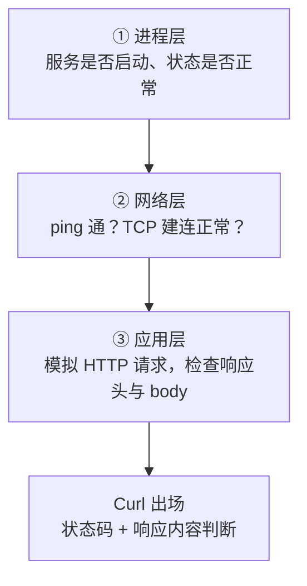
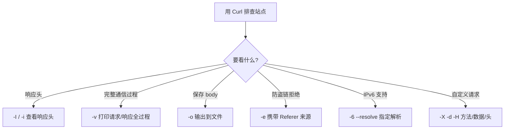

# Curl 命令最常见使用方式及案例

## 一、模块介绍

排查网站故障时，浏览器开发者工具很好用，但脚本调 API、监控服务状态、快速验证接口响应时，你需要一个**命令行 HTTP 客户端**——这就是 Curl（命令行网络传输工具，全称 Client URL）。它模拟客户端请求，遵循 HTTP/HTTPS 协议，是运维与开发排查问题的"瑞士军刀"。

本模块从网站服务分析场景切入，梳理 Curl 最常用的参数与案例：状态码判断、通信过程查看、Referer 防盗链、IPv6 检测、代理访问、断点续传与各类 HTTP 方法。

### 1.1 前置知识

- 了解 HTTP 协议与状态码的基本概念
- 了解 TCP/IP、域名解析（DNS）的基本知识

### 1.2 学习目标

- 掌握 Curl 常用参数（`-i`、`-I`、`-v`、`-o`、`-e`、`-H`、`-E`、`-6` 等）
- 掌握网站故障的排查路径与状态码判断
- 掌握 Referer 防盗链、IPv6 检测、代理访问、断点续传等实战案例
- 掌握用 `-X` + `-d` 覆盖各类 HTTP 方法

---

## 二、核心方法论

### 2.1 排查思路：自下而上

部署或变更完一个站点后，排查"打不开"问题的标准路径是**自下而上**：

- **进程层（Process Layer）**：`ps` 查看进程是否存在、是否 running、CPU 占用是否正常，配合日志查错误；
- **网络层（Network Layer）**：`ping` 通不通、TCP 连接是否建立（可配合 telnet/tcpdump 抓包）；
- **应用层（Application Layer）**：用 Curl 模拟 HTTP 请求，判断服务端返回的头信息与 body 是否符合预期。

Curl 是应用层验证的核心工具。

### 2.2 状态码是第一信号

HTTP 状态码是故障定位的第一个信号，通过它可快速锁定排查方向：

| 区间 | 含义 | 常见码 |
|------|------|--------|
| 1xx | 信息响应，未完成完整请求 | 100 Continue |
| 2xx | 成功 | 200 OK |
| 3xx | 重定向 | 301 / 302 |
| 4xx | 客户端错误 | 400、403（受限）、404（未找到）、499（客户端断开，Nginx 特有） |
| 5xx | 服务端错误 | 500（程序问题）、502、503 |

> 通过状态码可快速定位方向：403 看权限、404 看路径与防盗链规则、5xx 查服务端程序日志。

### 图：网站故障排查自下而上路径



上图为网站故障排查的自下而上路径：先看进程层确认服务是否启动、状态是否正常；再看网络层确认 ping 通、TCP 建连正常；最后在应用层用 Curl 模拟 HTTP 请求，检查响应头与 body。Curl 依据返回的状态码与响应内容作出判断。

---

## 三、关键流程

### 3.1 基本用法与常用参数

| 参数 | 作用 |
|------|------|
| 无参数 | 默认输出响应 body |
| `-i` | 输出响应头 + body |
| `-I` | 只输出响应头（HEAD 请求） |
| `-o` | 输出到文件，如 `-o output.txt` |
| `-v` | 打印完整通信过程（请求头、响应头、body） |

```bash
curl baidu.com          # 返回 body（HTML）
curl -I baidu.com       # 只返回响应头
curl -v https://example.com   # 查看完整通信过程
```

### 3.2 场景判断的决策路径

根据排查目标选择 Curl 的参数组合：想看响应头用 `-I`/`-i`，想观察完整握手与通信过程用 `-v`，想把 body 落盘分析用 `-o`，想绕过防盗链用 `-e` 带 Referer，想测 IPv6 用 `-6 --resolve`。

### 图：Curl 排查参数选择决策



上图为 Curl 排查参数的选型路径：需要响应头用 `-I`/`-i`，需要源码级通信过程用 `-v`，需要保存 body 用 `-o`，遇到防盗链拒绝用 `-e` 携带 Referer，验证 IPv6 支持用 `-6 --resolve`，发送自定义请求用 `-X`/`-d`/`-H`。根据目标选择相应参数组合即可高效排查。

---

## 四、工具与实践

### 4.1 防盗链排查：Referer 头

Nginx 配置了"必须携带 Referer 才能下载"的规则时，直接请求返回 404：

```bash
# 不带 Referer → 404
curl -I <下载链接>

# 携带 Referer → 200
curl -I -e "https://example.com" <下载链接>
```

`-e`/`--referer` 指定请求来源地址，匹配服务端防盗链规则后即可正常访问。

### 4.2 自定义请求头

HTTP 请求头可以被用户自定义或改写：

```bash
# 指定浏览器类型
curl --user-agent "Mozilla/5.0 (Macintosh; Intel Mac OS X)" <URL>

# 添加自定义头（模拟 JSON 接口）
curl -H "Content-Type: application/json" -X POST -d '{"name":"test"}' <URL>
```

### 4.3 HTTPS 与自定义证书

- 公共证书站点：直接访问，无需本地密钥；
- 自建证书站点：需要把客户端密钥放到本地，用 `-E` 指定：

```bash
curl -E /path/to/client.pem https://self-signed.example.com
```

### 4.4 IPv6 站点检测

本地有 IPv6 地址且服务端支持 IPv6 时，可用 `-6` 强制 IPv6 请求，`--resolve` 手动指定域名解析结果：

```bash
curl -6 -vo /dev/null \
  --resolve "static.example.com:80:[2001:db8::1]" \
  "http://static.example.com/path/app.js"
```

| 参数 | 作用 |
|------|------|
| `-6` | 发起 IPv6 请求 |
| `-v` | 显示通信过程 |
| `-o /dev/null` | body 丢弃，只关注响应头 |
| `--resolve` | 手动指定域名→IP 解析 |

### 4.5 代理访问、上传与下载

```bash
# 代理访问：-x 指定代理地址，请求经代理转发
curl -x http://192.0.2.10:8080 https://example.com

# FTP 下载
curl -u user:pass ftp://ftp.example.com/file.zip

# 断点续传：-C 从上次中断位置继续
curl -C - -o file.zip https://example.com/big.zip
```

**断点续传原理**：客户端记录已下载字节索引，网络抖动后重连，**基于原有断点继续下载**，无需从头再来——大文件下载的必备选项。

### 4.6 HTTP 请求方法

默认 Curl 使用 GET，通过 `-X` 指定方法、`-d` 携带数据：

```bash
# GET（默认）
curl https://api.example.com/users

# POST：提交参数
curl -X POST -d "arg1=value1&arg2=value2" https://api.example.com/submit

# PUT：更新资源
curl -X PUT -d "data" https://api.example.com/users/1

# DELETE：删除资源
curl -X DELETE https://api.example.com/users/1

# OPTIONS：探测支持的请求方法
curl -X OPTIONS https://api.example.com/users
```

---

## 五、常见坑点

- **状态码定位方向**：403 看权限，404 看路径与防盗链规则，5xx 查服务端程序日志——用错方向会浪费时间。
- **自建证书不指定 `-E`**：自签/企业内部站点需要把客户端证书通过 `-E` 指定，否则握手失败。
- **防盗链 404 误判**：请求被防盗链规则拒绝时返回 404 而非 403，需用 `-e` 携带 Referer 再试。
- **大文件下载不设断点续传**：网络抖动导致重来，应使用 `-C -` 基于断点继续。
- **只测 GET 不测其他方法**：写接口（POST/PUT/DELETE）必须用 `-X` + `-d` 验证，否则只验证了读路径。

---

## 六、进阶扩展与参考

- **延伸工具**：配合 `jq` 解析 JSON 接口响应；`wget` 更适合递归下载整站；`httpie`/`xh` 提供更简洁的交互式调用。
- **参考**：Curl 官方文档 `man curl`；HTTP 状态码标准定义（RFC 9110）。

---

## 小结

- **排查思路**：进程 → 网络 → 应用层，Curl 是应用层验证的核心工具；
- **参数速记**：`-I` 看头、`-v` 看全过程、`-o` 存文件、`-e` 带 Referer、`-H` 自定义头、`-E` 客户端证书、`-6 --resolve` 测 IPv6；
- **功能场景**：`-x` 代理、`-C -` 断点续传、`-X` + `-d` 组合覆盖全部 HTTP 方法；
- **状态码**：200 正常、3xx 重定向、4xx 客户端问题、5xx 服务端问题，是故障定位的第一信号。