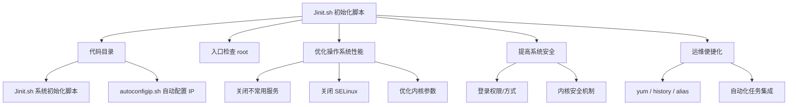
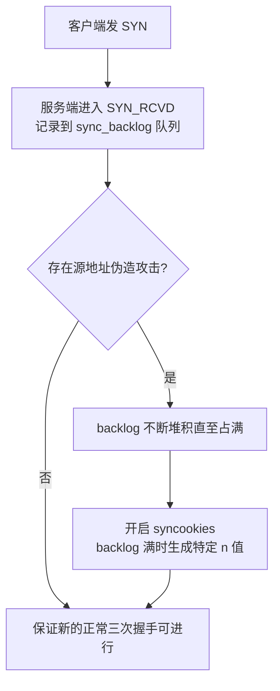
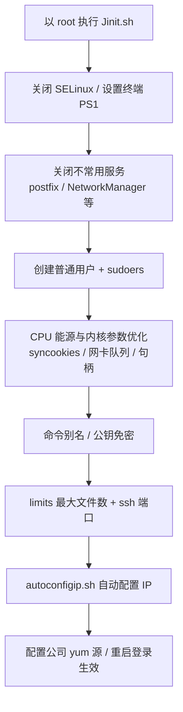

# Shell 如何来实现系统初始化

## 一、模块介绍

本模块进入一个新的课程模块（部署）。在这里将首先讲解 Shell 如何实现系统初始化——通过 Shell 脚本集成 Linux 操作命令，对操作系统进行初始化。

本文会演示一个用 Shell 实现的系统初始化脚本 **Jinit.sh**，它实现了 OS 所需的系统参数优化、运维优化、安全优化、自动化任务等多方面功能。学习时建议具备一定的 Linux 操作基础，并了解基础的操作系统原理（如 TCP 三次握手）。

### 1.1 前置知识

- 具备 Linux 命令与 Shell 脚本基础
- 了解操作系统原理与 TCP 三次握手等网络基础

### 1.2 学习目标

- 理解 Jinit 初始化脚本的整体框架与三大优化方向
- 掌握关闭不常用服务、关闭 SELinux、优化内核参数等初始化方式
- 掌握 Shell 脚本的 root 判断、常用与安全优化、自动化任务集成等逻辑
- 能根据自身环境定制系统初始化脚本

---

## 二、核心方法论

### 2.1 Jinit 初始化脚本框架

Jinit.sh 采用最基础的 Shell 编写方式，Shell 会由上到下依次执行每一段优化项。如果想写得更好，建议把优化项封装成函数以提升维护性，也可以选择优先执行的调用顺序。

在安装完操作系统后，IP 地址可能是动态获取或临时的，需要把操作系统临时获取的静态 IP 进行配置，`autoconfigip.sh` 用于完成这个工作，而 `Jinit.sh` 会调用并执行它。

### 2.2 初始化优化的三大类

从大类来看，Jinit.sh 脚本所做的工作共分三类：

- **优化操作系统性能**：把不常用的服务关闭、忽略影响系统性能的安全设置（如关闭 SELinux）、优化系统内核参数、优化启动项配置；
- **提高操作系统安全**：如用户登录权限、修改登录方式、修改内核的安全机制等相关设置；
- **便捷化管理**：优化 yum 设置、设置 history 记录、创建方便的别名、集成自动化任务。

### 图：Jinit 系统初始化脚本框架



上图为 Jinit 初始化脚本的框架：脚本目录含系统初始化脚本 `Jinit.sh` 与自动配置 IP 的 `autoconfigip.sh`；脚本首先检查是否以 root 运行，随后分三条主线执行——优化操作系统性能（关闭不常用服务、关闭 SELinux、优化内核参数）、提高系统安全（登录权限/方式、内核安全机制）、运维便捷化（yum/history/alias、自动化任务集成）。

### 2.3 执行效果概览

执行初始化脚本后通常需要重启主机再次登录。因为脚本对 ssh 登录服务端口和登录方式进行了修改，所以需用新的方式登录；同时旧密码不再能登录，需输入重置后的新密码，且终端交互样式因脚本修改了终端交互显示环境而与之前有差异。

> 注：笔者的操作系统为 CentOS 7（该脚本也是为 CentOS 7 准备的），如果你的系统不是 CentOS 7，需根据系统差异对脚本内容进行适当修改。

---

## 三、关键流程

### 3.1 优化操作系统性能

**关闭不常用服务**：把一些不常用的服务关闭，比如邮件服务、网卡管理服务等平时做运维管理或应用程序时不需要的服务。原因：不常用服务长期运行会占用系统资源；出于安全考虑，不常用、对外的服务应尽可能关闭，避免暴露不需要的服务端口。在 CentOS 7 中通过 `systemctl` 管理服务并将这些服务在启动项中关闭。

**关闭 SELinux**：SELinux（Security-Enhanced Linux，安全增强型 Linux）是内核的安全模组，提供访问控制安全策略机制。其安全机制非常强大，而一般场景不太需要，反而会给实际管理服务运行带来干扰，所以脚本会在启动项中把默认开启的 SELinux 关闭：

```bash
/bin/sed -i 's/SELINUX=permissive/SELINUX=disabled/' /etc/selinux/config
/bin/sed -i 's/SELINUX=enforcing/SELINUX=disabled/'  /etc/selinux/config
```

通过 `sed` 命令修改配置文件直接把 SELinux 置为 disabled。

**优化内核参数**：重点讲解 **TCP Timestamps** 建议设置为 0。在极少数场景中它可能导致网络抖动或丢包：若 Timestamps 设为 1，客户端往服务端发包时会判断源 IP 上次通讯的时间戳值是否大于本次，若不大于（即时间戳比本地更小）就 drop 这个包，因此设 0 可避免该问题。

### 图：SYN 攻击与 syncookies 抵御机制



上图为 SYN 攻击与 syncookies 抵御机制：客户端发送 SYN 后服务端进入 SYN_RCVD 状态，信息保存在服务端网卡队列（sync_backlog）。若攻击者发送伪造源地址的 TCP 请求，服务端收不到第三次握手，导致 sync_backlog 不断堆积占满而无法对外服务（SYN 攻击）。开启 `net.ipv4.tcp_syncookies=1` 后，backlog 满时内核生成特定 n 值而非把连接放入 backlog，从而保证新的、正常的三次握手能正常进行。

### 3.2 网卡队列与连接状态优化

在做内核优化时，很多参数都是优化服务端的网卡队列相关信息：TCP 三次握手中客户端发送 SYN 包到服务端后，服务端进入 SYN_RCVD 状态，该状态的数值需保存在服务端网卡队列中。对于高并发服务，需要优化本地网卡队列长度、SYN 队列长度（默认值随内核版本不同，可调大）、TIME_WAIT 队列长度（短连接服务本地会产生大量 TIME_WAIT，调高缓冲可减少 TIME_WAIT 报错），以及 `ip_local_port_range`（表示本地最多可使用多少个 IP 和端口连接同一个目标 IP 及端口）。

---

## 四、工具与实践

### 4.1 脚本入口与 root 判断

```bash
WORK_DIR=$(pwd)

# Only root
[ $EUID -ne 0 ] && echo 'Error: This script must be run as root!' && exit 1
```

脚本最开始判断是否由 root 用户运行，该初始化脚本只能由 root 执行。

### 4.2 关闭 SELinux 与设置终端环境

```bash
/bin/sed -i 's/mingetty tty/mingetty --noclear tty/' /etc/inittab
/bin/sed -i 's/SELINUX=permissive/SELINUX=disabled/' /etc/selinux/config
/bin/sed -i 's/SELINUX=enforcing/SELINUX=disabled/'  /etc/selinux/config

/bin/cat << EOF >> /etc/profile
export PS1='\u@\h:\w\n\\$ '
EOF
```

上面这段用于关闭 SELinux，并把终端交互环境显示通过 `PS1` 变量设置为自定义模式。

### 4.3 关闭不常用服务与创建普通用户

```bash
# Close unuseful services
systemctl disable 'postfix'
systemctl disable 'NetworkManager'
systemctl disable 'abrt-ccpp'
```

同时会新建一个操作系统普通用户，并配置其 sudoers 权限控制其可否提取 root 权限——生产环境尽可能关闭 root 账号、让普通用户登录；若需 root 则通过提权控制实现。

### 4.4 CPU 能源管理优化

```bash
# Change Intel P-state
sed -i '/GRUB_CMDLINE_LINUX/{s/"$//g;s/$/ intel_pstate=disable intel_idle.max_cstate=0 processor.max_cstate=1 idle=poll"/}' /etc/default/grub
```

调整 CPU 的能源管理模块（pstate 和 cstate 数值）以获得更高的处理性能。

### 4.5 创建命令别名

```bash
# Bash Aliases
cat > /etc/profile.d/Je.sh << EOF
alias ls='ls -hAF --color=auto --time-style=long-iso'
alias ll='ls -l'
alias cp='cp -i'
alias mv='mv -i'
alias rm='rm -i'
alias df='df -h'
alias grep='egrep --color'
EOF
```

将常用命令通过 `alias` 做别名，更便于管理与维护。

### 4.6 配置公钥免密登录

```bash
# Public key
mkdir /root/.ssh
echo $pub_key >> /root/.ssh/authorized_keys
chmod 700 /root/.ssh
chmod 600 /root/.ssh/authorized_keys
chown -R root:root /root/.ssh
```

通过 SSH 建立连接时，用密钥方式比密码方式更常见、更安全（可防止中间人劫持）。脚本自动生成公共密钥，本地保存好对应私钥即可直接通过私钥登录。

### 4.7 内核参数优化

```bash
found=`grep -c net.ipv4.tcp_timestamps /etc/sysctl.conf`
if ! [ $found -gt "0" ]
then
cat > /etc/sysctl.conf << EOF
net.core.rmem_max = 16777216
net.core.wmem_max = 16777216
fs.file-max = 131072
kernel.panic=1
net.ipv4.tcp_rmem = 4096 87380 16777216
net.ipv4.tcp_wmem = 4096 65536 16777216
net.ipv4.tcp_timestamps = 0
net.ipv4.tcp_window_scaling = 1
net.ipv4.tcp_sack = 1
net.ipv4.tcp_no_metrics_save = 1
net.core.netdev_max_backlog = 3072
net.ipv4.tcp_max_syn_backlog = 4096
net.ipv4.tcp_max_tw_buckets = 720000
net.ipv4.ip_local_port_range = 1024 65000
net.ipv4.tcp_fin_timeout = 5
net.ipv4.tcp_retries1 = 2
net.ipv4.tcp_retries2 = 10
net.ipv4.tcp_synack_retries = 2
net.ipv4.tcp_syn_retries = 2
net.ipv4.tcp_syncookies = 1
EOF
fi
```

> **注意**：老版本脚本中常见的 `net.ipv4.tcp_tw_recycle = 1` 已不再收录——该参数在 Linux 4.12（2017 年）已被内核移除，且在 NAT 环境下会错误丢弃报文。TIME_WAIT 优化应依赖 `tcp_tw_reuse`、`tcp_fin_timeout` 与端口范围调整，切勿再启用 `tcp_tw_recycle`。

文件句柄大小、内存空间分配、网卡队列大小以及 syncookies 等优化都在这里统一完成，其中关键项的意义：

- `fs.file-max`：系统可打开的最大文件句柄数；
- `net.ipv4.tcp_timestamps = 0`：关闭时间戳以避免丢包；
- `net.core.netdev_max_backlog`、`net.ipv4.tcp_max_syn_backlog`：网卡与 SYN 队列长度；
- `net.ipv4.ip_local_port_range`：本地可用的端口范围；
- `net.ipv4.tcp_syncookies = 1`：开启 SYN cookies 防范 SYN 攻击。

### 4.8 最大打开文件数与 SSH 端口等

```bash
# Max open files
found=`grep -c "^ *soft nproc" /etc/security/limits.conf`
if ! [ $found -gt "0" ]
then
cat >> /etc/security/limits.conf << EOF
* soft nproc 2048
* hard nproc 16384
* soft nofile 8192
* hard nofile 65536
EOF
fi
```

设置操作系统最大文件打开数与进程数限制。之后会调整 ssh 登录端口（如改为 9922）与 history 历史记录的长度及格式，并调用 `autoconfigip.sh` 自动配置 IP、配置公司自建 yum 源。

### 图：初始化脚本的执行流程



上图为初始化脚本的整体执行流程：以 root 执行后依次关闭 SELinux 并设置终端、关闭不常用服务、创建普通用户与 sudoers、进行 CPU 与内核参数优化（含 syncookies、网卡队列、句柄）、配置命令别名与公钥免密、设置最大文件数与 ssh 端口，再调用 autoconfigip.sh 配置 IP，最后配置公司 yum 源并重启登录生效。

---

## 五、常见坑点

- **非 root 直接执行**：初始化脚本需要对系统全局配置进行操作，非 root 执行会失败或中途报错，必须先做 EUID 判断。
- **直接改 `/etc/selinux/config` 需重启生效**：关闭 SELinux 需要重启或 `setenforce` 才能完全生效，脚本执行后的变更在重启登录时才体现。
- **内核参数依赖 sysctl 加载**：写入 `/etc/sysctl.conf` 后需 `sysctl -p` 或重启刷新，否则参数不生效。
- **`/etc/sysctl.conf` 被整段覆盖的风险**：脚本用 `cat >` 覆盖写入，若已存在配置且未命中 `grep` 检查条件，可能覆盖既有配置。应使用守护检查逻辑（`found` 判断）后再追加。
- **不同发行版细节差异**：CentOS 7 脚本在 Ubuntu/新版本上可能因 systemd 服务名、默认 shell 等差异失效，须按系统差异调整。
- **`sshd` 端口改错导致无法登录**：修改 ssh 端口前务必确保防火墙放行新端口，并保留一个会话以防锁死。

---

## 六、进阶扩展与参考

- **封装成函数**：基础顺序执行虽直观，但工程上建议将各类优化封装为函数，便于维护和选择性调用。
- **接入 yum 源**：一般大公司都会有自己的 yum 源以维护自有的软件包与整体依赖。把公司 yum 源配置一并放入初始化脚本，新机器启动后执行脚本即可一键完成多数需要手工维护的内容。
- **自动化与配置管理**：可将初始化脚本下沉到云镜像、Ansible playbook 或 Packer/Dockerfile 中，实现新主机"一键初始化"。
- **初始化脚本的后续动作**：执行完初始化、配置好 IP 与 yum 源后，即可进行 SSH 端口调整后的登录与后续程序部署（可衔接集群部署等模块）。
- **参考命令**：`systemctl`、`sed`、`sysctl`、`limits.conf`、`/etc/sudoers` 的 `man` 手册与官方文档。

---

## 小结

- **初始化三方向**：优化系统性能（关服务/关 SELinux/内核参数）、提高系统安全（登录与内核机制）、运维便捷化（yum/history/alias/自动化任务）；
- **脚本入口**：必须先判断 root 执行；
- **内核重点**：tcp_syncookies 防范 SYN 攻击、网卡队列与 TIME_WAIT 缓冲、文件句柄与端口范围；
- **安全实践**：关闭不常用服务端口暴露、公钥免密登录、SSH 端口调整；
- **最后一步**：自动配置 IP 与公司 yum 源，实现新机器一键就绪。