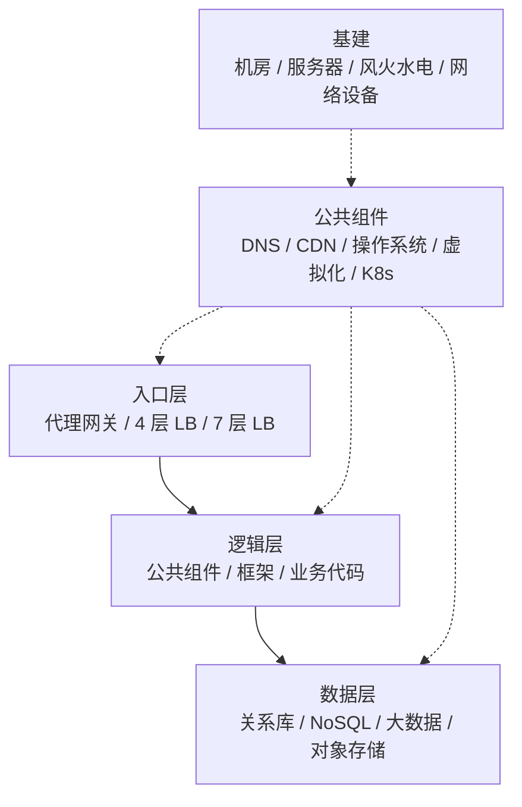
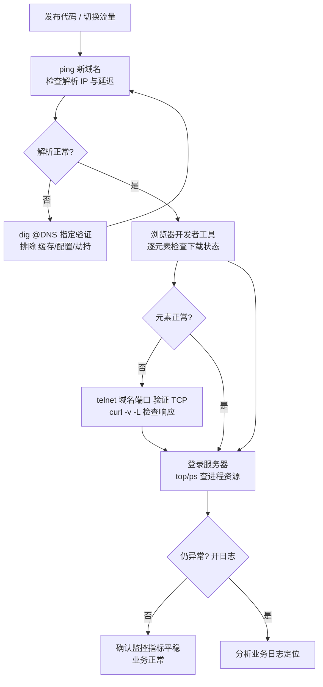
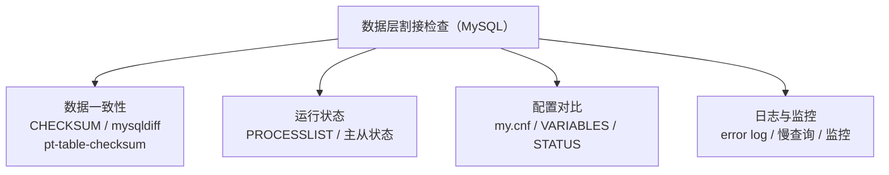

# 网站割接必须掌握的 N 个检查项及命令

## 一、模块介绍

"割接"（Cutover）最初指网络架构的升级或变更切换，在网站场景中指**对网站服务环境的切换与变更**——升级 Nginx、更换网关、迁移数据库、切换机房，都属于割接。割接是风险最高的运维操作：**任何一环检查不到位，都可能演变成线上事故**。

本模块给出割接检查的完整框架：先看网站服务架构与割接分类，再按"上层业务"与"数据层"两大类梳理检查项及对应命令，帮助你系统化地把控割接前后的每一条链路。

### 1.1 前置知识

- 了解网站服务架构（入口层、逻辑层、数据层）的基本层次结构
- 熟悉 DNS、TCP、MySQL 主从、日志等运维基础概念

### 1.2 学习目标

- 理解网站的层次结构与割接的两种分类方式
- 掌握上层业务检查项（DNS、TCP 建连、入口应用、监控）及对应命令
- 掌握数据层检查项（一致性、运行状态、配置、日志）及对应命令
- 掌握割接后从用户视角向下钻取的检查顺序

---

## 二、核心方法论

### 2.1 网站的层次结构

网站通常由以下层次构成，任何一层变化都可能触发割接并需要对应检查：

- **入口层（Entry Layer）**：代理网关、4/7 层负载均衡（Load Balancing）；
- **逻辑层（Logic Layer）**：公共组件、框架、业务代码；
- **数据层（Data Layer）**：关系型数据库、NoSQL、大数据、对象存储；
- **公共组件**：DNS、CDN、操作系统、虚拟化、Kubernetes（K8s）；
- **基建（Infrastructure）**：机房、服务器、风火水电、网络设备。

> 割接检查的范围往往比操作本身大得多——操作只动一处，检查要覆盖整条链路。

### 2.2 割接的两种分类方式

| 分类维度 | 类型 | 说明 | 示例 |
|----------|------|------|------|
| 结构 | 同构割接 | 主体结构不变，例行升级 | Nginx 版本升级 |
| 结构 | 异构割接 | 主体结构改变 | 入口网关 Nginx 换成 Apache |
| 影响面 | 局部割接 | 只影响一小部分 | 单模块配置调整 |
| 影响面 | 全局割接 | 影响整体功能与用户体验 | 数据库整体迁移 |

### 图：网站服务架构层次



上图为网站的分层架构：入口层（代理网关与四/七层负载均衡）承接流量，转发到逻辑层（组件、框架、业务代码），最终访问数据层（关系库、NoSQL、大数据、对象存储）；底层还有 DNS/CDN/虚拟化/K8s 等公共组件和机房基建支撑。其中任何一层发生变化都可能触发一次割接。

---

## 三、关键流程

### 3.1 上层业务检查项

上层业务检查**贴近真实用户视角**，覆盖入口层、逻辑层及 DNS/CDN 等公共组件。

**DNS 域名解析**：检查域名解析的 IP 是否正确、解析内容与配置是否匹配。解析异常常见三种原因：**DNS 缓存失效周期、本地 DNS 配置错误、DNS 劫持**——此时需指定可信 DNS 服务器逐层验证。

**TCP 服务建连**：确认服务端口可达、连接建立正常。

**网站入口应用**：检查页面、接口、进程与日志是否正常。

**监控系统**：割接后必须查看监控，不仅要确认业务正常，还要**确认整体指标平稳**。

### 3.2 例行发布后的检查流程

1. **发布代码** → 检查域名解析：`ping 新域名`，确认返回地址与延迟符合预期；
2. 解析异常 → `dig @8.8.8.8` 或 `nslookup` 指定 DNS 服务验证，排除缓存/配置/劫持；
3. **浏览器开发者工具**刷新页面，检查每个元素的下载状态与返回值；
4. 元素异常 → `telnet 域名 80` 验证 TCP 连通，`curl -v -L` 检查应用层响应头与 body；
5. 登录服务器：`top` / `ps` 检查进程与资源；
6. 仍异常 → 打开业务日志分析。

### 图：割接后上层业务检查流程



上图为割接后上层业务的检查流程：先 `ping` 验证域名解析，异常时用 `dig`/`nslookup` 指定 DNS 验证排除缓存、配置与劫持；再用浏览器开发者工具逐元素检查下载状态；异常时用 `telnet` 验证 TCP、`curl -v -L` 检查响应，登录服务器用 `top`/`ps` 查进程资源；最后确认监控指标平稳，仍有问题则分析业务日志定位。

---

## 四、工具与实践

### 4.1 DNS 域名解析检查

| 命令 | 用途 |
|------|------|
| `ping` | 验证域名可达性与延迟 |
| `nslookup` | 查询解析记录、指定 DNS 服务器 |
| `dig` | 专业解析工具，`dig @DNS服务IP` 指定服务器，`dig +trace` 模拟自根起的迭代解析全过程 |

### 4.2 TCP 服务建连检查

| 工具 | 用途 |
|------|------|
| `ping` / `fping` | ICMP 探测；fping 支持批量指定主机范围 |
| `tcpping` | 用 TCP 协议 ping（服务端关闭 ICMP 时替代） |
| `telnet IP 端口` | 客户端验证 TCP 连接是否建立 |
| `netstat` / `ss` / `lsof` | 服务端查看监听端口、连接状态、句柄占用 |
| `tcpdump` | 抓包分析网络包 |
| `nc` | 客户端/服务端两用，可模拟端口监听进程 |

### 4.3 网站入口应用检查

- **页面与接口**：浏览器开发者工具逐个检查元素下载状态；无浏览器时用 `curl -v -L` 查看完整请求过程与响应头；
- **服务端进程**：`top` / `ps` 分析进程资源占用，应用专属工具（如 jmap）检查 JVM 状态；
- **业务日志**：日志是判断入口应用是否正常的重要依据。

### 4.4 监控系统

割接后必须查看监控，确认整体指标平稳。开源方案推荐 Zabbix 与 Prometheus；大型网站还会用第三方检测工具（如博睿、听云等）从指定地域探测服务。

### 4.5 数据层检查项（以 MySQL 为例）

**数据一致性**分析工具：

| 工具 | 用途 |
|------|------|
| `CHECKSUM TABLE` | MySQL 内核对表数据一致性校验 |
| `mysqldiff` | MySQL Utilities，检查表结构是否一致 |
| `mysqldbcompare` | 检查不同数据库之间的一致性 |
| `pt-table-checksum` | Percona 工具集，在线检查**主从**数据一致性（从主库核对从库） |

**运行状态**：

```sql
SHOW FULL PROCESSLIST;      -- SQL 执行状态，完整展示 SQL 语句
SHOW SLAVE STATUS\G         -- 主从同步状态与延迟
SHOW MASTER STATUS\G        -- 主库当前 binlog 位置
```

**配置对比与日志监控**：

- 对比 `my.cnf` 配置文件的差异是否合理；
- `SHOW VARIABLES\G` 查看系统变量、`SHOW STATUS\G` 查看状态变量，两侧对比分析；
- **error log** 判断数据库运行错误；**慢查询日志**关注对外服务的查询质量；将关键指标接入监控系统，日常通过监控判断运行状态。

### 图：数据层割接检查项总览



上图为数据层割接检查的总览：从数据一致性（`CHECKSUM`、`mysqldiff`、`pt-table-checksum`）、运行状态（`PROCESSLIST`、主从状态）、配置对比（`my.cnf`、系统/状态变量）、日志与监控（error log、慢查询、监控系统）四个维度全面校验数据层的健康状态。

---

## 五、常见坑点

- **只检查操作那一处**：操作只动一层，但割接影响整条链路，检查必须覆盖入口、逻辑、数据与公共组件四层。
- **DNS 解析异常时盲目重试**：应先区分 DNS 缓存失效、本地配置错误、DNS 劫持三种原因，用指定可信 DNS 服务器（如 `dig @8.8.8.8`）逐层验证。
- **忽略整体指标**：割接后不仅要确认业务正常，还要确认 CPU、内存、连接数等整体指标平稳，排除潜在劣化。
- **数据一致性只靠手查**：主从一致性应使用 `pt-table-checksum` 等在线工具自动核对，而非人工比对。
- **配置/页面优化改动未持久化**：临时改动后需确认写入配置文件并重启生效，否则重启丢失。
- **漏看主从延迟与 binlog 位置**：数据库割接须确认 `SHOW SLAVE STATUS` 无延迟、`SHOW MASTER STATUS` 的 binlog 位置正确。

---

## 六、进阶扩展与参考

- **自动化检查**：可将交叉检查项固化为巡检脚本或自动化测试，提升割接的可靠性与速度；
- **回滚预案**：割接前应准备回滚方案（如 DNS 回切、数据库闪回、版本回退），确保异常时可快速恢复；
- **相关工具**：Zabbix、Prometheus、Percona Toolkit、tcpdump、ping/fping/tcpping 等；
- **参考命令**：`dig`、`nslookup`、`telnet`、`netstat`、`ss`、`lsof`、`nc`、`curl` 的 `man` 手册与官方文档。

---

## 小结

- **架构视角**：入口层、逻辑层、数据层 + DNS/CDN 公共组件，任何一层变动都是割接；
- **上层检查**：DNS（ping/nslookup/dig）→ TCP 建连（telnet/netstat/tcpdump/nc）→ 入口应用（curl/浏览器/进程/日志）→ 监控；
- **数据层检查**：一致性（checksum 系列）、运行状态（processlist/主从状态）、配置对比、日志与监控；
- **检查顺序**：自用户视角向下钻取，先入口后数据，先表象后日志，是割接检查的不变主线。