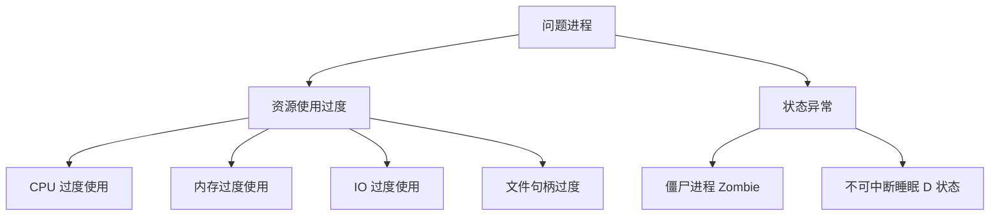
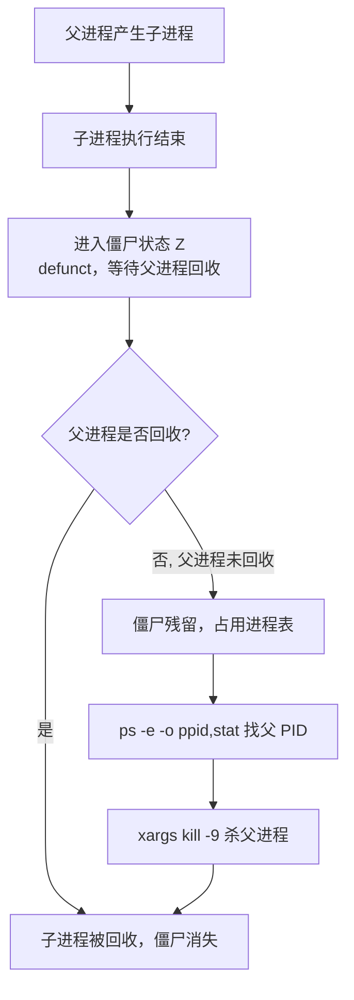

# 典型系统故障：快速排错操作系统问题进程

## 一、模块介绍

系统变慢、服务告警、业务抖动，绝大多数时候根源都在**问题进程**上。问题进程可分为两大类：**资源使用过度**（CPU、内存、IO、文件句柄）和**状态异常**（僵尸进程、不可中断睡眠）。

本模块按"现象 → 成因 → 分析命令 → 处置"的顺序，把这两类故障的排查路径讲透——这是运维排障最常复用的技能组合。

### 1.1 前置知识

- 熟悉进程、状态（Zombie、D 状态）等基本概念
- 掌握 `top`、`ps`、`free` 等基础资源命令

### 1.2 学习目标

- 识别六类常见进程问题及其对业务的影响
- 掌握 CPU、内存、IO、文件句柄四类资源故障的分析命令
- 掌握僵尸进程与不可中断睡眠的识别与处置
- 培养"先定性（资源 or 状态）再定位（命令取证）"的排障思维

---

## 二、核心方法论

### 2.1 常见进程问题及其影响

| 类型 | 现象 | 对业务的影响 |
|------|------|--------------|
| CPU 过度使用 | 单核/多核打满 | 服务响应变慢、请求堆积 |
| 内存过度使用 | 内存耗尽、OOM | 进程被杀、系统 Swap 抖动 |
| IO 过度使用 | 磁盘繁忙、IO 等待高 | 读写阻塞、整体卡顿 |
| 文件句柄过度 | 句柄耗尽、Too many open files | 新连接失败、服务不可用 |
| 僵尸进程 | 大量 Z 状态进程 | 占用进程表，pid 耗尽 |
| 不可中断睡眠 | 进程卡死、kill -9 无效 | 服务僵死、无法恢复 |

### 2.2 常见成因

- **外部负载**：请求量超过进程承载能力，资源消耗过高；
- **代码缺陷**：程序设计不合理、算法低效，资源分配不当；
- **部署不当**：多个进程抢占同一份资源；
- **安全问题**：被攻击（如 CC、挖矿木马）导致资源耗尽。

### 图：问题进程两大类与四类资源



上图为问题进程的二分法：一类是资源使用过度（CPU、内存、IO、文件句柄四类资源被耗尽），另一类是状态异常（僵尸进程 Z、不可中断睡眠 D）。先判断问题属于哪一类，再选择对应的分析命令与处置手段，是高效排障的第一步。

---

## 三、关键流程

### 3.1 资源分析的排查思路

`top` 定位可疑进程 → `ps` 确认进程详情 → `strace` 观察系统调用卡点 → `free`/`iostat` 确认资源维度。

### 3.2 僵尸进程的处置流程

僵尸进程**无法被直接 kill**（它已经死了，只是未被回收），必须清理其父进程：

```bash
ps -e -o ppid,stat | grep Z | awk '{print $1}' | xargs kill -9
```

原理：`ps -e -o ppid,stat` 列出父进程 ID 与状态 → 过滤 Z 状态 → 用 `awk '{print $1}'` 提取第一列父 PID（ps 输出列右对齐带前导空格，用 awk 取列比 cut 更可靠）→ 杀掉父进程，由 init/systemd 完成僵尸回收。

### 图：僵尸进程产生与清理流程



上图为僵尸进程的产生与清理：子进程执行结束后进入僵尸状态（defunct），等待父进程回收；若父进程未及时回收则僵尸残留并占用进程表。清理时用 `ps -e -o ppid,stat` 定位其父进程 PID，将其杀掉后由 init/systemd 统一回收僵尸，从而释放进程表资源。

### 3.3 不可中断睡眠（D 状态）的成因与处置

操作系统睡眠分两种：**可中断睡眠（S）**——等待条件为真，硬件中断、资源释放、信号量都可唤醒；**不可中断睡眠（D）**——只能等待特定硬件资源被唤醒，**不响应信号**。

典型场景：进程 B 向队列添加数据后唤醒进程 A，而 A 正在处理上一次任务，无法响应唤醒，于是进入不可中断睡眠。

**处置要点**：

- `kill -9` 对 D 状态进程**无效**；
- 只能通过**重启操作系统**，或**恢复其等待的资源**（如重启 NFS 服务）来恢复。

### 图：不可中断睡眠产生机制


上图为不可中断睡眠的产生机制：进程 B 向队列添加数据后尝试唤醒进程 A，但 A 正在处理上一次任务、无法及时响应唤醒信号，于是进入不可中断睡眠（D）状态。此时 A 不响应任何信号，`kill -9` 无效，只能恢复其等待的资源或重启系统。

---

## 四、工具与实践

### 4.1 资源分析命令

| 命令 | 用途 | 常用形式 |
|------|------|----------|
| `top` | 实时显示各进程资源占用 | `top`、`top -p <pid>` 只看某进程 |
| `ps` | 显示瞬间进程状态快照 | `ps -ef`、`ps aux` |
| `strace` | 跟踪进程的系统调用 | `strace -p <pid>` 观察卡住的进程 |
| `free` | 统计内存使用 | `free -h` |
| `iostat` | 监视磁盘 IO 活动 | `iostat -x 1` |
| `iotop` | 按进程查看 IO 使用 | `iotop`（IO 频繁时慎用，本身开销大） |

排查思路：`top` 定位可疑进程 → `ps` 确认进程详情 → `strace` 观察系统调用卡点 → `free`/`iostat` 确认资源维度。

### 4.2 文件句柄问题：查看限制与用量

```bash
cat /proc/sys/fs/file-max    # 系统全部进程允许打开的最大 fd 总数
cat /proc/sys/fs/file-nr     # 已分配 / 已分配但空闲 / 最大 fd 数量
ls -l /proc/<pid>/fd/ | wc -l    # 统计某进程打开的 fd 数量
```

`/proc/<pid>/fd/` 目录存放着进程当前打开的所有文件句柄（File Descriptor）。

**处置思路**：句柄过多超过限制时，两条路线：
- **调大系统限制**（ulimit、limits.conf）；
- **程序优化**：排查为何打开这么多句柄——常见原因是程序设计不合理，在本地创建大量临时碎片文件。

### 4.3 僵尸进程的识别与清理

```bash
ps -ef | grep defunct        # 关键字 defunct 即僵尸进程
ps -e -o ppid,stat | grep Z | awk '{print $1}' | xargs kill -9   # 清理：杀父进程回收
```

`top` 中也能看到僵尸进程数量。

### 4.4 不可中断睡眠的经典案例：NFS 挂载

NFS 客户端挂载共享存储后，**服务端未先 umount 就关闭**，客户端执行 `df` 会一直处于不可中断状态，`kill -9` 也无法关闭。正确做法是**先恢复 NFS 服务端**，再唤醒客户端进程。

---

## 五、常见坑点

- **对僵尸进程直接 kill -9**：僵尸进程已经死了，无法被杀；必须清理其父进程，由 init/systemd 回收。
- **对 D 状态进程 kill -9**：不可中断睡眠不响应信号，`kill -9` 无效，只能恢复其等待的资源或重启系统。
- **只看 top 不看状态列**：要结合 `ps -ef`/`ps aux` 中的 STAT 列判断进程是否 Z/D 状态，而不仅是资源占用。
- **误把 IO 高当 CPU 问题**：磁盘繁忙、IO 等待高时需用 `iostat`/`iotop` 区分 IO 与 CPU 维度。
- **`iotop` 在 IO 频繁时滥用**：`iotop` 本身开销大，IO 已繁忙时应慎用，避免加重负担。

---

## 六、进阶扩展与参考

- **排障思维**：先定性（资源 or 状态）再定位（命令取证），区分"能杀"与"不能杀"。
- **资源维度深入**：结合 `/proc/<pid>/` 各子文件、`perf`、`vmstat`、`mpstat` 做更细粒度分析。
- **D 状态与存储**：不可中断睡眠常见于 NFS、存储网络等场景，排查时优先恢复底层存储与网络资源。
- **参考命令**：`top`、`ps`、`strace`、`free`、`iostat`、`iotop`、`lsof` 的 `man` 手册与官方文档。

---

## 小结

- **资源类故障**：top 定位 → ps 确认 → strace/free/iostat 深入，句柄问题查 `/proc/<pid>/fd` 与 file-max/file-nr；
- **僵尸进程**：grep defunct 识别，杀父进程回收，无法直接 kill 僵尸本身；
- **不可中断睡眠**：D 状态不响应信号，kill -9 无效，恢复资源或重启系统才是出路；
- **排障思维**：先定性（资源 or 状态）再定位（命令取证），区分"能杀"与"不能杀"。