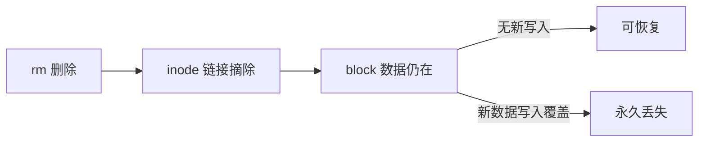
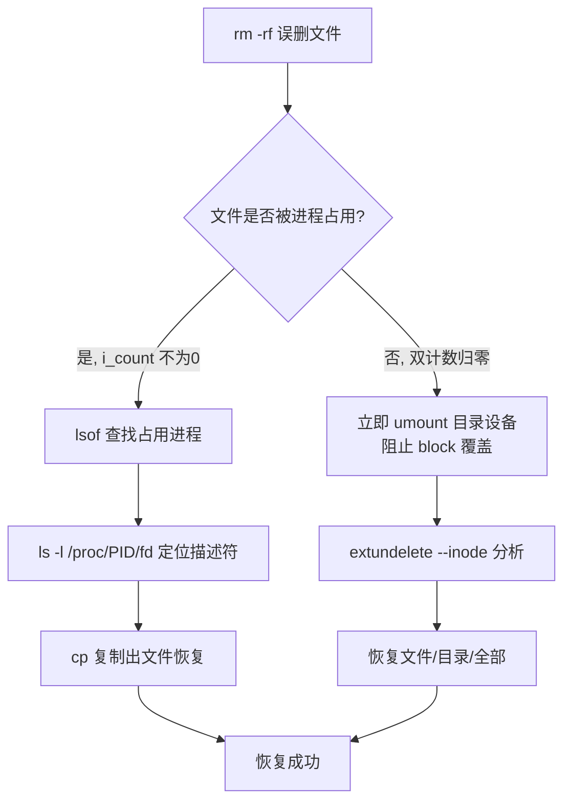

# 磁盘数据恢复：rm -rf 误删数据，如何进行数据恢复

## 一、模块介绍

`rm -rf` 是 Linux 上最危险的命令之一，误删文件后第一反应往往是大惊失色。但**"删除"不等于"消失"**：Linux 的删除本质是摘除 inode 链接，数据块的物理内容依旧存在。

本模块先讲清两种误删场景与可恢复的原理（i_count/i_nlink、inode/block），再分别演示进程占用中删除与无进程占用删除的恢复方法，并给出防止二次覆盖的关键操作。

### 1.1 前置知识

- 了解 inode 与 block 的基本概念
- 熟悉 `lsof`、`mount`/`umount`、`rm`、`tar` 等基础命令

### 1.2 学习目标

- 理解 `rm` 删除的本质与数据可恢复的原理
- 掌握进程占用中删除文件的 `lsof` + `/proc/<pid>/fd` 恢复法
- 掌握无占用删除文件的 extundelete 恢复工具实战
- 牢记"立即 umount 防止 block 覆盖"的第一原则

---

## 二、核心方法论

### 2.1 两种误删场景

| 场景 | 状态 | 恢复手段 |
|------|------|----------|
| 场景一 | 文件正在被进程使用 | `/proc/<pid>/fd` 直接找回 |
| 场景二 | 文件未被任何进程使用 | 分析 block 数据块（extundelete） |

### 2.2 为什么数据可以恢复

**两个链接计数器**：Linux 中每个文件有两个链接计数器：
- **i_count**：文件被进程引用的次数（进程打开文件时 +1）；
- **i_nlink**：文件的硬链接个数。

**只有两个计数器都归零，文件才被系统真正判定删除。**
- 场景一：执行 `rm -rf` 时进程还在使用文件，i_count 不为 0——文件"看似被删"，实际仍可通过进程的文件描述符找回；
- 场景二：两个计数器都为 0，inode 链接被摘除，但数据仍在 block 中。

**inode 与 block 的存储结构**：
- **inode（索引节点）**：存放文件元数据（大小、权限、时间戳），内含索引指向数据块；
- **block（数据块）**：实际存放文件数据的数据块。

`rm` 只是删除了 inode 的链接，**block 数据块并未被清除**——理论上可完整找回。

### 2.3 唯一风险：block 覆盖

删除后若有进程持续向磁盘写入数据，操作系统可能把已删除文件的 block 分配给新数据，**覆盖后数据将永久丢失**。因此误删后的第一动作是：**立即 umount 目录所在磁盘设备**（`umount /test -l`），阻止新的写入。

### 图：rm 删除与数据可恢复原理



上图为 rm 删除与可恢复性原理：`rm` 只是摘除 inode 的链接，而承载数据的 block 块物理内容仍在。若此后没有新数据写入覆盖这些 block，则数据可恢复；反之，新数据写入覆盖 block 后将永久丢失。这正是误删后立即 `umount` 阻止写入的原因。

---

## 三、关键流程

### 3.1 场景一：进程占用中删除的恢复流程

1. 模拟场景：`echo "Delete file" > deletefile.txt`，用 `tail -f deletefile.txt` 让进程持续占用该文件；
2. 执行 `rm -rf deletefile.txt` 制造误删；
3. 用 `lsof | grep deletefile.txt` 找到正在使用该文件的进程（如 tail，PID 为 4701）；
4. 通过进程的文件描述符找回：

```bash
ls -l /proc/4701/fd/           # 找到指向已删除文件的描述符（标记为 deleted）
cp /proc/4701/fd/3 /opt/recovertest/deletefile.txt_bak
```

恢复出的文件内容与删除前完全一致——因为进程仍持有该文件，数据从未真正消失。

### 3.2 场景二：无进程占用删除的恢复流程（extundelete）

1. **先卸载**误删目录所在设备：`umount /test -l`（防止新写入覆盖 block）；
2. 分析设备上的已删除文件：`extundelete /dev/sdb --inode 2`；
3. 执行恢复命令（见下）。

### 图：磁盘数据恢复完整流程



上图为数据恢复的完整流程：误删后先判断文件是否被进程占用。若 i_count 不为 0（场景一），用 `lsof` 找到占用进程、通过 `/proc/<pid>/fd` 复制出文件即可恢复；若双计数器归零（场景二），立即 `umount` 阻止 block 覆盖，再用 extundelete 分析 inode 并恢复文件/目录/全部数据。

---

## 四、工具与实践

### 4.1 安装 extundelete

基于 ext3/ext4 的已删文件分析恢复工具（最后一个版本 0.2.4 发布于 2013 年，项目已停止维护，仅适用于 ext3/ext4 文件系统）：

```bash
yum -y install bzip2 e2fsprogs e2fsprogs-devel gcc-c++
wget https://nchc.dl.sourceforge.net/project/extundelete/extundelete/0.2.4/extundelete-0.2.4.tar.bz2
tar jxvf extundelete-0.2.4.tar.bz2 && cd extundelete-0.2.4
./configure && make && make install
```

### 4.2 使用 extundelete 恢复

```bash
# 1. 先卸载误删目录所在设备，防止新写入覆盖 block
umount /test -l

# 2. 分析设备上的已删除文件
extundelete /dev/sdb --inode 2

# 3. 恢复
extundelete /dev/sdb --restore-file file            # 恢复单个文件
extundelete /dev/sdb --restore-directory testdir    # 恢复单个目录
extundelete /dev/sdb --restore-all                  # 恢复全部已删文件
```

> 恢复命令需在**其他目录**下执行（如 `/opt/recovertest`），恢复结果输出到当前目录的 `RECOVERED_FILES/` 下；同名文件多次恢复会自动生成 `.v1`、`.v2` 版本。

### 4.3 恢复操作的注意事项

- 恢复动作本身对业务有影响与数据风险，执行前应评估；
- 最后原则是预防重于恢复：谨慎使用 `rm -rf`，重要数据走备份与回收站机制。

---

## 五、常见坑点

- **误删后不及时 umount**：未阻止新写入，block 被覆盖后数据永久丢失——这是恢复成败的分水岭。
- **在误删目录内执行恢复命令**：恢复命令应在其他目录（如 `/opt/recovertest`）执行，避免二次写入。
- **对已删除的软链接/硬链接理解不清**：只有 i_count 与 i_nlink 双计数器归零才真正删除，进程占用可经 `/proc/<pid>/fd` 找回。
- **extundelete 仅支持 ext3/ext4**：其他文件系统（xfs、btrfs）需使用对应恢复工具。
- **把恢复当常规操作**：恢复对业务有影响，应在低峰期操作并优先走备份恢复。

---

## 六、进阶扩展与参考

- **进阶工具与防御**：PhotoRec、testdisk 等更通用的恢复工具；生产环境建议使用回收站机制、版本管理、快照与异地备份，从源头避免依赖数据恢复。
- **参考命令**：`lsof`、`mount`/`umount`、extundelete 的 `man` 手册与官方文档。

---

## 小结

- **两大原理**：i_count/i_nlink 双计数器归零才算删除；删除只摘 inode 链接，block 数据仍在；
- **第一原则**：误删后立即 `umount`，阻止新写入覆盖 block——这是恢复成功与否的分水岭；
- **场景一（进程占用）**：`lsof` 找进程 → `/proc/<pid>/fd` 复制找回，恢复零成本；
- **场景二（无占用）**：extundelete 分析 inode → `--restore-file` / `--restore-all` 恢复；
- **预防重于恢复**：谨慎使用 `rm -rf`，重要数据走备份与回收站机制，恢复操作本身对业务有影响与数据风险。