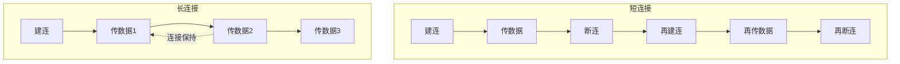
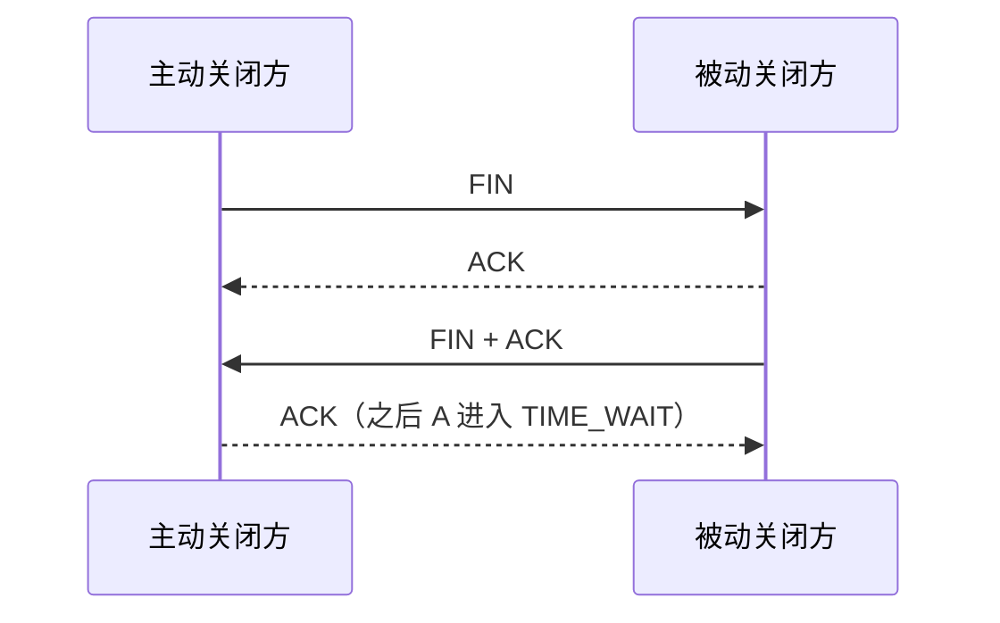
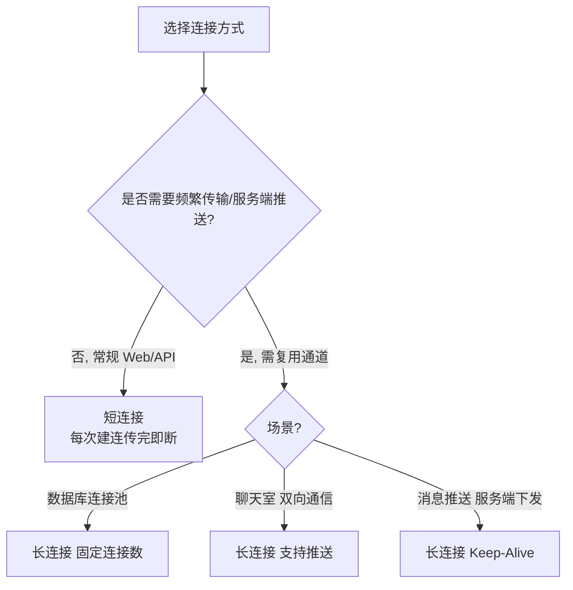

# 典型网络故障：长连接与短连接选择及 TIME_WAIT 优化

## 一、模块介绍

"为什么 `netstat` 里有几万个 TIME_WAIT？""该用长连接还是短连接？"——这是后端与运维面试的高频题，也是线上真实故障的常见源头。

本模块按四个模块展开：长连接与短连接的原理、各自的应用场景、TIME_WAIT 与 TCP 连接的关系，以及系统层面的优化方案。

### 1.1 前置知识

- 了解 TCP 三次握手、四次挥手与连接状态
- 熟悉 `netstat`、`sysctl` 等命令与 HTTP 协议基础

### 1.2 学习目标

- 理解长连接与短连接的原理、优劣与应用场景
- 掌握 HTTP 1.0/1.1/2.0 的连接模型演进
- 理解 TIME_WAIT 的产生机制（四次挥手）与影响
- 掌握 `tcp_tw_reuse`、`tcp_max_tw_buckets` 等 TIME_WAIT 优化参数，厘清 `tcp_fin_timeout` 的真实含义

---

## 二、核心方法论

### 2.1 什么是长连接和短连接

- **短连接（Short Connection）**：每次传输数据前建立一次连接通道，传完即关；传第二份数据时重新建连；
- **长连接（Long Connection）**：建立一条连接通道并保持，多次传输复用同一条通道。

### 图：长连接与短连接对比



上图为长短连接的行为对比：短连接每次传输都要"建连→传数据→断连"，传第二份数据时重新建连；长连接建立后保持通道，多次传输（传数据 1、2、3）复用同一条连接，无需反复建连。

### 2.2 建立长连接的两个前提

1. **客户端使用长连接方式请求**：客户端不能主动断开，要复用连接传输数据；
2. **服务端支持长连接**：在连接周期内不主动断开，支持客户端请求模式。

以 Nginx 为例：

```11-Nginx基础概述
keepalive_timeout 0;      # 关闭长连接，仅支持短连接
keepalive_timeout 120s;   # 支持 2 分钟的长连接
```

通过浏览器开发者工具可验证：Request Headers 与 Response Headers 中 `Connection: keep-alive` 表示双向建立了长连接（Keep-Alive）。

### 2.3 HTTP 协议与连接模型演进

| 协议版本 | 连接能力 | 说明 |
|----------|----------|------|
| HTTP/1.0 | 不支持长连接 | 每次请求都要新建 TCP 连接 |
| HTTP/1.1 | 支持长连接 | 可复用连接，但请求响应**串行** |
| HTTP/2.0 | 长连接 + 多路复用 | 同一条连接上并发传输多个请求响应 |

HTTP/1.1 下请求 `index.html`、`aa.css`、`bb.js` 必须串行：一个请求完成后才能发起下一个；HTTP/2.0 可以在同一条 TCP 连接上**同时发起多个请求、并行接收响应**，这就是多路复用（Multiplexing）。

### 2.4 长连接与短连接的优劣对比

| 维度 | 短连接 | 长连接 |
|------|--------|--------|
| TCP 建连开销 | 每次传输都建连，开销大 | 只建一次，开销小 |
| 探活开销 | 无 | 需持续探活保持通道，有资源开销 |
| 同并发下服务端压力 | 连接周期短，压力略小 | 连接常驻，整体开销更大 |
| 服务端主动推送 | 做不到 | 支持（聊天室等场景） |

> 选择逻辑：**大部分 Web 服务与 API 用短连接**；长连接集中用于三类场景——数据库连接池（固定数量的连接通道）、聊天室（双向通信）、消息推送（服务端主动下发）。

---

## 三、关键流程

### 3.1 TIME_WAIT 的产生机制：TCP 四次挥手

主动关闭方发出 FIN → 被动方回 ACK → 被动方再发 FIN+ACK → 主动方回 ACK 后进入 **TIME_WAIT** 状态。

### 图：TCP 四次挥手产生 TIME_WAIT



上图为 TCP 四次挥手产生 TIME_WAIT 的过程：主动关闭方先发 FIN，被动方回 ACK；被动方发 FIN+ACK，主动方回 ACK 后进入 TIME_WAIT 状态。四次挥手理论上已结束，但 TCP 协议需要保证最后一次 ACK 的稳定性——若 ACK 丢失需重发，同时确保旧连接的数据包不会串扰新连接，因此保留 TIME_WAIT 状态。

### 3.2 大量 TIME_WAIT 的影响

- 占用**文件句柄、内存与端口**；
- 系统会回收过多的 time-wait socket，网络条件不佳时可能导致**数据包重复发送**；
- 通常不会直接造成连接失败，但会带来资源占用与新建连接的风险。

### 3.3 长连接与短连接的选择决策

### 图：长连接与短连接的选型



上图为连接方式的选择路径：常规 Web 服务与 API 多用短连接；需要复用通道、支持服务端推送的场景（数据库连接池、聊天室、消息推送）采用长连接（Keep-Alive）。选择核心是在"TCP 建连开销"与"长连接探活开销"之间权衡。

---

## 四、工具与实践

### 4.1 加大 TIME_WAIT 队列容量

```bash
sysctl -w net.ipv4.tcp_max_tw_buckets=200000
```

在系统资源允许的前提下调高 `tcp_max_tw_buckets`，增大缓冲容量，避免操作系统过早强制回收 time-wait socket（超过该值时内核会清除最旧记录并打印 "time wait bucket table overflow" 告警）。

### 4.2 TIME_WAIT 优化的正确姿势

```bash
# 开启 TIME_WAIT 复用：主动关闭方（典型为客户端）可安全复用 TIME_WAIT 连接
# 依赖 tcp_timestamps=1（默认开启）
sysctl -w net.ipv4.tcp_tw_reuse=1

# 扩大本地可用端口范围，缓解源端口耗尽
sysctl -w net.ipv4.ip_local_port_range="1024 65535"
```

两个常见误区需要澄清：

- **`tcp_fin_timeout` 并不控制 TIME_WAIT 时长**：它控制的是 FIN_WAIT_2 状态的超时（对端迟迟不发 FIN 时本端的等待上限）；
- **TIME_WAIT 的时长固定为 60 秒（2MSL），不可通过内核参数调整**。

因此 TIME_WAIT 过多的正解是：`tcp_tw_reuse` 复用连接 + 服务端配置 keepalive、客户端使用连接池从源头减少连接数；`tcp_max_tw_buckets` 只作容量兜底。

### 4.3 优化原则与持久化

- 先评估连接数规模与资源水位，再决定是否调参；
- 更根本的优化是**减少连接数**：服务端合理配置 keepalive 复用连接、客户端使用连接池；
- 内核参数修改后写入 `/etc/sysctl.conf` 持久化，并 `sysctl -p` 生效：

```bash
# 写入配置文件持久化
echo "net.ipv4.tcp_tw_reuse = 1" >> /etc/sysctl.conf
echo "net.ipv4.ip_local_port_range = 1024 65535" >> /etc/sysctl.conf
echo "net.ipv4.tcp_max_tw_buckets = 200000" >> /etc/sysctl.conf
sysctl -p        # 立即生效
```

---

## 五、常见坑点

- **想把 TIME_WAIT 归零**：TIME_WAIT 是 TCP 协议保障最后一次 ACK 稳定的特性，数量大可调优但不可盲目归零/去除。
- **把 `tcp_fin_timeout` 当 TIME_WAIT 时长**：它实际控制 FIN_WAIT_2 状态的超时；TIME_WAIT 固定 60 秒（2MSL）不可调，优化应使用 `tcp_tw_reuse`。
- **只调内核参数不减少连接数**：最根本的优化是减少连接——服务端配好 keepalive、客户端用连接池，而非一味调大桶数。
- **修改后不持久化**：`sysctl -w` 仅当前会话有效，需写入 `/etc/sysctl.conf` 并 `sysctl -p` 生效。
- **忽略 HTTP 版本差异**：HTTP/1.1 请求串行、HTTP/2.0 才支持多路复用，评估长连接价值时要结合协议版本。

---

## 六、进阶扩展与参考

- **长短连接的本质**：短连接每次建连传完即断，长连接复用通道持续传输；选型取决于建连开销与探活开销的权衡；
- **HTTP 演进**：1.0 不支持长连接 → 1.1 串行长连接 → 2.0 多路复用；
- **TIME_WAIT 是协议特性**：由四次挥手产生，保证最后一次 ACK 稳定，数量大可调优但不可归零；
- **深入方向**：可结合 TCP keepalive、SO_REUSEADDR/SO_REUSEPORT、连接池与连接复用中间件等做更深层调优；
- **参考命令**：`netstat`、`ss`、`sysctl`、Nginx `keepalive_timeout` 配置的官方文档。

---

## 小结

- **长短连接的本质**：短连接每次建连传完即断，长连接复用通道持续传输；选型取决于建连开销与探活开销的权衡；
- **HTTP 演进**：1.0 不支持长连接 → 1.1 串行长连接 → 2.0 多路复用；
- **TIME_WAIT 是协议特性**：由四次挥手产生，保证最后一次 ACK 稳定，数量大可调优但不可归零；
- **优化思路**：`tcp_tw_reuse` 复用连接、`ip_local_port_range` 扩大端口、`tcp_max_tw_buckets` 容量兜底，配合 keepalive 与连接池从源头减少连接数。