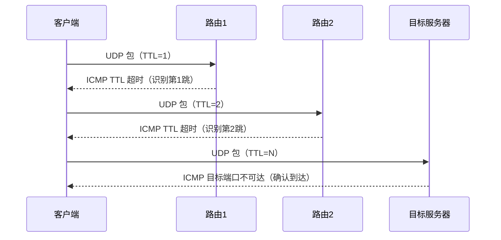
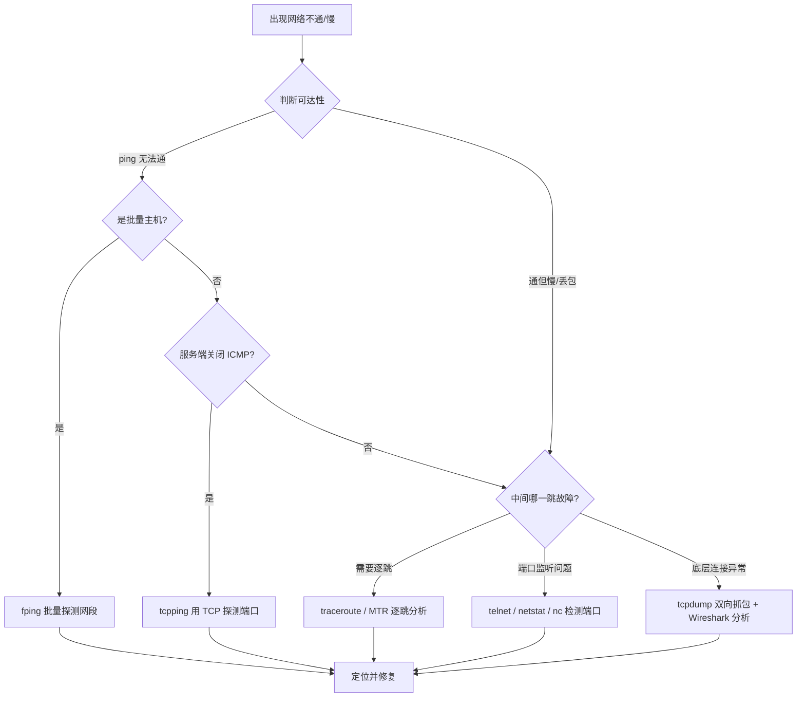

# 网络故障分析（ping、mtr、traceroute）与抓包分析（tcpdump）诊断

## 一、模块介绍

在运维工作中，"网络不通"是最常见也最易让人无从下手的定位难题。它可能出在骨干网络、内部 IDC 网络、单台主机的网络配置，甚至服务进程本身。本模块帮助运维工程师从"会不会用几个命令"提升到"能系统性定位网络问题"。

本模块先梳理常见网络故障的分类与排查思路，再重点讲解 `ping`、`fping`、`tcpping`、`traceroute`、`MTR` 等诊断命令的原理与用法，接着介绍服务端端口检测工具 NetCat（nc），最后讲解 `tcpdump` 抓包与 `Wireshark` / `Charles` 分析实战。

### 1.1 前置知识

- 理解 TCP/IP 协议栈、IP 与端口的基本概念
- 了解 ICMP（Internet Control Message Protocol，互联网控制报文协议）与 UDP（User Datagram Protocol，用户数据报协议）
- 熟悉基础的 `ping`、`netstat` / `ss` 命令

### 1.2 学习目标

- 掌握常见网络故障的分类与定位思路
- 理解 `traceroute` 逐跳路由侦测的 TTL（Time To Live，生存时间）原理
- 掌握 `ping` / `fping` / `tcpping` / `traceroute` / `MTR` 的选择与使用
- 掌握服务端端口检测（`telnet`、`netstat`、`nc`）
- 掌握 `tcpdump` 抓包与 `Wireshark` / `Charles` 分析

---

## 二、核心方法论

### 2.1 常见网络故障的分类

网络故障粗略分为两类：

- **骨干网络故障（Backbone Network Failure）**：连接多个区域（地区）的高速网络故障，通常是运营商网络，常见原因有光缆被挖断、网络设备故障等；
- **内部网络故障（Internal Network Failure）**：IDC（Internet Data Center，互联网数据中心）或局域网的故障。

导致内部网络故障的原因通常有 4 类：

| 类别 | 典型表现 |
|------|----------|
| 网络设备故障 | 模块、板卡等硬件异常 |
| 网络带宽瓶颈 | 带宽耗尽导致丢包、拥塞 |
| 内网攻击 | 黑客对内网的扫描、DDoS 等攻击 |
| 配置与管理问题 | 路由、ACL、VLAN 等配置错误 |

运维工程师虽非专职一线网络技术，但仍需懂得定位并反馈网络问题——能够判断问题所属故障范围：是主机网络配置问题、服务本身问题，还是某一跳路由故障。

### 2.2 诊断工具的选择逻辑

不同的场景要选不同的工具，核心取舍如下：

- **判断目的端是否可达** → `ping`（发送 ICMP 探测包）；
- **批量 ping 一个网段的主机** → `fping`（可批量并行探测主机段）；
- **服务端关闭 ICMP 无法 ping 通** → `tcpping`（改用 TCP 探测公共服务端口，如 80/443）；
- **追踪中间哪一跳路由故障** → `traceroute` / `MTR`（`ping` 无法解决"中间某段"问题）；
- **服务端端口是否监听** → `telnet`、`netstat -auntp`、`ss -tunlp`、`nc`；
- **底层连接是否正常** → `tcpdump` 抓包分析。

> `fping` 与 `tcpping` 都能获取点到点的延迟情况；但若要知道数据包到底卡在哪一段路由，就必须依赖 `traceroute` 和 `MTR`。

### 2.3 故障范围的定位思路

定位网络问题需要先界定故障边界：先确认是本机网卡与 IP 配置、本机到网关、网关到目的端哪一段出了问题，再决定下一步命令。整体遵循"由近及远、逐层剥离"的原则。

---

## 三、关键流程

### 3.1 traceroute 的逐跳侦测原理

`traceroute` 用来检测一个点到目的端途径的所有路由器。默认基于 UDP 协议向目的端发送数据包（默认使用 UDP 端口大于 30000 的数据包），通过逐步递增 TTL 值实现对每一跳路由的探测：

1. 客户端发送 **TTL=1** 的数据包，送到第 1 个路由器后 TTL 减 1（变为 0），路由器返回一个 **ICMP TTL 超时**（Time Exceeded）包给客户端，从而拿到第 1 跳的地址；
2. 客户端再发 **TTL=2** 的数据包，可经过两个路由，直到 TTL 等于 0 时到达第 2 个路由，路由 2 同样返回 ICMP TTL 超时包；
3. 依此类推逐级递进，直到数据包到达最终目标端；
4. 目标端不再返回 TTL 超时，而是返回 **ICMP 目标端口不可达**（Destination Port Unreachable）响应，客户端据此判断已到达最终目的地址，完成整个 traceroute 过程。

### 图：traceroute 逐跳路由侦测原理



上图为 traceroute 逐级侦测路由的过程：客户端通过逐渐增大 TTL 值，让每一跳路由器返回 ICMP TTL 超时包，从而拿到每一级路由的地址与延迟状态；当目标服务器返回 ICMP 目标端口不可达时，即认为数据包已到达最终目的服务器，完成全程路由追踪。

### 3.2 防火墙导致的不一致循环与应对

`traceroute` 默认基于 UDP，但目标地址的防火墙可能做安全限制，导致服务端始终不返回 ICMP 不可达的响应，客户端持续发送 UDP 数据包，形成不一致的循环（表现为多次 `*` 无反馈）。

**应对方案**：改用 `traceroute -I`，让客户端改用 ICMP 协议而非 UDP 发送数据包。到达目标地址后，由于使用的是 ICMP 协议，服务端会回复 **ICMP echo reply**（回显应答）包，从而避免 UDP+防火墙导致的死循环。

### 3.3 网络故障排查总体流程

### 图：网络故障排查总体流程



上图为网络故障排查的整体决策流程：先判断目的端可达性，再根据是否为批量主机、是否关闭 ICMP、是否需要逐跳定位等分支，选择 `fping`、`tcpping`、`traceroute`/`MTR`、端口检测或 `tcpdump` 抓包等不同手段，最终收敛到故障节点并修复。

---

## 四、工具与实践

### 4.1 基础连通性检测

```bash
# 判断对目的端是否可达（发送 ICMP 探测包）
ping 192.168.1.10

# 批量 ping 一个主机段（网段内所有主机可达性，适合批量巡检）
fping -g 192.168.1.0/24

# 服务端关闭 ICMP 时，改用 TCP 探测公共服务端口
tcpping 192.168.1.10 80
```

**说明**：`fping` 可对一个网段内的多台主机进行批量并发探测，弥补 `ping` 只能单台测试的不足；`tcpping` 基于 TCP 探测，一般服务端都开放了 80/443 等公共端口，可绕过 ICMP 被关闭的问题。

### 4.2 逐跳路由追踪

```bash
# 最常用：不做主机名解析，直接显示 IP 地址；默认发送 UDP 大于 30000 端口的数据包
traceroute -n 目标IP

# 服务端关闭 UDP 返回时，改用 ICMP 协议数据包避免不一致循环
traceroute -I -n 目标IP

# MTR：结合 ping 与 traceroute，循环得出每一跳的延时与丢包率
mtr -n 目标IP
```

**说明**：`traceroute -n` 是最常用方式，只展示 IP 地址而不做主机名解析，默认发 UDP 大端口数据包；在 UDP 被防火墙拦截、不断出现 `*` 时，改用 `traceroute -I -n` 发送 ICMP 数据包即可完成全程追踪。`MTR`（My Traceroute）集成了 `ping` 和 `traceroute` 两者的优点：既能得出每一跳路由器的地址，又能通过循环 `ping` 得出每一跳的延时与丢包率。

> **双向检测的重要性**：若 A 到 B 网络不可达，建议从 A 上执行一次 `traceroute`/`MTR`，再从 B 上执行一次返回 A。因为部分网络架构中 A→B 与 B→A 的路由可能不一致，双向截图能帮助网络工程师更准确地判断故障点。

### 4.3 服务端端口检测

```bash
# 客户端端口连通性检测
telnet 目标IP 80

# 服务端查看本机端口监听情况
netstat -auntp
ss -tunlp
```

**NetCat（nc，号称"瑞士军刀"）常用参数**：

- `-v`：显示指令执行过程；
- `-w <秒>`：设置等待连线的时间（超时秒数）；
- `-u`：使用 UDP 协议发送数据包；
- `-z`：0 传输输入模式，仅在扫描服务端口时使用。

### 4.4 NetCat 端口扫描与 UDP 检测

```bash
# 检查服务端 80~88 端口是否开放（相当于做一次端口扫描）
nc -v -z -w 1 目标IP 80-88

# 服务端模拟一个监听 1080 端口的 UDP 接收端
nc -ul 1080

# 客户端向服务端 1080 端口发送数据，验证 UDP 通道是否可达
echo "test data" | nc -u 服务端IP 1080
```

**说明**：`nc -z` 仅检测端口是否开放、不传数据，配合 `-w` 秒数可控制超时；UDP 协议不保证可靠性、是单向传输，因此可通过"服务端 `nc -ul` 监听 + 客户端 `echo | nc -u` 发送"组成一个完整的客户端+服务端检测链路，若服务端收到 `test data` 数据，即可判断该 UDP 通道可达。

### 4.5 tcpdump 抓包

```bash
# 抓取目标端口 6060、源网段 192.168.1.0/24 的 TCP 数据包，共 100 个，存入文件
tcpdump tcp -i eth0 -t -s 0 -c 100 dst port 6060 and src net 192.168.1.0/24 -w test.cap

# 更详细输出（-vv 比 -v 更详细），只抓取与该主机 IP 相关的收发数据包
tcpdump -vv -i eth0 host 192.168.1.104
```

**参数说明**：

- `tcp`：指定抓取 TCP 协议的数据包；
- `-i eth0`：监听的网卡；
- `-t`：不显示时间戳；
- `-s 0`：抓取完整的数据包（不加可能只抓部分字节）；
- `-c 100`：一共抓取 100 个数据包；
- `dst port 6060`：目标端口为 6060；
- `src net 192.168.1.0/24`：来源网络地址为 192.168.1.0/24 网段；
- `-w test.cap`：把抓取的数据包保存到文件（供 `Wireshark` 分析）；
- `-vv`：展示结果的详细程度（v 数越多越详细）；
- `host 192.168.1.104`：只抓取源地址或目的地址为该 IP 的数据包。

**说明**：抓包保存后的 `.cap` 文件是二进制的，无法作为文本文档直接阅读，需要通过 `Wireshark` 等专业工具打开分析。若不加 `-w`，则在终端直接输出抓包过程；为了便于详细分析，通常建议 `-w` 落盘后用分析工具查看。

### 4.6 抓包数据分析工具

| 工具 | 定位 | 适用场景 |
|------|------|----------|
| Wireshark | 通用抓包与分析，图形化界面，支持 TCP/UDP/HTTP 等多种协议 | 客户端/服务端双向抓包、TCP 建连与 HTTP 长连接全过程分析 |
| Charles | 偏重 HTTP/HTTPS 协议分析，Mac 下非常好用 | 网站类工程师分析 HTTP/HTTPS 请求与响应 |

**典型场景**：客户端和服务端都认为网络可达、端口检测也没问题，但无法判断服务上数据传送、建连情况时，可在客户端和服务端**双向抓包**，分析 TCP 建连过程以及 HTTP 长连接的数据包发包过程，从而判断长连接在该业务场景下是否能完整执行每一次请求。

---

## 五、常见坑点

1. **只认 `ping`，不知道换协议**：服务端出于安全考虑可能关闭 ICMP，导致 `ping` 无结果。此时应改用 `tcpping` 基于 TCP 探测，或调整其他判断手段，而非误判网络不可达。
2. **UDP 被防火墙拦截却一直等**：`traceroute` 默认 UDP，目的端防火墙不回应大端口 UDP 探测时会出现不断 `*` 的不一致循环。应改用 `traceroute -I` 走 ICMP 协议。
3. **只做单向 traceroute/MTR**：A→B 与 B→A 的路由可能不一致，单向结果可能误导判断。规范做法是双向各做一次。
4. **抓包文件是二进制**：`.cap`/`.pcap` 落盘后无法用文本查看，需用 `Wireshark` 打开；不加 `-w` 在终端输出则不利于分析。
5. **断言"打通了"却不看丢包率**：`MTR` 的价值在于每一跳的延时与丢包率，仅看是否到达可能漏掉中间某跳的隐性拥塞。
6. **不改 `-s 0` 导致抓包不完整**：默认可能只抓部分字节，分析长数据报文时需用 `-s 0` 抓完整包。

---

## 六、进阶扩展与参考

### 6.1 进阶方向

- **深入报文特征**：结合 `Wireshark` 查看 TCP 建连的三次握手、四次挥手，以及重传（Retransmission）、乱序（Out-of-Order）、零窗口（Zero Window）等异常特征，定位应用层与传输层瓶颈。
- **HTTP/HTTPS 精细化分析**：在网站型业务中，可用 `Charles` 分析 HTTP/HTTPS 的请求、响应头与 body，排查代理、缓存、认证等应用层问题。
- **自动化网络巡检**：将 `fping`、`mtr --report`（一次性输出报告）、`tcpping` 组合进定时脚本，形成网络质量监控与告警。
- **从抓包到根因**：抓包发现的建连失败、SYN 重传、RST 异常，往往对应防火墙策略、服务端 backlog 满、内核参数（如 `tcp_tw_reuse`）等问题，可结合《典型网络故障：选择长连接 or 短连接，大量 Timewait 的产生时如何处理？》一篇的 TCP 优化联合排障。

### 6.2 参考资料

- `man traceroute`、`man mtr`、`man nc`、`man tcpdump`
- Wireshark / Charles 官方文档与抓包分析教程