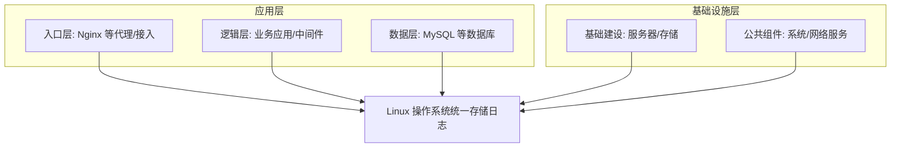
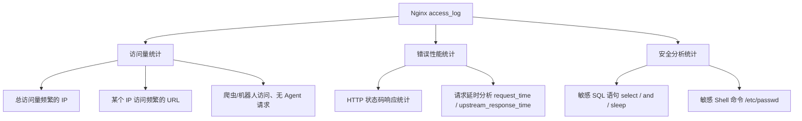

# Linux 系统快速分析日志定位故障原因的 10 个方法

## 一、模块介绍

当企业还没有可用的日志检索分析系统（如 EFK、ELK）时，当遇到紧急故障需要临时、快速定位时，离不开 Linux 组合命令对日志的快速分析。本模块基于 Nginx 与 MySQL 两类代表性日志，讲解如何在缺少集中式日志平台的场景下，通过命令组合快速定位访问量、错误、性能与安全问题。

### 1.1 适用场景

- 企业没有可用日志检索分析系统（EFK / ELK），需通过 Shell 或 Linux 组合命令做日志分析；
- 企业已有日志分析和检索系统，但仍离不开临时性日志分析，如处理紧急故障时需要组合命令细致排查。

### 1.2 前置知识

- 了解 Nginx 操作基础（配置、日志）
- 了解 MySQL 使用基础

### 1.3 学习目标

- 理解 Linux 上 Nginx / MySQL 各类日志的存储位置与类型
- 掌握 Nginx access_log 的格式定义（`log_format`）与日志字段含义
- 掌握访问量、错误性能、安全分析三大类组合命令
- 掌握 MySQL 慢日志分析工具 `mysqldumpslow` 与 `pt-query-digest`

---

## 二、核心方法论

### 2.1 日志分层与承载

Linux 系统上存储的日志类型非常多，从入口层、逻辑层、数据层到基础建设和公共组件层，几乎所有日志都可以存储在 Linux 操作系统上；即便是基建部分，也可以通过收集抓取系统硬件底层控制器信息或网络设备信息，存储在操作系统上。

### 图：Linux 日志分层架构



上图为 Linux 上日志的分层承载模型：入口层、逻辑层、数据层与基础设施层的日志统一落在 Linux 操作系统上存储，运维可通过组合命令对各层日志进行快速检索与分析。

### 2.2 Nginx 的两类日志

Nginx 日志主要分为两类，各有分工：

- **访问日志（access_log）**：记录用户相关的访问信息，用于分析访问量、来源、状态码、响应时间与安全威胁等；
- **错误日志（error_log）**：记录 Nginx 进程启动、停止、重启及处理请求过程中发生的所有错误信息，用于分析 Nginx 配置或服务本身的问题。

#### access_log 配置语法

```bash
Syntax:
access_log path [format [buffer=size] [gzip[=level]] [flush=time] [if=condition]];
access_log off;

Default: access_log logs/access.log combined;
Context: http, server, location, if in location, limit_except
```

参数说明：

- `path`：指定日志存放路径；
- `format`：定义日志格式，默认使用预定义的 `combined` 格式名称；如需自定义内容与格式，需通过 `log_format` 预定义格式名称并在 `access_log` 中引用；
- `buffer`：指定日志写入时的缓冲区大小，默认 64k；
- `gzip`：设置日志写入前先压缩，压缩比越高消耗越大，压缩比越小占用空间越多；
- `flush`：设置日志缓存的有效时间；
- `if`：条件判断，即满足什么条件才记录访问日志（例如只记录返回状态码等于 200 的日志）。
- `access_log off` 表示关闭请求日志。

> `Context` 表示该配置允许在 Nginx 配置的 `http`、`server`、`location`、`if in location`、`limit_except` 等层级中进行配置。

#### error_log 配置语法

```bash
Syntax: error_log file [level];
Default: error_log logs/error.log error;
```

`error_log` 后加具体文件路径与日志级别即可配置输出。默认记录到 `logs/error.log`，级别为 `error`，满足该级别（及以上）的错误都会输出到该文件。

### 2.3 access_log 的日志内容结构

通过 `log_format` 可以预先定义日志格式，其配置选项有：

- `name`：格式名称，供 `access_log` 引用；
- `escape`：字符编码方式，可为 JSON，默认使用 `default` 编码方式；
- `string`：定义日志格式与内容，通过 Nginx 内置变量来表达。

```bash
log_format  main  '$remote_addr - $remote_user [$time_local] "$request" '
                  '$status $body_bytes_sent "$http_referer" '
                  '"$http_user_agent" "$http_x_forwarded_for"';
```

字段含义：

- `$remote_addr`：直接请求客户端的 IP 地址；
- `$remote_user`：请求客户端的用户（通常为空，显示为 `-`）；
- `$time_local`：用户请求到 Nginx 的时间；
- `$request`：用户请求的内容（方法、路径、协议）；
- `$status`：Nginx 返回给客户端的 HTTP 状态码（200/300/400/500 等）；
- `$body_bytes_sent`：服务端向客户端发送的 body 字节大小；
- `$http_referer`：客户端请求地址的上一跳地址；
- `$http_user_agent`：用户请求使用的客户端（浏览器 User-Agent）；
- `$http_x_forwarded_for`：用户 IP 与 Proxy 的 IP 头信息。

所有格式内容默认以空格分隔，除非自定义分隔符（如 `/`、`[]`）。最终打印内容形如：

```bash
192.0.2.8 - - [01/Apr/2020:10:40:03 +0800] "GET /jeson/ HTTP/1.1" 200 17460 "-" "Chrome/57" "-"
```

其中第一个 `-` 是格式里的固定分隔符，第二个 `-` 对应为空的 `$remote_user`；`http_referer` 为空说明用户直接请求 `/jeson` 未携带 referer 信息；`Chrome/57` 表示客户端为 Chrome 浏览器。

---

## 三、关键流程

### 3.1 Nginx 日志分析的三大类场景

Nginx access_log 的分析通常覆盖三大类场景：**访问量统计**、**错误性能统计**、**安全分析统计**。

### 图：Nginx 日志分析场景总览



上图为 Nginx access_log 的三大分析场景：一是访问量统计（IP 排行、单 IP URL 排行、爬虫与无 Agent 请求）；二是错误性能统计（状态码分布、请求延时）；三是安全分析统计（SQL 注入与危险 Shell 命令的敏感词检测）。

---

## 四、工具与实践

### 4.1 访问量统计

#### （1）统计总访问量最频繁的 IP

```bash
cat access.log | awk '{print $1}' | sort | uniq -c | sort -n -k 1 -r | more
```

**说明**：`cat` 读取 access.log，`awk '{print $1}'` 只打印第一列（IP），`sort` 对 IP 进行排序，`uniq -c` 按相同 IP 统计出现次数，最后 `sort -n -k 1 -r` 按次数由大到小排序。结果形如：

```bash
342 203.0.113.10
138 203.0.113.25
 69 198.51.100.31
 46 198.51.100.7
```

最上面为请求最多的 IP，第一列为请求个数，可据此了解哪些 IP 对服务端造成较大请求压力。

#### （2）查看某个 IP 访问最频繁的 URL

```bash
cat access.log | grep '203.0.113.10' | awk '{print $7}' | sort | uniq -c | sort -n -k 1 -r | more
```

**说明**：先用 `grep` 按某个 IP 筛选日志，再把第 7 列（`$request` 请求路径）打印出来并做同样的排序统计，即可看出该 IP 主要请求的地址与次数。

```bash
114 /videotech/getip/
114 /videotech/getpages
114 /jeson
```

#### （3）查看爬虫、机器人访问

```bash
cat access.log | grep -ivE "MSIE|Firefox|Chrome|Opera|Safari|Gecko|Mozilla|wordpress"
```

**说明**：`grep -iv` 中 `-i` 表示不区分大小写，`-v` 表示反向排查——把正常浏览器 Agent 的访问全部排除，只看非正常 Agent 转发的请求，从而判断是否有机器人或爬虫请求及占比。

#### （4）过滤没有 Agent 的请求

```bash
cat access.log | awk '{if($11 ~ "-"){print $0}}'
```

**说明**：`awk` 判断 Agent 对应列内容是否为横杠 `-`（代表 access log 未取到内容），若是则 `print $0` 把没有 Agent 的每一条请求打印出来。

### 4.2 错误性能统计

#### （1）HTTP 状态码响应统计

```bash
cat access.log | awk '{print $9}' | sort | uniq -c | more
```

**说明**：`$9` 对应 log_format 中的状态码，基于状态码排序统计可了解各状态码分布。200 为正常，300 为重定向类，400/500 说明客户端/服务端请求存在问题。

```bash
922 200
235 301
  1 404
 10 500
```

#### （2）请求延时分析

access_log 中两个关键变量：

- `$request_time`：从接受用户请求的第一个字节到发送完响应数据的时间，包含接收请求数据、程序响应、输出响应数据的时间；
- `$upstream_response_time`：Nginx 发出请求到拿到后端 real server 再返回数据的时间，主要用于反向代理模式。

```bash
log_format  main  '$remote_addr - $remote_user [$time_local] "$request" '
                  '$status $body_bytes_sent "$http_referer" '
                  '"$http_user_agent" "$http_x_forwarded_for" $upstream_response_time';
```

在 `main` 格式最后加入 `$upstream_response_time` 后 `reload` Nginx，即可在新日志中记录该时间。检测后端响应慢的请求：

```bash
tail -f access.log | awk '{if($(NF) > 6){print $0}}'
```

**说明**：`tail -f` 保持对文件的实时监听，`awk` 判断最后一行 `upstream_response_time` 数值大于 6 秒时打印（即打印后端响应整体大于 6 秒的请求），帮助运维和开发分析单个请求的具体延迟问题。

### 4.3 安全分析统计

#### （1）分析请求中存在的敏感 SQL 语句

SQL 注入是常见攻击手段，需关注客户端请求中是否携带敏感词（如 `select`、`and`、`sleep`）：

```bash
cat access.log | awk '/select/{print $1}' | sort -n | uniq -c | sort -nr
cat access.log | awk '/\/and\//||/\+and\+/||/%20and%20and/{print $1}' | sort -n | uniq -c | sort -nr
cat access.log | awk '/sleep/{print $1}' | sort -n | uniq -c | sort -nr
```

**说明**：前两条分别筛选敏感词 `select` 与 `and`（及其 URL 编码变体），第三条筛选 `sleep`——黑客常在注入成功后使用 `sleep` 使 MySQL 响应延迟变长，通过在 access.log 中筛选关键词即可发现此类攻击行为。

#### （2）分析请求中存在的敏感 Shell 命令

```bash
cat access.log | awk '/\/etc\/passwd/{print $1}' | sort -n | uniq -c | sort -nr
```

**说明**：若请求中携带 `etc/passwd` 关键词，说明该请求十分不正常（企图读取系统账户文件），这类请求需要重点关注并分析。

### 4.4 MySQL 日志分析

#### MySQL 日志类型

| 日志类型 | 作用 | 是否默认开启 |
|----------|------|--------------|
| error_log | 错误日志，MySQL 管理时必须关注 | 是 |
| slow_log | 慢日志，记录查询较慢的 SQL，性能优化时关注 | 手动开启 |
| binlog | 二进制日志，支持主从数据复制、数据误删找回 | 手动开启 |
| 查询日志（general） | 记录每一条 SQL 查询/更新 | 建议关闭（消耗性能） |

#### MySQL 日志分析工具

| 工具 | 来源 | 特点 |
|------|------|------|
| `mysqldumpslow` | MySQL 自带 | 官方自带，分析慢查询文件 |
| `pt-query-digest` | percona-toolkit | 第三方更强大，可分析 MySQL 所有日志（不止 slow log） |

#### 慢日志分析命令

```bash
# mysqldumpslow：按记录数倒序返回前 10 条慢语句
mysqldumpslow -s r -t 10 /slowquery.log

# 筛选包含 left join 关键词并返回前 10 条
mysqldumpslow -s t -t 10 -g "left join" /slowquery.log

# pt-query-digest：直接分析慢查询文件并重定向结果
pt-query-digest [参数] /var/lib/mysql/log/slow.log > slow.report

# pt-query-digest：分析最近 12 小时内的查询
pt-query-digest --since=12h /var/lib/mysql/log/slow.log > slow_report2.log
```

**说明**：

- `mysqldumpslow` 常用 `-s`（排序方式，`c/t/l/r` 分别按出现次数、查询时间、锁时间、返回记录数排序，加前缀 `a` 表示按对应平均值排序，如 `at`）、`-t`（返回前多少条）、`-g`（按关键词模式筛选）；
- `pt-query-digest` 支持 `--since` 等选项，可分析最近一段时间内的慢日志，并将结果重定向保存到报告文件。

---

## 五、常见坑点

1. **直接 `uniq` 不做 `sort`**：`uniq -c` 只能统计相邻重复行，未先 `sort` 会导致同一 IP/状态码被拆成多段统计，结果不准确。
2. **列号取错**：不同 `log_format` 下 `$1`、`$7`、`$9` 对应字段不同，需先确认日志格式再取列，否则会统计到无关字段。
3. **忘记 `reload` 使新格式生效**：在 `log_format` 中加入 `$upstream_response_time` 后需 `reload` Nginx，否则新日志中不会记录该字段。
4. **误开 MySQL 查询日志**：查询日志（general log）会记录每条 SQL，严重消耗性能，通常应保持关闭。
5. **敏感词筛选只做一种变体**：SQL 敏感词有多种编码变体（如 `+and+`、`%20and%20`、URL 编码），漏做变体会遗漏攻击检测。
6. **不区分状态码盲目"看通"**：大量 500/4xx 状态码说明服务交互异常，仅看 200 会漏掉潜在错误。

---

## 六、进阶扩展与参考

### 6.1 进阶方向

- **从组合命令到集中式日志**：本模块命令适用于临时/紧急分析；当规模与复杂度上升，可平滑迁移到 EFK（Elasticsearch + Filebeat + Kibana）或 ELK 为主的收集检索体系。
- **正则的精细运用**：结合 `grep -E` / `egrep`、`awk` 的多条件与 `$NF` 取最后一列，可构造更复杂的访问/性能/安全统计规则。
- **脚本化沉淀分析资产**：将常用组合命令封装为 Shell 脚本，统一 `Top 20` IP、注入、Web Shell 等分析，形成可复用的日志分析工具集。
- **对接 MySQL 慢日志平台**：用 `pt-query-digest` 生成报告后可进一步调度定时任务，对慢 SQL 进行趋势监控与优化。

### 6.2 参考资料

- Nginx 官方文档：`ngx_http_log_module`（access_log / log_format / error_log）
- MySQL 官方文档：慢日志（slow query log）、二进制日志（binlog）
- Percona Toolkit 文档：`pt-query-digest`