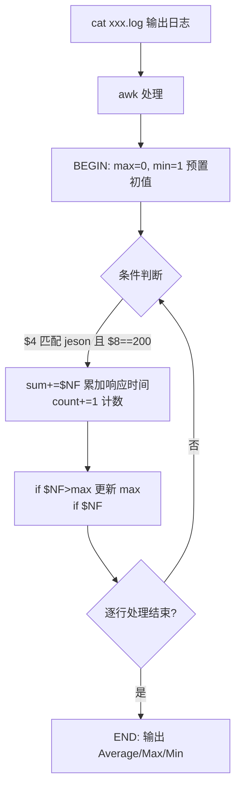

# Shell 脚本如何作日志分析

## 一、模块介绍

当一个场景偏大型或复杂、又缺乏系统的日志收集检索系统时，仅靠单条命令组合已难以应对，需要借助脚本（Shell、Python、PHP 等）来做日志分析。本模块讲解如何通过 Shell 高效地进行日志分析，核心围绕 `grep`、`awk`、`ag` 三个文本处理命令，并以一个完整的 Nginx 分析脚本演示落地。

### 1.1 适用场景

- 需要对大型、复杂日志进行多次/多维度分析；
- 企业缺少系统的日志收集检索系统，需借助 Shell 脚本承载分析逻辑。

### 1.2 前置知识

- 了解 Linux 基本命令与管道（`|`）、重定向
- 了解 Nginx access_log 的格式与字段（可参考《Linux 系统快速分析日志定位故障原因的 10 个方法》一篇）

### 1.3 学习目标

- 掌握 `grep` 的常见选项与正则匹配
- 掌握 `awk` 的三种使用方式与 `BEGIN{}` / `{}` / `END{}` 结构
- 了解 `ag` 命令的高效查找能力
- 理解一个完整 Nginx 日志分析 Shell 脚本的编写思路

---

## 二、核心方法论

### 2.1 grep、awk、ag 的分工

| 命令 | 定位 | 特点 |
|------|------|------|
| `grep` | 对文件/文本进行筛选查找 | 简单高效，支持 `-E`/`egrep` 做正则 |
| `awk` | 强大的文件分析工具与编程语言 | 逐行扫描、按列处理、支持动作指令 |
| `ag` | 高性能文件查找工具 | 比 `grep`/`awk` 更高效，默认支持正则 |

在日志分析中三者常配合管道使用：先用 `grep` / `ag` 做粗筛，再用 `awk` 按列做精细统计与计算。

### 2.2 grep 命令详解

基本用法：

```bash
grep [选项] PATTERN filename
```

其中 `PATTERN` 可以是模式匹配的关键文字或正则表达式，`filename` 是目标文件。`grep` 也支持管道用法：`command1 | grep [选项] PATTERN`。

常用选项：

- `-i`：忽略大小写；
- `-l`（小写 L）：结果中只显示含有匹配内容的文件名称或路径；
- `-R`：递归查询，逐级查找目录下哪些文件含有指定内容；
- `-o`：结果中打印匹配出的内容；
- `-B <n>`：显示匹配关键字之前 n 行；
- `-A <n>`：显示匹配关键字之后 n 行（`-B2 -A2` 则打印匹配行前 2 行与后 2 行）。

正则匹配使用 `grep -E` 或 `egrep`：

```bash
egrep '[^0][0-9]{0,2}\.[0-9]{1,3}\.[0-9]{1,3}\.[0-9]{1,3}' ./test -c
```

**说明**：`[^0]` 匹配第一个数值是非零开头的任意数字，`[0-9]{0,2}` 表示第二个数字开始可出现 0~2 个 0~9 的数字，通过小数点分割后逐段匹配，整体用于查找 test 文件里是否匹配 IP 地址，并打印匹配 IP 地址的行信息。

### 2.3 awk 命令详解

`awk` 是非常强大的文件分析工具和编程语言，可逐行扫描文件、从第一行到最后一行寻找匹配特定模式的行，并在这些行上执行操作。

三种使用方式：

| 方式 | 语法 | 示例 |
|------|------|------|
| 仅匹配 | `awk 'pattern' filename` | `awk -F: '/root/' /etc/passwd` |
| 仅动作 | `awk '{action}' filename` | `awk -F: '{print $1}' /etc/passwd` |
| 匹配+动作 | `awk 'pattern {action}' filename` | `awk -F: '/root/{print $1,$3}' /etc/passwd` |

其中 `-F:` 以冒号按列分割；`/root/` 表示匹配包含 root 关键字的行；`{print $1}` 打印第 1 列；`$0` 表示整行。

**awk 的 action 结构**：

```bash
格式: BEGIN{} {} END{}
```

- `BEGIN{}`：在 awk 处理行之前执行的动作（可省略）；
- `{}`：在 awk 执行过程中执行的动作；
- `END{}`：处理完所有内容后执行的动作（可省略）。

示例——统计用户名长度为 5 的个数：

```bash
awk -F: 'length($1)==5{count++;print $1}END{print "count is: "count}' /etc/passwd
```

**说明**：对 `/etc/passwd` 每一行第 1 列（用户名）判断长度是否等于 5，满足条件则 `count++` 计数并打印该用户名，处理完后再用 `END{}` 打印 `count` 总数。

---

## 三、关键流程

### 3.1 awk 求接口响应时间的流程

对 Nginx 的 access 日志做性能分析时，常需了解某接口的最大、最小、平均响应时间（利用 `$upstream_response_time` 字段）。

### 图：awk 计算接口响应时间流程



上图为 **awk 统计接口响应时间** 的执行流程：先在 `BEGIN{}` 预置 max/min 初值，再在逐行处理中通过条件判断累加响应时间、计数并更新极值，最后在 `END{}` 输出平均、最大、最小响应时间。

示例日志格式 `xxx.log`：

```bash
log_format  main  '$remote_addr - $remote_user [$time_local] "$request" '
                      '$status $body_bytes_sent "$http_referer" '
                      '"$http_user_agent" "$http_x_forwarded_for" $upstream_response_time';
```

---

## 四、工具与实践

### 4.1 awk 统计接口响应时间的完整命令

```bash
cat xxx.log | awk 'BEGIN{max=0;min=1}
{if ($4 ~ /jeson/ && $8==200){
    sum+=$NF; count+=1;
    if($NF > max) max=$NF;
    if($NF < min) min=$NF;
}}
END {print "Average = ", sum/count; print "Max = ", max; print "Min", min}'
```

**说明**：

- `BEGIN{max=0;min=1}`：执行 awk 前预置变量，max 取 0、min 取 1；
- 处理中判断 `$4`（请求路径等第 4 列）是否匹配关键字 `jeson`，且 `$8==200`（返回状态码为 200）；
- 两者都成立时，用 `$NF`（日志最后一列，即 `upstream_response_time`）累加到 `sum`，`count` 自增计数；并分别与 `max`、`min` 比较替换，得到整体最大/最小响应时间；
- `END` 中 `sum/count` 得到平均响应时间，再分别打印 `max`、`min`。

### 4.2 ag 命令

`ag` 相比 `grep`/`awk` 性能更高，且默认支持正则（无需 `egrep` 之类的额外选项）。其选项与 `grep` 基本一致：

- `-A`：查找指定行后的多少行；
- `-B`：查找指定行前的多少行；
- `-context`：匹配特定行的前后多少行。

Shell 脚本中大部分对文件关键字的查找可以基于 `ag` 命令实现。

### 4.3 完整 Nginx 日志分析脚本（11-Nginx基础概述_check.sh）

下面是一个典型 `11-Nginx基础概述_check.sh` 的整体结构。脚本开头先清理输出目录，再校验日志路径与系统版本，随后逐项执行日志分析并将结果通过 `tee` 输出到 `/tmp/logs` 目录。

```bash
#!/bin/bash
# 1. 清理历史输出目录，供汇总各项分析结果
if [ -d /tmp/logs ]; then
  rm -rf /tmp/logs
fi
mkdir -p /tmp/logs

# 2. 配置 Nginx access 日志路径，路径不存在则退出
LOG=/var/log/11-Nginx基础概述/access.log
if [ ! -f "$LOG" ]; then
  echo "日志文件不存在: $LOG"
  exit 1
fi

# 3. 系统版本检测（Deiban / Ubuntu / CentOS 等）
if ! grep -qiE 'debian|ubuntu|centos' /etc/os-release; then
  echo "不支持的操作系统"
  exit 1
fi

# 4. 统计访问 Top20 的 IP 地址
ag -o '[0-9]+\.[0-9]+\.[0-9]+\.[0-9]+' "$LOG" \
  | sort | uniq -c | sort -nr | head -20 | tee /tmp/logs/top20.log
```

**说明**：

- 第 1 步：先判断 `/tmp/logs` 是否存在，存在则清空，避免历史结果残留；
- 第 2 步：设置 Nginx access 日志路径并做存在性判断，不存在则退出（脚本中断）；
- 第 3 步：做系统版本检测，仅支持 Debian/Ubuntu/CentOS 等常见发行版；
- 第 4 步：用 `ag` 做正则匹配提取所有客户端 IP，经 `sort` 排序、`uniq` 统计、`sort -nr` 由大到小，`head -20` 过滤出前 20 行，并用 `tee` 同时输出到终端与 `/tmp/logs/top20.log` 文件。

该脚本的每一项功能分析原理相似：通过 `ag` 对文件做关键字查找、分析与统计，结果以对应文件名归纳到日志目录，方便逐项查看。此类脚本通常可实现以下能力：

- 统计 Top 20 地址
- SQL 注入分析
- SQL 注入 FROM 查询统计
- 扫描器 / 常用黑客工具检测
- 漏洞利用检测
- 敏感路径访问
- 文件包含攻击
- Web Shell 检测
- 寻找响应长度大的 URL Top 20
- 寻找罕见的脚本文件访问
- 寻找 302 跳转的脚本文件

执行 `bash 11-Nginx基础概述_check.sh`，在终端关注执行过程与进度，再在结果目录中详细分析 `ag` 得到的日志结果。

---

## 五、常见坑点

1. **管道中漏写分隔符 `-F`**：`awk` 未指定 `-F:` 时按空白分隔，处理 `passwd` 等冒号文件会取错列。
2. **`BEGIN{}`/`END{}` 误用**：`BEGIN` 在读取第一行前执行、`END` 在全部处理完成后执行，初始化或输出放错位置会导致统计错误。
3. **正则转义遗漏**：`grep`/`awk` 匹配 `/`、`+` 等特殊字符时需正确转义（如 `/etc/passwd` 需写成 `\/etc\/passwd`），否则匹配失败。
4. **`ag` 与 `grep` 选项差异**：二者大多一致，但个别参数与语义不同，迁移脚本时需确认。
5. **脚本硬编码日志路径**：日志路径写死而忽略存在性判断，会因路径错误导致脚本静默失败；应如示例般做存在性校验。

---

## 六、进阶扩展与参考

### 6.1 进阶方向

- **多命令组合与函数化**：将 `grep`/`awk`/`ag` 常用逻辑封装成函数或独立脚本，形成可复用的日志分析工具集。
- **结合组合命令沉淀**：将访问量、状态码、延时、安全敏感词等分析结构化进同一脚本，一次运行输出多维报告。
- **引入其他语言**：当规则复杂时可引入 Python/PHP 等做结构化日志解析（如 JSON 日志）、正则分组与统计可视化。
- **向集中式日志演进**：脚本分析适合临时/中小规模，大规模场景建议平滑过渡到 EFK/ELK 体系。

### 6.2 参考资料

- `man grep`、`man awk`、`man ag`
- 《sed & awk》等文本处理经典书籍
- 参考《Linux 系统快速分析日志定位故障原因的 10 个方法》一篇