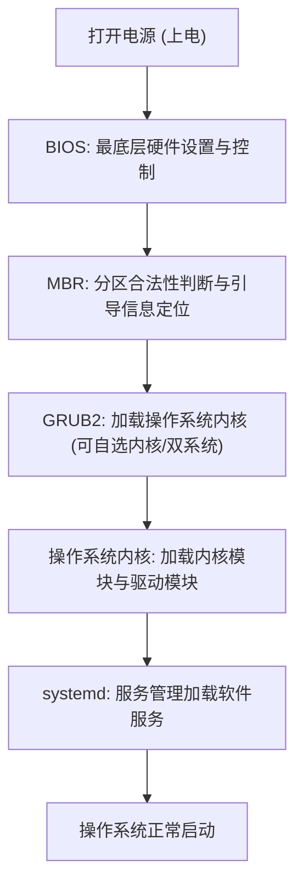
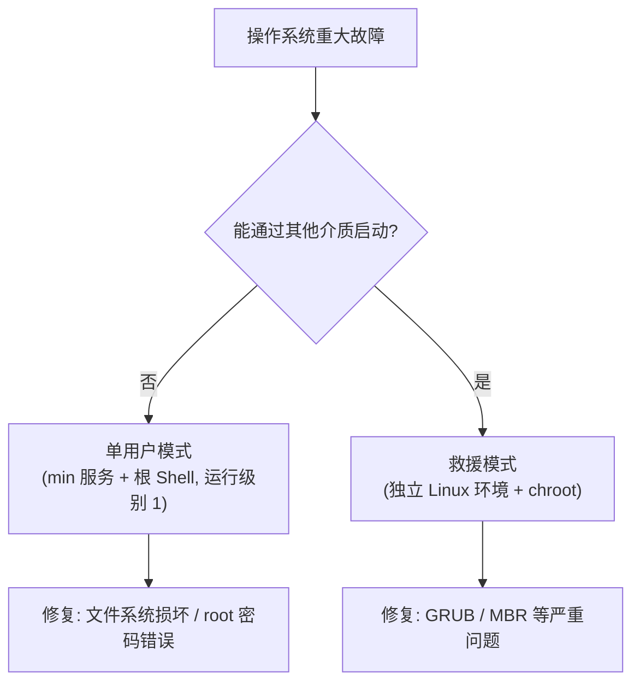

# 操作系统紧急故障修复常见有效方案

## 一、模块介绍

操作系统遇到灾难性故障时，往往导致系统无法正常运行、无法启动，或运维人员无法进行管理。要学习解决操作系统的故障，必须先了解操作系统依赖的核心模块（BIOS、MBR、GRUB2、内核、systemd）及其启动顺序。

本模块先讲解操作系统启动所依赖的核心模块，再分析常见故障的成因（fstab 错误、GRUB/MBR 损坏、文件系统损坏、root 密码错误），最后重点讲解单用户模式与救援模式两种特殊修复模式，并给出 CentOS 6/7 的进入步骤与 GRUB 损坏的救援演示。

### 1.1 前置知识

- 了解计算机 BIOS 与磁盘引导的基本概念
- 熟悉 Linux 基本命令（`ls`、`mkdir`、`rm -rf`、`chroot` 等）

### 1.2 学习目标

- 理解操作系统启动所依赖的核心模块与启动顺序
- 掌握常见启动故障的成因（fstab / GRUB / 文件系统 / root 密码）
- 掌握单用户模式与救援模式的适用场景与进入方式
- 掌握 CentOS 7 救援模式下修复 GRUB 的完整流程

---

## 二、核心方法论

### 2.1 操作系统依赖的核心模块与启动顺序

### 图：操作系统启动顺序



上图为操作系统的启动顺序：打开电源后首先进入 BIOS（Basic Input/Output System，基本输入输出系统），BIOS 提供最底层的硬件设置与控制并加载 MBR；MBR（Master Boot Record，主引导记录）负责对磁盘分区做合法性判断及引导信息定位，随后交给 GRUB2；GRUB2（Grand Unified Bootloader version 2，统一引导加载器 2）用于加载操作系统内核（双系统场景需在 GRUB2 中选择内核）；内核启动时加载内核模块与驱动模块，最后交给系统服务管理 `systemd`（System and Service Manager，系统与服务管理器）做服务加载，完成系统的启动过程。

任一模块出现问题，都可能导致操作系统无法正常运行、运维人员无法管理。

### 2.2 常见故障成因

| 故障 | 主要成因 |
|------|----------|
| fstab 错误 | 运行中移除硬盘/存储未更新 fstab；或配置 fstab 时出错且重启前未更正 |
| GRUB / MBR 损坏 | 安装第二系统清掉了前面的 MBR；误删 GRUB 相关文件导致无法读取配置 |
| 文件系统损坏 | 意外断电、磁盘等硬件故障，需软件或硬件层修复 |
| root 用户密码错误 | 忘记密码、修改 sshd 配置、password 文件出错，导致无法通过 SSH 远程管理 |

> fstab（File System Table，文件系统表）位于 `/etc` 目录下（`/etc/fstab`），存放操作系统的文件系统挂载信息；开机自动挂载磁盘设备和分区即通过 fstab 加载。

---

## 三、关键流程

### 3.1 两种特殊修复模式

针对重大故障，常用两种特殊模式修复：

- **单用户模式（Single User Mode）**：操作系统安装完成后默认存在，只启动最小的必要操作系统服务，主要用于系统修复。运行级别为 1，进入后引导一个根 Shell，并默认禁用网络。进入前需重启服务器，前提条件是运维人员能触碰到机器（或通过服务器管理卡操作进入）。可修复文件系统损坏、root 密码错误等故障。
- **救援模式（Rescue Mode）**：要求更苛刻、修复优先级更高，需通过其他介质（U 盘、光盘等）启动。救援模式本质是一个独立的 Linux 系统环境——即使原系统损坏也不影响登录到新的 Linux 环境，可修复原来操作系统的 GRUB/MBR 等严重问题。

> 注意：不同的操作系统进入单用户模式会有操作上的差异。

### 图：单用户模式与救援模式的选择



上图为两种特殊修复模式的选型：当无法通过其他介质启动时用单用户模式修复文件系统损坏、root 密码错误等较轻度故障；当可通过 U 盘/光盘等介质启动时，进入救援模式这一独立 Linux 环境，配合 `chroot`（Change Root，切换根目录）修复 GRUB/MBR 等严重问题。

### 3.2 CentOS 6 进入单用户模式

1. 启动界面任意按一个字符，进入选择启动项菜单；
2. 在启动菜单（GRUB）读秒界面按 `e` 键进入编辑模式；
3. 用上下键移动到 "kernel" 行，按 `e` 进入行编辑模式；
4. 在行编辑界面，在行末尾键入 `s`、`S`、`1` 或 `single`；
5. 保存并重启，让系统以单用户模式加载启动。

### 3.3 CentOS 7 进入单用户模式（流程更复杂）

1. 启动界面任意按一个字符，进入选择启动项菜单；
2. 在启动菜单（GRUB）读秒界面按 `e` 键进入编辑模式；
3. 用上下键移动到 "kernel" 行，按 `e` 进入行编辑模式，**找到 "linux16" 开头的行**；
4. 在行编辑界面，找到 `linux16` 开头的行，在行末尾**删除 `rhgb` 和 `quiet`**，然后二选一：添加 `1`（或 `s`、`S`、`single`）进入单用户模式；或添加 `init=/sysroot/bin/sh` 以最小 Shell 启动（该方式进入后需执行 `chroot /sysroot` 才能操作原系统文件）；
5. 保存编辑内容并重启，即可进入单用户模式。

### 3.4 CentOS 7 进入救援模式

1. 设置 BIOS 的引导设备，优先通过 ISO 启动；
2. 进入系统安装盘界面，先选 **Troubleshooting**，再选 **Rescue a CentOS system**；
3. 进入后等待进入提示模式，输入 `1` 回车；
4. 输入 `chroot /mnt/sysimage` 切换到原 Linux 系统主目录下，即可开始对原系统进行修复。

---

## 四、工具与实践

### 4.1 使用救援模式修复损坏的 GRUB（CentOS 7 演示）

下面以 CentOS 7 为例，演示通过救援模式修复被删除的 GRUB。环境：虚拟机挂载两块硬盘（硬盘 1 为系统盘、硬盘 2 为数据盘），光盘挂载与已安装 OS 同版本的 ISO 镜像作为救援介质。

**第一步：模拟损坏 GRUB**

```bash
# 进入 /boot 目录，查看 GRUB 文件目录
cd /boot && ls

# 删除 GRUB 整个文件目录（模拟误删导致的引导文件缺失）
rm -rf grub*

# 再次 ls 确认 GRUB 目录已不存在
ls
```

**第二步：通过光盘进入救援模式并修复**

```bash
# 设置 BIOS 引导介质为光盘，重启后进入救援模式；出现提示时输入 1 回车进入救援 Shell

# 切换到原系统根目录结构下
chroot /mnt/sysimage/

# 新建 GRUB2 目录（因之前已删除整个目录）
mkdir -p /boot/grub2

# 按路径要求生成 GRUB 配置文件
grub2-mkconfig -o /boot/grub2/grub.cfg

# 安装引导信息到需要修复系统所在的磁盘设备（系统盘）
grub2-install /dev/sda

# 确认对应目录下已生成文件
ls /boot/grub2/
```

**第三步：重启并处理 SELinux 阻塞启动问题**

```bash
# 重新启动系统（将 BIOS 启动介质改回磁盘 1），进入 GRUB 菜单后会先停留在一个 selinux 报错上
# 此时再重启虚拟机，进入 GRUB 菜单按 e 编辑
# 找到 "Linux 16" 这一行，在 "centos/swap" 后面输入如下参数临时禁用 SELinux
#  selinux=0
# 然后按 control + X 继续启动，即可正常进入登录界面
```

**说明**：

- 删除 `/boot` 下的 `grub*` 后重启会提示"文件没有找到"，必须通过救援介质进入修复；
- 进入救援模式后先用 `chroot /mnt/sysimage` 切到原系统磁盘目录（`ls /` 能看到原系统盘的内容结构）；
- CentOS 7 用 `grub2-mkconfig` 生成配置文件、`grub2-install /dev/sda` 将引导安装回系统盘；
- 修复后若启动卡在 SELinux 报错，需在 `Linux 16` 行加载参数 `selinux=0` 临时禁用（永久关闭方式可参考 01-基础与系统 分类的《Shell 如何来实现系统初始化》一篇），再 `Ctrl + X` 继续启动即可进入登录界面。

---

## 五、常见坑点

1. **误删 `grub*` 后保留文件未清干净**：直接重启会因引导文件缺失卡住，必须通过救援介质进救援模式修复，而非仅重启。
2. **救援模式下忘记 `chroot`**：不切换根目录会操作在救援环境而非原系统，导致对原系统的修复无效。必须先 `chroot /mnt/sysimage`。
3. **修复命令路径/磁盘指定错误**：`grub2-install` 必须指定实际系统盘设备（如 `/dev/sda`），指定错误（数据盘）会装错引导。
4. **忽略 SELinux 阻塞**：GRUB 修复后仍可能因 SELinux 报错停住，需在启动行加 `selinux=0` 临时禁用或按永久方式关闭。
5. **不同版本进入单用户模式操作不同**：CentOS 6（kernel 行）与 CentOS 7（linux16 行 + `init=/sysroot/bin/sh`）差异明显，照搬会导致无法进入。

---

## 六、进阶扩展与参考

### 6.1 进阶方向

- **GRUB 加密与恢复**：了解 GRUB 的密码保护机制，以及密码忘记时通过救援/单用户模式重置的方法。
- **文件系统校验与重建**：在单用户/救援模式下可执行 `fsck`（File System Consistency Check，文件系统一致性检查）修复因断电损坏的文件系统。
- **应急加固与预防**：对 `fstab` 增加正确性校验、对 `/boot` 与引导文件做备份、对 root 采用 SSH 密钥等，从源头降低重大故障概率。
- **多发行版横向对照**：比较 RHEL/CentOS、Ubuntu、Debian 在单用户/救援模式上的差异，形成跨平台的应急修复手册。

### 6.2 参考资料

- CentOS / RHEL 官方文档：救援模式、单用户模式
- `man grub2-mkconfig`、`man grub2-install`、`man chroot`、`man fstab`
- 参考《磁盘数据恢复：rm -rf 误删数据，如何进行数据恢复》与《Shell 如何来实现系统初始化》（含 SELinux 关闭）等关联内容