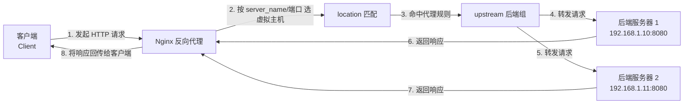
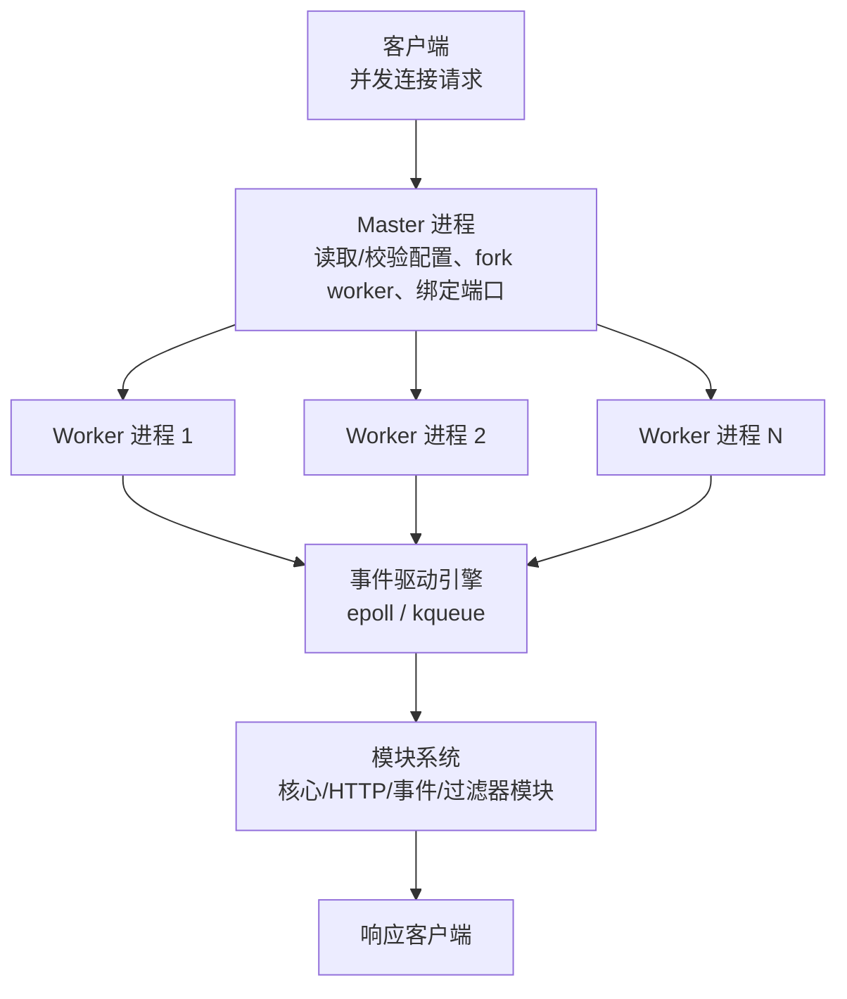

# Nginx

## 一、模块介绍

Nginx（Engine x）是一款高性能、轻量级的 Web 服务器（Web Server）软件，同时也可作为反向代理（Reverse Proxy）服务器、负载均衡器（Load Balancer）、HTTP 缓存以及邮件代理服务器（IMAP/POP3/SMTP）。Nginx 的第一个公开版本 0.1.0 于 2004 年发布，以**事件驱动的异步非阻塞架构**著称，在高并发场景下表现优秀。

由于 Nginx 使用基于事件驱动的架构，能够并发处理百万级别的 TCP 连接；加之高度模块化的设计与自由的许可证，使得扩展 Nginx 功能的第三方模块层出不穷，并带来极佳的稳定性。因此其作为 Web 服务器被广泛应用到大流量网站上，包括腾讯、新浪、网易、淘宝等。

> **与其他 Web 服务器的定位差异**：Apache、Lighttpd、Tomcat、Jetty、IIS 都属于 Web 服务器（WWW 服务器），但各自定位不同。Tomcat/Jetty 面向 Java 是重量级服务器；IIS 只能在 Windows 运行；Apache 稳定跨平台但是重量级、不支持高并发——在 Apache 上若有数以万计的并发请求，会消耗大量内存，内核在大量进程间切换消耗大量 CPU，并拖慢平均响应速度；Lighttpd 与 Nginx 都是轻量高性能服务器，欧洲开发者更偏爱 Lighttpd，国内公司更青睐 Nginx。

### Nginx 的 I/O 多路复用

在传统的多线程并发（multithreading concurrency）中，每个 I/O 流进入目标主机时系统都会分配一个线程管理，服务器与用户始终保持同步连接。若服务器响应时间长，将非常浪费资源。

> 当用户发起请求，服务器生成一个线程转发给数据库；由于数据库匹配速度比 Web 服务器慢，期间服务器一直与用户保持联系，线程持续运行消耗资源。多位用户同时访问时，有多少用户就要开启多少线程，给服务器带来极大压力，随时可能宕机。

Nginx 的最大优势就是 **I/O 多路复用（I/O Multiplexing）**：单个线程通过监控每个 I/O 流，当请求等待数据库处理时线程转去处理其他请求；之前的请求返回时线程再回来继续处理。这样既增加吞吐量（单位时间内处理更多请求），也减少系统资源消耗。

> 多路复用概念很早就被提出，但技术上一直有缺陷；直到 2002 年 **epoll** 出现才实现质的飞跃，修复了绝大部分问题。

epoll 最大的特点是**异步、非阻塞**。异步指线程将请求发出去后不会一直等待返回；它不等待返回而是去做别的事，就是非阻塞。服务器每进来一个请求由一个线程处理，当将请求发给数据库时发生阻塞，线程并不干等，而是先去注册一个事件；一旦请求返回就触发该事件，系统通知线程回来接着处理，这就是**异步回调（Asynchronous Callback）**。此时若再有请求进来，就按同样方式处理。

## 二、核心方法论

### 更快

- 正常情况下，单次请求会得到更快的响应。
- 在高峰期（数以万计的并发请求）时，Nginx 比其他 Web 服务器响应更快。

### 高扩展性

Nginx 的设计极具扩展性，完全由多个不同功能、不同层次、不同类型且耦合度极低的模块组成。修复或升级某个模块的 Bug 时，可以专注模块自身，无需在意其他。

在 HTTP 模块中还设计了 **HTTP 过滤器（Filter）模块**：一个正常 HTTP 模块处理完请求后，会有一串过滤器模块对结果再处理。开发新模块时，不但可使用 HTTP 核心模块、events 模块、log 模块等不同层次或类型的模块，还能复用大量已有的过滤器模块。这种低耦合设计造就了 Nginx 庞大的第三方模块生态。

Nginx 的模块都嵌入到二进制文件中执行，无论官方还是第三方模块都是如此，使第三方模块同样具备优秀性能并充分利用高并发特性。因此许多高流量网站倾向于开发符合自身业务特性的定制模块。

### 高可靠性

Nginx 的高可靠性来自核心框架代码的优秀设计与模块设计的简单性。官方提供的常用模块都非常稳定，每个 worker 进程相对独立；master 进程在某个 worker 进程出错时可以快速“拉起”新的 worker 子进程继续提供服务。

### 高并发高性能

- 一般情况下，10000 个非活跃的 HTTP Keep-Alive 连接在 Nginx 中仅消耗约 2.5MB 内存，这是 Nginx 支持高并发连接的基础。
- 理论上 Nginx 支持的并发连接上限取决于内存，10 万远未封顶；能否及时处理更多并发请求与业务特点密切相关。

### 热部署

master 管理进程与 worker 工作进程的分离设计，使 Nginx 能够提供**热部署（Hot Deployment）**——可在 7×24 小时不间断服务的前提下升级可执行文件，也支持不停止服务就更新配置项、更换日志文件等功能。

### 许可证

Nginx 采用 **BSD 许可证**，自由开放，商业使用友好。

## 三、关键流程

### 图：反向代理请求处理流程

以 Nginx 作为反向代理为例，客户端、Nginx 与后端服务器之间的请求流转如下：



**说明**：客户端请求先到达 Nginx；Nginx 根据 `listen` 端口与 `server_name` 选择对应的虚拟主机（server 块），再经 `location` 规则匹配 URI。若命中代理规则，则由 `upstream` 定义的后端组选择一个后端服务器处理。对客户端而言，它只面对 Nginx，无需感知后端服务器地址，从而实现后端隐藏与统一入口。

### 图：主从进程与事件驱动模型

Nginx 由 1 个 master 进程 + 多个 worker 进程构成，多个连接由事件驱动引擎统一调度：



**说明**：master 进程以 root 权限运行，负责读取与校验配置文件、通过 `fork()` 创建 worker 进程、监控 worker 健康状态、处理信号，并在启动时绑定监听端口供 worker 继承。worker 进程为单线程、异步非阻塞的事件循环，能处理成千上万条并发连接，进程间相互独立，一个崩溃不影响其他进程。

**应用场景矩阵**：静态内容服务（使用 `location` 中 `root`/`alias`，性能高出动态服务器几个数量级）、反向代理（隐藏后端、灵活更换后端、统一 SSL 终止）、负载均衡（`round-robin` 轮询 / `least_conn` 最少连接 / `ip_hash` IP 哈希 / `hash` 自定义键）、API 网关（路由、认证鉴权、`limit_req` 限流、日志监控）、内容缓存（`proxy_cache_path` 与 `proxy_cache`）。

## 四、工具与实践

### 负载均衡基础配置（upstream）

```11-Nginx基础概述
upstream myapp_backend {
    server backend1.example.com:8001 weight=3; # 权重为 3
    server backend2.example.com:8002;          # 默认权重 1
    server backup1.example.com:8003 backup;    # 备份服务器，仅在主服务器不可用时启用
}

server {
    location / {
        proxy_pass http://myapp_backend;        # 转发到 upstream 组
    }
}
```

**注释说明**：`upstream` 定义一组后端服务器，`weight` 控制加权轮询，`backup` 标记备机。`proxy_pass` 指向定义好的 upstream 名字即可完成反向代理 + 负载均衡。

### 反向代理核心头设置

```11-Nginx基础概述
server {
    location / {
        proxy_pass http://127.0.0.1:8080;
        proxy_set_header Host $host;                          # 透传原始 Host
        proxy_set_header X-Real-IP $remote_addr;              # 记录客户端真实 IP
        proxy_set_header X-Forwarded-For $proxy_add_x_forwarded_for; # IP 链
        proxy_set_header X-Forwarded-Proto $scheme;           # 原始协议 http/https
    }
}
```

**注释说明**：反向代理时默认会丢失客户端真实 IP 与协议信息，通过 `proxy_set_header` 将这些信息写入请求头透传给后端，便于后端做日志审计与业务判断。

### 静态内容服务与缓存

```11-Nginx基础概述
server {
    location /static/ {
        root /var/www;                 # root + URI 拼出实际路径
        expires 30d;                   # 缓存 30 天
        add_header Cache-Control "public, immutable";
    }
}
```

**注释说明**：静态资源通过 `root` 定位磁盘路径并设置长过期头，配合 Nginx 的高效静态文件传输，可显著降低源站压力。

### 安装与目录结构

Nginx 基于 C 语言开发，源码编译需先准备编译环境与正则、压缩、SSL 依赖：

```bash
yum -y install gcc pcre-devel zlib-devel openssl openssl-devel
yum install wget -y
wget https://11-Nginx基础概述.org/download/11-Nginx基础概述-1.30.4.tar.gz
tar -zxvf 11-Nginx基础概述-1.30.4.tar.gz
cd 11-Nginx基础概述-1.30.4
./configure --prefix=/usr/local/11-Nginx基础概述   # --prefix 指定安装目录
make && make install
```

默认安装到 `/usr/local/11-Nginx基础概述` 后的重点目录：

| 目录/文件 | 说明 | 备注 |
|-----------|------|------|
| **conf** | 配置文件的存放目录 | |
| **conf/11-Nginx基础概述.conf** | Nginx 的核心配置文件 | 最常操作的配置文件 |
| **html** | 存放静态资源（html、css 等） | 部署的静态资源可放入该目录 |
| **logs** | 存放 Nginx 日志（访问日志、错误日志等） | |
| **sbin/11-Nginx基础概述** | 二进制文件，用于启动、停止 Nginx | |

### 常用命令

在 `/usr/local/11-Nginx基础概述/sbin/` 目录下执行：

```bash
./11-Nginx基础概述 -v          # 查看版本
./11-Nginx基础概述 -t          # 检查配置文件语法
./11-Nginx基础概述             # 启动
./11-Nginx基础概述 -s stop     # 停止
./11-Nginx基础概述 -s reload   # 重新加载配置（修改配置文件后生效）
```

Nginx 启动后默认有 master + worker 两个进程；也可编辑 `/etc/profile` 将 `sbin` 加入 `PATH` 以在任意目录使用 `11-Nginx基础概述` 命令。

### 阿里云综合实战配置

一个集「静态资源 + FastDFS 文件服务 + 多个反向代理」于一身的 server 示例：

```11-Nginx基础概述
user  root;
worker_processes  1;

pid  /usr/local/11-Nginx基础概述/logs/11-Nginx基础概述.pid;

events {
  worker_connections  1024;
}

http {
  include       mime.types;
  default_type  application/octet-stream;

  sendfile        on;
  keepalive_timeout  65;

  server {
    listen       80;
    server_name  192.0.2.10;

    # 静态资源前端站点
    location / {
      root /usr/local/webfront-zzy/user-center;
      index index.html index.htm;
    }

    # FastDFS 文件服务（ngx_fastdfs_module）
    location /group1/M00 {
      root /home/fastdfs/fdfs_storage/data;
      ngx_fastdfs_module;
    }

    error_page  500 502 503 504  /50x.html;
    location = /50x.html {
      root   html;
    }

    # 反向代理：music 前端 → 9002
    location /music-next/ {
      proxy_set_header X-Real-IP $remote_addr;
      proxy_set_header X-Forwarded-For $proxy_add_x_forwarded_for;
      proxy_set_header Host $http_host;
      proxy_set_header X-Nginx-Proxy true;
      proxy_pass http://127.0.0.1:9002/;
    }

    # 反向代理：yapi → 9091
    location /yapi/ {
      proxy_set_header X-Real-IP $remote_addr;
      proxy_set_header X-Forwarded-For $proxy_add_x_forwarded_for;
      proxy_set_header Host $http_host;
      proxy_set_header X-Nginx-Proxy true;
      proxy_pass http://127.0.0.1:9091/;
    }

    # 反向代理：后端 → 7001，让后端通过 X-Forwarded-For 取真实 IP
    location /youtobeclone-backend/ {
      proxy_set_header X-Real-IP $remote_addr;
      proxy_set_header X-Forwarded-For $proxy_add_x_forwarded_for;
      proxy_set_header Host  $http_host;
      proxy_set_header X-Nginx-Proxy true;
      proxy_pass    http://127.0.0.1:7001/;
    }
  }
}
```

**注释说明**：`proxy_set_header` 用于把客户端真实 IP（`X-Real-IP`）、真实主机名（`Host`）等传递给后端；`X-Forwarded-For` 字段让后端的 Web 应用能获取用户真实 IP，`X-Nginx-Proxy true` 标识请求经 Nginx 转发。

## 五、常见坑点

- **盲目对比 Apache**：Nginx 的高并发优势来自事件驱动模型；若业务是 CPU 密集或需要复杂动态逻辑，仍需后端处理，Nginx 负责前置转发与静态加速。
- **worker 数设得过少/过多**：过多 worker 反而因进程切换与内存开销降低性能，通常设为 `auto`（等于 CPU 核心数）。
- **忘记设置反向代理头**：不配置 `proxy_set_header` 会导致后端拿不到真实 IP 与协议，应用日志与安全策略判断失真。
- **`if` 滥用**：在 `location` 内使用多层 `if` 修改 `proxy_pass` 等关键指令易引发意外，应优先使用 `map`。
- **缓存命中率低**：`proxy_cache_key` 设置不合理或没有正确分类缓存，会导致缓存反复失效，后端压力未见下降。

## 六、进阶扩展与参考

- **主要 Nginx 版本分支**：
  - **Nginx 开源版（11-Nginx基础概述.org）**：官方免费开源版，分主线版（Mainline）与稳定版（Stable），可通过源码编译或官方仓库安装，适合大多数标准场景。
  - **Nginx Plus（商业版）**：F5 提供，含 SLA 技术支持、高级负载均衡算法（最少时间、会话持久性）、实时监控仪表板、配置管理 API、JWT 校验与动态限流等，适合企业关键业务。
  - **操作系统发行版自带版本**：Debian/Ubuntu 用 `apt install 11-Nginx基础概述`，RHEL/CentOS 用 `yum install 11-Nginx基础概述`，版本较旧但测试充分、与系统深度集成。
  - **OpenResty**：基于 Nginx 核心的增强平台，集成 LuaJIT 虚拟机，可用 Lua 脚本扩展，适合 API 网关、Web 应用防火墙等复杂逻辑。
  - **Tengine**：阿里巴巴基于 Nginx 的分支，提供动态模块加载（DSO）、增强负载均衡算法、请求合并、动态 upstream 与更细的状态监控。

| 使用场景               | 推荐版本                       | 理由                        |
| ---------------------- | ------------------------------ | --------------------------- |
| 通用 Web 服务/代理     | Nginx 开源版（官方仓库）       | 稳定、社区活跃、文档完整    |
| 企业关键业务           | Nginx Plus                     | 技术支持、高级功能、SLA 保障 |
| API 网关/复杂逻辑      | OpenResty                      | Lua 编程能力强大灵活        |
| 高并发互联网应用       | Tengine 或开源版自定义编译     | 针对高并发优化              |
| 云原生/K8s 环境        | Nginx 开源版（Ingress 控制器） | 生态完善，社区支持好        |
| 简单快速部署           | 操作系统发行版自带版本         | 安装简单，稳定可靠          |

- **模块系统要点**：核心模块（`ngx_core_module` 定义 `worker_processes`/`error_log`/`pid`，`ngx_events_module` 事件模型，`ngx_errlog_module` 日志）；标准 HTTP 模块（`ngx_http_core_module`、`ngx_http_proxy_module`、`ngx_http_upstream_module`、`ngx_http_rewrite_module`、`ngx_http_gzip_module`）；可选模块需编译时启用（`ngx_http_ssl_module`、`ngx_http_realip_module`、`ngx_http_geoip_module`、`ngx_http_brotli_module`）。
- **配置系统**：声明式、嵌套上下文结构。上下文（Context）包括 `main`、`events`、`http`、`server`、`location`、`upstream`、`stream`；指令以分号 `;` 结尾。
- **事件驱动模型**：根据操作系统自动选择最高效机制，Linux 下为 `epoll`，FreeBSD/macOS 为 `kqueue`，Windows 为 `IOCP`。
- **参考**：官方文档 https://11-Nginx基础概述.org/ ；深入阅读《深入理解 Nginx》可了解模块解析与事件循环的实现细节。