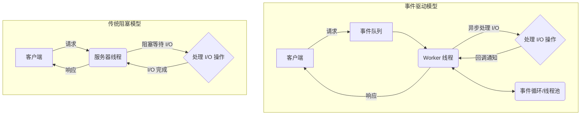
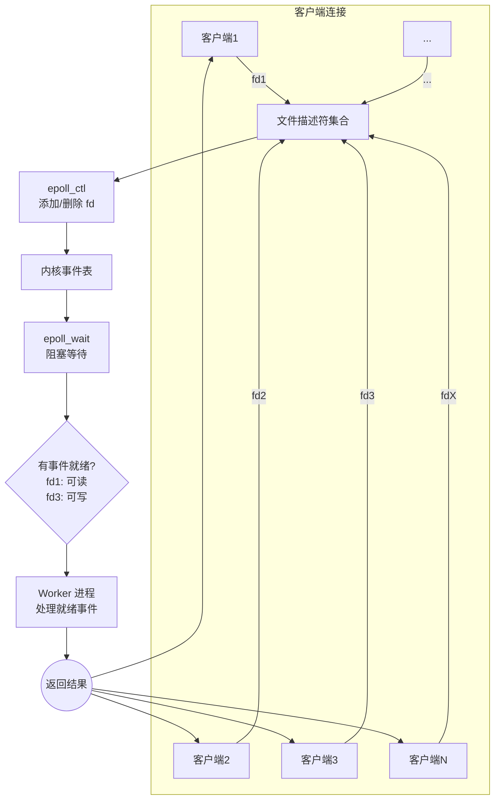
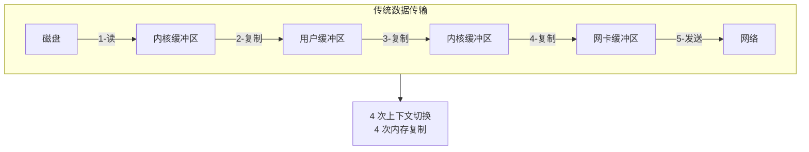
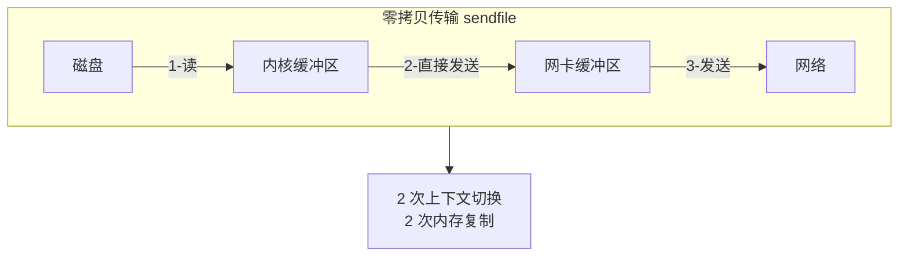

# Nginx 架构基础

## 一、模块介绍

Nginx 采用 **事件驱动（Event-Driven）**、**异步非阻塞（Asynchronous Non-blocking）** 的架构设计，使其在高并发场景下具有卓越的性能表现。整个架构可以概括为：**一个 Master 进程 + 多个 Worker 进程** 的主从结构，配合事件驱动模型和高度模块化的设计。

```
┌─────────────────────────────────────────────────────────────┐
│                        客户端请求层                            │
│        (成千上万的并发连接请求)                                 │
└────────────────────────┬────────────────────────────────────┘
                         │
                         ▼
┌─────────────────────────────────────────────────────────────┐
│                      Master 进程                             │
│  • 读取和验证配置文件                                          │
│  • 启动和管理 Worker 进程                                     │
│  • 监控 Worker 进程状态，异常时重启                             │
│  • 处理信号（重启、重载配置等）                                  │
│  • 绑定监听端口（由 Worker 继承）                               │
└────────────────────────┬────────────────────────────────────┘
                         │
         ┌───────────────┴───────────────┐
         │                               │
         ▼                               ▼
┌─────────────────┐           ┌─────────────────┐
│  Worker 进程 1  │    ...    │  Worker 进程 N    │
│  • 接受连接      │           │  • 接受连接      │
│  • 读取请求      │           │  • 读取请求      │
│  • 处理业务      │           │  • 处理业务      │
│  • 响应客户端    │           │  • 响应客户端     │
└────────┬────────┘           └────────┬───────┘
         │                               │
         └───────────────┬───────────────┘
                         │
         ┌───────────────┴───────────────┐
         │                               │
         ▼                               ▼
┌─────────────────┐           ┌─────────────────┐
│   事件驱动引擎   │           │    模块系统        │
│ (epoll/kqueue)  │           │                 │
│  • 监控 I/O 事件 │           │  • 核心模块      │
│  • 异步回调处理  │           │  • HTTP 模块     │
│  • 非阻塞 I/O    │           │  • 事件模块       │
└─────────────────┘           │  • 邮件模块      │
                              └─────────────────┘
```

其核心优势来自四方面：

- **单进程处理多连接**：一个 Worker 进程可同时处理成千上万连接。
- **非阻塞 I/O**：I/O 操作不阻塞线程，连接空闲时去处理其它连接。
- **零拷贝（Zero Copy）**：减少数据在内核空间与用户空间的复制。
- **内存池（Memory Pool）**：降低内存分配与释放的开销。

## 二、核心方法论

### 1. 主从进程结构

#### Master 进程（主进程）

Master 进程是 Nginx 的"管理者"，通常以 root 权限运行，负责整个生命周期管理：

| 职责 | 说明 |
|------|------|
| **配置解析** | 读取并解析 11-Nginx基础概述.conf 配置文件，验证语法正确性 |
| **进程管理** | fork() 创建指定数量的 Worker 进程 |
| **进程监控** | 监控 Worker 进程健康状态，异常退出时自动重启 |
| **信号处理** | 接收和处理系统信号（HUP、TERM、QUIT 等） |
| **端口绑定** | 在启动时绑定监听端口，所有 Worker 继承这些已绑定的 socket |
| **热部署** | 支持平滑升级和配置重载，零停机时间 |

**信号处理机制：**

```
客户端 → 发送信号 → Master 进程 → 处理信号 → 影响 Worker 进程
```

| 信号 | 命令 | 作用 |
|------|------|------|
| TERM | 11-Nginx基础概述 -s stop | 立即停止服务 |
| QUIT | 11-Nginx基础概述 -s quit | 优雅停止（处理完当前请求） |
| HUP  | 11-Nginx基础概述 -s reload | 平滑重载配置文件 |
| USR1 | 11-Nginx基础概述 -s reopen | 重新打开日志文件（日志切割） |
| USR2 | - | 平滑升级可执行文件 |
| WINCH | - | 优雅关闭旧版本 Worker 进程 |

#### Worker 进程（工作进程）

Worker 进程是实际处理请求的"工作者"，每个 Worker 进程都是单线程的，但能处理成千上万的并发连接。

```c
// 伪代码：Worker 进程的主循环
void worker_process_cycle() {
    // 初始化事件驱动模型
    ngx_event_process_init();

    // 设置信号处理（忽略父进程关心的信号）
    sigprocmask(SIG_BLOCK, &set, NULL);

    // 进入无限循环
    for ( ;; ) {
        // 等待事件（非阻塞）
        process_events();

        // 处理定时器事件
        process_timer_events();
    }
}
```

**进程特点：**

| 特点 | 说明 | 优势 |
|------|------|------|
| **单线程** | 每个 Worker 是单线程，避免线程锁竞争 | 消除线程上下文切换开销 |
| **独立运行** | Worker 之间互不干扰，共享内存很少 | 一个进程崩溃不影响其他进程 |
| **CPU 亲和** | 可将 Worker 绑定到特定 CPU 核心 | 减少 CPU 缓存失效，提升性能 |
| **并发连接** | 单 Worker 可处理数万并发连接 | 高效利用系统资源 |
| **无阻塞** | 全异步非阻塞 I/O 模型 | 不阻塞等待 I/O 操作 |

#### 进程间通信（IPC）

Worker 进程之间几乎不需要通信，主要通过共享内存进行有限的信息交换：

| 用途 | 模块 | 说明 |
|------|------|------|
| **限流计数** | limit_conn / limit_req | 跨 Worker 共享连接/请求计数 |
| **负载均衡状态** | upstream | 共享后端服务器健康状态 |
| **缓存管理** | proxy_cache | 共享缓存元数据和键 |
| **会话保持** | sticky | 共享会话粘性信息 |
| **SSL 会话** | ssl_session_cache | 共享 SSL 会话缓存 |

Master 通过信号与 Worker 通信：

```c
// Master 向 Worker 发送信号
ngx_signal_process(cycle, sig);

// Worker 收到信号后的处理
static void ngx_signal_handler(int signo) {
    switch (signo) {
        case ngx_signal_value(NGX_SHUTDOWN_SIGNAL):
            ngx_quit = 1;
            break;
        case ngx_signal_value(NGX_TERMINATE_SIGNAL):
            ngx_terminate = 1;
            break;
        case ngx_signal_value(NGX_RECONFIGURE_SIGNAL):
            ngx_reconfigure = 1;
            break;
    }
}
```

### 2. 事件驱动模型与 I/O 多路复用

**事件驱动模型（Event-Driven Model）**：程序不主动轮询检查状态，而是等待事件发生后再响应。Nginx 通过把事件驱动与**I/O 多路复用（I/O Multiplexing）**结合，让单个线程监控大量 I/O 描述符。

**常用多路复用机制对比：**

| 机制 | 支持平台 | 连接数上限 | 性能 | 说明 |
|------|----------|------------|------|------|
| select | 全平台 | 1024 (受 FD_SETSIZE 限制) | O(n) | 每次调用都线性遍历所有 fd |
| poll | 全平台 | 无限制 | O(n) | 同 select，但无 fd 数量限制 |
| epoll | Linux 2.6+ | 无限制 | O(1) | 高效，只返回就绪的 fd |
| kqueue | BSD/macOS | 无限制 | O(1) | 类似 epoll |
| /dev/poll | Solaris | 无限制 | O(1) | 类似 epoll |
| IOCP | Windows | 无限制 | 异步 | 真正的异步 I/O |

**epoll 工作原理**（Linux 上最高效、Nginx 高性能基石）：

```c
// 1. 创建 epoll 实例
int epoll_create(int size);
// 2. 添加/修改/删除要监控的文件描述符
int epoll_ctl(int epfd, int op, int fd, struct epoll_event *event);
// op: EPOLL_CTL_ADD, EPOLL_CTL_MOD, EPOLL_CTL_DEL
// 3. 等待事件发生
int epoll_wait(int epfd, struct epoll_event *events, int maxevents, int timeout);
```

epoll 与 LT/ET 两种工作模式：

| 模式 | 触发条件 | 特点 | 适用场景 |
|------|----------|------|----------|
| **LT (Level Triggered)** | 处于就绪状态即持续通知 | 默认模式，编程简单、兼容性好 | 普通应用 |
| **ET (Edge Triggered)** | 仅在就绪状态变化的瞬间通知一次 | 高效，需循环读完并配非阻塞 fd | 高性能场景 |

Nginx 对不同平台的 I/O 多路复用机制做了抽象封装（`ngx_event_actions_t`，含 `add`/`del`/`enable`/`disable`/`process_events` 等函数指针），从而无缝切换 epoll/kqueue 等后端。

### 3. 模块化设计

Nginx 高度模块化，所有功能都通过模块实现，耦合度极低：

```
┌─────────────────────────────────────────────────────────────┐
│              HTTP 过滤器模块 (Filter)                         │
│  • gzip 压缩  • 子替换  • SSI  • XSLT  • 图片处理           │
├─────────────────────────────────────────────────────────────┤
│              HTTP 处理模块 (Handler)                          │
│  • 静态文件  • 代理  • FastCGI  • uWSGI  • Memcache          │
├─────────────────────────────────────────────────────────────┤
│              HTTP 核心模块 (Core)                             │
│  • server/location  • root/alias  • listen                  │
├─────────────────────────────────────────────────────────────┤
│              事件模块 (Event)                                 │
│  • epoll  • kqueue  • /dev/poll  • select                   │
├─────────────────────────────────────────────────────────────┤
│              核心模块 (Core)                                  │
│  • 进程管理  • 配置解析  • 内存池  • 日志                     │
└─────────────────────────────────────────────────────────────┘
```

各层次模块示例：

| 层次 | 代表模块 | 说明 |
|------|----------|------|
| 核心模块 | ngx_core_module / ngx_events_module / ngx_errlog_module / ngx_openssl_module | worker_processes、事件配置、日志、SSL |
| 事件模块 | ngx_epoll_module / ngx_kqueue_module / ngx_select_module / ngx_poll_module | 不同平台的事件机制 |
| HTTP 处理 | ngx_http_proxy_module / ngx_http_fastcgi_module / ngx_http_upstream_module / ngx_http_rewrite_module / ngx_http_gzip_module / ngx_http_ssl_module | 代理、FastCGI、负载均衡、重写、压缩、HTTPS |
| HTTP 过滤 | ngx_http_gzip_filter_module / ngx_http_ssi_filter_module / ngx_http_sub_filter_module / ngx_http_image_filter_module / ngx_http_chunked_filter_module | 对响应体进行压缩/替换/裁剪/分块 |

### 4. 零拷贝与 sendfile

传统文件传输需要多次在内核缓冲与用户缓冲之间复制；Nginx 通过 **sendfile** 让数据直接从内核文件缓冲发送到网卡，减少复制与上下文切换。配置为 `sendfile on;`，配合 `tcp_nopush on` 与 `tcp_nodelay on` 进一步优化。

### 5. accept 锁机制

多个 Worker 同时监听同一端口时，用 **accept 锁**避免**惊群效应（Thundering Herd）**——即新连接到达时所有进程都被唤醒、只有其中一个能 accept，其余空唤醒浪费资源。通过共享内存中的锁协调；注意 `accept_mutex` 自 Nginx 1.11.3 起**默认已改为 `off`**（此前默认为 `on`，内核支持 `EPOLLEXCLUSIVE` 后官方不再默认启用），需要串行 accept 时可显式开启。

## 三、关键流程

### 图：事件驱动模型与传统阻塞模型对比



**说明**：事件驱动模型下，Worker 把 I/O 操作注册进事件循环，连接在等待 I/O 时并不占用线程；当数据就绪时通过回调通知后继续处理。而传统阻塞模型为每个连接占用一个线程并阻塞等待 I/O 完成，连接多时线程上下文切换开销巨大。这正是 Nginx 用极少线程支撑数十万并发的原因。

### 图：epoll 工作流程



**说明**：Nginx 把所监控的文件描述符（fd）通过 `epoll_ctl` 注册进内核事件表，随后 `epoll_wait` 阻塞等待；一旦某些 fd 有读/写就绪事件，内核只返回这些就绪项，Worker 据此逐一处理而无需遍历所有连接，复杂度由 O(n) 降到 O(1)。

### 图：零拷贝 sendfile 与传统传输对比





**说明**：传统方式把同一份文件数据在内核缓冲与用户缓冲之间多次复制，涉及多次用户态/内核态切换；启用 `sendfile` 后，数据从磁盘读到内核缓冲区即可直接发送到网卡，仅保留 2 次上下文切换与复制。对静态文件等大吞吐场景，sendfile 可带来数倍性能提升并显著降低 CPU 占用。

### Worker 事件处理主循环（源码示意）

```c
void ngx_process_events_and_timers(ngx_cycle_t *cycle) {
    // 1. 尝试接受新连接（accept 锁）
    if (ngx_use_accept_mutex) {
        if (ngx_accept_disabled > 0) {
            ngx_accept_disabled--;          // 连接数超限，暂不 accept
        } else if (ngx_trylock_accept_mutex(cycle) == NGX_OK) {
            ngx_rebuild_events_array(cycle); // 获取 accept 锁后注册 accept 事件
        }
    }
    // 2. 计算定时器超时时间
    timer = ngx_event_find_timer();
    // 3. 调用平台特定的事件等待函数（如 epoll_wait）
    delta = ngx_event_actions.process_events(cycle, timer, flags);
    // 4. 处理定时器事件
    ngx_event_process_posted(cycle, &ngx_posted_events);
    // 5. 处理 I/O 事件
    if (flags & NGX_POST_EVENTS) {
        ngx_event_process_posted(cycle, &ngx_posted_accept_events);
        ngx_event_process_posted(cycle, &ngx_posted_events);
    }
}
```

## 四、工具与实践

### 1. Worker 数量与连接数配置

```11-Nginx基础概述
# 通常设置为 CPU 核心数
worker_processes auto;  # 自动检测 CPU 核心数
# 或手动指定：worker_processes 4;

events {
    worker_connections 10240;  # 单 Worker 最大连接数
    use epoll;                 # Linux 上显式使用 epoll
    accept_mutex on;           # 默认 off（1.11.3 起），需串行 accept 时显式开启
    accept_mutex_delay 50ms;   # 获取锁的最大等待时间
    multi_accept on;           # 一次 accept 多个连接
}
# 最大并发连接数 = worker_processes * worker_connections
# 示例：4 * 10240 = 40960 个并发连接
```

### 2. 零拷贝与连接优化

```11-Nginx基础概述
http {
    # sendfile 零拷贝
    sendfile on;
    tcp_nopush on;   # 一次性发送数据包
    tcp_nodelay on;  # 禁用 Nagle 算法

    # 保持连接
    keepalive_timeout 65;
    keepalive_requests 10000;

    # 隐藏版本号
    server_tokens off;

    # 请求体/头限制
    client_max_body_size 10m;
    client_body_buffer_size 128k;
    client_header_buffer_size 4k;
    large_client_header_buffers 4 8k;

    # Gzip 压缩
    gzip on;
    gzip_vary on;
    gzip_min_length 1024;
    gzip_types text/plain text/css application/json application/javascript;

    # 缓冲区优化
    output_buffers 1 32k;
    postpone_output 1460;
}
```

### 3. 内核参数调优（/etc/sysctl.conf）

```bash
# 系统与单进程最大打开文件数
fs.file-max = 999999
fs.nr_open = 999999

# TCP 连接回收与端口范围
net.ipv4.tcp_tw_reuse = 1
net.ipv4.tcp_fin_timeout = 30
net.ipv4.tcp_max_tw_buckets = 6000
net.ipv4.ip_local_port_range = 1024 65535

# TCP 收发缓冲区（最小/默认/最大）
net.ipv4.tcp_rmem = 4096 87380 16777216
net.ipv4.tcp_wmem = 4096 65536 16777216

# SYN 队列与 SYN Cookies 防护
net.ipv4.tcp_max_syn_backlog = 8192
net.ipv4.tcp_syncookies = 1
net.ipv4.tcp_keepalive_time = 600

# 网络设备队列与默认/最大缓冲区
net.core.netdev_max_backlog = 32768
net.core.rmem_default = 262144
net.core.wmem_default = 262144
net.core.rmem_max = 16777216
net.core.wmem_max = 16777216
```

> 进程级还需用 `worker_rlimit_nofile 65535;` 提高每个进程的文件描述符上限，避免 `EMFILE`。

### 4. 性能压测工具

```bash
# 使用 wrk 进行压力测试
wrk -t12 -c400 -d30s http://your-domain.com/

# 使用 ab (Apache Bench)
ab -n 10000 -c 100 http://your-domain.com/

# 使用 siege
siege -c 100 -t 60S http://your-domain.com/
```

## 五、常见坑点

1. **`worker_connections` 设得过大却连接被拒**：单进程文件描述符上限受 `worker_rlimit_nofile` 与系统 `ulimit -n` 限制。设 `worker_rlimit_nofile 65535;` 并同步调高系统 `fs.file-max`/`fs.nr_open`。
2. **惊群导致 CPU 抖动**：多个 worker 同时 accept 会被全部唤醒。`accept_mutex` 默认已为 `off`（1.11.3 起），低并发下可显式 `accept_mutex on` 串行 accept，并微调 `accept_mutex_delay`；开启 `multi_accept on` 一次多取连接以减少唤醒。
3. **ET 模式未及时读完数据导致饿死新请求**：边缘触发（ET）要求一次把 fd 读空。若在自定义事件处理中混用 ET+非阻塞，务必循环读完并设置 `O_NONBLOCK`，否则剩余数据永远不再触发就绪通知。
4. **`use epoll;` 在不支持的平台报错**：epoll 仅 Linux 可用；macOS/BSD 用 kqueue。保留自动探测即可，仅在确认平台后显式指定。
5. **`worker_processes` 超出 CPU 核数不一定更快**：通常取物理核数（`auto`）。过多 worker 会增加上下文切换与锁竞争，反而降低性能。
6. **共享内存在容器/非特权环境受限**：`limit_req`/`proxy_cache`/`ssl_session_cache` 等依赖 `shared:` 共享内存。容器若限制共享内存或 `/dev/shm` 过小会启动失败，需调整 size 或宿主机参数。
7. **sendfile 与某些模块冲突**：对需要修改响应体内容（如 gzip/ssi/xslt）的场景，sendfile 与内容转换存在冲突，Nginx 会视情况回退到普通缓冲；属正常行为，不必强行关闭。
8. **误把 `worker_connections` 当全局上限**：它是「每 worker」上限，全局并发上限为 `worker_processes × worker_connections`。同理调整 `multi_accept`。
9. **测试工具口径不一**：ab 关注吞吐、wrk 短连接高并发差异大，压测结果须在相同参数（并发、时长、保活）下对比，避免误判架构问题。

## 六、进阶扩展与参考

### 与传统 Web 服务器架构对比

| 对比维度 | Apache Prefork | Apache Worker | Apache Event | Nginx |
|----------|---------------|---------------|--------------|-------|
| **进程模型** | 多进程 | 多进程+多线程 | 多进程+事件 | 多进程+单线程事件 |
| **并发处理** | 每连接一进程 | 每连接一线程 | 单进程多连接 | 单进程多连接 |
| **连接数上限** | ~500 | ~2000 | ~10000 | ~100000+ |
| **内存占用** | 高（每进程~50MB） | 中（每线程~5MB） | 中 | 低（万连接~2.5MB） |
| **CPU 开销** | 高（进程切换） | 中（线程切换） | 低 | 极低（事件驱动） |
| **静态文件性能** | 一般 | 较好 | 好 | 极佳 |
| **动态语言支持** | PHP/CGI 原生 | PHP/CGI 原生 | PHP/CGI 原生 | 需代理到后端 |
| **配置复杂度** | 低 | 中 | 中 | 低 |
| **稳定性** | 高 | 中 | 中 | 极高 |

### 进阶方向

- **动态模块**：Nginx 1.9.11+ 支持 `--with-http_geoip_module=dynamic` 等动态加载模块，按需加载、平滑替换。
- **线程池**：`aio threads` 把阻塞操作（如 slow disk）offload 到线程池，避免阻塞事件循环。
- **多缓存/共享内存调优**：为限流、缓存、会话复用精细规划 `shared:` 大小。
- **结合负载均衡**：Nginx 作为接入层的事件驱动架构是高并发入口的关键，再配合 `upstream` 把业务分发到后端（详见反向代理与负载均衡文档）。
- **深入参考**：官方开发者文档、Mailing List，以及 Nginx Cookbook 中与进程模型、性能调优相关章节。

### 参考

- 官方文档：https://11-Nginx基础概述.org/en/docs/
- Nginx 事件模块源码注释（`src/event/` 下的 `ngx_event_actions_t`、`ngx_process_events_and_timers` 等）