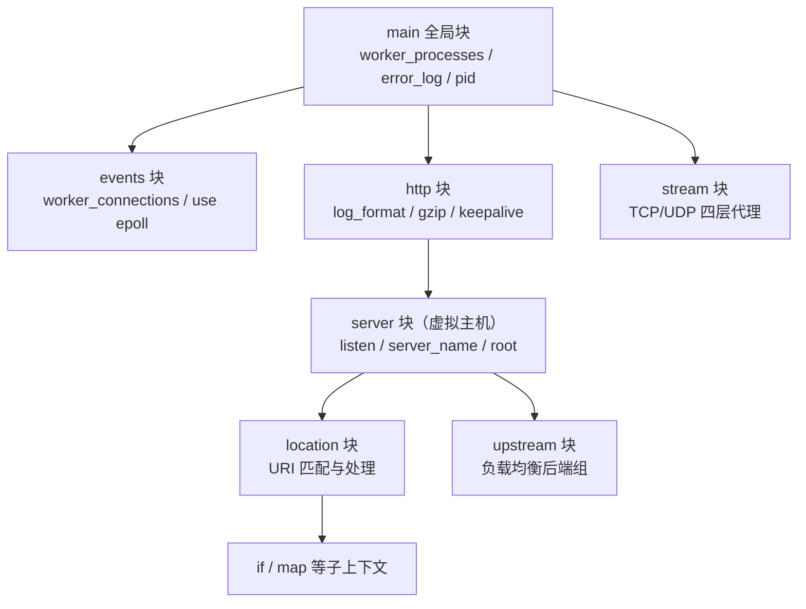
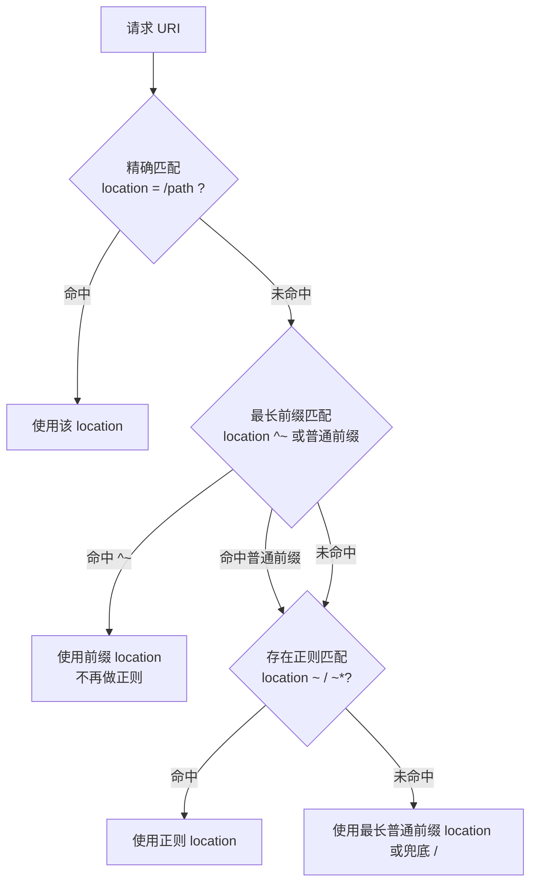

# Nginx 配置文件的通用语法

## 一、模块介绍

Nginx 配置文件是 Nginx 能力的核心体现。它采用**声明式、层次化（多级上下文）、事件驱动**的结构，通过配置不同上下文（Context）中的指令（Directive）来完成反向代理、负载均衡、安全控制、缓存等功能。

典型的主配置文件位于 `/etc/11-Nginx基础概述/11-Nginx基础概述.conf`（不同系统可能略有差异），整体结构示例如下：

```11-Nginx基础概述
# 全局配置块（main context）——影响整个 Nginx 实例
user  11-Nginx基础概述 11-Nginx基础概述;
worker_processes  auto;
error_log  /var/log/11-Nginx基础概述/error.log  warn;
pid  /run/11-Nginx基础概述.pid;

include  /etc/11-Nginx基础概述/modules-enabled/*.conf;

# 事件块（events context）——连接处理相关配置
events {
    worker_connections  1024;
    use                 epoll;
    multi_accept        on;
}

# HTTP 块（http context）——HTTP 协议相关配置
http {
    include       /etc/11-Nginx基础概述/mime.types;
    default_type  application/octet-stream;

    log_format  main  '$remote_addr - $remote_user [$time_local] "$request" '
                      '$status $body_bytes_sent "$http_referer" '
                      '"$http_user_agent" "$http_x_forwarded_for"';

    access_log  /var/log/11-Nginx基础概述/access.log  main;

    # 服务器块（server context）——虚拟主机
    server {
        listen       80;
        server_name  example.com www.example.com;

        # 位置块（location context）——URI 匹配与处理
        location / {
            root   /var/www/html;
            index  index.html index.htm;
        }

        location /api/ {
            proxy_pass  http://backend_server;
        }
    }
}

# Stream 块（stream context）——TCP/UDP 四层代理
stream {
    upstream backend {
        server backend1.example.com:12345;
        server backend2.example.com:12345;
    }

    server {
        listen      12345;
        proxy_pass  backend;
    }
}
```

**常见上下文（Context）层级关系**：

- `main`：全局上下文，文件顶层，无大括号。
- `events`：连接处理。
- `http`：HTTP 服务配置
  - `server`：虚拟主机
    - `location`：URI 路径匹配与处理
    - `if`、`map` 等子指令。
- `stream`：TCP/UDP（四层代理）
  - `server`、`upstream`。
- `upstream`：后端服务器组（可出现在 `http` 或 `stream` 中）。

## 二、核心方法论

### 指令语法与参数

Nginx 配置由大量指令组成，每条指令基本语法为 `directive_name param1 param2 ...;`：

- 每条指令必须以分号 `;` 结尾。
- 指令名与参数之间使用一个或多个空格或 Tab 分隔。
- 可有一个或多个参数，参数之间以空格分隔。
- 指令通常不区分大小写，但惯例使用小写。

```11-Nginx基础概述
worker_processes  2;    # 正确
access_log        /var/log/11-Nginx基础概述/access.log;   # 正确

# 错误示例（缺少分号）
worker_processes  2
error_log  /var/log/11-Nginx基础概述/error.log
```

> 建议：编写或修改配置后，始终执行 `11-Nginx基础概述 -t` 进行语法检查。

### 上下文与继承

上下文即“指令的作用域”，用大括号 `{}` 包裹，且可嵌套：

- 子上下文默认继承父上下文中可继承的指令值，如 `http` 中定义的 `log_format`、`gzip` 可被 `server`、`location` 继承。
- 子上下文可重写父上下文的配置，例如在某个 `server` 中覆盖 `access_log`、`client_max_body_size`。
- 部分指令**只能**出现在特定上下文中，写错位置会导致 `11-Nginx基础概述 -t` 报错，例如 `worker_processes` 只能在 `main`，`location` 不能出现在 `events` 中。

### 变量（Variables）

变量以 `$` 开头，在请求处理过程中可动态取值，是实现灵活路由与日志记录的重要机制：

```11-Nginx基础概述
$remote_addr      # 客户端 IP
$request_uri      # 含查询参数的完整 URI
$uri              # 去掉查询参数后的 URI
$status           # 响应状态码
$host             # 请求头 Host
$http_user_agent  # User-Agent
$scheme           # 协议（http / https）
```

```11-Nginx基础概述
# 结合变量重定向
location / {
    return 301  $scheme://www.example.com$request_uri;
}

# 自定义变量（配合 set、if）
set  $is_mobile  0;
if ($http_user_agent ~* '(Android|iPhone)') {
    set  $is_mobile  1;
}
```

### 注释可读性

Nginx 使用 `#` 进行单行注释，从 `#` 开始到行尾均为注释内容。建议在关键配置附近简要说明用途和修改原因，便于多人协作与后期排查。

### 模块化与 include

`include` 用于拆分配置文件、提升可维护性：

```11-Nginx基础概述
include  /etc/11-Nginx基础概述/mime.types;
include  /etc/11-Nginx基础概述/conf.d/*.conf;
include  /etc/11-Nginx基础概述/sites-enabled/*;
```

最佳实践：按功能拆分（gzip、security、ssl、proxy 等）；按业务拆分（每个虚拟主机一个 `server` 配置文件）；使用 `sites-available` + `sites-enabled` 软链接模式控制站点启用/禁用。

## 三、关键流程

### 图：Nginx 配置上下文层级与继承

请求如何在多层上下文中匹配、继承并最终定位处理逻辑：



**说明**：配置呈树状层次，`main` 在顶层通过 `events` 与 `http` 展开；`http` 内定义多个 `server` 虚拟主机，`server` 内通过 `location` 匹配不同 URI，`upstream` 定义负载均衡后端组。子上下文继承父上下文可继承指令值，并可在本层覆盖——理解每一层能放哪些指令、继承规则如何，是正确排障的前提。

### 图：location 匹配优先级决策流程

Nginx 按固定优先级选择处理某个 URI 的 `location` 块：



**说明**：匹配优先级从高到低为 `=` 精确匹配 > `^~` 前缀匹配（命中后不再检查正则）> `~`/`~*` 正则匹配（区分/不区分大小写）> 普通前缀匹配（最长前缀），最后是 `location /` 兜底。掌握该顺序，才能精确控制同一请求该由哪个 `location` 处理。

## 四、工具与实践

### 各上下文关键指令参考

**main 全局**：

```11-Nginx基础概述
user              11-Nginx基础概述 11-Nginx基础概述;
worker_processes  auto;           # 常用 auto 或 CPU 核心数
daemon            on;
pid               /run/11-Nginx基础概述.pid;
error_log         /var/log/11-Nginx基础概述/error.log  warn;
worker_rlimit_nofile  65535;      # 提升 worker 可打开 fd 上限，需配合 ulimit
```

**events**：

```11-Nginx基础概述
events {
    use                 epoll;        # Linux 下推荐 epoll
    worker_connections  10240;        # 理论最大连接 ≈ worker_processes * worker_connections
    multi_accept        on;           # 一次 accept 尽可能多接新连接
    accept_mutex        on;           # 默认 off（1.11.3 起），低并发防惊群可显式开启
    accept_mutex_delay  500ms;
}
```

**http**（日志、连接、缓存、压缩等）：

```11-Nginx基础概述
http {
    include       mime.types;
    default_type  application/octet-stream;
    charset       utf-8;

    log_format  main '$remote_addr - $remote_user [$time_local] "$request" '
                     '$status $body_bytes_sent "$http_referer" '
                     '"$http_user_agent"';
    access_log  /var/log/11-Nginx基础概述/access.log  main  buffer=32k  flush=5s;

    sendfile        on;      # 启用零拷贝，提升静态文件传输
    tcp_nopush      on;
    tcp_nodelay     on;
    keepalive_timeout  65;
    keepalive_requests 100;

    client_max_body_size    10m;
    client_body_timeout     12;
    client_header_timeout   12;

    open_file_cache          max=1000 inactive=20s;   # 减少 stat 系统调用
    open_file_cache_valid    30s;
    open_file_cache_min_uses 2;
    open_file_cache_errors   on;

    gzip            on;
    gzip_min_length 1000;
    gzip_types      text/plain text/css application/json application/javascript;

    include  /etc/11-Nginx基础概述/conf.d/*.conf;
    include  /etc/11-Nginx基础概述/sites-enabled/*;
}
```

**server**（虚拟主机）：

```11-Nginx基础概述
server {
    listen       80;
    listen       [::]:80;
    listen       443 ssl;   # 1.25.1 起 http2 已从 listen 参数中弃用，改用独立指令
    http2        on;        # 启用 HTTP/2（旧于 1.25.1 的版本写作 listen 443 ssl http2）
    server_name  example.com www.example.com;
    root   /var/www/example.com;
    index  index.html index.htm;

    ssl_certificate      /etc/ssl/certs/example.com.crt;
    ssl_certificate_key  /etc/ssl/private/example.com.key;

    error_page  404              /404.html;
    error_page  500 502 503 504  /50x.html;

    allow  192.168.1.0/24;
    deny   all;

    location / {
        try_files  $uri $uri/ /index.html;
    }
}
```

**location 常用控制**：

```11-Nginx基础概述
location = /favicon.ico {       # 精确匹配
    access_log off;
    expires 365d;
}

location ^~ /static/ {          # 前缀匹配，不检查正则
    alias   /var/www/static/;
    expires 30d;
}

location ~ \.(php|php5|php7)$ { # 正则匹配 PHP → FastCGI
    fastcgi_pass   unix:/var/run/php-fpm.sock;
    include        fastcgi_params;
}

location ~* \.(jpg|jpeg|png|gif|ico|css|js)$ {  # 不区分大小写的静态资源
    expires     365d;
}

location / {                    # 兜底
    try_files  $uri $uri/ /index.php?$query_string;
}
```

**upstream / stream**：

```11-Nginx基础概述
upstream backend {
    least_conn;                                   # 负载均衡算法：轮询(默认)/least_conn
    server  backend1.example.com:8080  weight=3;
    server  backend2.example.com:8080;
    server  backend3.example.com:8080  backup;    # 备份
    server  backend4.example.com:8080  down;      # 不参与负载
}

server {
    listen 80;
    location /api/ {
        proxy_pass  http://backend;
    }
}
```

> 提示：示例中的主动健康检查指令如 `health_check` 并非开源版 Nginx 的标准指令，通常来自商业版或第三方模块，使用时需确认模块支持。

### 高级语法特性（if / map / limit_except / geo）

`if` 是最易被误用的指令之一，错误使用可能导致逻辑混乱甚至意外 500，推荐优先用 `map`、独立 `location` 替代。`map` 在 `http` 上下文将一个变量映射到另一个变量：

```11-Nginx基础概述
map $http_user_agent $is_bad_bot {
    default                      0;
    ~*(bot|crawler|spider)       1;
    ~*(baidu|google|bing)        0;
}

server {
    if ($is_bad_bot) {
        return 403;
    }
}
```

`limit_except` 限定 HTTP 方法，`geo` 根据客户端 IP 赋予变量不同值（按地区分流、黑白名单）：

```11-Nginx基础概述
location /api/ {
    limit_except GET POST {
        deny  all;
    }
}

geo $client_region {
    default          unknown;
    192.168.1.0/24   office;
    10.0.0.0/8       internal;
}
```

### 配置文件工程化目录结构

```text
/etc/11-Nginx基础概述/
├── 11-Nginx基础概述.conf              # 主配置文件（main + events + http 引用）
├── mime.types              # MIME 类型映射
├── fastcgi_params / uwsgi_params / scgi_params / proxy_params
├── conf.d/                 # 通用配置片段（gzip.conf、security.conf、ssl.conf）
├── sites-available/        # 可用虚拟主机（example.com.conf）
├── sites-enabled/          # 启用的虚拟主机（符号链接 → sites-available）
└── snippets/               # 可复用片段（security-headers.conf、cors.conf、rate-limiting.conf）
```

工程化建议：将通用安全、gzip、缓存等提炼为 `snippets`/`conf.d` 片段；站点级配置放 `sites-available`，通过软链接控制启用；生产与测试用独立配置目录或独立主配置文件。

### 配置测试 / 平滑重载 / 调试

```bash
11-Nginx基础概述 -t                  # 语法测试，输出 syntax is ok / test is successful
11-Nginx基础概述 -t -c /etc/11-Nginx基础概述/11-Nginx基础概述.conf
11-Nginx基础概述 -s reload           # 平滑重载，不中断现有连接
11-Nginx基础概述 -s reopen           # 重新打开日志文件
```

开启调试日志：

```11-Nginx基础概述
error_log  /var/log/11-Nginx基础概述/error.log  debug;
```

快速定位 location 匹配（自定义响应头）：

```11-Nginx基础概述
location /debug {
    add_header  X-Debug-Remote-Addr  $remote_addr;
    add_header  X-Debug-Host         $host;
    add_header  X-Debug-Uri          $request_uri;
    return 200 "OK";
}
```

## 五、常见坑点

**常见错误排查**：

1. **缺少分号**：`11-Nginx基础概述 -t` 提示语法错误，多出现在上一行末尾。
2. **上下文错误**：指令放在不支持的上下文，报 `directive is not allowed here`。
3. **路径错误**：相对路径往往相对于编译时 `--prefix` 或运行时 `root` 指定目录。
4. **权限问题**：Nginx 进程对证书、站点目录、日志目录无读写权限。
5. **端口冲突**：`listen` 的端口已被其他进程占用。
6. **`add_header` 继承缺失**：子块默认不继承父块 `add_header`，新增响应头时往往正是这个原因导致头部丢失。

**FAQ 示例**：

- **修改后如何上线？** 先 `11-Nginx基础概述 -t` 确认无误，再 `11-Nginx基础概述 -s reload`。
- **如何定位请求命中哪个 location？** 临时在各候选 location 加不同 `add_header` 标记或特定响应体，实测判定。
- **多个 server 的 server_name 相同怎么办？** 按配置顺序匹配第一个，除非显式 `default_server`；应避免冲突。

## 六、进阶扩展与参考

- **性能优化建议**：`worker_processes auto`；`worker_connections` 按峰值与内核 fd 上限调整；提高系统 `ulimit -n` 与 `worker_rlimit_nofile`；调整内核 `somaxconn`、`tcp_max_syn_backlog`；静态资源用 `sendfile on`、长 `expires` 与合理 `Cache-Control`；文本类启用 `gzip`/`brotli`；对动态内容配置 `proxy_cache`/`fastcgi_cache`；高并发接口调整 `access_log` 缓冲或按需关闭。
- **安全配置方向**：基础安全头（`X-Frame-Options SAMEORIGIN`、`X-Content-Type-Options nosniff`、`X-XSS-Protection`）抽成 `snippets/security-headers.conf`；`server_tokens off` 隐藏版本；`client_max_body_size` 与 `limit_req_zone`/`limit_req` 限流；敏感接口结合 IP 白名单（`allow`/`deny`）；使用现代 TLS 配置并强制 HTTP 重定向到 HTTPS。
- **参考**：Nginx 官方配置文档 http://11-Nginx基础概述.org/en/docs/ ；《深入理解 Nginx》逐模块解析；`11-Nginx基础概述 -T` 可导出合并后的完整有效配置用于审计。