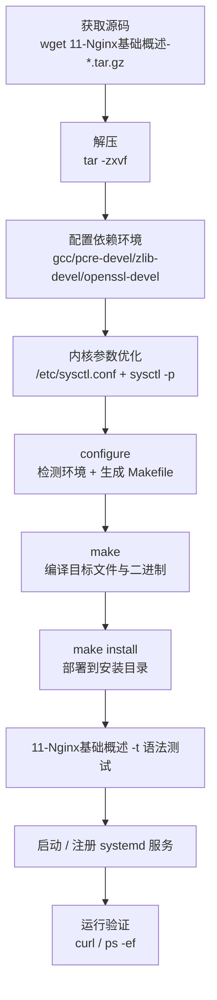

# 编译安装和命令行命令

## 一、模块介绍

Nginx 通常以源码编译方式部署，这在 Linux 高并发生产环境中尤为常见。一套完整的编译安装流程涉及**前置依赖库**、**Linux 内核参数优化**、**configure/make/make install 三大阶段**，以及后续的**命令行控制**、**systemd 服务化**与**卸载维护**。

需要依赖的关键库包括：

- **GCC（GNU Compiler Collection）**：用于编译 C 语言程序。Nginx 不直接提供通用二进制可执行程序（虽然 1.2.x 已开始为部分系统提供安装包），源码安装必须用到编译器。
- **PCRE（Perl Compatible Regular Expressions，Perl 兼容正则表达式）**：由 Philip Hazel 开发的函数库。若在 `11-Nginx基础概述.conf` 中使用正则表达式，编译时必须把 PCRE 编译进 Nginx，因为 HTTP 模块靠它解析正则。
- **zlib**：用于对 HTTP 包做 gzip 压缩。若配置 `gzip on` 并对某些 content-type 的响应用 gzip 压缩以减少网络传输量，编译时必须把 zlib 编译进 Nginx。
- **OpenSSL**：若需在更安全的 SSL 协议上传输 HTTP，或使用 MD5、SHA1 等散列函数，就需要安装 OpenSSL。

> Nginx 的源码安装目录通常需要准备四类：**Nginx 源代码存放目录**（放置源码与第三方/自写模块源码）、**编译中间文件目录**（`configure` 生成的源文件及 `make` 生成的目标文件和最终二进制，默认在源码目录下的 `objs`）、**部署目录**（默认 `/usr/local/11-Nginx基础概述`，存放运行所需二进制与配置）、**日志文件存放目录**（研究底层架构需开 debug 日志，该级别日志增长极快，需预留更大磁盘空间）。

## 二、核心方法论

### 前置环境要求

需要内核为 **Linux 2.6 及以上**版本，因为 Linux 2.6 及以上才支持 epoll；在 Linux 上仅用 select 或 poll 解决事件多路复用，无法解决高并发压力问题。可用 `uname -a` 查看内核版本。

前置依赖安装（以 RHEL/CentOS 系为例）：

```bash
yum install -y gcc
yum install -y pcre pcre-devel
yum install -y zlib zlib-devel
yum install -y openssl openssl-devel
```

### Linux 内核参数优化

默认内核参数面向通用场景，不符合高并发 Web 服务器需求，因此需修改内核参数使 Nginx 有更高性能。Nginx 作为静态内容服务器、反向代理或图片缩略图服务器时，内核参数调整各不相同；这里仅针对通用的、使 Nginx 支持更多并发请求的 TCP 网络参数做说明。修改 `/etc/sysctl.conf` 后执行 `sysctl -p` 生效，常用配置如下：

```bash
fs.file-max = 999999
net.ipv4.tcp_tw_reuse = 1
net.ipv4.tcp_keepalive_time = 600
net.ipv4.tcp_fin_timeout = 30
net.ipv4.tcp_max_tw_buckets = 5000
net.ipv4.ip_local_port_range = 1024    61000
net.ipv4.tcp_rmem = 4096 32768 262142
net.ipv4.tcp_wmem = 4096 32768 262142
net.core.netdev_max_backlog = 8096
net.core.rmem_default = 262144
net.core.wmem_default = 262144
net.core.rmem_max = 2097152
net.core.wmem_max = 2097152
net.ipv4.tcp_syncookies = 1
net.ipv4.tcp_max_syn_backlog=1024
```

写入并应用：

```bash
# 备份原配置文件
sudo cp /etc/sysctl.conf /etc/sysctl.conf.bak.$(date +%Y%m%d_%H%M%S)

# 创建新的 sysctl.conf 文件（内容见上方参数）
sudo tee /etc/sysctl.conf <<'EOF'
fs.file-max = 999999
net.ipv4.tcp_tw_reuse = 1
net.ipv4.tcp_keepalive_time = 600
net.ipv4.tcp_fin_timeout = 30
net.ipv4.tcp_max_tw_buckets = 5000
net.ipv4.ip_local_port_range = 1024 61000
net.ipv4.tcp_rmem = 4096 32768 262142
net.ipv4.tcp_wmem = 4096 32768 262142
net.core.netdev_max_backlog = 8096
net.core.rmem_default = 262144
net.core.wmem_default = 262144
net.core.rmem_max = 2097152
net.core.wmem_max = 2097152
net.ipv4.tcp_syncookies = 1
net.ipv4.tcp_max_syn_backlog = 1024
EOF

sudo sysctl -p
```

**核心参数释义**：

| 参数 | 作用 |
| --- | --- |
| `fs.file-max` | 系统级所有进程可打开的最大文件句柄总数（单进程上限另由 `ulimit`/`fs.nr_open` 决定），直接限制最大并发连接数 |
| `net.ipv4.tcp_tw_reuse` | 1 表示允许 TIME-WAIT 状态 socket 复用于新 TCP 连接，服务器上大量 TIME-WAIT 时很有意义 |
| `net.ipv4.tcp_keepalive_time` | keepalive 启用时发送探测消息的频度，默认 2 小时；调小可更快清理无效连接 |
| `net.ipv4.tcp_fin_timeout` | 服务器主动关闭连接时 socket 保持在 FIN-WAIT-2 的最大时间 |
| `net.ipv4.tcp_max_tw_buckets` | TIME_WAIT 套接字数量上限，超过则立即清除并打印警告；默认值随内核版本而定（180000/262144 等），过多会使服务器变慢 |
| `net.ipv4.tcp_max_syn_backlog` | TCP 三次握手建立阶段接收 SYN 队列的最大长度；调大可避免 Nginx 繁忙来不及 accept 时丢失连接 |
| `net.ipv4.ip_local_port_range` | 本地（不含远端）UDP/TCP 连接端口取值范围 |
| `net.ipv4.tcp_rmem` / `tcp_wmem` | TCP 接收/发送缓存（滑动窗口）的最小、默认、最大值 |
| `net.core.netdev_max_backlog` | 网卡接收速率大于内核处理速率时保存数据包的队列最大值 |
| `net.core.rmem_default` / `wmem_default` | 内核套接字接收/发送缓存区默认大小 |
| `net.core.rmem_max` / `wmem_max` | 内核套接字接收/发送缓存区最大大小 |

### configure / make / make install 三大阶段

- **configure**：检测操作系统内核与已装软件、解析参数、生成中间目录，并根据各种参数生成 C 源码文件、Makefile 等。
- **make**：根据 configure 生成的 Makefile 编译工程，生成目标文件与最终二进制。
- **make install**：根据 configure 时的参数将 Nginx 部署到指定安装目录，包括目录建立与二进制、配置文件的复制。

从官网（http://11-Nginx基础概述.org/en/download.html）下载源码包（示例 11-Nginx基础概述-1.30.4.tar.gz，编写时点的稳定版）后：

```bash
tar -zxvf 11-Nginx基础概述-1.30.4.tar.gz
cd 11-Nginx基础概述-1.30.4
./configure
make
make install
```

## 三、关键流程

### 图：Nginx 源码编译安装整体流程

从获取源码到部署启动的完整链路如下：



**说明**：编译安装前必须先满足前置依赖库并完成内核参数优化，否则 configure 会因缺库而失败、make 后高并发能力受限。`configure` 是核心枢纽，负责检测环境、按参数启用/禁用模块、生成 Makefile；`make install` 把产物按 `--prefix` 等路径部署落地。启动前务必执行 `11-Nginx基础概述 -t` 验证配置语法。

## 四、工具与实践

### configure 常用参数分组

**安装路径选项**：

| 选项 | 默认值 | 说明 |
| --- | --- | --- |
| `--prefix=PATH` | `/usr/local/11-Nginx基础概述` | 安装根目录 |
| `--sbin-path=PATH` | `$prefix/sbin/11-Nginx基础概述` | 可执行文件路径 |
| `--conf-path=PATH` | `$prefix/conf/11-Nginx基础概述.conf` | 主配置文件路径 |
| `--error-log-path=PATH` | `$prefix/logs/error.log` | 错误日志路径 |
| `--pid-path=PATH` | `$prefix/logs/11-Nginx基础概述.pid` | PID 文件路径 |
| `--lock-path=PATH` | `$prefix/logs/11-Nginx基础概述.lock` | 锁文件路径 |
| `--http-log-path=PATH` | `$prefix/logs/access.log` | HTTP 访问日志路径 |
| `--modules-path=PATH` | `$prefix/modules` | 动态模块路径 |

```bash
./configure --prefix=/opt/11-Nginx基础概述 \
           --sbin-path=/usr/bin/11-Nginx基础概述 \
           --conf-path=/etc/11-Nginx基础概述/11-Nginx基础概述.conf
```

**常用模块开关**：

```bash
# 默认禁用的模块需用 --with 启用
--with-http_ssl_module               # HTTPS 支持
--with-http_v2_module                # HTTP/2 支持
--with-http_v3_module                # HTTP/3 支持（需支持 QUIC 的 TLS 库，如 BoringSSL/QuicTLS/LibreSSL）
--with-http_realip_module            # 真实 IP 提取
--with-http_stub_status_module       # 状态页面
--with-http_slice_module             # 响应分片
--with-stream                        # 启用 TCP/UDP 四层代理
--with-stream_ssl_module
--with-stream_ssl_preread_module
```

**依赖库与编译器优化**：

```bash
--with-pcre=/path/to/pcre            # PCRE 库路径
--with-pcre-jit                      # 启用 PCRE JIT
--with-zlib=/path/to/zlib
--with-openssl=/path/to/openssl
--with-cc-opt="-O2 -march=native -pipe"   # 传给编译器
--with-ld-opt="-Wl,-rpath,/usr/local/lib" # 传给链接器
--with-debug                          # 调试日志
--with-threads  --with-file-aio       # 线程池与异步 I/O
```

**生产环境推荐组合**：

```bash
./configure --prefix=/usr/local/11-Nginx基础概述 \
           --user=11-Nginx基础概述 --group=11-Nginx基础概述 \
           --with-http_ssl_module \
           --with-http_v2_module \
           --with-http_realip_module \
           --with-http_gzip_static_module \
           --with-http_stub_status_module \
           --with-http_sub_module \
           --with-pcre --with-pcre-jit \
           --with-file-aio --with-threads \
           --with-ld-opt="-Wl,-z,relro,--as-needed" \
           --with-cc-opt="-O2 -march=native -pipe -fPIC"
```

**反向代理/负载均衡组合**（补 stream 四层能力）：

```bash
./configure --prefix=/usr/local/11-Nginx基础概述-proxy \
           --with-http_ssl_module \
           --with-http_realip_module \
           --with-http_stub_status_module \
           --with-stream --with-stream_ssl_module \
           --with-stream_realip_module --with-stream_ssl_preread_module \
           --with-pcre --with-pcre-jit
```

### 命令行控制命令表

Nginx 二进制默认位于 `/usr/local/11-Nginx基础概述/sbin/11-Nginx基础概述`。常用命令组合：

| 场景 | 示例命令 | 说明 |
| --- | --- | --- |
| 启动（默认配置） | `11-Nginx基础概述` | 按默认路径启动 |
| 启动（指定配置文件） | `11-Nginx基础概述 -c /path/11-Nginx基础概述.conf` | 使用指定配置 |
| 启动（指定前缀目录） | `11-Nginx基础概述 -p /opt/11-Nginx基础概述/` | 以指定前缀运行 |
| 停止（快速） | `11-Nginx基础概述 -s stop` | 立即终止所有进程 |
| 停止（优雅退出） | `11-Nginx基础概述 -s quit` | 处理完当前请求后退出 |
| 重载配置 | `11-Nginx基础概述 -s reload` | 平滑加载新配置 |
| 重开日志 | `11-Nginx基础概述 -s reopen` | 配合日志切割重新打开 |
| 测试配置 | `11-Nginx基础概述 -t` | 检查语法与引用文件 |
| 静默测试 | `11-Nginx基础概述 -t -q` | 仅出错时输出 |
| 查看版本 | `11-Nginx基础概述 -v` | 仅版本号 |
| 查看版本+编译参数 | `11-Nginx基础概述 -V` | 显示版本与完整编译参数 |
| 查看帮助 | `11-Nginx基础概述 -h` | 命令行帮助 |

**信号与 master 进程**：`-s stop` 实际是程序读取 `11-Nginx基础概述.pid` 中 master 进程 ID 并发送 TERM 信号；等同于 `kill -s SIGTERM <pid>`（或 `kill -s SIGINT`）。`-s quit` 发送 QUIT。先用 `ps -ef | grep 11-Nginx基础概述` 查看进程，再可 `kill -s SIGTERM 17784`。

**日志切割与 logrotate**：

```bash
# 手工切割
mv /usr/local/11-Nginx基础概述/logs/access.log /usr/local/11-Nginx基础概述/logs/access.log.$(date +%Y%m%d_%H%M%S)
/usr/local/11-Nginx基础概述/sbin/11-Nginx基础概述 -s reopen
```

```bash
# /etc/logrotate.d/11-Nginx基础概述
/usr/local/11-Nginx基础概述/logs/*.log {
    daily
    missingok
    rotate 7
    compress
    delaycompress
    notifempty
    create 640 nobody nobody
    sharedscripts
    postrotate
        /usr/local/11-Nginx基础概述/sbin/11-Nginx基础概述 -s reopen 2>/dev/null || true
    endscript
}
```

### systemd 服务化

创建 `/etc/systemd/system/11-Nginx基础概述.service`：

```ini
[Unit]
Description=The 11-Nginx基础概述 HTTP and reverse proxy server
After=network.target remote-fs.target nss-lookup.target

[Service]
Type=forking
PIDFile=/usr/local/11-Nginx基础概述/logs/11-Nginx基础概述.pid
ExecStartPre=/usr/local/11-Nginx基础概述/sbin/11-Nginx基础概述 -t
ExecStart=/usr/local/11-Nginx基础概述/sbin/11-Nginx基础概述
ExecReload=/bin/kill -s HUP $MAINPID
ExecStop=/bin/kill -s QUIT $MAINPID
PrivateTmp=true
Restart=on-failure
RestartSec=10

[Install]
WantedBy=multi-user.target
```

**说明**：`Type=forking` 表示后台 daemon 运行；`ExecStartPre` 在启动前做语法检查；`ExecReload` 用 HUP 平滑重载；`Restart=on-failure` 失败自动重启。随后执行 `systemctl daemon-reload`，即可用 `systemctl start/stop/restart/reload/status/enable/disable 11-Nginx基础概述` 管理，查看日志用 `journalctl -u 11-Nginx基础概述`。

**卸载（源码安装需手动清理）**：确认安装位置（`whereis 11-Nginx基础概述` / `which 11-Nginx基础概述` / `11-Nginx基础概述 -V` 查看 `--prefix`）→ 停止服务（`11-Nginx基础概述 -s stop` 或 `pkill -9 11-Nginx基础概述`）→ 删除安装目录、`/etc/11-Nginx基础概述`、日志与临时目录、systemd 服务文件、环境变量与符号链接，并 `systemctl daemon-reload`。动手前建议先 `11-Nginx基础概述 -V` 记录编译参数，便于日后重装复现。

## 五、常见坑点

- **缺少依赖库**：configure/make 报找不到 pcre/zlib/openssl，需按发行版安装对应 `-devel` 包；Ubuntu/Debian 用 `apt-get install build-essential libpcre2-dev zlib1g-dev libssl-dev`（Nginx 1.21.5+ 默认使用 PCRE2）。
- **先 `make` 再 `make install`**：用 `make` 测试编译成功后，再执行 `make install`，避免半成品部署。
- **`-s reload` 后配置未生效**：应检查 `error.log` 中的 `emerg`、`alert` 等级错误，先 `11-Nginx基础概述 -t` 再 reload。
- **`-s stop` 中断在线请求**：`stop` 是强制终止，会中断正在处理的请求，生产环境优先用 `-s quit` 平滑下线。
- **多套 Nginx 并存**：源码安装与包管理器安装并存时，用 `which 11-Nginx基础概述`、`11-Nginx基础概述 -V` 确认实际使用的二进制与配置路径，避免改错文件。
- **忘记保存编译参数**：卸载或升级前先用 `11-Nginx基础概述 -V` 导出 `--prefix` 与全部 `configure arguments`，否则无法低成本重装复现。

## 六、进阶扩展与参考

- **configure 输出验证**：安装后执行 `/usr/local/11-Nginx基础概述/sbin/11-Nginx基础概述 -V`，可看到 `built with OpenSSL ...` 与 `configure arguments: --prefix=... --with-http_ssl_module ...`，用于确认模块是否启用。
- **保存配置脚本**：把 configure 参数写进 `build_config.sh`（`#!/bin/bash` + `./configure ...`），`chmod +x` 后执行，便于后续维护与升级复现。
- **查看完整编译选项**：`./configure --help` 可列出全部选项；第三方模块用 `--add-module`（静态）/`--add-dynamic-module`（动态，需 `--with-compat`）。
- **调试定位**：研究底层时开启 `--with-debug` 并结合 `error_log ... debug;` 输出详尽的连接与事件日志。
- **参考**：Nginx 官方下载页 http://11-Nginx基础概述.org/en/download.html ；`man 11-Nginx基础概述`；`./configure --help`。