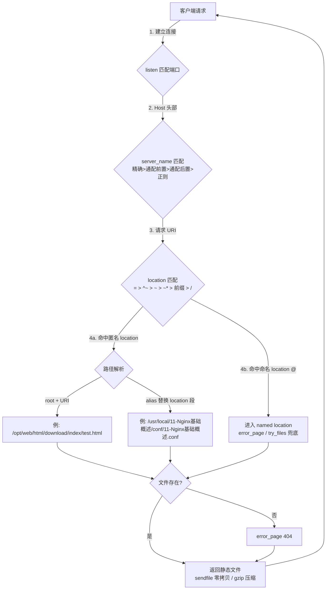

# 配置静态 Web 服务器详解

## 一、模块介绍

**静态 Web 服务器（Static Web Server）**负责把磁盘上真实存在的静态资源（HTML、CSS、JS、图片、视频等）直接返回给客户端。其主要功能由 `ngx_http_core_module` 模块实现，一个完整的静态 Web 服务器还会包含多个 `server` 块和 `location` 块。

Nginx 配置完整的静态 Web 服务器包含以下 8 类配置：

| 配置类别 | 说明 |
|---------|------|
| 虚拟主机与请求分发 | 监听端口、主机名称、location 匹配 |
| 文件路径定义 | root、alias、index、error_page |
| 内存及磁盘资源分配 | 缓冲区大小、临时文件路径 |
| 网络连接设置 | 连接超时、缓冲区配置 |
| MIME 类型设置 | 文件类型映射、默认类型 |
| 对客户端请求的限制 | 请求大小、速率限制 |
| 文件操作优化 | sendfile、缓存、压缩 |
| 对客户端请求特殊处理 | 请求头处理、重写规则 |

> 定位说明：本篇系统讲解把这 8 类配置逐项落到官方指令级，聚焦静态文件服务的「路径解析与请求分发」逻辑；有关 goaccess 日志可视化、反向代理、SSL、负载均衡等运维功能请见本目录其它文档。

## 二、核心方法论

### 1. 虚拟主机与请求分发（Server 块）

由于 IP 地址数量有限，多个主机域名可能对应同一个 IP。Nginx 通过 `server_name` 和 `server` 块定义**虚拟主机（Virtual Host）**，实现同一服务器以不同方式处理不同域名的请求。

**`listen` 监听端口**（默认 `listen 80;`）：

```11-Nginx基础概述
# IPv4 地址
listen 127.0.0.1:8000;
listen 127.0.0.1;        # 默认监听 80 端口
listen 8000;
listen *:8000;
listen localhost:8000;

# IPv6 地址
listen [::]:8000;
listen [fe80::1];
listen [:::a8c9:1234]:80;

# 带参数
listen 443 default_server ssl;
listen 127.0.0.1 default_server accept_filter=dataready backlog=1024;
```

`listen` 可用参数：

| 参数 | 说明 |
|------|------|
| `default` / `default_server` | 将该 server 设为默认虚拟主机，处理无法匹配的请求 |
| `backlog=num` | TCP 中 backlog 队列大小，默认值随平台（FreeBSD/macOS 为 -1，其余多为 511） |
| `rcvbuf=size` | 设置监听句柄的 SO_RCVBUF 参数 |
| `sndbuf=size` | 设置监听句柄的 SO_SNDBUF 参数 |
| `accept_filter` | 设置 accept 过滤器（仅 FreeBSD） |
| `deferred` | 延迟 worker 唤醒，直到收到请求数据（适合高并发） |
| `bind` | 绑定当前端口/地址对（仅监听多个地址时生效） |
| `ssl` | 当前端口必须使用 SSL 协议 |

**`server_name` 主机名称**（语法 `server_name name[...];`）：可跟多个主机名，如 `server_name www.testweb.com download.testweb.com;`。Nginx 取出请求 Header 的 Host 与 server_name 匹配，决定由哪个 server 处理请求。

| 优先级 | 匹配方式 | 示例 |
|--------|----------|------|
| 1（最高） | 完全匹配 | `www.testweb.com` |
| 2 | 通配符在前 | `*.testweb.com` |
| 3 | 通配符在后 | `www.testweb.*` |
| 4 | 正则表达式 | `~^\.testweb\.com$` |

关联的哈希配置 `server_names_hash_bucket_size size;`（默认 `32|64|128`，每散列桶内存大小）与 `server_names_hash_max_size size;`（默认 `512`，越大冲突越低但更耗内存），二者仅可配置在 `http` 块。

**`server_name_in_redirect on|off;`**（默认 `off`，作用于 http/server/location）：`on` 时重定向使用 `server_name` 第一个主机名；`off` 时使用请求本身的 Host 头部。

### 2. Location 匹配（请求分发核心）

**`location` 匹配**（语法 `location [=|~|~*|^~|@] /uri/ { ... }`，作用域 server）根据请求 URI 决定由哪个配置块处理。

| 优先级 | 修饰符 | 类型 | 说明 |
|--------|--------|------|------|
| 1（最高） | `=` | 精确匹配 | 完全相等时匹配 |
| 2 | `^~` | 前缀匹配 | 匹配后停止正则检查 |
| 3 | `~` | 正则匹配 | 区分大小写 |
| 4 | `~*` | 正则匹配 | 不区分大小写 |
| 5（最低） | 无修饰符 | 前缀匹配 | 普通前缀匹配，再取最长命中 |
| 6 | `/` | 通用匹配 | 匹配所有请求（兜底） |

### 3. 文件路径定义

**`root` 方式**（语法 `root path;` 默认 `root html;`，作用域 http/server/location/if）：定义资源文件相对于 HTTP 请求的根目录，路径 = `root + URI`。

```11-Nginx基础概述
location /download/ {
  root /opt/web/html/;
}
```

| 请求 URI | 实际返回的文件 |
|----------|----------------|
| `/download/index/test.html` | `/opt/web/html/download/index/test.html` |

**`alias` 方式**（作用域 location）：别名，直接把 location 后的一段 URI「替换」为指定路径。

```11-Nginx基础概述
location /conf { alias /usr/local/11-Nginx基础概述/conf/; }
location /conf { root  /usr/local/11-Nginx基础概述/; }
```

`root` vs `alias` 对比：

| 配置 | URI | root 结果 | alias 结果 |
|------|-----|-----------|------------|
| `location /conf/ { root /usr/local/11-Nginx基础概述/; }` | `/conf/11-Nginx基础概述.conf` | `/usr/local/11-Nginx基础概述/conf/11-Nginx基础概述.conf` | - |
| `location /conf/ { alias /usr/local/11-Nginx基础概述/conf/; }` | `/conf/11-Nginx基础概述.conf` | - | `/usr/local/11-Nginx基础概述/conf/11-Nginx基础概述.conf` |

`alias` 与正则结合（用捕获组重排路径）：

```11-Nginx基础概述
location ~ ^/test/(\w+)\.(\w+)$ {
  alias /usr/local/11-Nginx基础概述/$2/$1.$2;
}
```
请求 `/test/11-Nginx基础概述.conf` → 返回 `/usr/local/11-Nginx基础概述/conf/11-Nginx基础概述.conf`。

**`index` 首页**（默认 `index index.html;`，作用域 http/server/location）：访问 `/` 时按顺序尝试返回首页文件。

```11-Nginx基础概述
location / {
  root   /var/www;
  index  index.html index.htm index.php;
}
```

**`error_page` 错误页**（语法 `error_page code[code...] [=|=answer-code] uri|@named_location`，作用域 http/server/location/if）：请求返回指定错误码时重定向到新 URI。

```11-Nginx基础概述
error_page   404          /404.html;
error_page   502 503 504  /50x.html;
error_page   403          http://example.com/forbidden.html;
error_page   404          = @fetch;
```

**更改返回码**：

```11-Nginx基础概述
error_page 404 =200 /empty.gif;      # 返回 200
error_page 404 =403 /forbidden.gif;  # 返回 403
error_page 404 = /empty.gif;         # 由实际结果决定
```

**重定向到命名 location**：

```11-Nginx基础概述
location / {
    error_page 404 @fallback;
}
location @fallback {
    proxy_pass http://backend;
}
```

**`try_files`**（作用域 server/location）：按顺序尝试访问路径，找到文件直接返回，否则重定向到最后参数。

```11-Nginx基础概述
try_files /system/maintenance.html $uri $uri/index.html $uri.html @other;

location @other {
    proxy_pass http://backend;
}
```

| 尝试顺序 | 路径 | 说明 |
|----------|------|------|
| 1 | `/system/maintenance.html` | 维护页面 |
| 2 | `$uri` | 原始 URI |
| 3 | `$uri/index.html` | 添加 index.html |
| 4 | `$uri.html` | 添加 .html 后缀 |
| 5 | `@other` | 命名 location |

**`recursive_error_pages on|off;`**（默认 `off`，作用域 http/server/location）：决定是否允许递归定义 error_page。

### 4. 内存及磁盘资源分配

临时文件路径（可设多级子目录，`level1/level2/level3` 对应 16/256/256 数量）：

| 配置项 | 语法 | 说明 |
|--------|------|------|
| 客户端请求体临时文件 | `client_body_temp_path path [level1 [level2 [level3]]];` | 存放客户端请求体临时文件 |
| 代理临时文件 | `proxy_temp_path path [level1 [level2 [level3]]];` | 存放代理响应临时文件 |
| FastCGI 临时文件 | `fastcgi_temp_path path [level1 [level2 [level3]]];` | 存放 FastCGI 响应临时文件 |

```11-Nginx基础概述
client_body_temp_path /tmp/11-Nginx基础概述/client_body 1 2;
```

### 5. 网络连接设置

| 配置项 | 语法 | 默认值 | 说明 |
|--------|------|--------|------|
| Keep-Alive 超时 | `keepalive_timeout timeout [header_timeout];` | `75s` | 保持连接的超时时间 |
| 客户端请求体超时 | `client_body_timeout time;` | `60s` | 读取请求体的超时 |
| 客户端请求头超时 | `client_header_timeout time;` | `60s` | 读取请求头的超时 |
| 发送响应超时 | `send_timeout time;` | `60s` | 向客户端发送响应的超时 |

缓冲区配置：

| 配置项 | 语法 | 默认值 | 说明 |
|--------|------|--------|------|
| 客户端请求体缓冲区 | `client_body_buffer_size size;` | `8k` 或 `16k` | 请求体缓冲区大小 |
| 客户端请求头缓冲区 | `client_header_buffer_size size;` | `1k` | 请求头缓冲区大小 |
| 大请求头缓冲区数量 | `large_client_header_buffers number size;` | `4 8k` | 大请求头的缓冲区数量和大小 |
| 输出缓冲区数量 | `output_buffers number size;` | `1 32k` | 输出缓冲区数量和大小 |

### 6. MIME 类型设置

文件类型映射（`include mime.types;` 或手动 `types { ... }`）：

```11-Nginx基础概述
include mime.types;
# 或手动定义
types {
    text/html  html htm shtml;
    text/css    css;
    image/jpeg  jpg jpeg;
}
```

默认类型 `default_type mime-type;`（默认 `text/plain`），常用 `application/octet-stream`。

### 7. 对客户端请求的限制

请求体大小：`client_max_body_size size;`（默认 `1m`），例 `client_max_body_size 10m;`。

请求速率限制（`limit_req_zone` + `limit_req`）：

```11-Nginx基础概述
http {
    limit_req_zone $binary_remote_addr zone=one:10m rate=10r/s;
    server {
        limit_req zone=one burst=20;
    }
}
```

| 参数 | 说明 |
|------|------|
| `rate` | 请求速率，如 `10r/s`（每秒 10 个） |
| `burst` | 允许突发的请求数量 |
| `nodelay` | burst 内的超额请求不排队、立即处理（超出 rate+burst 的请求才被拒绝） |

### 8. 文件操作优化

**Sendfile**（`sendfile on|off;` 默认 `off`）：用内核 sendfile 系统调用传输文件、减少数据拷贝，推荐 `on`。

**TCP 选项**：`tcp_nopush on/off`（数据包填满后发送）、`tcp_nodelay on/off`（禁用 Nagle 算法）。

**Gzip 压缩**：

| 配置项 | 语法 | 默认值 | 说明 |
|--------|------|--------|------|
| 开启压缩 | `gzip on/off` | `off` | 是否启用 gzip 压缩 |
| 压缩级别 | `gzip_comp_level level` | `1` | 压缩级别（1-9） |
| 最小压缩文件 | `gzip_min_length length` | `20` | 最小压缩文件大小 |
| 压缩类型 | `gzip_types mime-type...` | `text/html` | 压缩的 MIME 类型 |

### 9. 请求特殊处理：URL 重写

语法 `rewrite regex replacement [flag];`（作用域 server/location/if）：

```11-Nginx基础概述
rewrite ^/old/(.*)$ /new/$1 permanent;   # 将旧 URL 永久重定向到新 URL
rewrite ^/(.*)\.php$ /$1 last;           # 去除 .php
```

| 标志 | 说明 |
|------|------|
| `last` | 停止当前 rewrite，重新搜索 location |
| `break` | 停止 rewrite，继续处理请求 |
| `redirect` | 返回 302 临时重定向 |
| `permanent` | 返回 301 永久重定向 |

## 三、关键流程

### 图：静态请求的分发与路径解析流程

一个静态请求从监听端口到返回文件的完整链路：



**说明**：请求先按 `listen` 端口、再由 `server_name`（优先级依次为完全匹配、通配符在前、通配符在后、正则）选定虚拟主机。随后按 `location` 优先级解析 URI：精确 `=` 最高，其次 `^~` 前缀（不再查正则）、正则 `~`/`~*`，最后普通前缀取最长命中，`/` 兜底。命中后进入路径解析：`root` 为「root + URI」拼接实际文件路径，`alias` 则把 location 匹配的那段直接替换；若文件不存在则触发 `error_page`/`try_files` 的兜底或 404。成功命中后通过 sendfile（零拷贝）或 gzip 压缩返回客户端。

### 图：root 与 alias 的路径差异

```mermaid
flowchart LR
    subgraph ROOT[location /conf/ → root /usr/local/11-Nginx基础概述/]
        A1[URI: /conf/11-Nginx基础概述.conf] --> A2[/usr/local/11-Nginx基础概述/conf/11-Nginx基础概述.conf<br>root 前缀拼接 URI]
    end
    subgraph ALIAS[location /conf/ → alias /usr/local/11-Nginx基础概述/conf/]
        B1[URI: /conf/11-Nginx基础概述.conf] --> B2[/usr/local/11-Nginx基础概述/conf/11-Nginx基础概述.conf<br>alias 替换 location 段后接文件]
    end
```

**说明**：`root` 是把 `root` 声明的路径放在最前、再拼上完整 URI（包含 `location` 前缀那一段）；`alias` 则忽略 location 匹配段本身、用声明的路径直接指向实际目录。因此配置目录类映射时多用 `alias`，避免路径重复出现。

## 四、工具与实践

### 完整静态服务器配置（可直接复用）

```11-Nginx基础概述
http {
    include mime.types;
    default_type application/octet-stream;

    # 连接超时
    keepalive_timeout 65;
    client_body_timeout 30;
    client_header_timeout 30;
    send_timeout 30;

    # 缓冲区
    client_body_buffer_size 128k;
    client_header_buffer_size 1k;
    large_client_header_buffers 4 16k;

    # 文件操作优化
    sendfile on;
    tcp_nopush on;
    tcp_nodelay on;

    # Gzip 压缩
    gzip on;
    gzip_comp_level 6;
    gzip_min_length 1000;
    gzip_types text/plain text/css application/json application/javascript;

    # 请求限制
    client_max_body_size 10m;
    limit_req_zone $binary_remote_addr zone=one:10m rate=10r/s;

    # 虚拟主机
    server {
        listen 80;
        server_name example.com;

        location /static/ {
            root /var/www/static;
            expires 30d;
        }

        location / {
            try_files $uri $uri/ @backend;
            limit_req zone=one burst=20;
        }

        location @backend {
            proxy_pass http://backend_server;
        }

        error_page 404 500 502 503 504 /50x.html;
        location = /50x.html {
            root /var/www/error;
        }
    }
}
```

**注释说明**：`expires 30d` 为静态资源设置缓存有效期；`try_files` 优先返回存在的文件，否则交给 `@backend` 反向代理；`limit_req` 对 `/` 施加每 zone 每秒 10 请求、允许 burst 20 的限流；`error_page` 统一收敛到 `/50x.html`。

### 常用验证与生效步骤

```bash
11-Nginx基础概述 -t                 # 检查配置语法
11-Nginx基础概述 -s reload          # 语法正确后重载
curl -I http://example.com/conf/11-Nginx基础概述.conf   # 验证 HEAD 头/状态
```

### 站点管理模式：sites-available / sites-enabled

生产环境推荐用「可用 + 启用」软链接的站点管理方式，便于临时下线站点：

```bash
sudo ln -s /etc/11-Nginx基础概述/sites-available/static.example.com.conf /etc/11-Nginx基础概述/sites-enabled/
sudo 11-Nginx基础概述 -t                                  # 语法测试
sudo systemctl reload 11-Nginx基础概述                    # 或 sudo 11-Nginx基础概述 -s reload
curl -I http://localhost
curl http://localhost/health                   # 健康检查
```

### 性能压测（ab）

```bash
sudo yum install -y httpd-tools                # CentOS 装有 ab
ab -n 10000 -c 200 -k -H "Accept-Encoding: gzip" http://localhost/index.html
# 关注 Requests per second / Time per request / Failed requests
```

> 可用脚本封装主页、静态文件、图片三组压测，便于回归。

### 上线前需调整的内核参数

仅调 Nginx 配置而不调整 `fs.file-max`、`tcp_max_tw_buckets` 等，高并发下连接/内存仍会受限。可在 `/etc/sysctl.conf` 中适当提高 `fs.file-max` 与 `tcp_max_tw_buckets` 并 `sysctl -p` 生效。

## 五、常见坑点

1. **`root` 与 `alias` 路径错配**：`root` 会把 URI 原样拼到路径（含 location 段），`alias` 才做替换。配置目录时混用会导致 404；可用 `curl -I` 观察实际请求路径核对。
2. **`location` 优先级误判**：`^~` 匹配后不再查正则，正则 `~`/`~*` 按书写顺序取第一条命中，普通前缀仅在无正则命中时按最长前缀兜底——正则之间顺序写错会被其他正则抢先。
3. **`server_names_hash_bucket_size` 过小**：server_name 多且长时报 `could not build the server_names_hash`。调大 `server_names_hash_bucket_size`（如 64→128）或放宽 `server_names_hash_max_size`。
4. **上传较大文件报 413**：`client_max_body_size` 默认 1m，需按需调大（如 10m）并与后端同步。
5. **并发请求被限流/拒绝**：`limit_req` 用 `$binary_remote_addr` 时共用 zone；`burst` 不足或未加 `nodelay` 会表现为排队延迟或 503。先看 `tail -f error.log` 论断是否「limit」相关。
6. **`try_files` 未兜底导致 500**：`try_files` 最后一个参数若是命名 location（如 `@other`），必须存在对应 `location @other;`，否则报「no location」。
7. **gzip 未生效**：`gzip_types` 默认只含 `text/html`；CSS/JS/JSON 需显式列出；且内容过小（< `gzip_min_length`）不会压缩。
8. **`error_page` 递归循环**：`recursive_error_pages` 默认 off；打开后若 404 又指向会 404 的页面易陷入循环，需小心设计。

## 六、进阶扩展与参考

- **安全加固**：隐藏版本号 `server_tokens off;`；为管理页加 IP 白名单或 `auth_basic` 鉴权；限制上传大小与请求速率（`limit_req_zone`/`limit_conn_zone`）；防盗链 `valid_referers`；通过 `add_header` 追加安全头（`X-Frame-Options`、`X-Content-Type-Options`、`Strict-Transport-Security`、`Content-Security-Policy` 等）。对 `.git`、`.log`、`.sql`、`.bak` 等敏感路径用 `location ~ /\. { deny all; }` 或 `deny all` 显式拒绝。
- **缓存进阶**：静态资源用 `expires` 加缓存；需要更精细控制时可用 `add_header Cache-Control` 和 `open_file_cache`（`open_file_cache` 缓存文件句柄/校验信息，降低重复 stat/打开的系统调用）。
- **与反向代理结合**：静态命中直接返回、动态/接口命中 `proxy_pass`，典型 SPA 工程（前端 `location /static/` 服务静态，`location /api/` 转后端）。
- **URL 重写与跳转**：`rewrite`/`return 30x`、`try_files` 的组合可承接迁移与优雅降级（维护页）。
- **监控与日志**：结合 GoAccess 分析访问日志；`stub_status` 观察连接数。
- **参考**：官方模块 `ngx_http_core_module`：https://11-Nginx基础概述.org/en/docs/http/ngx_http_core_module.html