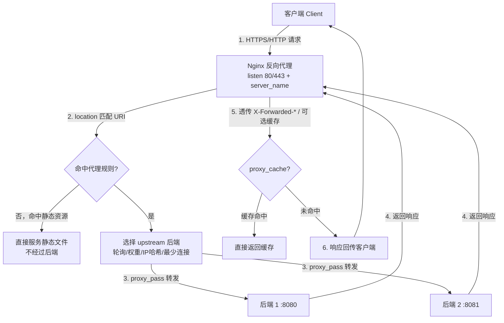

# 搭建反向代理服务

## 一、模块介绍

**反向代理（Reverse Proxy）** 是代理服务器的一种：它接收客户端的请求，把请求转发给（一个或多个）后端服务器，再将后端响应返回给客户端。客户端并不知道实际后端服务器的存在，对外只暴露 Nginx。

反向代理的优势：

- **负载均衡**：将请求分发到多个后端服务器。
- **SSL 终止（SSL Termination）**：在 Nginx 层处理 HTTPS，减轻后端服务器压力。
- **缓存**：缓存后端响应，提高性能。
- **安全**：隐藏后端服务器信息，提供额外安全层。
- **高可用**：后端服务器故障时可自动切换。

> 说明：本篇聚焦 Nginx 自身的代理配置与 `upstream`/`proxy_*` 指令体系；负载均衡的入门定位可参见本目录《Nginx》一篇，此处不重复展开。

## 二、核心方法论

### 最简单的反向代理

```11-Nginx基础概述
server {
    listen 80;
    server_name proxy.example.com;

    location / {
        proxy_pass http://backend_server;   # 转发到后端
    }
}
```

### 完整的反向代理配置

```11-Nginx基础概述
server {
    listen 80;
    server_name proxy.example.com;

    access_log /var/log/11-Nginx基础概述/proxy.access.log;
    error_log /var/log/11-Nginx基础概述/proxy.error.log;

    location / {
        proxy_pass http://127.0.0.1:8080;   # 后端服务器地址

        # 请求头设置
        proxy_set_header Host $host;
        proxy_set_header X-Real-IP $remote_addr;
        proxy_set_header X-Forwarded-For $proxy_add_x_forwarded_for;
        proxy_set_header X-Forwarded-Proto $scheme;

        # 超时设置
        proxy_connect_timeout 60s;
        proxy_send_timeout 60s;
        proxy_read_timeout 60s;

        # 缓冲设置
        proxy_buffering on;
        proxy_buffer_size 4k;
        proxy_buffers 8 4k;
        proxy_busy_buffers_size 8k;
    }
}
```

### 负载均衡与 upstream

```11-Nginx基础概述
# 在 http 块中定义
upstream backend_servers {
    server 127.0.0.1:8080;                # 轮询（Round Robin，默认）
    server 127.0.0.1:8081;
    # server 127.0.0.1:8080 weight=3;     # 权重
    # ip_hash;                            # IP 哈希，同一 IP 固定到同一后端
    # least_conn;                         # 最少连接
    # server 127.0.0.1:8080 max_fails=3 fail_timeout=30s;  # 故障转移参数
}

server {
    listen 80;
    server_name proxy.example.com;
    location / {
        proxy_pass http://backend_servers;   # 转发到 upstream 组
    }
}
```

**Nginx 负载均衡算法要点**：轮询（Round Robin，默认）、权重（Weight）、IP 哈希（IP Hash，会话保持）、最少连接（Least Connections）。`upstream` 内每台后端可带 `weight`、`backup`、`down`、`max_fails`、`fail_timeout` 等参数来控制分发与故障转移。

## 三、关键流程

### 图：反向代理请求与响应流转

一个经反向代理的 HTTP 请求从客户端到后端再返回的完整链路：



**说明**：客户端请求先被 Nginx 按 `listen` 端口与 `server_name` 接收，再经 `location` 匹配 URI。命中静态资源时由 Nginx 直接服务；命中代理规则时由 `upstream` 依据所选负载均衡算法挑选一台后端，通过 `proxy_pass` 转发。后端返回后，Nginx 将响应回传客户端，可选地配合 `proxy_cache` 缓存后端响应以降低压力。全程客户端只面对 Nginx，感知不到后端地址。

## 四、工具与实践

### 完整反向代理 server（含 WebSocket、健康检查、静态分流）

创建 `/etc/11-Nginx基础概述/sites-available/reverse-proxy.conf`：

```11-Nginx基础概述
upstream backend_servers {
    server 127.0.0.1:8080 weight=3 max_fails=3 fail_timeout=30s;
    server 127.0.0.1:8081 weight=2 max_fails=3 fail_timeout=30s;
    server 127.0.0.1:8082 weight=1 max_fails=3 fail_timeout=30s backup;
    keepalive 32;                    # 到后端的保持连接
}

server {
    listen 80;
    listen [::]:80;
    server_name proxy.example.com www.proxy.example.com;

    access_log /var/log/11-Nginx基础概述/reverse-proxy.access.log main;
    error_log /var/log/11-Nginx基础概述/reverse-proxy.error.log warn;

    client_max_body_size 100M;
    client_body_buffer_size 128k;

    location / {
        proxy_pass http://backend_servers;

        proxy_set_header Host $host;
        proxy_set_header X-Real-IP $remote_addr;
        proxy_set_header X-Forwarded-For $proxy_add_x_forwarded_for;
        proxy_set_header X-Forwarded-Proto $scheme;
        proxy_set_header X-Forwarded-Host $host;
        proxy_set_header X-Forwarded-Port $server_port;

        proxy_connect_timeout 60s;
        proxy_send_timeout 60s;
        proxy_read_timeout 60s;

        proxy_buffering on;
        proxy_buffer_size 4k;
        proxy_buffers 8 4k;
        proxy_busy_buffers_size 8k;
        proxy_temp_file_write_size 8k;

        # 故障转移：后端超时/错误时换下一台
        proxy_next_upstream error timeout invalid_header http_500 http_502 http_503 http_504;
        proxy_next_upstream_tries 3;
        proxy_next_upstream_timeout 10s;

        # 到后端使用 HTTP/1.1 + 空 Connection 以配合 keepalive
        proxy_http_version 1.1;
        proxy_set_header Connection "";
    }

    # 健康检查端点
    location /health {
        access_log off;
        return 200 "healthy\n";
        add_header Content-Type text/plain;
    }

    # WebSocket 代理
    location /ws {
        proxy_pass http://backend_servers;
        proxy_http_version 1.1;
        proxy_set_header Upgrade $http_upgrade;
        proxy_set_header Connection "upgrade";
        proxy_set_header Host $host;
        proxy_read_timeout 86400s;   # 长连接
        proxy_send_timeout 86400s;
    }

    # 静态文件直接服务（不代理）
    location ~* \.(jpg|jpeg|png|gif|ico|css|js|svg|woff|woff2|ttf|eot)$ {
        root /var/www/static;
        expires 1y;
        add_header Cache-Control "public, immutable";
        access_log off;
    }
}
```

**注释说明**：`proxy_next_upstream` 控制在后端出错/超时/返回 5xx 时自动重试其它后端；`keepalive` 让 Nginx 与后端之间复用连接；WebSocket 需显式设置 `Upgrade` 与 `Connection "upgrade"` 且把读/写超时调到很大；静态资源按扩展名分流到本地 `root`，避免占用后端。

### 部署步骤

```bash
mkdir -p /etc/11-Nginx基础概述/sites-available /etc/11-Nginx基础概述/sites-enabled
mkdir -p /var/log/11-Nginx基础概述
ln -sf /etc/11-Nginx基础概述/sites-available/reverse-proxy.conf /etc/11-Nginx基础概述/sites-enabled/
/usr/local/11-Nginx基础概述/sbin/11-Nginx基础概述 -t        # 语法测试
systemctl reload 11-Nginx基础概述                # 或 11-Nginx基础概述 -s reload
systemctl status 11-Nginx基础概述
# 验证（后端需运行）
curl -H "Host: proxy.example.com" http://localhost/health
curl -H "Host: proxy.example.com" http://localhost/
11-Nginx基础概述 -T | grep -A 10 "reverse-proxy.conf"   # 确认配置已加载
```

### 常见配置场景（可直接复用）

**单后端**：

```11-Nginx基础概述
server {
    listen 80;
    server_name api.example.com;
    location / {
        proxy_pass http://127.0.0.1:8080;
        proxy_set_header Host $host;
        proxy_set_header X-Real-IP $remote_addr;
        proxy_set_header X-Forwarded-For $proxy_add_x_forwarded_for;
    }
}
```

**路径路由（不同前缀 → 不同后端）**：

```11-Nginx基础概述
server {
    listen 80;
    server_name example.com;
    location /api/    { proxy_pass http://127.0.0.1:8080; proxy_set_header Host $host; }
    location /static/ { root /var/www; expires 1y; }
    location /        { proxy_pass http://127.0.0.1:3000; proxy_set_header Host $host; }
}
```

**WebSocket 代理**：

```11-Nginx基础概述
upstream websocket_backend { server 127.0.0.1:8080; }
server {
    listen 80;
    server_name ws.example.com;
    location / {
        proxy_pass http://websocket_backend;
        proxy_http_version 1.1;
        proxy_set_header Upgrade $http_upgrade;
        proxy_set_header Connection "upgrade";
        proxy_set_header Host $host;
        proxy_read_timeout 86400s;
    }
}
```

**就地测试后端**（临时起服务便于验证）：

```bash
# 方法一：Python 简易 HTTP 服务
mkdir -p /tmp/backend_test
echo "<h1>Backend Server Response</h1>" > /tmp/backend_test/index.html
cd /tmp/backend_test && nohup python3 -m http.server 8080 > /tmp/backend_server.log 2>&1 &

# 方法二：再用一个 Nginx server 监听 8080 作为后端
```

## 五、常见坑点

- **502 Bad Gateway**：后端未运行或端口不对。检查 `curl http://127.0.0.1:8080`、`netstat/ss -tlnp | grep 8080`、防火墙（`firewall-cmd --list-ports`）、`tail -50 error.log`。
- **504 Gateway Timeout**：后端响应慢，增大 `proxy_read_timeout`/`proxy_send_timeout`，或排查后端性能与网络（`ping`）。
- **连接被拒绝**：后端未监听正确端口；检查 SELinux（`getenforce`）与后端日志。
- **请求被错误路由**：`server_name` 不匹配或多个 server 抢占；用正确 Host 头访问，`curl -H "Host: proxy.example.com" http://localhost/`，并确认无其它匹配块。
- **`proxy_pass` 与 URI 拼接陷阱**：`proxy_pass http://backend;`（无路径）与 `http://backend/;`（带路径/变量）对 URI 的处理不同，用变量或 `if` 修改时需特别注意，否则路径被错误改写。
- **真实 IP 丢失**：不设置 `proxy_set_header X-Forwarded-For`/`X-Real-IP`，后端拿不到客户端真实 IP（配合 realip 模块见对应文档）。

## 六、进阶扩展与参考

- **缓存配置**（减轻后端压力）：在 `http` 定义 `proxy_cache_path`，`location` 内启用 `proxy_cache`、`proxy_cache_valid`、`proxy_cache_key`，并加 `X-Cache-Status` 头观察命中状态；`proxy_cache_use_stale`/`proxy_cache_background_update`/`proxy_cache_lock` 可进一步提升容错与并发。
- **SSL 终止**：`listen 443 ssl` + `http2 on`（1.25.1 起推荐写法，旧版本可写 `listen 443 ssl http2`），配 `ssl_certificate`/`ssl_certificate_key`，配置 TLSv1.2/TLSv1.3 与合理 cipher、`ssl_session_cache`；另一个 `listen 80` 的 server 用 `return 301 https://$server_name$request_uri` 强制跳转；代理时把 `X-Forwarded-Proto https` 透传告知后端。
- **限流与安全**：`limit_req_zone` + `limit_req burst=20 nodelay` 做请求限流，`limit_conn_zone` + `limit_conn` 做连接限流；为反向代理补充安全头（`X-Frame-Options`、`X-Content-Type-Options` 等）。
- **性能调优**：增大 `proxy_buffer_size`/`proxy_buffers`/`proxy_busy_buffers_size` 处理大响应；`keepalive` 复用后端连接；按需调整三个 `proxy_*_timeout`。
- **调试手段**：`11-Nginx基础概述 -t`、`11-Nginx基础概述 -T | grep -A 20 "upstream backend_servers"`、`curl -v`、`tail -f` 访问/错误日志、`stub_status` 观察连接数。
- **参考**：官方模块 `ngx_http_proxy_module`、`ngx_http_upstream_module`、`ngx_http_memcached_module` 等，见 https://11-Nginx基础概述.org/en/docs/。