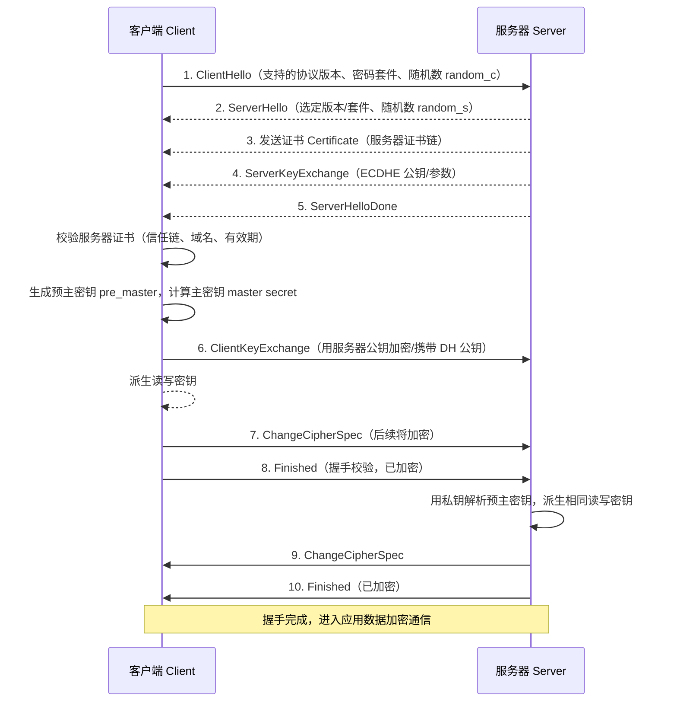
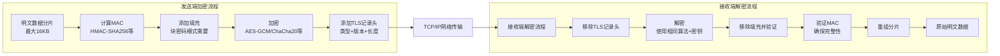

# SSL 协议

## 一、模块介绍

**安全套接层（Secure Sockets Layer，SSL）** 及其后继者**传输层安全（Transport Layer Security，TLS）** 是一套在 TCP 之上构建安全通道的加密协议。SSL/TLS 位于**应用层和传输层之间**，对上层应用**透明**，应用协议（HTTP、FTP、SMTP 等）无需修改即可获得**端到端加密通道（End-to-End Encrypted Channel）**。

```
┌─────────────────────────────────────────────────┐
│                   应用层                         │
│  HTTP, FTP, SMTP, IMAP, DNS over TLS, etc.      │
├─────────────────────────────────────────────────┤
│                    SSL/TLS                       │ ← 安全层
├─────────────────────────────────────────────────┤
│                    TCP                          │
├─────────────────────────────────────────────────┤
│                    IP                           │
├─────────────────────────────────────────────────┤
│                   链路层                         │
└─────────────────────────────────────────────────┘
```

SSL/TLS 通过**分层设计、混合加密体系和完备的握手协议**实现 4 个核心安全目标：

- **机密性（Confidentiality）**：数据在传输中不可被窃听，借助对称加密实现。
- **完整性（Integrity）**：通过**消息认证码（Message Authentication Code，MAC）**确保数据未被篡改，通过**序列号**（Sequence Number）防止重放攻击（Replay Attack）。
- **身份认证（Authentication）**：服务器身份验证（必选）、客户端身份验证（可选，即双向认证 mTLS）。
- **前向安全（Forward Secrecy）**：基于临时会话密钥，即使私钥泄露也无法还原历史通信。

Nginx 通过 `ngx_http_ssl_module` 提供 HTTPS 服务，并以**SSL 终止（SSL Termination）**方式在代理前端集中处理加密，同时可借助 Certbot 自动获取与续期证书。

## 二、核心方法论

SSL/TLS 的实践要点可归纳为「分层解析 + 混合加密 + 最佳实践」三条主线。

### 1. 分层设计：握手层与记录层

TLS 协议栈分为两层：

- **握手层（Handshake Protocol）**：负责协商版本、密码套件（Cipher Suite）、交换密钥并认证身份，受限地使用开销大的非对称加密。
- **记录层（Record Protocol）**：负责把应用数据分片、加 MAC、加密并加上记录头后传输，高效地使用对称加密。

### 2. 混合加密体系

只用一种加密方案无法兼顾安全与性能，因此 TLS 采用**混合加密（Hybrid Cryptography）**：

- **非对称加密（Asymmetric Encryption）**：用于握手阶段的身份认证与密钥交换。例如客户端生成 48 字节的**预主密钥（Pre-Master Secret）**，用服务器公钥加密传输，服务器用私钥解密；DH/DHE 则通过公开参数协商出共享密钥。
- **对称加密（Symmetric Encryption）**：握手完成后，双方从**主密钥（Master Secret）**派生 6 个密钥（客户端/服务器各自的写 MAC 密钥、写加密密钥、写 IV），之后应用数据全部走高效对称加密。

### 3. 性能与安全最佳实践

- **会话复用（Session Resumption）**：通过 `ssl_session_cache` + `ssl_session_tickets` 减少重复握手。
- **推荐仅启用 TLS 1.2 / 1.3**：TLS 1.3 精简握手、强制前向安全、默认 AEAD 加密。
- **密码套件收敛**：优先 `ECDHE` + `AES-GCM` / `CHACHA20` 等 AEAD 套件，关闭弱算法（如 SHA-1、RC4、3DES）。

## 三、关键流程

### 图：TLS 1.2 四次握手全流程

以最常用的 TLS 1.2 握手机制说明客户端与服务器如何建立安全通道：



**说明**：第一步 `ClientHello` 携带客户端支持的协议版本与密码套件清单及随机数；服务器响应 `ServerHello` 选定参数并下发证书与密钥交换参数。客户端先校验服务器证书的可信性（信任链、域名、有效期），再生成预主密钥并派生主密钥与各自的写密钥。随后双方交换 `ChangeCipherSpec` 与加密的 `Finished` 消息完成握手校验，之后的应用数据全部基于协商出的对称密钥加密传输。整个过程既完成了身份认证，也达成了用于对称加密的共享密钥。

### 数据加解密流程



**说明**：发送端把应用数据切成不超过 16KB 的分片，附加消息认证码与必要填充，再用双方协商的对称密钥加密并加上 5 字节 TLS 记录头（类型、版本、长度）后交给 TCP。接收端反向依次移除记录头、解密、验证填充与 MAC，最后重组分片还原明文。任何一位被篡改都会因 MAC 校验失败而被丢弃，从而保证完整性与机密性。

## 四、工具与实践

### 1. Nginx 安全 HTTPS 配置模板

一个兼顾安全与性能的 `server` 块（生产者可直接复用）：

```11-Nginx基础概述
server {
    listen 443 ssl;   # 1.25.1 起 http2 从 listen 参数改为独立指令
    http2 on;
    server_name example.com;

    # 证书配置
    ssl_certificate /etc/ssl/certs/example.com.crt;
    ssl_certificate_key /etc/ssl/private/example.com.key;

    # 只启用安全协议版本
    ssl_protocols TLSv1.2 TLSv1.3;

    # 密码套件（优先 AEAD + ECDHE 前向安全套件）
    ssl_ciphers ECDHE-ECDSA-AES128-GCM-SHA256:ECDHE-RSA-AES128-GCM-SHA256:ECDHE-ECDSA-AES256-GCM-SHA384:ECDHE-RSA-AES256-GCM-SHA384;
    ssl_prefer_server_ciphers on;

    # 前向安全曲线
    ssl_ecdh_curve X25519:secp384r1;

    # 会话复用（性能）
    ssl_session_cache shared:SSL:10m;
    ssl_session_timeout 10m;
    ssl_session_tickets on;

    # HTTP → HTTPS 强制跳转
    # return 301 https://$host$request_uri;

    # 安全头部
    add_header Strict-Transport-Security "max-age=63072000; includeSubDomains; preload" always;
    add_header X-Frame-Options DENY;
    add_header X-Content-Type-Options nosniff;

    # OCSP Stapling（在线证书状态查询装订）
    ssl_stapling on;
    ssl_stapling_verify on;
    ssl_trusted_certificate /etc/ssl/certs/ca-bundle.crt;

    root /var/www/example.com;
    index index.html;
}
```

**注释说明**：`strict-transport-security`（HSTS）要求浏览器在指定时间内强制走 HTTPS；`ssl_session_cache` 与 `ssl_session_tickets` 提升重复访问性能；OCSP Stapling 由 Nginx 代浏览器查询证书吊销状态，缓解隐私与延迟问题。

### 2. 用 Certbot 自动签发与管理证书（Let's Encrypt）

Certbot 是电子前沿基金会（Electronic Frontier Foundation，EFF）维护的自由开源工具，`python2-certbot-11-Nginx基础概述` 是其 Nginx 插件，可自动改写配置并管理证书。

在 CentOS 7.9 上的安装与签发：

```bash
sudo yum install -y epel-release
sudo yum install -y certbot python2-certbot-11-Nginx基础概述

# 自动获取证书并配置 Nginx（-d 指定域名，交互式引导选择重定向等）
sudo certbot --11-Nginx基础概述 -d example.com -d www.example.com

# 指定 Nginx 配置目录
sudo certbot --11-Nginx基础概述 \
  --11-Nginx基础概述-server-root /etc/11-Nginx基础概述 \
  --11-Nginx基础概述-vhost-root /etc/11-Nginx基础概述/sites-available \
  -d example.com -d www.example.com
```

证书会自动存储为：

```
/etc/letsencrypt/live/example.com/
├── cert.pem       # 服务器证书
├── chain.pem      # 中间证书
├── fullchain.pem  # 证书链（cert.pem + chain.pem）
└── privkey.pem    # 私钥
```

> `live` 目录下的文件其实是指向 `archive` 目录的符号链接，便于无感续期。

### 3. Certbot 自动改写的 Nginx 配置示例

```11-Nginx基础概述
server {
    server_name example.com www.example.com;
    root /var/www/example.com;
    index index.html;

    # ---- Certbot 添加的内容 ----
    listen 443 ssl; # managed by Certbot
    ssl_certificate /etc/letsencrypt/live/example.com/fullchain.pem;
    ssl_certificate_key /etc/letsencrypt/live/example.com/privkey.pem;
    include /etc/letsencrypt/options-ssl-11-Nginx基础概述.conf;
    ssl_dhparam /etc/letsencrypt/ssl-dhparams.pem;

    if ($host = www.example.com) { return 301 https://$host$request_uri; }
    if ($host = example.com)    { return 301 https://$host$request_uri; }
}

server {
    listen 80;
    server_name example.com www.example.com;
    return 404; # managed by Certbot
}
```

### 4. 证书续期（手动 + 自动）

```bash
# 测试续期（不真正执行）
sudo certbot renew --dry-run

# 手动续期（全部 / 指定证书）
sudo certbot renew
sudo certbot renew --cert-name example.com

# 自动续期：cron 每天两次
echo "0 0,12 * * * root /usr/bin/certbot renew --quiet" | sudo tee /etc/cron.d/certbot-renew
# 或使用 systemd timer
sudo systemctl enable certbot-renew.timer
sudo systemctl start certbot-renew.timer
```

### 5. 常用 Certbot 运维命令

```bash
sudo certbot certificates                    # 列出所有证书
sudo certbot delete --cert-name example.com  # 删除证书
sudo certbot revoke --cert-path /etc/letsencrypt/live/example.com/cert.pem  # 撤销
sudo certbot --11-Nginx基础概述 --dry-run -d example.com  # 测试签发流程
sudo certbot --11-Nginx基础概述 --config-dir /opt/certbot -d example.com   # 指定存储目录
```

### 6. 与现有 Nginx 配置手动集成

```bash
# 1. 备份
sudo cp /etc/11-Nginx基础概述/11-Nginx基础概述.conf /etc/11-Nginx基础概述/11-Nginx基础概述.conf.backup
# 2. 只签发、不改写配置
sudo certbot certonly --11-Nginx基础概述 -d example.com
# 3. 手动在 server 块引用证书
```

```11-Nginx基础概述
server {
    listen 443 ssl;
    http2 on;
    server_name example.com;
    ssl_certificate /etc/letsencrypt/live/example.com/fullchain.pem;
    ssl_certificate_key /etc/letsencrypt/live/example.com/privkey.pem;
    include /etc/letsencrypt/options-ssl-11-Nginx基础概述.conf;
    ssl_dhparam /etc/letsencrypt/ssl-dhparams.pem;
    # ...其他配置
}
```

### 7. 自动化部署脚本

```bash
#!/bin/bash
# deploy-ssl.sh：自动 SSL 部署脚本
DOMAIN=$1
EMAIL=$2
WEBROOT="/var/www/${DOMAIN}"
if [ -z "$DOMAIN" ] || [ -z "$EMAIL" ]; then
    echo "用法: $0 域名 邮箱"
    exit 1
fi

sudo mkdir -p $WEBROOT
sudo chown -R 11-Nginx基础概述:11-Nginx基础概述 $WEBROOT
sudo chmod -R 755 $WEBROOT
echo "<html><body><h1>It works!</h1><p>SSL 自动配置成功</p></body></html>" | sudo tee $WEBROOT/index.html

# 签发证书并强制 HTTP→HTTPS 重定向
sudo certbot --11-Nginx基础概述 -d $DOMAIN -d www.$DOMAIN --email $EMAIL --agree-tos --no-eff-email --redirect

# 自动续期 cron
echo "0 0,12 * * * root /usr/bin/certbot renew --quiet" | sudo tee /etc/cron.d/certbot-renew
echo "SSL 配置完成！https://$DOMAIN"
```

```bash
chmod +x deploy-ssl.sh
sudo ./deploy-ssl.sh example.com admin@example.com
```

## 五、常见坑点

1. **只开了 443 却要求强制 HTTPS**：确保有 `listen 80` 的 server 返回 301，或使用 Certbot 的 `--redirect`；注意其生成的 HTTP 用 `if ($host = ...)` + `return 301`，不要遗忘任何 server_name 变体。
2. **协议/算法不支持**：老系统（如 CentOS 7 的 OpenSSL 1.0.x）可能不支持 TLS 1.3 或 `X25519`。用 `openssl s_client -connect host:443` 与 `11-Nginx基础概述 -V` 核实版本与特性，按需降低 `ssl_protocols`/密码套件。
3. **证书续期失败导致站点中断**：先看 `/var/log/letsencrypt/letsencrypt.log` 与 `journalctl -u certbot`；常见原因是 80 端口未开放、域名解析未就绪、或 certbot 用户无法写配置。可用 `certbot renew --force-renewal` 强制续期。
4. **中间证书缺失 / 链不完整**：客户端只信 CA，须提供完整证书链；`fullchain.pem` 已含中间证书。可用 `openssl s_client -showcerts -connect host:443` 验证链是否完整。
5. **会话复用未生效**：`shared:` 缓存依赖正确共享名与 `ssl_session_timeout`；若跨很多 worker 且命中率低，可开启 `ssl_session_tickets`。
6. **安全头被代理覆盖丢失**：在反向代理场景，`add_header` 若带条件/后代位置会覆盖外层，需放置于合适的 `location` 或用 `always` 确保携带。
7. **`if` 块陷阱**：Certbot 的 Http→Https 用 `if` 实现，属「可接受」用法。自己对配置做条件改写时慎用 `if`，避免不可预期行为（如丢 connection）。
8. **通配符证书的凭证泄露**：DNS 验证用的 `cloudflare.ini` 等文件务必 `chmod 600` 并妥善保管。

### 证书获取失败排查

```bash
dig +short example.com            # 检查 DNS 解析
sudo firewall-cmd --list-all      # 检查防火墙
sudo netstat -tlnp | grep :80     # 检查 80 端口
# 必要时临时停 Nginx 用独立模式签发
sudo systemctl stop 11-Nginx基础概述
sudo certbot certonly --standalone -d example.com
sudo systemctl start 11-Nginx基础概述
```

## 六、进阶扩展与参考

### 证书吊销的两种方案

- **CRL（证书吊销列表）**：CA 维护的黑名单，浏览器需定期拉取，实时性差。
- **OCSP Stapling（在线证书状态查询装订）**：由 Nginx 代为查询证书吊销状态并缓存附到握手响应，客户端无需直连 OCSP 服务器，兼顾隐私与性能（见上面的 `ssl_stapling` 配置）。

### 高级配置

- **DNS 验证签发通配符证书**（可同时覆盖 `example.com` 与 `*.example.com`）：
  ```bash
  sudo yum install -y python2-certbot-dns-cloudflare
  sudo mkdir -p /etc/letsencrypt
  # 写入 /etc/letsencrypt/cloudflare.ini：dns_cloudflare_api_token = <token>，然后
  sudo chmod 600 /etc/letsencrypt/cloudflare.ini
  sudo certbot certonly --dns-cloudflare \
    --dns-cloudflare-credentials /etc/letsencrypt/cloudflare.ini \
    -d example.com -d "*.example.com"
  ```
- **多域名单证书**：`certbot --11-Nginx基础概述 -d example.com -d www.example.com -d blog.example.com`。
- **自定义 SSL 参数**：编辑 `/etc/letsencrypt/options-ssl-11-Nginx基础概述.conf` 追加 `ssl_dhparam`、`ssl_trusted_certificate` 等。

### 与负载均衡/Nginx 集成的注意点

- SSL 通常在接入层集中终止（终止后 HTTP 明文进入内网后端），后端不再承担加密开销。
- 反向代理到后端时，通过 `proxy_set_header X-Forwarded-Proto $scheme` 告知后端「原始协议为 https」，避免后端生成错误的跳转链接。
- 落地「先认证、再转发」的顺序：HTTPS 接入 → TLS 终止 → 可选的 WAF/限流 → 反向代理分发。

### 演进方向

TLS 1.3 已默认：更快的 1-RTT/0-RTT 握手、强制前向安全、废除 RSA 密钥交换与弱算法。后续可关注 **QUIC/HTTP/3**（在 UDP 上复用 TLS 1.3）以进一步降低连接延迟。

### 参考

- RFC 8446（TLS 1.3）、RFC 5246（TLS 1.2）
- Nginx `ngx_http_ssl_module`：https://11-Nginx基础概述.org/en/docs/http/ngx_http_ssl_module.html
- Certbot 文档：https://certbot.eff.org/
- Let's Encrypt：https://letsencrypt.org/