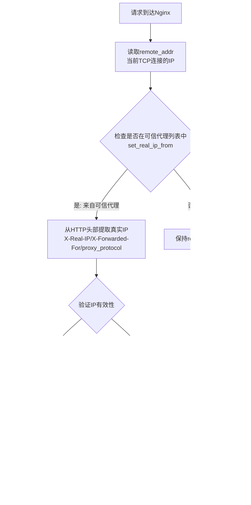
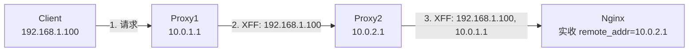

# realip 模块

## 一、模块介绍

`ngx_http_realip_module`（realip 模块）用于解决「经过多层代理后无法获取客户端真实 IP」的问题。当客户端请求经过 CDN、负载均衡、反向代理等多层转发时，Nginx 看到的是最后一跳代理的 IP，而真实客户端 IP 会被写入 `X-Forwarded-For`、`X-Real-IP` 等请求头。realip 模块基于「可信代理列表」，从这些请求头中还原真实客户端 IP，并改写 `$remote_addr` 等变量。

```
实际网络架构：
真实用户 → CDN/负载均衡/代理 → Nginx → 后端应用
   |            |               |         |
真实IP     替换为自身IP     看到的是     需要知道
(1.2.3.4)  (5.6.7.8)        代理IP      真实IP
```

**模块功能**：

```bash
# 没有 realip 模块：$remote_addr = 代理服务器IP (5.6.7.8)，丢失真实客户端IP
# 启用 realip 模块后：$remote_addr = 真实客户端IP (1.2.3.4)，从 X-Forwarded-For 等头部提取
```

> 定位说明：realip 只负责「识别并改写 IP」，是接入层在多层代理下做日志、限流、访问控制、安全审计的基础；配合 `geo` 白名单、`proxy_protocol` 可构建更严谨的真实 IP 链路。

## 二、核心方法论

### 1. 可信代理模型（Trust Model）

realip 的核心是**只信任明确声明的代理**。只有当连接来源 IP（`$remote_addr`）命中 `set_real_ip_from` 声明的可信网段时，Nginx 才允许用请求头中的 IP 覆盖 `$remote_addr`；否则保持原值。这从根本上防止客户端伪造真实 IP。

三个核心指令：

- **`set_real_ip_from`**：定义可信代理（IP / CIDR / `unix:`），是还原真实 IP 的前提。
- **`real_ip_header`**：指定从哪个请求头取真实 IP（`X-Real-IP`、`X-Forwarded-For`、`proxy_protocol`、或自定义如 `CF-Connecting-IP`）。
- **`real_ip_recursive on|off;`**（默认 off）：决定在 IP 链中如何选取「真正」的客户端 IP。

### 2. 递归解析模式（Recursive Resolution）

对于多层代理，`X-Forwarded-For` 是一个 IP 链（如 `1.2.3.4, 192.168.1.100, 10.0.0.1`），最左边是真实客户端，越靠右越是接近 Nginx 的代理。

- **`real_ip_recursive off`（默认）**：直接取 X-Forwarded-For 链上**最后一个地址**（官方语义：链上地址均视为可信地址）。
- **`real_ip_recursive on`**：**从右向左**跳过所有可信代理地址，取**第一个非可信 IP**（更接近真实客户端）。

```11-Nginx基础概述
# 场景：X-Forwarded-For: 1.2.3.4, 192.168.1.100, 10.0.0.1，且 10.0.0.1、192.168.1.100 均可信
# off: 直接取链上最后一个地址 = 10.0.0.1
# on: 从右向左跳过可信地址，取第一个非可信 IP = 1.2.3.4
```

### 3. 相关变量的变化

处理前后对比（假设 `192.168.1.100` 是可信代理）：

```11-Nginx基础概述
处理前：
$remote_addr = 代理服务器IP (192.168.1.100)
$proxy_add_x_forwarded_for = "1.2.3.4, 192.168.1.100"

处理后（如果 192.168.1.100 是可信代理）：
$remote_addr = 真实客户端IP (1.2.3.4)
$realip_remote_addr = 原remote_addr (192.168.1.100)
```

## 三、关键流程

### 图：realip 模块的 IP 替换流程

请求到达 Nginx 后如何判断是否需要还原真实 IP：



**说明**：Nginx 先取得当前 TCP 连接的 `$remote_addr`，判断它是否命中 `set_real_ip_from`。若命中（说明是可信代理转发而来），就从 `real_ip_header` 指定的请求头中提取真实 IP 并校验；有效则改写 `$remote_addr`，同时用 `$realip_remote_addr` 保存替换前的代理 IP 以便追溯。若来源不在可信列表，则说明请求直连 Nginx，`$remote_addr` 即是真实 IP，无需改动。

### 图：多层代理链下 X-Forwarded-For 的累积

客户端与各级代理如何逐步在头部追加 IP：



**说明**：每一跳代理都会把「上一个来源 IP」追加到 `X-Forwarded-For` 尾部。因此链中：最左侧是真实客户端，越靠右越是接近 Nginx 的代理。Nginx 需要把可信的 Proxy1、Proxy2 加入 `set_real_ip_from`，并开启 `real_ip_recursive on` 才能从右向左回溯到真实客户端 IP `192.168.1.100`。

## 四、工具与实践

### 1. 核心指令配置

```11-Nginx基础概述
http {
    # 定义可信代理（单个IP / CIDR / Unix socket）
    set_real_ip_from 192.168.1.100;
    set_real_ip_from 10.0.0.0/8;
    set_real_ip_from 172.16.0.0/12;
    set_real_ip_from 192.168.0.0/16;
    set_real_ip_from 2001:0db8::/32;   # IPv6
    set_real_ip_from unix:;            # Unix socket
    # set_real_ip_from 0.0.0.0/0;      # ❌ 危险！信任所有地址

    # 指定头部字段
    real_ip_header X-Real-IP;          # 单个IP，更安全
    # real_ip_header X-Forwarded-For;  # IP链，需递归模式
    # real_ip_header proxy_protocol;   # HAProxy等
    # real_ip_header CF-Connecting-IP; # Cloudflare
    # real_ip_header True-Client-IP;   # Akamai

    # 递归解析模式（多层代理必须开启）
    real_ip_recursive on;
}
```

### 2. 基础完整配置

```11-Nginx基础概述
http {
    set_real_ip_from 192.168.1.0/24;
    set_real_ip_from 10.0.0.0/8;
    real_ip_header X-Forwarded-For;
    real_ip_recursive on;

    server {
        listen 80;
        location / {
            access_log /var/log/11-Nginx基础概述/access.log;   # 日志中的 $remote_addr 现在是真实IP
            proxy_set_header X-Real-IP $remote_addr; # 向后端透传真实IP
            proxy_set_header X-Forwarded-For $proxy_add_x_forwarded_for;
            proxy_pass http://backend;
        }
    }
}
```

### 3. 多级代理 / Cloudflare 场景

```11-Nginx基础概述
http {
    # 多级内部代理
    set_real_ip_from 10.1.0.0/16;  # 第一层代理
    set_real_ip_from 10.2.0.0/16;  # 第二层代理
    set_real_ip_from 10.3.0.0/16;  # 第三层代理

    # Cloudflare CDN IP 段（可引用独立文件）
    include /etc/11-Nginx基础概述/conf.d/cloudflare-ips.conf;

    real_ip_header CF-Connecting-IP;  # Cloudflare 专用头部
    real_ip_recursive on;

    server {
        listen 80;
        location /debug {
            add_header Content-Type text/plain;
            return 200 "
            真实客户端IP: $remote_addr
            原始连接IP: $realip_remote_addr
            X-Forwarded-For: $http_x_forwarded_for
            CF-Connecting-IP: $http_cf_connecting_ip
            ";
        }
    }
}
```

`/etc/11-Nginx基础概述/conf.d/cloudflare-ips.conf` 示例（IP 段需定期更新）：

```11-Nginx基础概述
# Cloudflare IPv4地址
set_real_ip_from 173.245.48.0/20;
set_real_ip_from 103.21.244.0/22;
set_real_ip_from 141.101.64.0/18;
set_real_ip_from 108.162.192.0/18;
set_real_ip_from 190.93.240.0/20;
set_real_ip_from 198.41.128.0/17;
set_real_ip_from 104.16.0.0/13;
set_real_ip_from 172.64.0.0/13;

# Cloudflare IPv6地址
set_real_ip_from 2400:cb00::/32;
set_real_ip_from 2606:4700::/32;
set_real_ip_from 2803:f800::/32;
set_real_ip_from 2405:b500::/32;
set_real_ip_from 2a06:98c0::/29;
set_real_ip_from 2c0f:f248::/32;

# 主配置
real_ip_header CF-Connecting-IP;
real_ip_recursive on;
```

### 4. 变量与日志

模块引出的变量：`$realip_remote_addr`（替换前的原始 `$remote_addr`，即代理 IP）、`$realip_remote_port`（原始端口）；处理后 `$http_x_real_ip`、`$http_x_forwarded_for` 携带还原后的头部信息。

```11-Nginx基础概述
log_format realip_log '真实IP:$remote_addr '
                      '代理IP:$realip_remote_addr '
                      '端口:$realip_remote_port '
                      'XFF:$http_x_forwarded_for '
                      'XRI:$http_x_real_ip';

server {
    access_log /var/log/11-Nginx基础概述/realip.log realip_log;
    location / {
        proxy_set_header X-Original-Remote-Addr $realip_remote_addr;
        proxy_set_header X-Real-Client-IP $remote_addr;
    }
}
```

### 5. 三种典型部署场景

**场景1：单一反向代理**（无中间代理，无需 realip，`$remote_addr` 即客户端 IP）：

```11-Nginx基础概述
http {
    server {
        listen 80;
        location / {
            proxy_set_header X-Real-IP $remote_addr;
            proxy_pass http://backend;
        }
    }
}
```

**场景2：Nginx + 上层代理**（客户端 → CDN/ELB → Nginx → 应用）：

```11-Nginx基础概述
http {
    set_real_ip_from 203.0.113.0/24;   # 信任 CDN/ELB
    real_ip_header X-Forwarded-For;
    real_ip_recursive on;
    server {
        location / {
            proxy_set_header X-Client-IP $remote_addr;   # $remote_addr 现为真实IP
        }
    }
}
```

**场景3：复杂代理链**（客户端 → CDN → WAF → 负载均衡 → Nginx → 应用）：

```11-Nginx基础概述
http {
    set_real_ip_from cdn_ip_range;
    set_real_ip_from waf_ip_range;
    set_real_ip_from lb_ip_range;

    real_ip_header X-Forwarded-For;
    real_ip_recursive on;   # 重要！
    server {
        # $remote_addr = 客户端IP；$realip_remote_addr = 负载均衡IP
    }
}
```

### 6. 与 proxy_protocol 配合（HAProxy）

```11-Nginx基础概述
server {
    listen 80 proxy_protocol;       # 启用 PROXY 协议
    listen 443 ssl proxy_protocol;  # HTTPS 也启用
    real_ip_header proxy_protocol;  # 从 PROXY 协议头取真实 IP
    set_real_ip_from 192.168.1.0/24;  # 仍需信任 HAProxy
    real_ip_recursive on;
}
```

## 五、常见坑点

1. **realip 不生效**：先确认模块已编译进 Nginx（`11-Nginx基础概述 -V 2>&1 | grep -o with-http_realip_module`）；再确认 `set_real_ip_from` 确实包含代理 IP，否则按「直连」处理不改 IP。
2. **`set_real_ip_from 0.0.0.0/0` 信任一切**：攻击者可发送伪造的 `X-Forwarded-For: 8.8.8.8` 伪装成任意 IP，绕过多数基于 IP 的限制。务必只信任明确的内网/CDN/代理网段。
3. **获取到的是代理 IP 而非真实 IP**：多为 `real_ip_recursive` 未开启，或 `set_real_ip_from` 未覆盖中间代理。用 `/debug` 端点对比 `$remote_addr`/`$realip_remote_addr`/`$http_x_forwarded_for` 定位。
4. **多层代理 IP 顺序混乱 / 选错值**：记住 `off` 直接取链尾最后一个地址，`on` 从右向左跳过可信地址取第一个非可信 IP。链长、可信列表不全都会导致选取错误。
5. **误以为模块改写请求头原始值**：realip 改的是 `$remote_addr` 等变量，请求头字符串仍保留；向后端转发时需显式 `proxy_set_header` 或使用 `$proxy_add_x_forwarded_for`，否则自动透传的原始头可能被滥用。
6. **`geo`/限流用的还是代理 IP**：凡是依赖 `$remote_addr` 的指令（`limit_req_zone $binary_remote_addr`、`geo`、`deny/allow`）都会随 realip 改写而一起生效；如需对「原始连接 IP」区分，用 `$realip_remote_addr`。

## 六、进阶扩展与参考

### 安全增强

- **IP 白名单验证**：用 `geo` 按真实 IP 做二次校验，对可疑来源做日志/拒绝。

  ```11-Nginx基础概述
  geo $real_ip_whitelist {
      default 0;
      192.168.0.0/16 1;
      10.0.0.0/8     1;
      1.2.3.4        0;   # 已知攻击IP
  }
  server {
      location / {
          if ($real_ip_whitelist = 0) {
              access_log /var/log/11-Nginx基础概述/suspicious.log;
              # return 403;
          }
      }
  }
  ```

- **完整日志**：同时记录真实 IP 与代理 IP，便于审计。

  ```11-Nginx基础概述
  log_format complete '$remote_addr ($realip_remote_addr) - $remote_user '
                      '[$time_local] "$request" $status $body_bytes_sent '
                      '"$http_referer" "$http_user_agent" '
                      'X-Forwarded-For: "$http_x_forwarded_for"';
  ```

### 性能优化

- **CIDR 聚合**：把零散 IP 合并为网段，减少 `set_real_ip_from` 查找开销（每个条目都有查找成本），避免逐个列出单个 IP。
- **定期自动更新 CDN IP**：`curl -s https://www.cloudflare.com/ips-v4 > /etc/11-Nginx基础概述/cloudflare-ips-v4.conf`，再 `include` 引用，配合定时任务保持列表新鲜。
- **GeoIP 配合**：`--with-http_geoip_module` + `geoip_country`，可按来源国家决定是否启用 realip / 直接拒绝。

### 调试手段

```bash
11-Nginx基础概述 -t -c /path/to/11-Nginx基础概述.conf        # 语法检查
curl -H "X-Forwarded-For: 1.2.3.4" http://server/debug   # 伪造头测试还原
11-Nginx基础概述 -V 2>&1 | grep with-http_realip_module              # 确认模块
```

利用 `/debug-ip` 端点输出 `$remote_addr` / `$realip_remote_addr` 快速核对链路：

```11-Nginx基础概述
location /debug-ip {
    add_header Content-Type text/plain;
    return 200 "Client: $remote_addr\nOriginal: $realip_remote_addr";
}
```

### 参考

- 官方模块文档 `ngx_http_realip_module`：https://11-Nginx基础概述.org/en/docs/http/ngx_http_realip_module.html
- PROXY Protocol：https://www.haproxy.org/download/1.8/doc/proxy-protocol.txt