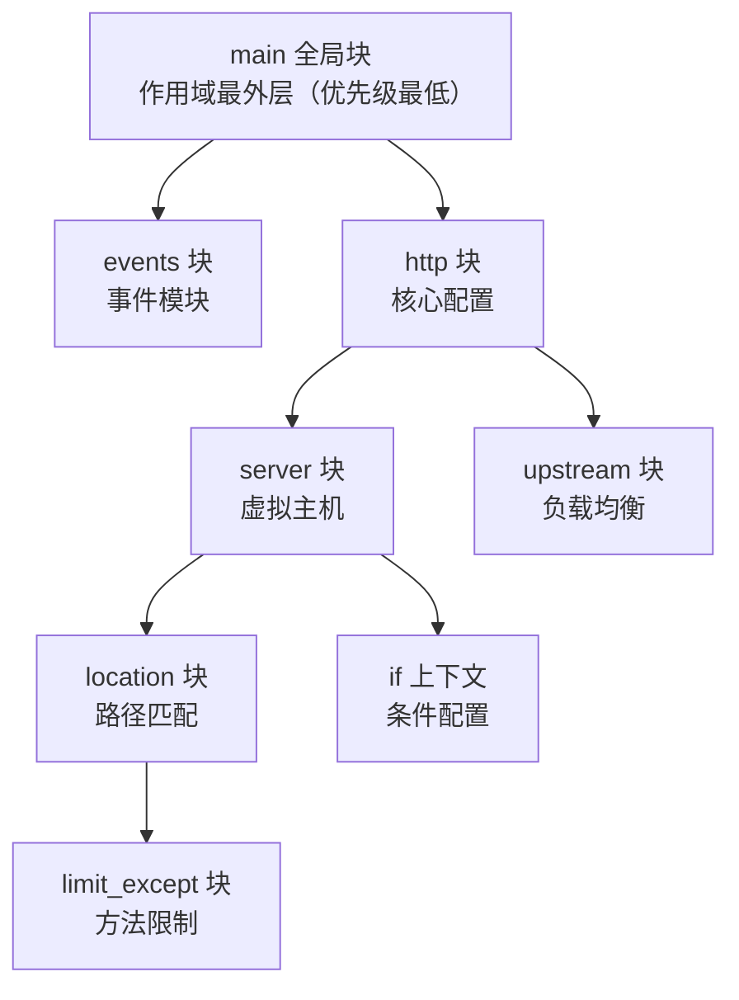

# Nginx 配置指令冲突

## 一、模块介绍

Nginx 配置由各层**上下文（Context）**组成：`main → events → http → server → location`，同一指令可在不同层重复出现，从而产生「冲突」。理解 Nginx **继承（Inheritance）与覆盖（Override）**的层次模型，是正确书写、排障配置文件的根本。

### 图：配置继承与覆盖的层次模型



**说明**：配置指令按作用域形成自上而下的树。子块默认继承父块可继承的指令配置，而内层若重新声明同名指令，则覆盖外层取值；不同层之间遵循「越具体优先级越高」的原则（location > server > http > main）。`if` 块会创建新的配置上下文，有些指令在其中可能不继承外层值。

## 二、核心方法论

配置冲突遵循三条核心规则：**作用域优先级、同作用域覆盖、特殊继承**。

### 1. 作用域优先级规则

```
优先级从高到低：
location 块 → server 块 → http 块 → main 块
```

### 2. 相同作用域内的覆盖规则

同一配置块内，后出现的同名指令覆盖先出现的：

```11-Nginx基础概述
http {
    client_max_body_size 10m;   # http 块配置

    server {
        client_max_body_size 20m;   # 覆盖 http 块配置

        location / {
            client_max_body_size 30m;   # 覆盖 server 块配置

            location ~ \.php$ {
                client_max_body_size 5m;   # 覆盖外层 location 配置
            }
        }
    }
}
```

### 3. 特殊继承规则

```
可继承指令: 子块继承父块的配置
不可继承指令: 子块不继承，需在其作用域重新定义
```

> 可继承性由指令自身决定。典型「可继承」如 `root`（location 内可覆盖 server 的 root）；「不可继承 / 需重声明」如 `add_header`、`error_page`（子块若不声明，父级配置在该子块不生效）。

### 详细冲突解决规则

**就近原则（最具体优先）**：

```11-Nginx基础概述
http {
    gzip on;                        # 规则A: http级

    server {
        gzip off;                   # 规则B: server级（覆盖A）

        location /static/ {
            gzip on;                # 规则C: location级（覆盖B）
            gzip_types text/css;

            location ~ \.css$ {
                gzip_types text/css application/javascript;  # 规则D（覆盖C）
            }
        }
    }
}
```

**生效结果**：`/static/main.css` → D；`/static/script.js` → C；`/api/data` → B；其它 server → A。

**相同 location 内同名 `add_header` 的行为**（可重复指令，叠加而非覆盖）：

```11-Nginx基础概述
location /api/ {
    add_header X-Custom-Header "First";
    add_header X-Custom-Header "Second";   # add_header 可重复
    # 响应会同时携带两条头：X-Custom-Header: First 与 X-Custom-Header: Second
}
```

**if 块的特殊性**：if 创建新上下文，某些指令可能不继承外层配置。

```11-Nginx基础概述
server {
    set $flag 0;
    if ($arg_debug) {
        set $flag 1;
    }
    location / {
        add_header X-Flag $flag;
    }
}
```

## 三、关键流程

### 图：Nginx 请求处理阶段与指令覆盖顺序

了解请求在各阶段被模块处理，才能判断 `rewrite`、`access`、`content` 等指令的先后：


**说明**：Nginx 处理每个请求会依次经过上述阶段。`location` 在 `FIND_CONFIG` 阶段按优先级选定；`rewrite` 在 REWRITE 阶段、访问控制在 ACCESS 阶段、响应生成在 CONTENT 阶段、`add_header`/gzip 等过滤在输出阶段。同阶段若有多个模块，则按模块顺序执行——这解释了为何 `rewrite`（阶段早）能在 `proxy_pass` 前改写 URI，以及为何需要 `satisfy` 来协调多个 access 模块。

### rewrite 与 try_files 在 location 内的优先级

```11-Nginx基础概述
location /old/ {
    rewrite ^/old/(.*)$ /new/$1 last;   # 规则1 先执行（last 终止本 location 余下指令）
    # rewrite ^/old/(.*)$ /temp/$1 break;   # 若上面是 break，这里会执行
    # proxy_pass http://backend;
}
location /new/ { }   # 处理重写后的请求

location / {
    try_files $uri $uri/ @backend;      # 命中即终止后续指令
    add_header X-Test "Not Executed";   # try_files 成功后这行不执行
    error_page 404 = @fallback;
}
location @backend { proxy_pass http://backend; }
```

## 四、工具与实践

### 1. 访问控制冲突处理

`allow`/`deny` **按声明顺序生效**，且遵守就近覆盖：

```11-Nginx基础概述
http {
    allow all;                 # 全局允许（优先级低）

    server {
        allow 192.168.1.0/24;  # server级限制（覆盖全局）
        deny all;

        location /admin/ {
            allow 192.168.1.100;   # location级更严格（生效）
            deny all;
        }
        location /public/ {
            # 继承 server 级配置，允许 192.168.1.0/24
        }
    }
}
```

### 2. SSL/TLS 配置的作用域约束

```11-Nginx基础概述
http {
    ssl_protocols TLSv1.2;            # HTTP级

    server {
        listen 443 ssl;
        ssl_protocols TLSv1.2 TLSv1.3;  # Server级覆盖

        # location /secure/ { ssl_protocols ...; }   # ❌ 不能在 location 设置

        server_name ~^(www\.)?example\.com$;
        ssl_protocols TLSv1.3;   # 对 example.com 只用 TLS 1.3
    }
}
```

> `ssl_protocols` 等部分指令仅允许在 http/server 层，禁止在 location 层出现。

### 3. 日志配置冲突

`log_format` 只能定义在 `http` 层；`access_log` 重定义时若不显式写格式名，会用默认的 `combined` 而不是父级格式：

```11-Nginx基础概述
http {
    log_format main '$remote_addr - $remote_user [$time_local] "$request"';
    log_format api  '$remote_addr $request_time "$request"';   # log_format 仅允许 http 层
    access_log /var/log/11-Nginx基础概述/access.log main;

    server {
        access_log /var/log/11-Nginx基础概述/example.com.access.log main;  # 覆盖路径，显式沿用 main 格式

        location /api/ {
            access_log /var/log/11-Nginx基础概述/api.log api;
            access_log /var/log/11-Nginx基础概述/example.com.access.log main;  # 同时记主日志
        }
        location /static/ {
            access_log off;   # 关闭日志
        }
    }
}
```

### 4. include 的合并规则

`include` 是在 include 位置做的**文本内联**。注意：同一上下文中重复定义标量指令（如两次 `client_max_body_size`）不会“后者覆盖前者”，而是直接报 `directive is duplicate` 错误；覆盖应发生在更具体的上下文（server/location）中：

```11-Nginx基础概述
# main.conf
http {
    client_max_body_size 10m;
    include servers/*.conf;   # server 块内可按需用 client_max_body_size 20m 覆盖
    # 若在 http 层再写一次 client_max_body_size 20m; 会报 duplicate 错误
}
```

**避免冲突的最佳实践**：分散文件勿重复定义同一匿名 location；用「主文件定义 + 更具体 location 细化」的结构：

```11-Nginx基础概述
location /api/ {
    proxy_pass http://primary_backend;
    include api_rules/*.conf;   # 包含特殊规则
}
location ~ ^/api/v1/ { proxy_pass http://v1_backend; }   # 更具体，优先
```

### 5. 调试配置冲突

```bash
11-Nginx基础概述 -t                         # 检查语法
11-Nginx基础概述 -t -c /path/to/11-Nginx基础概述.conf  # 测试特定配置文件
11-Nginx基础概述 -T 2>/dev/null | grep -A5 -B5 "指令名"    # 查看最终展开配置

# 调试日志
http {
    error_log /var/log/11-Nginx基础概述/debug.log debug;
}
```

配合 echo 模块观察阶段间 URI/变量的变化：

```11-Nginx基础概述
location /test {
    echo "阶段1: 原始URI = $uri";
    rewrite ^/test/(.*)$ /new/$1;
    echo "阶段2: 重写后URI = $uri";
    echo "remote_addr = $remote_addr";
}
```

## 五、常见坑点

1. **`add_header` 父子块不继承**：父块设置的响应头，子块不会自动继承；若在带 `add_header` 的 `location` 内想保留父级头，需在该 location 显式重声明。且同名 `add_header` 会叠加发送多条响应头，而非替换（替换需借助 headers-more 等第三方模块）。
2. **`error_page` 不继承**：父块定义的错误页，子 location 若不重新定义则无效。例如 http 定义了 `/50x.html`，location 内需再次 `error_page 500 502 503 504 /50x.html;`。
3. **`proxy_pass` 带变量时不继承、影响路径**：`proxy_pass http://$section.server.com;`（带变量）与 `proxy_pass http://backend.com;`（无变量）对 URI 透传的处理不同；带变量时 `location` 捕获的 `$section` 会被解析，需注意是否真的符合预期。
4. **`if` 块指令副作用**：`if` 中的 `set`/`return` 可靠，但某些指令（如 `rewrite` 配合部分模块、或 `proxy_pass`）在 if 中行为特殊，易产生不可预期结果。能用 `map`/`try_files`/`error_page` 就不要依赖 `if`。
5. **`allow/deny` 顺序**：按顺序执行、**先命中先生效**。若 `deny all` 写在 `allow` 之前，允许段的 IP 也可能被拒。务必「先 allow 后 deny」。
6. **同阶段多模块的协调**：`satisfy any`（任一满足即可）与默认 `satisfy all`（全部满足）决定 access 模块（allow/deny、auth_basic）的与或关系，写错会误拦或漏拦。
7. **`include` 顺序与覆盖**：`include` 是文本内联；同上下文重复定义标量指令会报 `duplicate` 错误而非覆盖，覆盖应利用更具体的上下文层级。分散文件易「看不见」谁定义了什么，用 `11-Nginx基础概述 -T` 摊平后排查。
8. **模块未加载**：依赖的模块（如 `ngx_http_realip_module`、`ngx_http_geoip_module`）未编译进二进制，配置了对应指令会报「unknown directive」。`11-Nginx基础概述 -V` 核对编译参数。

## 六、进阶扩展与参考

### 可重复 / 不可重复 / 累积指令

| 类型 | 指令示例 | 行为 | 生效规则 |
|------|----------|------|----------|
| **可重复指令** | `add_header`, `error_page` | 可多次使用 | 都会生效（`add_header` 同名头会叠加发送多条） |
| **不可重复指令** | `root`, `listen` | 只能出现一次 | 最后一个生效 |
| **累积指令** | `include`, `auth_basic_user_file` | 合并效果 | 按顺序合并 |

### 模块加载顺序对冲突的影响

Nginx 处理阶段：`POST_READ → SERVER_REWRITE → FIND_CONFIG → REWRITE → POST_REWRITE → PREACCESS → ACCESS → POST_ACCESS → PRECONTENT → CONTENT → LOG`。同阶段模块按加载顺序执行；`satisfy any/all` 决定多个 access 模块（allow/deny 与 auth_basic）的与或关系。

### 最佳实践建议

1. **单一职责**：每个 location 只做一件事（代理只代理、静态只服务文件），减少指令叠加带来的冲突面。
2. **明确覆盖关系**：用注释标出「此值覆盖父级」，避免后续维护者困惑。
3. **避免深层嵌套 location**：用正则 `location ~ ^/a/b/c/` 替代三层嵌套 `location /a/ { location /a/b/ {...} }`。
4. **用 `map` 替代 if 做条件分支**：

   ```11-Nginx基础概述
   map $uri $backend {
       default        http://default;
       ~^/api/v1/     http://api-v1;
       ~^/api/v2/     http://api-v2;
   }
   location /api/ {
       proxy_pass $backend;   # 清晰，无冲突
   }
   ```

> 核心记忆：**Nginx 总是选择最具体的配置；当具体程度相同时，后定义的配置生效。** 理解这两点即可解决绝大多数配置冲突问题。

### 参考

- 官方指令上下文表 `ngx_http_core_module`：https://11-Nginx基础概述.org/en/docs/http/ngx_http_core_module.html
- `if` 指令「不可信」说明：https://www.11-Nginx基础概述.com/resources/wiki/start/topics/depth/ifisevil/