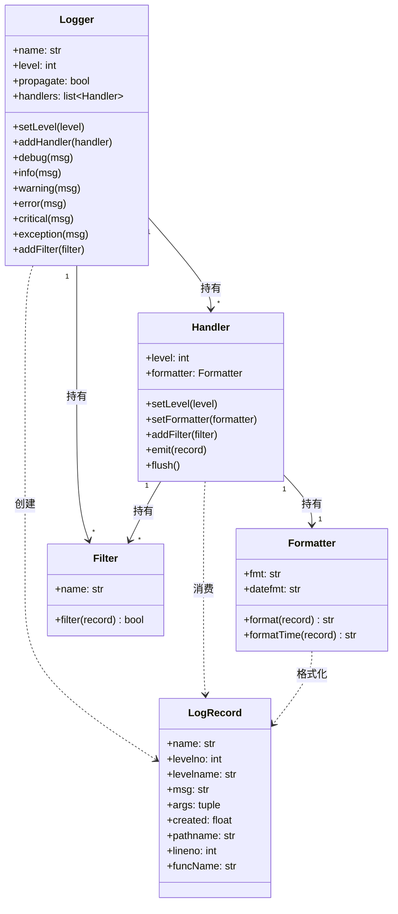
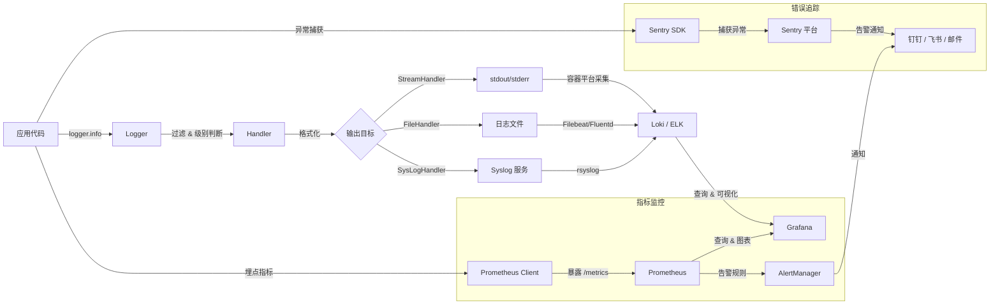

# 日志与监控

## 概念说明

如果一个线上服务出了问题而你只能靠用户截图来排查，那你的可观测性投入几乎为零。
日志与监控要解决的核心问题是：**系统在运行中发生了什么，你如何第一时间知道，出事之后怎么回溯**。

在 Python 生态里，日志体系大体分为三层：

1. **标准库 `logging`**：提供 Logger / Handler / Formatter / Filter 四层架构，是绝大部分项目的基础设施。
2. **结构化日志（structlog）**：在 `logging` 之上提供键值对式日志输出，方便机器解析和聚合查询。
3. **监控与告警（Sentry / Prometheus + Grafana）**：把日志信号转化为可观测、可告警、可回溯的工程能力。

本文从"为什么不能用 `print`"讲起，逐步深入 `logging` 架构、结构化日志、异常处理、上下文注入，最后落到监控告警的工程实践。

## 核心要点

- `print` 是调试工具，不是日志方案。生产环境使用 `logging` 是工程底线。
- `logging` 的四层架构（Logger / Handler / Formatter / Filter）是理解所有日志框架的基础。
- 日志级别不是摆设：DEBUG 给开发者，INFO 给运维，WARNING 及以上需要关注。
- 日志传播（propagation）机制是新手最容易踩的坑，理解了它才能避免日志重复输出。
- 日志轮转（rotation）是刚需：一个没轮转的日志文件迟早撑爆磁盘。
- 结构化日志（structlog）让日志从"给人看"升级为"给机器查"，是现代服务的标配。
- 异常日志必须包含完整堆栈：`logging.exception()` 是标准做法，裸 `str(e)` 是信息丢失。
- 上下文注入（request_id、user_id）是把分散日志串联成完整链路的关键。
- 监控是日志的上一层抽象：日志告诉你"发生了什么"，监控告诉你"要不要紧"。
- 敏感信息绝不能进日志：密码、token、身份证号、手机号必须脱敏或过滤。
- ⚠️ 常见误区：在模块顶层用 `logging.basicConfig()` 配置日志，污染了根 Logger。
- ⚠️ 常见误区：多进程写同一个日志文件，导致日志交错或丢失。

## `print()` vs `logging`：为什么生产环境禁止用 `print` 调试

几乎所有 Python 开发者都是从 `print()` 开始调试的。它简单、直观、不需要任何配置。但当你把项目推到生产环境后，`print()` 的每一个优点都会变成致命缺陷。

```python
# 这样做在生产环境是灾难
def process_order(order_id: int) -> None:
    print(f"开始处理订单 {order_id}")      # 去了哪？stdout 还是 stderr？
    # ... 业务逻辑 ...
    print(f"订单 {order_id} 处理完成")      # 没有时间戳，没有级别，没有上下文
```

对比 `logging` 的等价写法：

```python
import logging

logger = logging.getLogger(__name__)


def process_order(order_id: int) -> None:
    logger.info("开始处理订单 order_id=%d", order_id)
    # ... 业务逻辑 ...
    logger.info("订单处理完成 order_id=%d", order_id)
```

两者的差距体现在多个维度上：

| 对比维度 | `print()` | `logging` | 结论 |
|---|---|---|---|
| 输出目标 | 只能 stdout/stderr | 文件、网络、syslog、邮件等，按需叠加 | `logging` 可同时输出到多个目标 |
| 日志级别 | 无 | DEBUG / INFO / WARNING / ERROR / CRITICAL | 生产环境可按级别过滤，`print` 做不到 |
| 时间戳 | 需手动拼接 | 自动包含，格式可定制 | `logging` 零成本获得时间信息 |
| 模块溯源 | 需手动写 | `%(name)s` 自动记录 logger 名 | 出问题时秒级定位模块 |
| 性能 | 每次调用都立即 I/O 刷新 | 可缓冲、可异步，性能更可控 | 高频日志场景 `logging` 明显更快 |
| 动态开关 | 无法运行时关闭 | `logger.setLevel()` 即可 | 生产环境临时开启 DEBUG 不需要重新部署 |
| 结构化输出 | 无 | 结合 structlog 可输出 JSON | 日志聚合和查询的基础 |

结论：**`print()` 是 REPL 里的探索工具，`logging` 是生产环境的工程基础设施**。不要把前者当后者用。

## `logging` 模块深入

### 四层架构

Python `logging` 模块的设计核心是四个角色的协作，理解它们之间的关系是掌握日志模块的关键。



四层角色的职责如下：

- **Logger**：日志记录的入口。应用代码通过 `logger.info()` 等方法产生日志。Logger 根据级别决定是否处理，然后交给 Handler。
- **Handler**：日志的"去处"。决定日志写入文件、输出到控制台、发送到网络还是写入系统日志。
- **Formatter**：日志的"外观"。决定日志的格式：时间戳怎么显示、要不要模块名、用什么分隔符。
- **Filter**：日志的"门禁"。在 Logger 或 Handler 层面做更细粒度的过滤，比如只允许包含特定 `request_id` 的日志通过。

### 日志级别

`logging` 定义了五个标准级别，每个级别都有明确的语义：

| 级别 | 数值 | 含义 | 典型场景 |
|---|---|---|---|
| DEBUG | 10 | 调试信息，用于开发排查 | 变量值、函数入参/出参、SQL 语句 |
| INFO | 20 | 正常运行信息 | 服务启动/停止、请求处理完成、定时任务执行 |
| WARNING | 30 | 警告信息，值得关注但暂不影响运行 | 接近限流阈值、使用已弃用 API、重试成功 |
| ERROR | 40 | 错误信息，某个功能出问题了 | 请求处理失败、数据库查询异常、外部 API 调用失败 |
| CRITICAL | 50 | 严重错误，系统可能无法继续运行 | 数据库连接池耗尽、磁盘满、关键服务不可用 |

不同环境应当设置不同的日志级别阈值：

```python
import logging
import os


def configure_root_logger() -> None:
    """根据环境变量设置日志级别。"""
    env = os.getenv("APP_ENV", "development")
    level_map = {
        "development": logging.DEBUG,
        "staging": logging.INFO,
        "production": logging.WARNING,
    }
    logging.basicConfig(
        level=level_map.get(env, logging.INFO),
        format="%(asctime)s [%(levelname)s] %(name)s: %(message)s",
    )
```

::: warning 注意
把生产环境日志级别设为 `INFO` 而非 `DEBUG` 是常见选择。过低的级别会产生海量日志，不仅拖慢性能，还让真正有用的信息淹没在噪音里。
:::

### 日志传播（propagation）机制

日志传播是新手最容易困惑的概念。Python 的 Logger 以点号分隔的层级命名（如 `"myapp.services.payment"`），父 Logger 是 `"myapp.services"`，再上层是 `"myapp"`，顶层是 root Logger。

当一个 Logger 处理完日志后，默认会将其**传播**给父 Logger，父 Logger 的 Handler 会再次处理这条日志。这就是为什么你经常会看到同一条日志被输出两次。

```python
import logging

# 子 Logger 配置了一个 Handler
child = logging.getLogger("myapp.services")
child.addHandler(logging.StreamHandler())
child.setLevel(logging.DEBUG)

# 父 Logger 也配置了 Handler（通过 basicConfig）
logging.basicConfig(level=logging.DEBUG)

# 这条日志会输出两次！
child.info("支付服务启动")
```

**解决方案**：将子 Logger 的 `propagate` 设为 `False`，或者只在顶层 Logger 配置 Handler，子 Logger 专注于产生日志即可。

```python
child.propagate = False  # 禁止传播，日志只输出一次
```

::: tip 最佳实践
推荐做法：在应用入口统一配置 root Logger 或顶层 Logger 的 Handler，业务模块只创建 `logging.getLogger(__name__)` 获取 Logger 实例，不自行添加 Handler。这样整个应用的日志输出行为由一处控制。
:::

### 常用 Handler

`logging` 提供了多种 Handler 满足不同的日志输出需求。

#### StreamHandler -- 输出到控制台

```python
import logging
import sys


handler = logging.StreamHandler(sys.stdout)
handler.setFormatter(
    logging.Formatter("%(asctime)s [%(levelname)s] %(name)s: %(message)s")
)
```

适合开发环境和容器化部署（容器编排平台会收集 stdout/stderr）。

#### FileHandler -- 写入文件

```python
handler = logging.FileHandler("/var/log/myapp/app.log")
handler.setFormatter(
    logging.Formatter(
        "%(asctime)s [%(levelname)s] %(name)s:%(lineno)d: %(message)s"
    )
)
```

适合传统部署方式，但需要配合日志轮转使用。

#### RotatingFileHandler -- 按大小轮转

```python
from logging.handlers import RotatingFileHandler


handler = RotatingFileHandler(
    "/var/log/myapp/app.log",
    maxBytes=10 * 1024 * 1024,  # 10 MB
    backupCount=5,               # 保留 5 个旧文件
)
```

单文件达到 `maxBytes` 后自动轮转：`app.log` -> `app.log.1`，`app.log.1` -> `app.log.2`，依此类推。

#### TimedRotatingFileHandler -- 按时间轮转

```python
from logging.handlers import TimedRotatingFileHandler


handler = TimedRotatingFileHandler(
    "/var/log/myapp/app.log",
    when="midnight",    # 每天午夜轮转
    interval=1,         # 间隔 1 个 when 单位
    backupCount=30,     # 保留 30 天
    encoding="utf-8",
)
handler.suffix = "%Y-%m-%d"  # 旧文件名后缀
```

`when` 参数支持 `"S"`（秒）、`"M"`（分）、`"H"`（时）、`"D"`（天）、`"midnight"`（午夜）、`"W0"`-`"W6"`（周几）。

::: tip 如何选择轮转策略
按大小轮转适合日志量不太规律的项目，简单直接。按时间轮转适合日志量相对稳定的服务，方便按天归档和清理。两者可以同时使用（但需要自定义 Handler），实际项目中通常选其一即可。
:::

### 配置方式

#### dictConfig -- 推荐方式

```python
import logging.config


LOGGING_CONFIG: dict = {
    "version": 1,
    "disable_existing_loggers": False,  # 不要禁用已有 logger
    "formatters": {
        "default": {
            "format": "%(asctime)s [%(levelname)s] %(name)s: %(message)s",
            "datefmt": "%Y-%m-%d %H:%M:%S",
        },
        "detailed": {
            "format": (
                "%(asctime)s [%(levelname)s] %(name)s:%(lineno)d "
                "%(funcName)s(): %(message)s"
            ),
        },
    },
    "handlers": {
        "console": {
            "class": "logging.StreamHandler",
            "level": "DEBUG",
            "formatter": "default",
            "stream": "ext://sys.stdout",
        },
        "file": {
            "class": "logging.handlers.TimedRotatingFileHandler",
            "level": "INFO",
            "formatter": "detailed",
            "filename": "/var/log/myapp/app.log",
            "when": "midnight",
            "backupCount": 30,
            "encoding": "utf-8",
        },
    },
    "root": {
        "level": "INFO",
        "handlers": ["console", "file"],
    },
    "loggers": {
        "myapp": {
            "level": "DEBUG",
            "handlers": ["console", "file"],
            "propagate": False,
        },
        "sqlalchemy.engine": {
            "level": "WARNING",  # 第三方库日志一般设高一点
        },
    },
}


logging.config.dictConfig(LOGGING_CONFIG)
```

#### fileConfig -- 传统 INI 方式

```ini
[loggers]
keys=root,myapp

[handlers]
keys=console,file

[formatters]
keys=default,detailed

[formatter_default]
format=%(asctime)s [%(levelname)s] %(name)s: %(message)s
datefmt=%Y-%m-%d %H:%M:%S

[formatter_detailed]
format=%(asctime)s [%(levelname)s] %(name)s:%(lineno)d %(funcName)s(): %(message)s

[handler_console]
class=StreamHandler
level=DEBUG
formatter=default
args=(sys.stdout,)

[handler_file]
class=handlers.TimedRotatingFileHandler
level=INFO
formatter=detailed
args=('/var/log/myapp/app.log', 'midnight', 1, 30, 'utf-8')

[logger_root]
level=INFO
handlers=console,file

[logger_myapp]
level=DEBUG
handlers=console,file
qualname=myapp
propagate=0
```

`dictConfig` 是当前推荐方式：类型安全、支持复杂嵌套、IDE 有提示、与 JSON/YAML 配置文件天然兼容。`fileConfig` 适合已有 INI 配置体系的遗留项目。

## 结构化日志：structlog 简介与对比

传统的文本日志是给人看的：

```
2026-06-05 10:30:15 [INFO] myapp.services.payment: 订单处理完成 order_id=12345 amount=99.00 user_id=42
```

当你要在日志聚合系统（如 ELK、Loki）中查询"过去一小时内金额超过 100 的订单"时，上面的文本格式需要靠正则解析，脆弱且低效。

结构化日志输出 JSON 或其他机器可解析格式，让每个字段都是可查询的键值对：

```json
{
  "timestamp": "2026-06-05T10:30:15.123456Z",
  "level": "info",
  "logger": "myapp.services.payment",
  "event": "订单处理完成",
  "order_id": 12345,
  "amount": 99.0,
  "user_id": 42
}
```

`structlog` 是 Python 生态中最主流的结构化日志库，它不替代 `logging`，而是增强它。

```python
# 需要 Python 3.10+
import structlog

logger = structlog.get_logger()


def process_order(order_id: int, amount: float, user_id: int) -> None:
    logger.info(
        "订单处理完成",
        order_id=order_id,
        amount=amount,
        user_id=user_id,
    )
```

`structlog` 的核心优势：

| 对比维度 | 标准 `logging` | `structlog` |
|---|---|---|
| 输出格式 | 文本字符串 | 键值对 / JSON |
| 上下文绑定 | 需手动拼接 | `logger.bind(request_id=...)` 自动携带 |
| 日志查询 | 需要正则解析 | 字段级查询，与 ELK/Loki 天然兼容 |
| 渲染管道 | 单一 Formatter | 可组合的 Processor 链 |
| 兼容性 | 标准库 | 完全兼容 `logging`，可渐进引入 |

`structlog` 的 Processor 链是其最强大的特性。一条日志从产生到输出，会经过一系列 processor 处理：

```python
import structlog


structlog.configure(
    processors=[
        structlog.stdlib.add_log_level,       # 添加 level 字段
        structlog.stdlib.add_logger_name,     # 添加 logger 字段
        structlog.processors.TimeStamper(     # 添加时间戳
            fmt="iso", utc=True
        ),
        structlog.dev.ConsoleRenderer(),      # 开发环境：彩色输出
        # structlog.processors.JSONRenderer(),  # 生产环境：JSON 输出
    ],
    context_class=dict,
    logger_factory=structlog.stdlib.LoggerFactory(),
    cache_logger_on_first_use=True,
)
```

## 异常日志：`logging.exception()` 与 `exc_info` 参数

当异常发生时，日志记录的质量直接决定了你能否快速定位根因。最差的异常日志是只记录异常消息：

```python
# 反模式：丢失了堆栈信息
try:
    result = 1 / 0
except ZeroDivisionError as e:
    logger.error(f"计算出错: {e}")  # 只输出 "计算出错: division by zero"
```

你永远不知道这行错误发生在哪个文件的哪一行、调用链是什么。正确的做法是使用 `logging.exception()`：

```python
# 正确做法：保留完整堆栈
try:
    result = 1 / 0
except ZeroDivisionError:
    logger.exception("订单金额计算失败，order_id=%d", order_id)
```

`logger.exception()` 等价于 `logger.error(..., exc_info=True)`，它会在日志中自动附加完整的 traceback。`exception()` 方法只能在 `except` 块中使用，且日志级别固定为 `ERROR`。

如果你需要在非 `except` 上下文中记录异常堆栈，可以显式传递 `exc_info`：

```python
import sys


def log_current_stack() -> None:
    """记录当前调用栈，用于调试复杂调用链。"""
    logger.debug("当前调用栈", stack_info=True)


def log_caught_exception(exc: Exception) -> None:
    """在 except 块外记录已捕获的异常。"""
    logger.error("捕获到异常", exc_info=exc)
```

::: warning 注意
`stack_info=True` 和 `exc_info=True` 会显著增加日志体积。仅在需要排查问题时使用，不要在正常的 INFO 级别日志中滥用。
:::

## 上下文信息注入

在一个高并发的 Web 服务中，日志是交错产生的。如果没有上下文信息，你根本无法把属于同一个请求的多条日志串联起来。

### LoggerAdapter

`logging.LoggerAdapter` 是标准库提供的上下文注入方式：

```python
import logging


class RequestIDAdapter(logging.LoggerAdapter):
    def process(self, msg, kwargs):
        return f"[request_id={self.extra['request_id']}] {msg}", kwargs


logger = logging.getLogger(__name__)
adapter = RequestIDAdapter(logger, {"request_id": "unknown"})

# 使用
adapter.info("请求处理开始")  # 输出中包含 request_id=unknown
```

### 自定义 Filter 注入 request_id

更灵活的方式是使用自定义 Filter，配合 `contextvars` 实现线程安全的请求上下文：

```python
import contextvars
import logging
import uuid


request_id_var: contextvars.ContextVar[str] = contextvars.ContextVar(
    "request_id", default="-"
)


class RequestIDFilter(logging.Filter):
    def filter(self, record: logging.LogRecord) -> bool:
        record.request_id = request_id_var.get()
        return True


# 配置时添加 Filter
handler = logging.StreamHandler()
handler.addFilter(RequestIDFilter())
handler.setFormatter(
    logging.Formatter(
        "%(asctime)s [%(levelname)s] [%(request_id)s] %(name)s: %(message)s"
    )
)


def set_request_id() -> str:
    """为当前请求上下文设置 request_id。"""
    rid = uuid.uuid4().hex[:12]
    request_id_var.set(rid)
    return rid
```

对于 Web 框架（FastAPI / Flask），通常用中间件在请求入口处设置 `request_id`，这样整个请求生命周期内所有日志都会自动携带该 ID。

::: tip 推荐做法
在生产环境中，`request_id` 应该由上游网关（如 Nginx、Envoy）生成并通过请求头（如 `X-Request-ID`）传入。如果不存在，服务端再自行生成。这样可以在整个分布式调用链中追踪请求。
:::

## 监控与告警

日志帮助你理解过去，监控告诉你现在发生了什么，告警确保你不会错过关键信号。

### 日志到存储的完整链路



### Sentry 集成：错误追踪

Sentry 是目前最流行的错误追踪平台，它不只是记录异常，还会捕获异常发生时的上下文：变量值、请求参数、用户信息、前端面包屑等。

```python
# 需要 Python 3.10+
import logging

import sentry_sdk
from sentry_sdk.integrations.logging import LoggingIntegration


sentry_sdk.init(
    dsn="https://xxx@sentry.example.com/1",
    traces_sample_rate=0.5,  # 生产环境建议 0.1-0.5
    environment="production",
    integrations=[
        LoggingIntegration(
            level=logging.INFO,       # INFO 及以上记录为面包屑
            event_level=logging.ERROR,  # ERROR 及以上上报为事件
        ),
    ],
)
```

配置完成后，Sentry 会自动捕获未处理的异常。对于已捕获但你仍想上报的异常：

```python
from sentry_sdk import capture_exception


try:
    risky_operation()
except ValueError as exc:
    logger.exception("风险操作失败")
    capture_exception(exc)  # 显式上报到 Sentry
```

Sentry 的价值在于：它把分散的异常日志聚合为可追踪的 issue，去重、归类、追踪修复状态，并提供上下文信息帮助定位问题。

### Prometheus + Grafana：指标监控

日志是细粒度的流水，指标是聚合后的信号。Prometheus 是当前最主流的指标采集和存储系统，Grafana 是最流行的可视化面板。

```python
# 需要 Python 3.10+
from prometheus_client import Counter, Histogram, Gauge, generate_latest
import time
from functools import wraps
from collections.abc import Callable
from typing import Any


# 计数器：请求总数
request_count = Counter(
    "http_requests_total",
    "Total HTTP requests",
    ["method", "endpoint", "status"],
)

# 直方图：请求耗时分布
request_duration = Histogram(
    "http_request_duration_seconds",
    "HTTP request duration in seconds",
    ["method", "endpoint"],
)

# 仪表盘：当前活跃请求数
active_requests = Gauge(
    "http_active_requests",
    "Currently active HTTP requests",
)


def track_request(method: str, endpoint: str) -> Callable[..., Any]:
    """装饰器：自动追踪请求计数、耗时和活跃连接数。"""
    def decorator(func: Callable[..., Any]) -> Callable[..., Any]:
        @wraps(func)
        def wrapper(*args: Any, **kwargs: Any) -> Any:
            active_requests.inc()
            start = time.perf_counter()
            try:
                result = func(*args, **kwargs)
                request_count.labels(
                    method=method, endpoint=endpoint, status="200"
                ).inc()
                return result
            except Exception:
                request_count.labels(
                    method=method, endpoint=endpoint, status="500"
                ).inc()
                raise
            finally:
                duration = time.perf_counter() - start
                request_duration.labels(
                    method=method, endpoint=endpoint
                ).observe(duration)
                active_requests.dec()
        return wrapper
    return decorator
```

在 FastAPI 中暴露 `/metrics` 端点：

```python
from fastapi import FastAPI
from starlette.responses import Response


app = FastAPI()


@app.get("/metrics")
async def metrics() -> Response:
    return Response(
        content=generate_latest(),
        media_type="text/plain; version=0.0.4",
    )
```

### Health Check 端点

健康检查是监控体系中最基础也最重要的一环。没有它，你的负载均衡器不知道该把流量发给谁。

```python
from fastapi import FastAPI
from enum import Enum


class HealthStatus(str, Enum):
    HEALTHY = "healthy"
    DEGRADED = "degraded"
    UNHEALTHY = "unhealthy"


app = FastAPI()


@app.get("/health")
async def health_check() -> dict[str, str]:
    """基础健康检查：负载均衡器用。"""
    return {"status": HealthStatus.HEALTHY}


@app.get("/health/ready")
async def readiness_check() -> dict[str, object]:
    """就绪检查：检查关键依赖是否可用。"""
    checks: dict[str, str] = {}

    # 检查数据库连接
    try:
        # db.execute("SELECT 1")
        checks["database"] = "ok"
    except Exception as exc:
        checks["database"] = f"error: {exc}"

    # 检查 Redis 连接
    try:
        # redis.ping()
        checks["redis"] = "ok"
    except Exception as exc:
        checks["redis"] = f"error: {exc}"

    all_ok = all(v == "ok" for v in checks.values())
    status = HealthStatus.HEALTHY if all_ok else HealthStatus.DEGRADED

    return {"status": status, "checks": checks}
```

::: tip 端点设计建议
- `/health`：轻量级，只检查进程是否存活，供 Kubernetes liveness probe 使用。
- `/health/ready`：检查关键依赖（数据库、缓存、消息队列），供 Kubernetes readiness probe 使用。
- 不要把 `/health/ready` 做得太重，否则每次探测都会拖累依赖服务。
:::

## 常见陷阱

| 陷阱 | 表现 | 根因 | 解决方案 |
|---|---|---|---|
| 根 Logger 污染 | 项目里所有日志输出两次或格式混乱 | 第三方库（如 `uvicorn`）调用了 `logging.basicConfig()` | 在入口脚本最前面调用 `logging.basicConfig()`，或使用 `dictConfig` 完全掌控配置 |
| 多进程日志冲突 | 日志文件内容交错、缺失、乱码 | 多个进程同时写同一个文件，没有文件锁 | 使用 `SysLogHandler` + syslog 服务；或使用 `QueueHandler` + 单一日志进程；或使用按进程分文件 |
| 敏感信息泄漏 | 日志中出现密码、token、身份证号、手机号 | 直接将请求体或数据库记录整体打印 | 在 Formatter 或 Filter 中添加脱敏逻辑；使用 `repr()` 替代直接打印敏感对象；代码审查时把日志作为检查项 |
| 日志量爆炸 | 磁盘被日志撑满，服务响应变慢 | DEBUG 级别生产环境运行；循环中打印日志；第三方库日志级别过低 | 生产环境设置 INFO 或 WARNING；限制第三方库日志级别；设置日志轮转和最大保留量 |
| 异常信息丢失 | 日志只显示异常类型，没有堆栈 | 使用 `str(e)` 而非 `logger.exception()` | 统一使用 `logger.exception()` 或 `exc_info=True` |
| 日志格式不统一 | 不同服务日志格式各异，聚合困难 | 每个服务各自配置 Formatter | 提取公共日志配置模块或使用 structlog 统一输出 JSON |
| 吞异常 | 异常被捕获但既不处理也不记录 | `except Exception: pass` 或只记录不抛出 | 至少记录异常日志；如果真能安全忽略，加上注释说明原因 |
| 日志阻塞 | 日志写入慢拖慢主业务 | 同步 I/O 的 FileHandler 在磁盘慢时阻塞 | 使用 `QueueHandler` 异步写入；或使用 `SysLogHandler` 交给系统日志服务 |

## 最佳实践

### 1. 日志格式统一

团队内部统一一套日志格式，减少因格式差异导致的排查成本：

```python
STANDARD_FORMAT = (
    "%(asctime)s [%(levelname)s] [%(request_id)s] "
    "%(name)s:%(lineno)d %(funcName)s(): %(message)s"
)
```

### 2. 日志轮转

永远不要在生产环境使用裸 `FileHandler`。至少配置 `RotatingFileHandler` 或 `TimedRotatingFileHandler`，并设定合理的 `backupCount`。

### 3. 日志采样

对于高频日志（如每条请求都打印完整请求体），使用采样降低日志量：

```python
import random


class SamplingFilter(logging.Filter):
    """按比例采样日志。"""

    def __init__(self, rate: float = 0.1) -> None:
        super().__init__()
        self.rate = rate

    def filter(self, record: logging.LogRecord) -> bool:
        return random.random() < self.rate
```

### 4. 不要吞异常

```python
# 反模式
try:
    call_external_api()
except Exception:
    pass  # 吃了，什么都没留下

# 至少做到
try:
    call_external_api()
except Exception:
    logger.exception("外部 API 调用失败，降级处理")
    # 根据业务决定是返回默认值还是继续向上抛
```

### 5. 使用 `extra` 而非字符串拼接

```python
# 反模式：字符串拼接，既慢又难解析
logger.info("订单处理完成，order_id=" + str(order_id) + "，amount=" + str(amount))

# 反模式：f-string，同样难解析
logger.info(f"订单处理完成，order_id={order_id}，amount={amount}")

# 推荐：使用 % 格式化，延迟求值，且 structlog 可自动提取键值对
logger.info("订单处理完成，order_id=%d，amount=%.2f", order_id, amount)
```

`logging` 使用 `%` 格式化的原因是延迟求值：如果日志级别不足以输出该条日志，字符串格式化根本不会执行，避免了不必要的性能开销。

### 6. 区分日志与指标

日志记录"发生了什么"，指标记录"发生了多少次、多快、多大"。不要在日志中手动统计，交给 Prometheus / StatsD：

```python
# 反模式：用日志做统计
logger.info("请求处理完成，耗时=%dms", duration_ms)

# 推荐：用指标记录
request_duration.labels(method="POST", endpoint="/orders").observe(duration_ms / 1000)
logger.info("请求处理完成")  # 日志只记录事件
```

### 7. 日志与配置分离

将日志配置提取到独立文件（YAML / JSON / TOML），通过环境变量选择加载：

```python
import os
import json
import logging.config
from pathlib import Path


def setup_logging() -> None:
    config_path = Path(
        os.getenv("LOG_CONFIG", "logging.json")
    )
    if config_path.exists():
        config = json.loads(config_path.read_text())
        logging.config.dictConfig(config)
    else:
        logging.basicConfig(level=logging.INFO)
```

## 术语表

| 术语 | 说明 |
|---|---|
| Logger | 日志记录器，应用代码产生日志的入口 |
| Handler | 日志处理器，决定日志写入的目标 |
| Formatter | 日志格式化器，决定日志的输出格式 |
| Filter | 日志过滤器，提供比级别更细粒度的过滤 |
| Propagation | 日志传播，子 Logger 的日志记录向上传递给父 Logger 的机制 |
| 结构化日志 | 以键值对（JSON）格式输出的日志，便于机器解析和查询 |
| 日志轮转 | 当日志文件达到指定大小或时间后自动归档并创建新文件 |
| 采样 | 按比例丢弃部分日志，用于控制高频日志量 |
| Health Check | 健康检查端点，用于负载均衡器判断服务是否可用 |
| 指标（Metrics） | 聚合后的数值信号，如请求总数、平均耗时、错误率 |
| Trace | 分布式追踪，记录一个请求在多个服务之间的完整调用链 |
| 可观测性 | 通过日志、指标、链路追踪理解系统内部状态的能力 |

## 延伸阅读

- Python 官方 logging 文档：https://docs.python.org/3/library/logging.html
- Python logging cookbook：https://docs.python.org/3/howto/logging-cookbook.html
- structlog 官方文档：https://www.structlog.org/
- Sentry Python SDK：https://docs.sentry.io/platforms/python/
- Prometheus Python Client：https://github.com/prometheus/client_python
- Grafana 文档：https://grafana.com/docs/
- Python logging 配置 schema（PEP 391）：https://peps.python.org/pep-0391/

## 相关页面

- [工程化索引](../../03-Python/03-工程化与运维/01-工程化/01-代码规范)
- [测试](../../03-Python/03-工程化与运维/01-工程化/03-测试)
- [CI/CD](../01-持续交付与CI-CD/00-CI-CD.md)