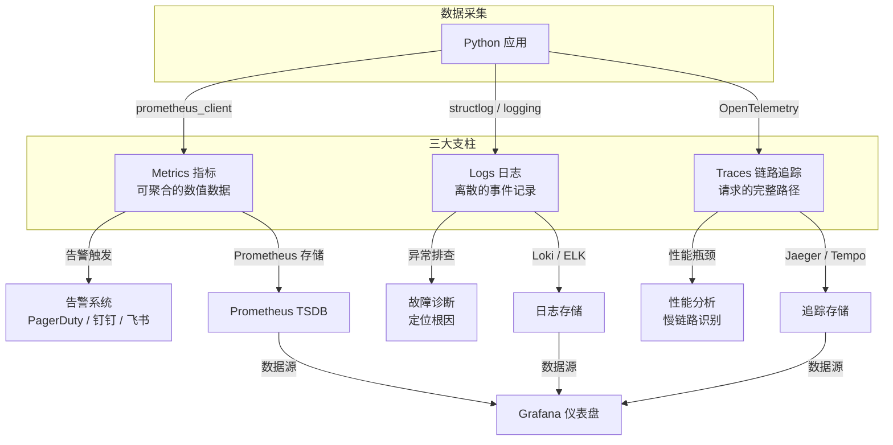
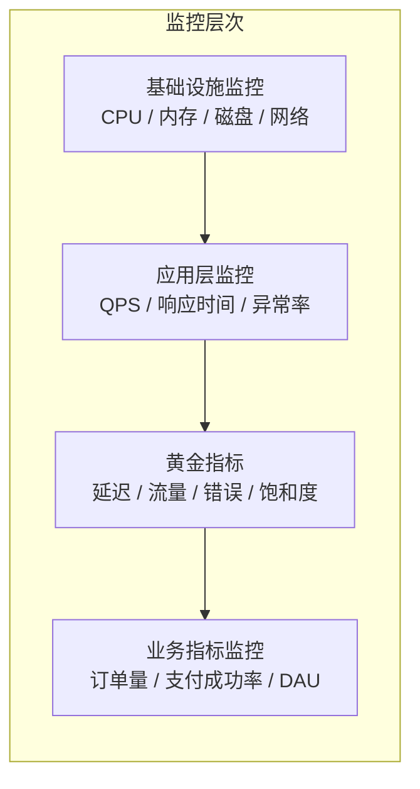
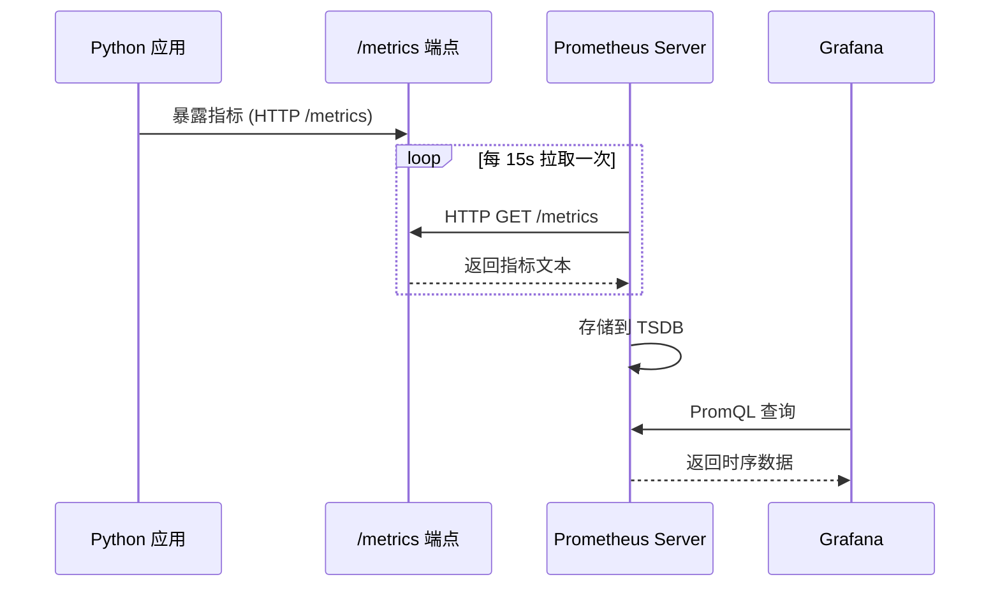
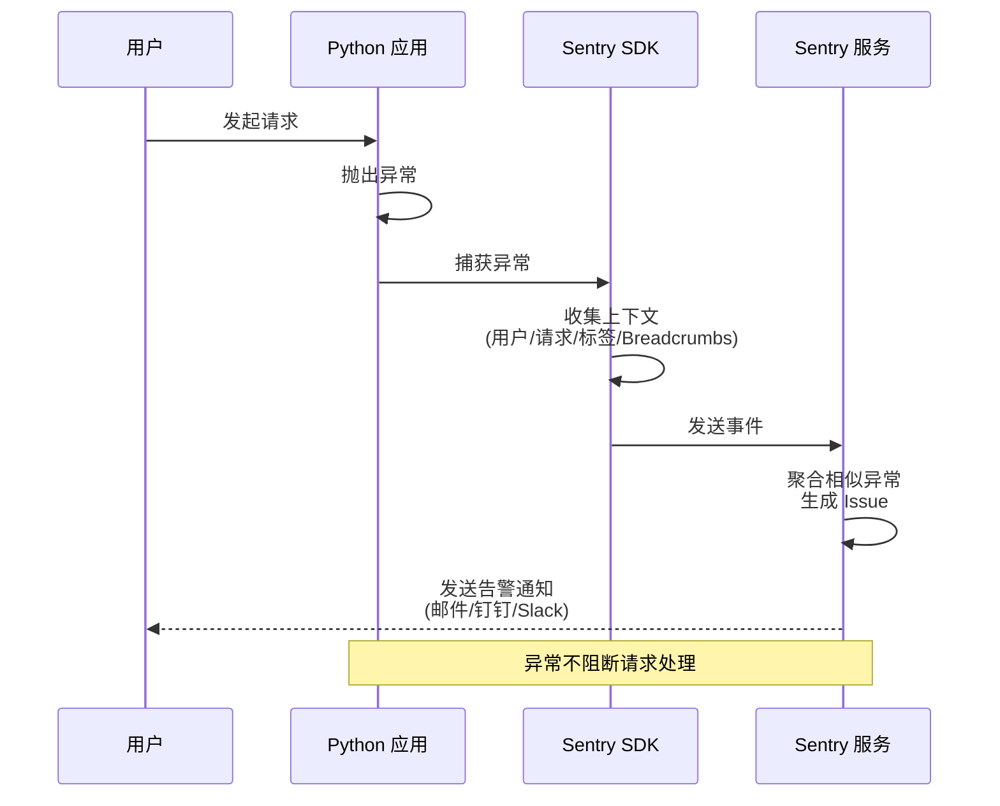
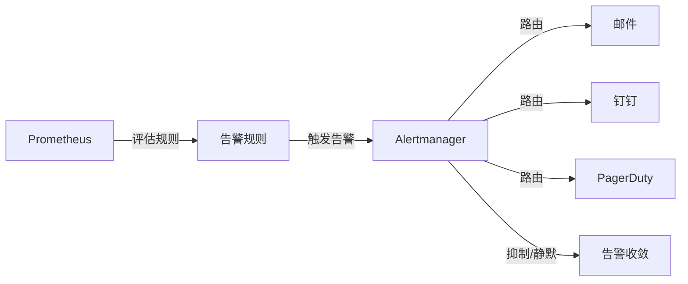
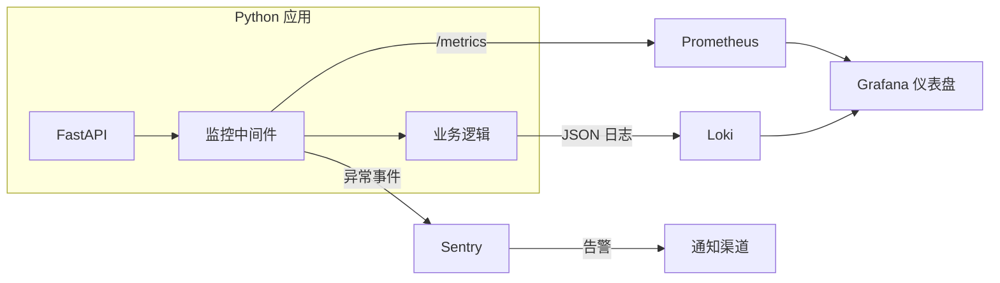

# 监控与告警实战

> 本文面向入门到进阶的运维与开发读者，所有代码基于 **Python 3.10+**、**Prometheus 3.x**、**Grafana 13.x**、**Sentry SDK 2.x**（截至 2026-09 的主流版本线），系统讲解如何为一套 Python 应用构建从指标、日志到异常追踪的完整监控与告警闭环。

## ① 模块介绍

**没有监控的系统就是黑箱——出问题时你只能猜。** 监控与告警是生产环境的"眼睛"和"耳朵"，让你在用户投诉之前就知道哪里出了问题。

现代可观测性（Observability）由三大支柱构成：指标（Metrics）、日志（Logs）、链路追踪（Traces）。三者协同才能还原系统的完整运行状态。

### 图：监控体系全景



上图展示了一整套监控体系的组成：三大支柱分别经由 prometheus_client、structlog/logging、OpenTelemetry 从 Python 应用采集数据，逐级沉淀到对应的指标（Prometheus TSDB）、日志（Loki/ELK）与追踪（Jaeger/Tempo）存储，最终汇聚到 Grafana 统一可视化，并由指标侧的告警触发链路驱动 PagerDuty、钉钉、飞书等通知渠道。

### 图：监控层次模型



该层次模型自下而上逐层递进：先是基础设施层的 CPU、内存、磁盘、网络，再到应用层的 QPS、响应时间、异常率，进而汇总为黄金指标，最终落到业务指标。业务指标处于金字塔顶端，是最贴近用户价值的一环。

> Google SRE 提出的四大黄金指标（Golden Signals）：延迟（Latency）、流量（Traffic）、错误（Errors）、饱和度（Saturation），是监控体系的北极星。

## ② 核心方法论

### 三大支柱对比

| 维度 | 指标 Metrics | 日志 Logs | 链路追踪 Traces |
|------|-------------|-----------|----------------|
| 数据特征 | 数值型，可聚合 | 文本型，离散事件 | 有向无环图（DAG） |
| 数据量 | 小（KB 级/秒） | 中（MB 级/秒） | 大（MB~GB 级/秒） |
| 典型用途 | 告警、容量规划 | 故障排查、审计 | 性能瓶颈定位 |
| 存储成本 | 低 | 中 | 高 |
| 采样策略 | 全量采集 | 可按级别过滤 | 通常需采样（1%~100%） |
| 典型工具 | Prometheus | ELK / Loki | Jaeger / Tempo |
| 关键问题 | "系统现在健康吗？" | "刚才发生了什么？" | "请求为什么慢？" |

衡量一个监控体系是否完整，核心在于四大黄金指标（延迟/流量/错误/饱和度）全覆盖，且指标、日志、追踪三类数据通过请求 ID（traceId）贯通，形成可告警、可定位、可复盘的闭环。

### 图：三大支柱如何协同排障

```mermaid
flowchart LR
    A[Metrics 指标<br/>"现在健康吗？"] -->|触发告警| B[告警]
    C[Traces 链路<br/>"卡在哪一跳？"] -->|关联 traceId| A
    D[Logs 日志<br/>"具体发生了什么？"] -->|关联 traceId| A
    B --> E[值班响应与复盘]
```

本图说明三类数据并非孤立存在：通常由指标告警发现异常，再借助链路追踪定位到具体服务节点，最后通过日志还原细节，三者在同一次请求 ID 下协同完成一次完整排障。

### 指标设计实践速查

| 实践 | 说明 |
|------|------|
| 使用四大黄金指标 | 延迟、流量、错误、饱和度全覆盖 |
| Histogram 优于 Summary | Histogram 可在服务端聚合，Summary 不行 |
| 自定义桶边界 | 根据 SLA 设置，如 P99 < 500ms 则桶边界应包含 0.5 |
| 标签基数 < 100 | 避免高基数标签导致 TSDB 膨胀 |
| 路径规范化 | 将 `/api/users/123` 归一化为 `/api/users/{id}` |

### 告警设计实践速查

| 实践 | 说明 |
|------|------|
| 告警分级 | Critical（立即响应）、Warning（工作时间处理）、Info（仅记录） |
| 设置 `for` 持续时间 | 避免瞬时波动触发告警，至少 1~2 分钟 |
| 告警收敛 | 同组告警合并，抑制规则防止告警风暴 |
| 告警可操作性 | 每条告警必须附带排查指引或 Runbook 链接 |
| 定期审查 | 每月审查告警规则，删除无效规则，调整阈值 |

### 日志与异常追踪实践速查

| 领域 | 实践 | 说明 |
|------|------|------|
| 日志设计 | 结构化输出 | 使用 JSON 格式，方便机器解析 |
| 日志设计 | 请求 ID 串联 | 每个请求分配唯一 ID，贯穿日志链路 |
| 日志设计 | 区分日志级别 | ERROR（需要行动）、WARNING（需关注）、INFO（业务事件）、DEBUG（调试） |
| 日志设计 | 不记录敏感信息 | 密码、Token、身份证号脱敏或剔除 |
| 日志设计 | 上下文绑定 | 使用 `structlog.bind()` 携带请求级上下文 |
| 异常追踪 | 区分环境 | `environment` 区分 dev/staging/production |
| 异常追踪 | 关联版本 | `release` 关联 CI/CD 版本号 |
| 异常追踪 | 合理采样 | 关键接口 100%，健康检查 0%，普通接口 10% |
| 异常追踪 | 自定义上下文 | 添加 `user_id`、`tenant_id` 等业务标签 |
| 异常追踪 | Breadcrumbs | 记录异常前的操作路径，加速定位 |

## ③ 关键流程

### 图：Prometheus 拉取指标（Pull 模式）时序



该时序图描述了 Prometheus 的核心拉取模型：Python 应用先在 `/metrics` 端点暴露指标，Prometheus Server 按固定周期（如 15 秒）主动 HTTP 拉取并写入时序数据库 TSDB，随后 Grafana 通过 PromQL 查询并渲染图表。

### 图：Sentry 异常追踪工作流



本图展示了 Sentry 的完整异常链路：应用抛出异常后被 Sentry SDK 捕获，SDK 收集用户、请求、标签与面包屑（Breadcrumb）等上下文后异步上报到 Sentry 服务端，服务端聚合相似异常生成 Issue 并触发告警通知；整个过程不会阻断正常的请求处理。

### 图：告警规则评估与通知路由



该流程图说明了告警从产生到触达的路径：Prometheus 周期性评估告警规则，触发后把告警交给 Alertmanager，由其按严重级别路由到邮件、钉钉、PagerDuty 等渠道，同时通过抑制与静默机制做告警收敛，避免告警风暴。

## ④ 工具与实践

Prometheus 是云原生监控的事实标准。Python 通过 `prometheus_client` 库暴露指标，Prometheus Server 主动拉取（Pull 模式）。

### 安装与指标类型

```bash
pip install prometheus-client
```

| 指标类型 | 用途 | 典型场景 | 示例 |
|---------|------|---------|------|
| Counter | 只增不减的计数器 | 请求总数、错误总数 | `http_requests_total` |
| Gauge | 可增可减的仪表盘 | 当前连接数、温度 | `active_connections` |
| Histogram | 观测值分布直方图 | 请求延迟、响应大小 | `http_request_duration_seconds` |
| Summary | 分位数统计 | 请求延迟（客户端计算） | `rpc_duration_seconds` |

> Histogram 与 Summary 的关键区别：Histogram 在服务端通过 PromQL 计算分位数，Summary 在客户端计算。生产环境推荐 Histogram，因为可以聚合。

#### Counter 计数器

```python
from prometheus_client import Counter, start_http_server

# 定义计数器
REQUEST_COUNT = Counter(
    'http_requests_total',
    'Total HTTP requests',
    ['method', 'endpoint', 'status']  # 标签（维度）
)

# 在业务代码中递增
def handle_request(method: str, endpoint: str, status: int):
    REQUEST_COUNT.labels(
        method=method,
        endpoint=endpoint,
        status=str(status)
    ).inc()

# 批量递增
def handle_batch_errors(count: int):
    REQUEST_COUNT.labels(
        method='POST',
        endpoint='/api/data',
        status='500'
    ).inc(count)
```

#### Gauge 仪表盘

```python
from prometheus_client import Gauge
import threading

# 当前活跃连接数
ACTIVE_CONNECTIONS = Gauge(
    'active_connections',
    'Number of active connections'
)

# 可以作为上下文管理器使用
def process_connection():
    with ACTIVE_CONNECTIONS.track_inprogress():
        # 连接处理逻辑
        handle_connection()
    # 退出 with 块后自动减 1

# 也可以直接设置值
def update_temperature(temp: float):
    TEMPERATURE = Gauge('room_temperature_celsius', 'Room temperature')
    TEMPERATURE.set(temp)

# 设置为当前函数返回值
ACTIVE_THREADS = Gauge('active_threads', 'Number of active threads')
ACTIVE_THREADS.set_function(lambda: threading.active_count())
```

#### Histogram 直方图

```python
from prometheus_client import Histogram
import time

# 自定义桶边界（秒），根据业务 SLA 调整
REQUEST_DURATION = Histogram(
    'http_request_duration_seconds',
    'HTTP request duration in seconds',
    ['method', 'endpoint'],
    buckets=[0.01, 0.025, 0.05, 0.1, 0.25, 0.5, 1.0, 2.5, 5.0, 10.0]
)

# 计时装饰器
def monitor_duration(method: str, endpoint: str):
    def decorator(func):
        def wrapper(*args, **kwargs):
            start = time.perf_counter()
            try:
                return func(*args, **kwargs)
            finally:
                duration = time.perf_counter() - start
                REQUEST_DURATION.labels(
                    method=method,
                    endpoint=endpoint
                ).observe(duration)
        return wrapper
    return decorator

# 使用装饰器
@monitor_duration('GET', '/api/users')
def get_users():
    time.sleep(0.05)
    return [{'id': 1, 'name': 'Alice'}]

# 也可以用上下文管理器
def process_task():
    with REQUEST_DURATION.labels('POST', '/api/tasks').time():
        do_heavy_work()
```

#### 完整示例：独立指标服务

```python
"""metrics_server.py — 独立指标服务"""
from prometheus_client import Counter, Histogram, Gauge, start_http_server
import time
import random
import threading

# ===== 定义指标 =====

REQUEST_COUNT = Counter(
    'app_http_requests_total',
    'Total HTTP requests',
    ['method', 'endpoint', 'status']
)

REQUEST_DURATION = Histogram(
    'app_http_request_duration_seconds',
    'HTTP request duration',
    ['method', 'endpoint'],
    buckets=[0.005, 0.01, 0.025, 0.05, 0.1, 0.25, 0.5, 1.0, 2.5]
)

ACTIVE_REQUESTS = Gauge(
    'app_http_requests_in_progress',
    'Requests currently in progress',
    ['endpoint']
)

DB_POOL_SIZE = Gauge(
    'app_db_pool_size',
    'Database connection pool size'
)

DB_POOL_AVAILABLE = Gauge(
    'app_db_pool_available',
    'Available database connections'
)

# ===== 模拟业务流量 =====

def simulate_requests():
    """模拟业务请求"""
    endpoints = ['/api/users', '/api/orders', '/api/products']
    methods = ['GET', 'POST', 'PUT', 'DELETE']
    statuses = [200, 200, 200, 200, 201, 400, 404, 500]

    while True:
        endpoint = random.choice(endpoints)
        method = random.choice(methods)
        status = random.choice(statuses)

        with ACTIVE_REQUESTS.labels(endpoint=endpoint).track_inprogress():
            duration = random.expovariate(10)  # 模拟延迟
            time.sleep(min(duration, 2.0))

        REQUEST_COUNT.labels(
            method=method, endpoint=endpoint, status=str(status)
        ).inc()
        REQUEST_DURATION.labels(
            method=method, endpoint=endpoint
        ).observe(duration)

def simulate_db_pool():
    """模拟数据库连接池"""
    total = 20
    while True:
        available = random.randint(0, total)
        DB_POOL_SIZE.set(total)
        DB_POOL_AVAILABLE.set(available)
        time.sleep(1)

if __name__ == '__main__':
    # 在 8000 端口启动指标服务
    start_http_server(8000)
    print("Metrics server started at http://localhost:8000/metrics")

    # 启动模拟线程
    threading.Thread(target=simulate_requests, daemon=True).start()
    threading.Thread(target=simulate_db_pool, daemon=True).start()

    # 主线程保持运行
    try:
        while True:
            time.sleep(1)
    except KeyboardInterrupt:
        print("Shutting down...")
```

### 与 FastAPI 集成

```python
"""app/metrics.py — FastAPI 指标中间件"""
from prometheus_client import Counter, Histogram, Gauge, REGISTRY, generate_latest
from starlette.middleware.base import BaseHTTPMiddleware
from starlette.requests import Request
from starlette.responses import Response
import time

# 定义指标
REQUEST_COUNT = Counter(
    'fastapi_requests_total',
    'Total request count',
    ['method', 'endpoint', 'status_code']
)

REQUEST_DURATION = Histogram(
    'fastapi_request_duration_seconds',
    'Request duration',
    ['method', 'endpoint'],
    buckets=[0.01, 0.025, 0.05, 0.1, 0.25, 0.5, 1.0, 2.5, 5.0]
)

REQUESTS_IN_PROGRESS = Gauge(
    'fastapi_requests_in_progress',
    'Requests in progress',
    ['method', 'endpoint']
)


class PrometheusMiddleware(BaseHTTPMiddleware):
    """自动采集每个请求的指标"""

    async def dispatch(self, request: Request, call_next):
        method = request.method
        # 规范化路径，避免高基数问题
        endpoint = self._normalize_path(request.url.path)

        REQUESTS_IN_PROGRESS.labels(method=method, endpoint=endpoint).inc()

        start_time = time.perf_counter()
        try:
            response = await call_next(request)
            status_code = str(response.status_code)
        except Exception:
            status_code = '500'
            raise
        finally:
            duration = time.perf_counter() - start_time
            REQUESTS_IN_PROGRESS.labels(method=method, endpoint=endpoint).dec()
            REQUEST_COUNT.labels(
                method=method, endpoint=endpoint, status_code=status_code
            ).inc()
            REQUEST_DURATION.labels(
                method=method, endpoint=endpoint
            ).observe(duration)

        return response

    @staticmethod
    def _normalize_path(path: str) -> str:
        """将路径中的动态参数替换为占位符，避免高基数"""
        parts = path.strip('/').split('/')
        normalized = []
        for part in parts:
            # 如果段看起来像 ID（纯数字或 UUID），替换为占位符
            if part.isdigit() or '-' in part and len(part) > 20:
                normalized.append('{id}')
            else:
                normalized.append(part)
        return '/' + '/'.join(normalized)


def metrics_endpoint():
    """暴露 /metrics 端点"""
    return Response(
        content=generate_latest(REGISTRY),
        media_type='text/plain; version=0.0.4; charset=utf-8'
    )
```

```python
"""main.py — FastAPI 应用注册"""
from fastapi import FastAPI
from app.metrics import PrometheusMiddleware, metrics_endpoint

app = FastAPI(title="监控示例应用")

# 注册中间件
app.add_middleware(PrometheusMiddleware)

# 注册指标端点
app.add_route('/metrics', metrics_endpoint, methods=['GET'])


@app.get('/api/users/{user_id}')
async def get_user(user_id: int):
    return {'id': user_id, 'name': 'Alice'}


@app.get('/api/orders')
async def list_orders():
    return [{'id': 1, 'amount': 99.9}]
```

#### 高基数标签陷阱

```python
# 错误：用户 ID 作为标签 → 标签值爆炸
REQUEST_COUNT.labels(user_id=str(user_id)).inc()  # 千万不要这样做！

# 正确：只使用低基数的标签
REQUEST_COUNT.labels(method='GET', endpoint='/api/users', status='200').inc()

# 标签基数参考
# ✅ 低基数（< 100）：HTTP 方法、状态码、端点路径、环境
# ⚠️ 中基数（100~10k）：数据中心、版本号
# ❌ 高基数（> 10k）：用户 ID、请求 ID、邮箱地址
```

### Grafana 仪表盘配置

Grafana 将 Prometheus 采集的指标可视化，是监控的"仪表盘"。

#### 关键 PromQL 查询

| 指标 | PromQL | 说明 |
|------|--------|------|
| 请求速率 | `rate(http_requests_total[5m])` | 每秒请求数 |
| 错误率 | `rate(http_requests_total{status=~"5.."}[5m]) / rate(http_requests_total[5m])` | 5xx 比例 |
| P50 延迟 | `histogram_quantile(0.5, rate(http_request_duration_seconds_bucket[5m]))` | 中位数延迟 |
| P99 延迟 | `histogram_quantile(0.99, rate(http_request_duration_seconds_bucket[5m]))` | 尾部延迟 |
| 可用连接 | `app_db_pool_available / app_db_pool_size` | 连接池利用率 |

#### 核心面板配置（简化版）

```yaml
# grafana/dashboards/python-app.json — 核心面板配置（简化版）
# 在 Grafana UI 中导入或通过 provisioning 配置

dashboard:
  title: Python 应用监控
  panels:
    - title: 请求速率 (QPS)
      type: timeseries
      targets:
        - expr: sum(rate(fastapi_requests_total[5m])) by (endpoint)
          legendFormat: "{{endpoint}}"

    - title: 错误率
      type: timeseries
      targets:
        - expr: |
            sum(rate(fastapi_requests_total{status_code=~"5.."}[5m])) by (endpoint)
            /
            sum(rate(fastapi_requests_total[5m])) by (endpoint)
          legendFormat: "{{endpoint}}"

    - title: 请求延迟 (P50/P95/P99)
      type: timeseries
      targets:
        - expr: |
            histogram_quantile(0.5,
              sum(rate(fastapi_request_duration_seconds_bucket[5m])) by (le, endpoint)
            )
          legendFormat: "P50 - {{endpoint}}"
        - expr: |
            histogram_quantile(0.95,
              sum(rate(fastapi_request_duration_seconds_bucket[5m])) by (le, endpoint)
            )
          legendFormat: "P95 - {{endpoint}}"
        - expr: |
            histogram_quantile(0.99,
              sum(rate(fastapi_request_duration_seconds_bucket[5m])) by (le, endpoint)
            )
          legendFormat: "P99 - {{endpoint}}"

    - title: 在线请求数
      type: gauge
      targets:
        - expr: sum(fastapi_requests_in_progress)
          legendFormat: "In Progress"

    - title: 连接池利用率
      type: gauge
      targets:
        - expr: app_db_pool_available / app_db_pool_size
          legendFormat: "可用率"
      thresholds:
        - value: 0.2
          color: red      # 低于 20% 可用，危险
        - value: 0.5
          color: yellow   # 低于 50% 可用，警告
        - value: 1.0
          color: green    # 正常
```

#### Grafana Provisioning 自动化

```yaml
# grafana/provisioning/datasources/prometheus.yml
apiVersion: 1
datasources:
  - name: Prometheus
    type: prometheus
    access: proxy
    url: http://prometheus:9090
    isDefault: true
    editable: false
```

```yaml
# grafana/provisioning/dashboards/dashboards.yml
apiVersion: 1
providers:
  - name: Python App
    orgId: 1
    folder: ''
    type: file
    disableDeletion: false
    updateIntervalSeconds: 30
    options:
      path: /var/lib/grafana/dashboards
      foldersFromFilesStructure: false
```

### Sentry 异常追踪

Sentry 是实时异常追踪平台，捕获未处理异常、记录上下文信息，帮助快速定位问题。

```bash
pip install sentry-sdk
```

```python
"""sentry_config.py — Sentry 初始化"""
import sentry_sdk

def init_sentry(dsn: str, environment: str = "production", release: str = ""):
    """初始化 Sentry SDK"""
    sentry_sdk.init(
        dsn=dsn,
        environment=environment,
        release=release,              # 关联代码版本
        traces_sample_rate=0.1,       # 性能追踪采样率 10%
        profiles_sample_rate=0.1,     # 性能分析采样率 10%
        send_default_pii=False,       # 不发送个人身份信息
        max_breadcrumbs=50,           # Breadcrumb 数量
        attach_stacktrace=True,       # 附加堆栈到非异常日志
    )
```

#### FastAPI 集成

```python
"""FastAPI + Sentry"""
import sentry_sdk
from sentry_sdk.integrations.fastapi import FastApiIntegration
from fastapi import FastAPI, Request
from fastapi.responses import JSONResponse

sentry_sdk.init(
    dsn="https://examplePublicKey@o0.ingest.sentry.io/0",
    integrations=[FastApiIntegration()],
    traces_sample_rate=0.1,
    environment="production",
    release="my-app@1.0.0",
)

app = FastAPI()

# 全局异常处理，确保未捕获异常上报 Sentry
@app.exception_handler(Exception)
async def global_exception_handler(request: Request, exc: Exception):
    # Sentry 自动捕获未处理异常，这里也可以手动上报
    sentry_sdk.capture_exception(exc)
    return JSONResponse(
        status_code=500,
        content={"detail": "Internal Server Error"}
    )

@app.get("/api/users/{user_id}")
async def get_user(user_id: int):
    if user_id > 1000:
        raise ValueError(f"Invalid user_id: {user_id}")
    return {"id": user_id, "name": "Alice"}
```

#### Flask 集成

```python
"""Flask + Sentry"""
import sentry_sdk
from sentry_sdk.integrations.flask import FlaskIntegration
from flask import Flask, jsonify

sentry_sdk.init(
    dsn="https://examplePublicKey@o0.ingest.sentry.io/0",
    integrations=[FlaskIntegration()],
    traces_sample_rate=0.1,
)

app = Flask(__name__)

@app.errorhandler(Exception)
def handle_exception(exc):
    sentry_sdk.capture_exception(exc)
    return jsonify({"error": "Internal Server Error"}), 500

@app.route("/api/orders/<int:order_id>")
def get_order(order_id):
    order = find_order(order_id)
    if not order:
        raise LookupError(f"Order {order_id} not found")
    return jsonify(order)
```

#### 自定义 Context

```python
"""自定义 Sentry 上下文信息"""
import sentry_sdk

def set_user_context(user_id: int, username: str, email: str):
    """设置用户上下文"""
    sentry_sdk.set_user({
        "id": str(user_id),
        "username": username,
        "email": email,
        # 不要放密码等敏感信息！
    })

def set_request_context(request_id: str, tenant_id: str):
    """设置标签和额外信息"""
    # 标签：可搜索、可过滤
    sentry_sdk.set_tag("request_id", request_id)
    sentry_sdk.set_tag("tenant_id", tenant_id)
    sentry_sdk.set_tag("service", "user-api")

    # 额外信息：不可搜索，但有助于排查
    sentry_sdk.set_context("request_info", {
        "request_id": request_id,
        "tenant_id": tenant_id,
        "region": "cn-east-1",
    })

def add_breadcrumb(action: str, category: str, data: dict | None = None):
    """添加 Breadcrumb（面包屑），记录异常发生前的操作路径"""
    sentry_sdk.add_breadcrumb(
        category=category,
        message=action,
        data=data or {},
        level="info",
    )

# 使用示例
@app.post("/api/checkout")
async def checkout(request: Request):
    user = get_current_user()
    set_user_context(user.id, user.name, user.email)

    add_breadcrumb("开始结账流程", "checkout", {"cart_items": 3})

    order = create_order(user)
    add_breadcrumb("订单创建成功", "checkout", {"order_id": order.id})

    payment = process_payment(order)
    if payment.failed:
        # 手动上报业务异常
        sentry_sdk.capture_message(
            f"支付失败: order={order.id}, reason={payment.error}",
            level="warning"
        )

    return {"order_id": order.id, "status": "paid"}
```

#### 采样策略

```python
"""Sentry 采样策略 — 控制数据量和成本"""
import sentry_sdk

def traces_sampler(sampling_context):
    """自定义性能追踪采样"""
    op = sampling_context.get("parent_sampled")
    transaction_name = sampling_context.get("transaction_context", {}).get("name", "")

    # 健康检查不采样
    if transaction_name in ("/health", "/ready", "/metrics"):
        return 0.0

    # 关键业务接口全量采样
    if transaction_name.startswith("/api/payment"):
        return 1.0

    # 其他接口 10% 采样
    return 0.1

sentry_sdk.init(
    dsn="https://examplePublicKey@o0.ingest.sentry.io/0",
    traces_sampler=traces_sampler,
)
```

### 结构化日志与日志聚合

传统 `print` 和裸 `logging` 无法被机器解析。结构化日志以 JSON 格式输出，方便日志系统索引和检索。

```bash
pip install structlog
```

```python
"""logging_config.py — 结构化日志配置"""
import logging
import structlog
from typing import Any


def add_app_context(
    logger: logging.Logger, method_name: str, event_dict: dict[str, Any]
) -> dict[str, Any]:
    """自定义处理器：添加应用上下文"""
    event_dict["app"] = "user-api"
    event_dict["version"] = "1.0.0"
    return event_dict


def configure_logging(log_level: str = "INFO", json_logs: bool = True):
    """配置结构化日志"""
    shared_processors: list[Any] = [
        structlog.contextvars.merge_contextvars,     # 合并上下文变量
        structlog.stdlib.add_logger_name,             # 添加 logger 名称
        structlog.stdlib.add_log_level,               # 添加日志级别
        structlog.stdlib.PositionalArgumentsFormatter(), # 位置参数格式化
        structlog.processors.TimeStamper(fmt="iso"),  # ISO 8601 时间戳
        structlog.processors.StackInfoRenderer(),     # 堆栈信息
        structlog.processors.UnicodeDecoder(),        # Unicode 解码
        add_app_context,                              # 自定义上下文
    ]

    if json_logs:
        # JSON 格式输出（生产环境）
        renderer = structlog.processors.JSONRenderer()
    else:
        # 控制台彩色输出（开发环境）
        renderer = structlog.dev.ConsoleRenderer()

    structlog.configure(
        processors=[
            *shared_processors,
            structlog.stdlib.ProcessorFormatter.wrap_for_formatter,
        ],
        context_class=dict,
        logger_factory=structlog.stdlib.LoggerFactory(),
        wrapper_class=structlog.stdlib.BoundLogger,
        cache_logger_on_first_use=True,
    )

    # 配置标准库 logging 的格式化器
    formatter = structlog.stdlib.ProcessorFormatter(
        processors=[
            structlog.stdlib.ProcessorFormatter.remove_processors_meta,
            renderer,
        ],
        foreign_pre_chain=shared_processors,
    )

    handler = logging.StreamHandler()
    handler.setFormatter(formatter)

    root_logger = logging.getLogger()
    root_logger.handlers = [handler]
    root_logger.setLevel(log_level.upper())

    # 降低第三方库日志级别
    logging.getLogger("uvicorn.access").setLevel(logging.WARNING)
    logging.getLogger("sqlalchemy.engine").setLevel(logging.WARNING)
```

```python
"""业务代码中的结构化日志"""
import structlog

logger = structlog.get_logger()


def process_order(order_id: int, user_id: int):
    # 绑定上下文，后续日志自动携带
    log = logger.bind(order_id=order_id, user_id=user_id)

    log.info("order_processing_started")

    try:
        result = validate_order(order_id)
        log.info("order_validated", item_count=result.item_count)
    except ValueError as e:
        log.error("order_validation_failed", error=str(e), error_type=type(e).__name__)
        raise

    try:
        payment = charge_payment(order_id)
        log.info("payment_completed", amount=payment.amount, method=payment.method)
    except PaymentError as e:
        log.error("payment_failed", error=str(e))
        raise
```

输出示例（JSON 格式）：

```json
{
  "event": "order_validated",
  "order_id": 12345,
  "user_id": 678,
  "item_count": 3,
  "logger": "app.orders",
  "level": "info",
  "timestamp": "2026-06-06T10:30:00.123456Z",
  "app": "user-api",
  "version": "1.0.0"
}
```

#### 上下文变量（Context Variables）

```python
"""请求级上下文传递 — 不用层层传参"""
import structlog
from contextvars import ContextVar

# 定义上下文变量
request_id_var: ContextVar[str] = ContextVar("request_id", default="")
tenant_id_var: ContextVar[str] = ContextVar("tenant_id", default="")


def context_injector(
    logger, method_name: str, event_dict: dict
) -> dict:
    """自动注入上下文变量到每条日志"""
    request_id = request_id_var.get("")
    tenant_id = tenant_id_var.get("")
    if request_id:
        event_dict["request_id"] = request_id
    if tenant_id:
        event_dict["tenant_id"] = tenant_id
    return event_dict


# FastAPI 中间件设置上下文
from fastapi import Request
import uuid

@app.middleware("http")
async def context_middleware(request: Request, call_next):
    request_id = request.headers.get("X-Request-ID", str(uuid.uuid4()))
    tenant_id = request.headers.get("X-Tenant-ID", "default")

    request_id_var.set(request_id)
    tenant_id_var.set(tenant_id)

    response = await call_next(request)
    response.headers["X-Request-ID"] = request_id
    return response
```

#### ELK vs Loki 对比

| 维度 | ELK (Elasticsearch + Logstash + Kibana) | Loki + Grafana |
|------|----------------------------------------|----------------|
| 架构 | 重，三组件独立部署 | 轻，与 Prometheus/Grafana 统一 |
| 索引 | 全文索引，资源消耗大 | 仅索引标签，日志正文不索引 |
| 查询 | Lucene 语法，功能强大 | LogQL，与 PromQL 类似 |
| 存储 | 需要大量磁盘 | 压缩存储，资源消耗低 |
| 适用规模 | 大规模、需要全文搜索 | 中小规模、与指标统一查看 |
| 学习成本 | 高 | 低 |
| 推荐场景 | 日志分析复杂、需要聚合 | 已有 Prometheus/Grafana 体系 |

#### Loki 日志配置（Promtail 采集）

```yaml
# promtail/config.yml — 日志采集代理配置
server:
  http_listen_port: 9080

positions:
  filename: /tmp/positions.yaml

clients:
  - url: http://loki:3100/loki/api/v1/push

scrape_configs:
  - job_name: python-app
    static_configs:
      - targets:
          - localhost
        labels:
          job: python-app
          environment: production
          __path__: /var/log/python-app/*.log
    pipeline_stages:
      - json:
          expressions:
            level: level
            logger: logger
            request_id: request_id
            tenant_id: tenant_id
      - labels:
          level:
          logger:
          tenant_id:
      - timestamp:
          source: timestamp
          format: RFC3339Nano
```

### 实战场景一：FastAPI 应用的完整监控

将 Prometheus 指标、Sentry 异常追踪、结构化日志整合到一起。

### 图：统一监控架构



该图把 FastAPI 应用里的三套监控管线统一到中间件：请求指标经 `/metrics` 进 Prometheus、异常事件进 Sentry、JSON 业务日志进 Loki，最终 Prometheus 与 Loki 汇入 Grafana 面板，Sentry 独立触发告警通知。

```python
"""app/monitoring.py — 统一监控配置"""
import time
import uuid
import structlog
import sentry_sdk
from contextvars import ContextVar
from sentry_sdk.integrations.fastapi import FastApiIntegration
from prometheus_client import Counter, Histogram, Gauge, REGISTRY, generate_latest
from fastapi import FastAPI, Request, Response
from fastapi.responses import JSONResponse
from starlette.middleware.base import BaseHTTPMiddleware

# ===== 上下文变量 =====
request_id_var: ContextVar[str] = ContextVar("request_id", default="")

# ===== Prometheus 指标 =====
REQUEST_COUNT = Counter(
    'app_requests_total',
    'Total requests',
    ['method', 'endpoint', 'status']
)

REQUEST_DURATION = Histogram(
    'app_request_duration_seconds',
    'Request duration',
    ['method', 'endpoint'],
    buckets=[0.01, 0.025, 0.05, 0.1, 0.25, 0.5, 1.0, 2.5, 5.0]
)

ACTIVE_REQUESTS = Gauge(
    'app_active_requests',
    'Currently processing requests'
)

DB_QUERY_DURATION = Histogram(
    'app_db_query_duration_seconds',
    'Database query duration',
    ['operation'],
    buckets=[0.001, 0.005, 0.01, 0.025, 0.05, 0.1, 0.5]
)

# ===== 结构化日志 =====
logger = structlog.get_logger()


# ===== 监控中间件 =====
class MonitoringMiddleware(BaseHTTPMiddleware):
    """统一监控中间件：采集指标 + 设置上下文"""

    async def dispatch(self, request: Request, call_next):
        # 设置请求上下文
        request_id = request.headers.get("X-Request-ID", str(uuid.uuid4()))
        request_id_var.set(request_id)

        method = request.method
        endpoint = self._normalize_path(request.url.path)

        log = logger.bind(
            request_id=request_id,
            method=method,
            endpoint=endpoint,
        )

        log.info("request_started")
        ACTIVE_REQUESTS.inc()

        start = time.perf_counter()
        try:
            response = await call_next(request)
            status = str(response.status_code)
            log.info("request_completed", status_code=status)
        except Exception as e:
            status = "500"
            log.error("request_failed", error=str(e), error_type=type(e).__name__)
            # Sentry 自动捕获，这里显式上报确保不遗漏
            sentry_sdk.capture_exception(e)
            raise
        finally:
            duration = time.perf_counter() - start
            ACTIVE_REQUESTS.dec()
            REQUEST_COUNT.labels(method=method, endpoint=endpoint, status=status).inc()
            REQUEST_DURATION.labels(method=method, endpoint=endpoint).observe(duration)
            log.info("request_metrics", duration_ms=round(duration * 1000, 2))

        return response

    @staticmethod
    def _normalize_path(path: str) -> str:
        parts = path.strip('/').split('/')
        normalized = []
        for part in parts:
            if part.isdigit() or (len(part) > 20 and '-' in part):
                normalized.append('{id}')
            else:
                normalized.append(part)
        return '/' + '/'.join(normalized)


# ===== 应用初始化 =====
def setup_monitoring(app: FastAPI, sentry_dsn: str = "", env: str = "production"):
    """统一初始化监控组件"""
    # Sentry
    if sentry_dsn:
        sentry_sdk.init(
            dsn=sentry_dsn,
            integrations=[FastApiIntegration()],
            traces_sample_rate=0.1,
            environment=env,
        )

    # 中间件
    app.add_middleware(MonitoringMiddleware)

    # 指标端点
    def metrics():
        return Response(
            content=generate_latest(REGISTRY),
            media_type="text/plain; version=0.0.4; charset=utf-8",
        )

    app.add_route("/metrics", metrics, methods=["GET"])

    # 全局异常处理
    @app.exception_handler(Exception)
    async def handle_exception(request: Request, exc: Exception):
        logger.error(
            "unhandled_exception",
            error=str(exc),
            error_type="Exception",
            path=request.url.path,
        )
        sentry_sdk.capture_exception(exc)
        return JSONResponse(status_code=500, content={"detail": "Internal Server Error"})

    logger.info("monitoring_initialized", environment=env)
```

```python
"""main.py — 完整监控的 FastAPI 应用"""
from fastapi import FastAPI
from app.monitoring import setup_monitoring, DB_QUERY_DURATION, logger
import time
import os

app = FastAPI(title="完整监控示例")

# 初始化监控
setup_monitoring(
    app,
    sentry_dsn=os.getenv("SENTRY_DSN", ""),
    env=os.getenv("ENVIRONMENT", "development"),
)


@app.get("/health")
async def health():
    return {"status": "ok"}


@app.get("/api/users/{user_id}")
async def get_user(user_id: int):
    with DB_QUERY_DURATION.labels(operation="select_user").time():
        user = await fetch_user_from_db(user_id)

    if not user:
        logger.warning("user_not_found", user_id=user_id)
        return {"error": "User not found"}, 404

    return user


@app.post("/api/orders")
async def create_order():
    with DB_QUERY_DURATION.labels(operation="insert_order").time():
        order = await insert_order_to_db()

    logger.info("order_created", order_id=order.id)
    return order
```

### 实战场景二：自定义告警规则

Prometheus Alertmanager 配置告警规则和通知路由。

```yaml
# prometheus/alert_rules.yml — 告警规则
groups:
  - name: python_app_alerts
    rules:
      # ===== 错误率告警 =====
      - alert: HighErrorRate
        expr: |
          sum(rate(app_requests_total{status=~"5.."}[5m]))
          /
          sum(rate(app_requests_total[5m]))
          > 0.05
        for: 2m
        labels:
          severity: critical
          team: backend
        annotations:
          summary: "HTTP 5xx 错误率超过 5%"
          description: |
            当前 5xx 错误率: {{ $value | humanizePercentage }}
            持续时间: 2 分钟
            请立即排查应用日志

      # ===== 高延迟告警 =====
      - alert: HighLatencyP99
        expr: |
          histogram_quantile(0.99,
            sum(rate(app_request_duration_seconds_bucket[5m])) by (le, endpoint)
          ) > 2.0
        for: 5m
        labels:
          severity: warning
          team: backend
        annotations:
          summary: "P99 延迟超过 2 秒"
          description: |
            端点: {{ $labels.endpoint }}
            P99 延迟: {{ $value | printf "%.2f" }}s

      # ===== 连接池耗尽告警 =====
      - alert: DBPoolExhaustion
        expr: app_db_pool_available / app_db_pool_size < 0.1
        for: 1m
        labels:
          severity: critical
          team: backend
        annotations:
          summary: "数据库连接池即将耗尽"
          description: |
            可用连接比例: {{ $value | humanizePercentage }}
            请检查是否有连接泄漏

      # ===== 服务不可用 =====
      - alert: ServiceDown
        expr: up{job="python-app"} == 0
        for: 1m
        labels:
          severity: critical
          team: backend
        annotations:
          summary: "Python 应用实例下线"
          description: "实例 {{ $labels.instance }} 已下线超过 1 分钟"

      # ===== 内存使用率 =====
      - alert: HighMemoryUsage
        expr: process_resident_memory_bytes / (1024 * 1024) > 1024
        for: 10m
        labels:
          severity: warning
          team: backend
        annotations:
          summary: "Python 进程内存超过 1GB"
          description: |
            当前内存: {{ $value | printf "%.0f" }}MB
            可能存在内存泄漏

      # ===== 请求激增 =====
      - alert: RequestSpike
        expr: |
          sum(rate(app_requests_total[1m]))
          /
          sum(rate(app_requests_total[5m] offset 1h))
          > 3
        for: 2m
        labels:
          severity: warning
          team: backend
        annotations:
          summary: "请求量突增 3 倍"
          description: "当前 QPS 是 1 小时前的 3 倍以上，请关注容量"
```

```yaml
# alertmanager/alertmanager.yml — 告警路由与通知
global:
  resolve_timeout: 5m

route:
  group_by: ['alertname', 'severity']
  group_wait: 30s       # 同组告警等待 30s 合并
  group_interval: 5m    # 同组新告警间隔 5m
  repeat_interval: 4h   # 重复告警间隔 4h
  receiver: 'default'

  routes:
    # 严重告警 → 钉钉 + 电话
    - matchers:
        - severity="critical"
      receiver: 'critical'
      repeat_interval: 30m

    # 警告 → 钉钉
    - matchers:
        - severity="warning"
      receiver: 'warning'
      repeat_interval: 2h

# 抑制规则：服务下线时抑制其他告警
inhibit_rules:
  - source_match:
      alertname: ServiceDown
    target_match:
      severity: warning
    equal: ['instance']

receivers:
  - name: 'default'
    webhook_configs:
      - url: 'http://alertmanager-webhook:8080/notify'

  - name: 'critical'
    webhook_configs:
      - url: 'http://alertmanager-webhook:8080/notify/critical'

  - name: 'warning'
    webhook_configs:
      - url: 'http://alertmanager-webhook:8080/notify/warning'
```

### Docker Compose 完整监控栈

```yaml
# docker-compose.monitoring.yml
services:
  # ===== 应用 =====
  app:
    build: .
    ports:
      - "8000:8000"
    environment:
      - SENTRY_DSN=${SENTRY_DSN}
      - ENVIRONMENT=production
    networks:
      - monitoring

  # ===== Prometheus =====
  prometheus:
    image: prom/prometheus:v3.8.0
    ports:
      - "9090:9090"
    volumes:
      - ./prometheus/prometheus.yml:/etc/prometheus/prometheus.yml
      - ./prometheus/alert_rules.yml:/etc/prometheus/alert_rules.yml
      - prometheus_data:/prometheus
    command:
      - '--config.file=/etc/prometheus/prometheus.yml'
      - '--storage.tsdb.retention.time=30d'
    networks:
      - monitoring

  # ===== Alertmanager =====
  alertmanager:
    image: prom/alertmanager:v0.34.0
    ports:
      - "9093:9093"
    volumes:
      - ./alertmanager/alertmanager.yml:/etc/alertmanager/alertmanager.yml
    networks:
      - monitoring

  # ===== Grafana =====
  grafana:
    image: grafana/grafana:13.2.0
    ports:
      - "3000:3000"
    environment:
      - GF_SECURITY_ADMIN_PASSWORD=admin
      - GF_USERS_ALLOW_SIGN_UP=false
    volumes:
      - ./grafana/provisioning:/etc/grafana/provisioning
      - grafana_data:/var/lib/grafana
    networks:
      - monitoring

  # ===== Loki =====
  loki:
    image: grafana/loki:2.9.0
    ports:
      - "3100:3100"
    volumes:
      - loki_data:/loki
    networks:
      - monitoring

  # ===== Promtail =====
  promtail:
    image: grafana/promtail:2.9.0
    volumes:
      - ./promtail/config.yml:/etc/promtail/config.yml
      - /var/log:/var/log:ro
    networks:
      - monitoring

volumes:
  prometheus_data:
  grafana_data:
  loki_data:

networks:
  monitoring:
    driver: bridge
```

> 注意：Loki 官方自 3.4 起将 Promtail 标记为弃用，3.7 起移除其支持，新部署建议改用 Grafana Alloy 作为采集代理；上例保留 Promtail 配置用于演示日志采集的基本原理。

```yaml
# prometheus/prometheus.yml
global:
  scrape_interval: 15s
  evaluation_interval: 15s

alerting:
  alertmanagers:
    - static_configs:
        - targets: ['alertmanager:9093']

rule_files:
  - alert_rules.yml

scrape_configs:
  - job_name: 'python-app'
    metrics_path: '/metrics'
    static_configs:
      - targets: ['app:8000']
        labels:
          service: 'user-api'
```

## ⑤ 常见坑点

| 陷阱 | 说明 | 后果 | 正确做法 |
|------|------|------|---------|
| 高基数标签 | 将用户 ID、请求 ID 等高基数值作为 Prometheus 标签 | TSDB 膨胀、查询超时、OOM | 标签基数控制在 100 以内，高基数值放日志 |
| 忽略 /health 端点 | /health 和 /metrics 也被 Prometheus 拉取，但不记录指标 | 指标数据包含大量无意义的健康检查 | 在中间件中过滤 `/health`、`/ready`、`/metrics` 路径 |
| Sentry 不设采样 | 所有请求全量上报性能数据 | Sentry 配额迅速耗尽、成本失控 | 按 API 重要性设置采样率，健康检查采样率为 0 |
| 日志无结构 | 使用 `print()` 或裸 `logging` 输出纯文本 | 无法被日志系统索引和检索 | 使用 `structlog` 输出 JSON 格式 |
| 日志级别滥用 | 大量 INFO 日志淹没重要信息 | 告警疲劳、关键信息丢失 | INFO 记录关键业务事件，DEBUG 记录调试信息 |
| 忘记清理 Sentry Context | 请求结束后未清理 `set_user()` 等上下文 | 下一个请求可能携带上一个用户的上下文 | 使用 Sentry SDK 的 `scope` 机制，自动按请求隔离 |
| Histogram 桶不合理 | 使用默认桶边界，无法区分业务 SLA | P99 计算不准确 | 根据业务 SLA 自定义桶边界 |
| 只监控应用层 | 只关注 QPS、延迟，忽略基础设施 | 磁盘满、内存泄漏等基础问题遗漏 | 同时监控 CPU、内存、磁盘、网络 |
| 告警过多 | 任何小波动都触发告警 | 告警疲劳，团队开始忽略告警 | 设置合理的 `for` 持续时间，分级告警 |
| Prometheus 无持久化 | Docker 部署未挂载存储卷 | 容器重启后历史数据丢失 | 挂载 volume 到 `/prometheus` |
| 不关联 Release | Sentry 未设置 `release` 参数 | 无法区分哪个版本引入了问题 | 始终设置 `release`，与 CI/CD 版本号一致 |

## ⑥ 进阶扩展与参考

### 术语表

| 术语 | 英文 | 说明 |
|------|------|------|
| 可观测性 | Observability | 通过系统外部输出推断内部状态的能力 |
| 指标 | Metrics | 可聚合的数值型时序数据，如 QPS、延迟 |
| 日志 | Logs | 离散的事件记录，通常为文本或 JSON |
| 链路追踪 | Traces | 一个请求在分布式系统中的完整调用路径 |
| 时序数据库 | TSDB | Time Series Database，存储带时间戳的数值数据 |
| 拉取模式 | Pull Model | Prometheus 主动从目标拉取指标数据 |
| 推送模式 | Push Model | 应用主动向监控系统推送数据 |
| 分位数 | Quantile | 数据分布中的分割点，如 P99 表示 99% 的数据低于此值 |
| 直方图 | Histogram | 将观测值落入预定义桶的分布统计 |
| 高基数 | High Cardinality | 标签的可能取值数量很大（如用户 ID） |
| 采样率 | Sample Rate | 决定多少比例的事件被收集和分析 |
| 面包屑 | Breadcrumbs | Sentry 中记录异常发生前的操作序列 |
| 告警收敛 | Alert Deduplication | 合并重复或相关告警，避免告警风暴 |
| PromQL | PromQL | Prometheus Query Language，查询时序数据的 DSL |
| LogQL | LogQL | Loki Query Language，查询日志的 DSL |
| SLA | Service Level Agreement | 服务等级协议，定义可用性和性能承诺 |
| SLI | Service Level Indicator | 服务等级指标，衡量 SLA 的具体指标 |
| SLO | Service Level Objective | 服务等级目标，SLI 的目标值 |

### 进阶方向

- 从单一服务监控走向**分布式链路追踪**：借助 OpenTelemetry 统一指标、日志、追踪三大支柱，实现 traceId 全链路贯通；
- 结合[告警与值班机制](03-告警与值班机制.md)，把 Prometheus 告警规则与 SLO（Service Level Objective）绑定，建立"指标 → 告警 → 值班 → 复盘"的稳定性闭环；
- 关注 Prometheus 长期存储方案（如 Thanos、VictoriaMetrics）与高可用双副本架构，支撑更大规模指标量。

### 延伸阅读

- [Prometheus 官方文档](https://prometheus.io/docs/introduction/overview/) — 指标类型、PromQL、告警规则完整参考
- [Grafana 官方文档](https://grafana.com/docs/) — 仪表盘设计、Provisioning、告警配置
- [Sentry Python SDK 文档](https://docs.sentry.io/platforms/python/) — 集成方式、采样策略、上下文管理
- [structlog 官方文档](https://www.structlog.org/) — 处理器链、上下文变量、格式化器
- [Google SRE Book](https://sre.google/sre-book/monitoring-distributed-systems/) — 监控分布式系统的经典方法论
- [OpenTelemetry Python](https://opentelemetry.io/docs/instrumentation/python/) — 统一可观测性标准（指标+日志+追踪）