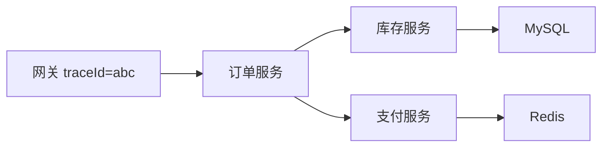

# 日志、监控与可观测性

> 面向 Java / Spring Boot 技术栈的通用可观测性（Observability）实践指南，从日志、指标、链路三大支柱出发，讲解规范化设计与 Actuator + Micrometer 落地，适合入门到进阶读者。

## ① 模块介绍

很多线上问题不是"代码不会写"，而是**"出了问题没人知道、知道了也定位不到"**。可观测性（Observability）的目标就是让系统状态可见、问题可追踪、异常可告警。本章从三大支柱（日志、指标、链路）出发，给出各自的最佳实践，并落地到 Spring Boot 场景的 Actuator + Micrometer 组合。

### 三个基础维度

| 维度 | 回答的问题 | 典型工具 |
|------|-----------|----------|
| 日志（Logs） | 发生了什么 | ELK、Loki、Filebeat |
| 指标（Metrics） | 系统整体状态如何 | Prometheus + Grafana |
| 链路（Traces） | 一次请求经过哪些环节 | Jaeger、SkyWalking、Zipkin |

三者互补：日志偏细节、指标偏全局趋势、链路把一次请求串起来——**只靠任何一个维度都无法高效排障**。

## ② 核心方法论

### 日志实践原则

- **统一格式**：至少包含时间、级别、服务名、traceId，机器可解析、人可读；
- **错误日志保留上下文**：避免只有一句"系统异常"，要带入参、堆栈与关联 ID；
- **不打印敏感信息**：密码、Token、身份证号等禁止进日志；
- **结构化输出**：JSON 格式便于采集与检索，配合 traceId 串联全链路。

### 指标实践原则

核心指标清单：

| 类别 | 指标 |
|------|------|
| 流量 | QPS / TPS |
| 性能 | 响应时间（P50/P95/P99） |
| 质量 | 错误率 |
| JVM | 内存、GC 频率与耗时 |
| 线程 | 线程池队列长度、活跃线程数 |
| 依赖 | 数据库连接池使用率、Redis/MQ 延迟 |

指标使用三条原则：

- **比趋势而不是比绝对值**：关注异常波动，而非精确数值；
- **指标要有告警**：只有面板没有告警，等于没监控；
- **业务指标优先**：技术指标正常不代表业务正常（如接口 200 但订单没生成）。

### 链路追踪方法论

微服务或多中间件调用场景下，链路追踪（Distributed Tracing）能回答三个问题：

- 这次请求**卡在哪一跳**？
- 哪个服务**最慢**？
- 哪个下游**错误扩散**了？

核心机制：请求入口生成 traceId，逐跳传递，各服务上报 span（调用片段，即链路中的每一个处理段），汇聚后还原完整调用拓扑与耗时。

## ③ 关键流程

### 图：一次请求的链路追踪数据流

该图展示了一次跨服务请求的追踪过程：请求自网关入口生成全局唯一的 traceId（如 `abc`），随后逐级传递给订单服务、库存服务与支付服务，库存与支付又分别依赖 MySQL 和 Redis。各环节基于同一个 traceId 上报各自的 span，最终可在追踪系统中还原出完整的调用拓扑与每跳耗时，从而定位"卡在哪一跳"。

## ④ 工具与实践

### Spring Boot 落地

- 接入 **Actuator（执行器）**：暴露 health、metrics、threaddump 等端点；
- 配合 **Micrometer（统一指标门面）**：以统一抽象对接 Prometheus 等后端：
  - JVM 内存/GC、线程池、HTTP 请求指标开箱即用；
  - 自定义业务指标：`MeterRegistry.counter("order.create.total")`；
- 单服务阶段指标 + 日志足够；**跨服务分析时再补链路追踪方案**（SkyWalking/Jaeger）。

在 `pom.xml` 中引入依赖并打开 `/actuator/prometheus` 端点后，即可通过 Micrometer 的默认绑定暴露 JVM、线程池、HTTP 等指标，再在业务代码中通过 `MeterRegistry` 声明自定义业务指标。整体落地路径遵循"先指标 + 日志，后链路追踪"的渐进策略，避免一次性引入过重体系。

## ⑤ 常见坑点

- **只有日志，没有指标**：日志定位单点细节，指标发现全局趋势，缺一不可；
- **只有监控面板，没有告警**：面板是给人看的，告警是让系统主动找人的；
- **排障时才临时加日志**：线上问题往往发生在没有日志的时刻，日志要提前埋好；
- **技术指标正常就以为一切正常**：必须补充业务指标（如订单生成量）才算真正健康的判定标准。

## ⑥ 进阶扩展与参考

### 小结

- **三大支柱**：日志（发生了什么）、指标（状态如何）、链路（卡在哪里），相互补充；
- **日志规范**：统一格式 + traceId + 上下文 + 无敏感信息；
- **指标重点**：QPS/RT/错误率/JVM/线程池/连接池，业务指标优先于技术指标；
- **落地路径**：Spring Boot 用 Actuator + Micrometer 起步，跨服务再上链路追踪；
- **核心思维**：可观测性的价值在"问题发生前可预警、发生时能定位、发生后可复盘"。

### 参考

- 可观测性三大支柱与 traceId 贯通：详见本文 ②、③ 节；
- 告警与值班机制：把监控、警报、响应、升级、复盘串成闭环体系，详见[告警与值班机制](03-告警与值班机制.md)；
- 指标与日志的具体采集工具：详见[日志管理](04-日志管理.md)与[APM 监控](05-APM监控.md)。