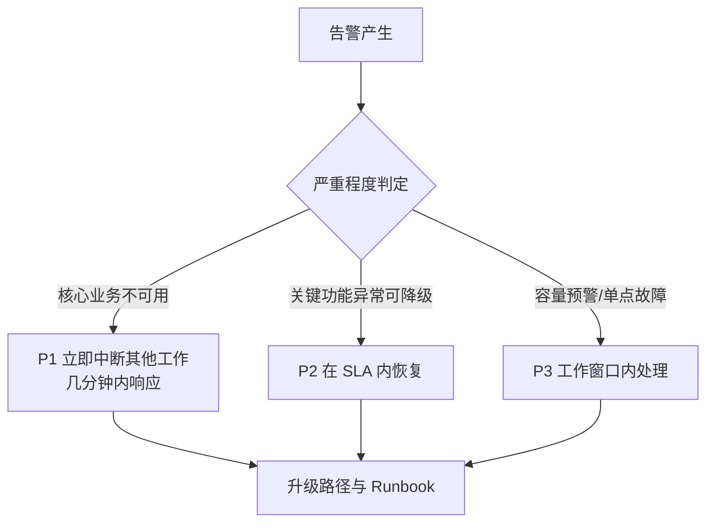
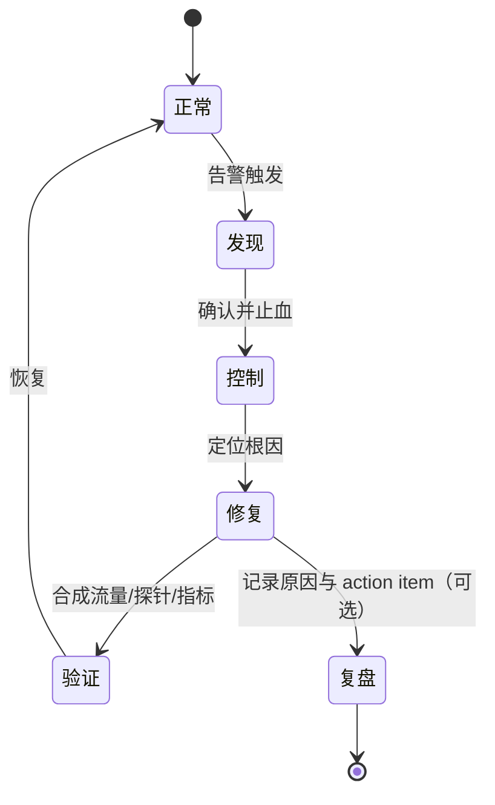

# 告警与值班机制

> 面向运维与 SRE 读者，讲解如何把监控、警报、响应、升级、复盘串成一套可落地的闭环机制，覆盖告警来源分层、阈值分级、值班流程与故障复盘四层。

## ① 模块介绍

很多团队"监控有了，告警也接了"，但线上出问题时依然手忙脚乱。原因在于告警与值班不是"看着面板"，而是把监控、警报、响应、升级、复盘串成一个闭环体系。本文从告警来源、阈值分级、值班流程、故障复盘四个层面，讲清楚一套可落地的告警与值班机制。

### 告警来源与指标分层

告警不能只盯一种指标，通常按以下五层采集：

| 层级 | 典型指标 | 反映的问题 |
|------|---------|-----------|
| 应用指标 | 请求错误率、超时比例、线程池队列长度、异步队列堆积 | 业务感知 |
| 基础设施指标 | CPU、内存、磁盘、网络使用率 | 整体服务退化 |
| 中间件指标 | 数据库连接池耗尽、Redis 延迟、MQ 消息积压 | 依赖链路故障 |
| 业务指标 | 支付成功率、订单处理吞吐、核心链路排队长度 | 业务是否可用 |
| 健康自检 | 定时心跳、依赖链路探活、合约测试 | 服务是否存活 |

其中业务指标最容易被忽略：技术指标恢复不代表业务恢复，只有业务指标也正常，才算真正恢复。

## ② 核心方法论

### 阈值策略与告警分级

阈值应结合业务 SLO（Service Level Objective，服务等级目标）与历史噪声设定，采用"静态阈值 + 动态趋势"双核驱动：

- 99.9% 业务可用目标对应错误率上限 0.1%，暂时超过即刻生成 P1 告警，响应窗口在几分钟内；
- 请求 RT 超过 2s 且错误率持续 5 分钟，触发 P2 告警；
- 线程池堆积超过 80% 但业务仍可用，作为 P3 预警安排后续排查。

告警分级是值班机制的基石：

| 级别 | 含义 | 响应要求 |
|------|------|---------|
| P1 | 核心业务不可用，大范围用户受影响 | 立即中断其他工作 |
| P2 | 关键功能异常，有临时降级方案 | 在 SLA 内恢复 |
| P3 | 容量预警、单点故障 | 工作窗口内处理 |

每个级别都必须有具体阈值、响应窗口、负责人与 Runbook（应急预案手册）链接，避免"谁也不清楚下一步该做什么"。

### 图：告警分级与响应窗口



该图说明告警分级决策：从原始告警出发，依据影响程度划分为 P1/P2/P3 三个级别，分别对应不同的响应窗口与负责人，最终统一落入升级路径与 Runbook 支撑，保证"每个级别都有明确下一步动作"。

### 故障响应四阶段

故障响应分为四个阶段：

1. **侦测阶段**：告警自动触发，值班人确认并补充影响服务、范围、TraceId；
2. **控制阶段**：立即执行预案（流量切换、发布降级），写出 ack（确认接收）内容；
3. **修复阶段**：定位根因，执行精准变更，并在方案中注明风险点与回滚办法；
4. **验证阶段**：通过合成流量、健康探针、指标监控确认系统恢复。

### 复盘方法论

复盘至少覆盖五个问题：发现路径（谁、通过哪个告警、何时发现）、已做的措施、为什么阈值没提前阻止、下次如何避免、后续 action item 与负责人。复盘的核心不在追责，而在记录"为什么发生"和"下次如何自动化"。

## ③ 关键流程

### 图：一次标准的值班响应流程

```mermaid
flowchart LR
    A[告警触发] --> B[值班人确认真假<br/>记录 incident log]
    B --> C[评估影响范围与等级]
    C --> D[止血：切负载/重启依赖/降级<br/>同步到告警通道]
    D --> E{处理能力是否不足}
    E -->|是| F[升级：第二负责人/架构/SRE/DBA<br/>@群内相关人；P1 跨子系统对产品运营通告]
    E -->|否| G[闭环：恢复后观察 15 分钟<br/>记录变更]
    F --> G
```

该图展示一次标准值班响应：告警触发后，值班人先确认真假并记入 incident log，随后评估影响范围与等级并立即止血，处理能力不足时走升级路径（通知第二负责人、架构、SRE、DBA 并在群里 @ 相关人；影响达 P1 且跨子系统时联系产品/运营对外通告），最终恢复后观察 15 分钟并记录变更（回滚、配置调整）完成闭环。

升级路径要提前写好"谁来接手、在哪个群复盘、需要填何种状态页"，并且每次值班都复查一次联系方式。

### 图：告警驱动的稳定性闭环



该状态图描述了一次故障从发生到闭环的完整生命周期：系统从"正常"状态被告警触发进入"发现"，依次经历"控制""修复""验证"后回到"正常"；同时修复环节可迭代进入"复盘"，把战报落成后续动作项，支撑下一次故障的自动化预防。

## ④ 工具与实践

### 实战场景一：支付链路 RT 激增

监控报错率从 0.5% 跃升到 3%，RT 从 350ms 升到 1.8s，触发 P1 并自动推送到 on-call 群。值班人确认是某台缓存节点延迟飙升，立即下线该节点并触发限流，把热 key 慢查询分析提交给 Redis 团队。12 分钟恢复正常，复盘发现原阈值未考虑峰值 30% 伸缩，需把限流阈值提前与容量团队对齐。

### 实战场景二：Kubernetes 节点资源耗尽

基础设施告警 `node CPU usage > 95%`，属于 P2。值班人先调低 kube-probe 拉取频率、提高 Pod 迁移优先级，发现某个定时任务 CPU 占用暴涨后临时禁用并加并发限制。复盘新增"启动前跑负载测试""利用 PodDisruptionBudget 保护核心服务"两个 action item。

### 落地要点清单

- 为每个告警级别配置：具体阈值 + 响应窗口 + 负责人 + Runbook 链接；
- 提前写清升级路径：谁来接手、在哪个群复盘、填何种状态页；
- 每次值班复查一次联系方式，保证升级链路真实可用；
- 复盘后把 action item 落地到告警阈值、容量预测与发布流程。

## ⑤ 常见坑点

- 所有告警一样严重，值班人沦为噪音过滤器，必须按业务影响定级；
- 告警里不写上下游影响，接手人只看到一个数字，无法决策；
- 故障恢复完不复盘或只写一句"已恢复"，复盘是让战报落地的方式；
- 只有技术指标告警没有业务指标告警，技术恢复后业务仍然不通；
- 阈值设太紧不关抖动告警，或设太松把真正的 P1 排在最后。

## ⑥ 进阶扩展与参考

### 小结

告警与值班机制的要点：指标分层采集（应用/基础设施/中间件/业务）、阈值结合 SLO 分级（P1/P2/P3）、值班流程标准化（判断→止血→升级→闭环）、故障四阶段响应 + 复盘落地。回答告警类面试题时，重点描述一条完整的告警响应流程：如何判断等级、谁去止血、如何升级、如何与团队同步。

### 参考

- 指标来源层的实际采集与工具配置：详见[监控与告警实战](01-监控与告警实战.md)（Prometheus 告警规则）、[日志管理](04-日志管理.md)、[容器监控实践](08-容器监控实践：Prometheus、Grafana%20方案介绍.md)；
- 深入 SLO/SLI（Service Level Indicator，服务等级指标）建模：可参考 Google SRE 工作手册；
- 下一篇[日志管理](04-日志管理.md)讲解海量日志如何统一采集、存储与检索，为排障提供数据底座。