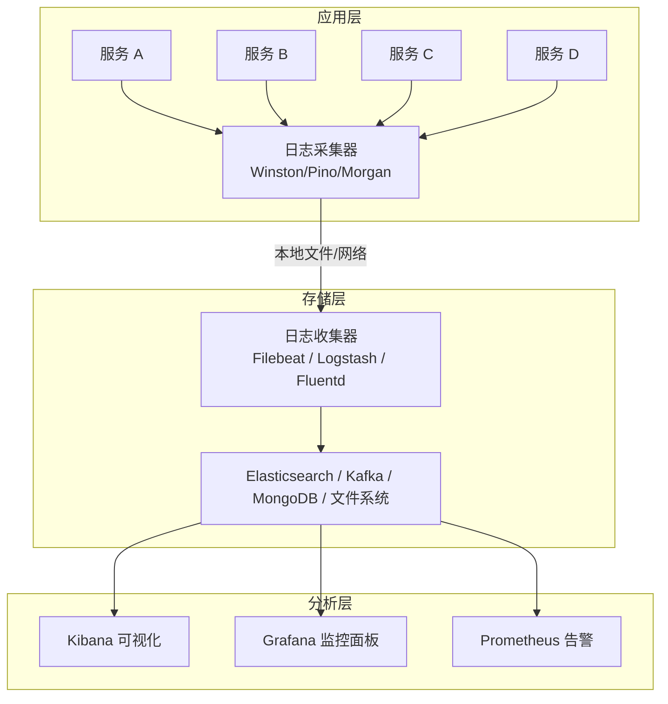
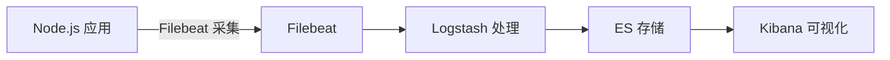
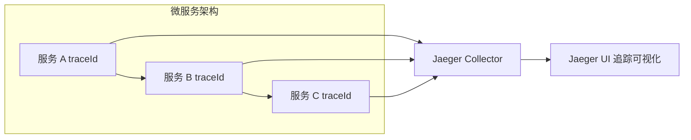
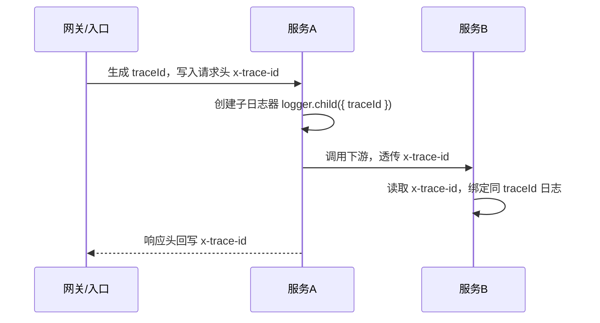

# 日志管理

> 面向 Node.js 技术栈的日志管理全指南，从框架选型、日志级别、结构化格式、日志轮转，到 ELK/分布式追踪/监控告警与安全合规，覆盖入门到进阶的完整链路。

## ① 模块介绍

日志是应用程序运行状态的重要记录，对于问题排查、性能监控、安全审计等场景至关重要。良好的日志管理策略可以大幅提高运维效率。

### 核心价值

| 场景 | 作用 | 示例 |
|------|------|------|
| 问题排查 | 快速定位错误根源 | 通过错误堆栈追踪 Bug |
| 性能监控 | 识别性能瓶颈 | 记录接口响应时间 |
| 安全审计 | 追踪用户操作 | 记录登录、权限变更 |
| 合规要求 | 满足审计需求 | 保留操作日志 180 天 |
| 业务分析 | 了解用户行为 | 统计功能使用频率 |

### 图：日志系统整体架构



本图描述了日志系统的四层架构：最上层应用通过 Winston/Pino/Morgan 等采集器产生并输出日志，经传输层的 Filebeat、Logstash、Fluentd 等收集转发，落入存储层的 Elasticsearch、Kafka、MongoDB 或文件系统，最终在分析层由 Kibana、Grafana、Prometheus 完成可视化与告警。

### 日志流向

```
应用程序 → 日志框架 → 本地文件/网络 → 日志收集器 → 存储系统 → 分析平台
```

## ② 核心方法论

### 框架选型原则

| 特性 | Winston | Pino | Bunyan | Morgan | Log4js |
|------|---------|------|--------|--------|--------|
| 性能 | 中 | 极高 | 高 | 中 | 中 |
| 输出格式 | 多种 | JSON | JSON | 文本 | 多种 |
| 传输方式 | 丰富 | 插件 | 基础 | 仅HTTP | 丰富 |
| 学习曲线 | 低 | 低 | 中 | 极低 | 中 |
| 社区活跃度 | 高 | 高 | 中 | 高 | 中 |
| TypeScript | 支持 | 支持 | 支持 | 支持 | 支持 |
| 适用场景 | 通用 | 高性能 | 结构化 | HTTP请求 | 企业级 |

> 选型要点：企业级功能丰富选 Winston；高性能与微服务场景选 Pino；HTTP 请求日志专用选 Morgan；企业级多 Appender 选 Log4js；结构化日志专用选 Bunyan。

### 标准日志级别

```
日志级别优先级（从高到低）
  FATAL (0)  → 系统崩溃级别的严重错误
  ERROR (1)  → 错误事件，应用可能无法继续运行
  WARN  (2)  → 警告事件，可能导致问题
  INFO  (3)  → 重要业务事件
  HTTP  (4)  → HTTP 请求日志
  DEBUG (5)  → 调试信息
  TRACE (6)  → 最详细的跟踪信息
```

### 级别使用指南

| 级别 | 用途 | 示例场景 | 生产环境建议 |
|------|------|----------|-------------|
| FATAL | 系统级崩溃 | 数据库连接失败、配置缺失导致无法启动 | 始终记录 |
| ERROR | 错误事件 | API 调用失败、异常捕获 | 始终记录 |
| WARN | 警告事件 | 配置缺失使用默认值、废弃 API 调用 | 始终记录 |
| INFO | 重要业务事件 | 用户登录、订单创建、支付完成 | 始终记录 |
| HTTP | HTTP 请求 | API 调用记录 | 可选记录 |
| DEBUG | 调试信息 | 变量值、执行路径 | 仅开发环境 |
| TRACE | 详细跟踪 | 函数调用栈、完整数据流 | 仅调试时 |

### 结构化字段标准

```javascript
// 标准日志结构
const logStructure = {
  // 必需字段
  timestamp: 'ISO 8601 格式时间戳',
  level: '日志级别',
  message: '日志消息',
  
  // 推荐字段
  service: '服务名称',
  traceId: '追踪ID',
  spanId: '跨度ID',
  
  // 可选字段
  userId: '用户ID',
  requestId: '请求ID',
  duration: '执行时长(ms)',
  error: {
    name: '错误名称',
    message: '错误消息',
    stack: '堆栈信息'
  }
};
```

### 结构化最佳实践对比

```javascript
// ❌ 不好的做法：字符串拼接
logger.info(`用户 ${userId} 登录成功，IP: ${ip}`);

// ✅ 好的做法：结构化数据
logger.info('用户登录成功', {
  userId,
  ip,
  userAgent: req.headers['user-agent'],
  timestamp: new Date().toISOString()
});
```

### 框架性能对比

```
日志框架性能对比（每秒处理日志数）
  框架       吞吐量 (ops/s)   说明
  console    ~10,000          同步写入，性能最差
  winston    ~100,000         功能丰富，性能中等
  bunyan     ~300,000         结构化日志，性能较好
  pino       ~1,000,000+      异步写入，性能最佳
```

> 注：以上吞吐量为社区基准测试的量级参考（示例数值，非实测），具体性能因硬件、日志量与配置不同而有差异。

## ③ 关键流程

### 图：日志采集、存储、分析的流向



本图展示 ELK Stack 的典型链路：Node.js 应用产生的日志由 Filebeat 采集，转发给 Logstash 做结构化处理与解析，写入 Elasticsearch（ES，存储与全文检索）后由 Kibana 完成可视化查询。

### 图：分布式追踪架构



该图展示了基于 Jaeger 的分布式追踪架构：微服务 A/B/C 在各自节点基于同一 traceId 上报 span，统一汇入 Jaeger Collector，最终在 Jaeger UI 中完成追踪可视化，还原一次请求在多个服务间的完整调用路径。

### 图：Trace ID 传递流程



本时序图说明 traceId 的传递机制：入口网关生成 traceId 并写入 `x-trace-id` 请求头，服务 A 据此创建带 traceId 的子日志器，调用下游时透传请求头，服务 B 读取后沿用同一 traceId，从而将一次请求在多服务间的所有日志串联起来。

## ④ 工具与实践

### Node.js 日志基础

最简单的日志方式是使用 Node.js 内置的 `console` 对象：

```javascript
console.log('普通日志');
console.info('信息日志');
console.warn('警告日志');
console.error('错误日志');
console.time('计时');
// ... 代码执行
console.timeEnd('计时');
```

### console 方法的局限性

| 问题 | 影响 | 严重程度 |
|------|------|----------|
| 没有日志级别控制 | 无法过滤日志 | 高 |
| 缺乏时间戳等元数据 | 排查困难 | 中 |
| 不支持日志轮转 | 磁盘溢出风险 | 高 |
| 同步写入 | 性能瓶颈 | 高 |
| 无结构化支持 | 难以解析分析 | 中 |

### console 性能问题演示

```javascript
// ❌ 生产环境避免使用 console
// 同步写入会阻塞事件循环
console.time('sync-log');
for (let i = 0; i < 10000; i++) {
  console.log(`日志 ${i}`);
}
console.timeEnd('sync-log'); // 可能耗时数秒

// ✅ 使用异步日志框架
const pino = require('pino');
const logger = pino();

console.time('async-log');
for (let i = 0; i < 10000; i++) {
  logger.info(`日志 ${i}`);
}
console.timeEnd('async-log'); // 毫秒级完成
```

### Winston（推荐通用场景）

```bash
npm install winston
```

#### 基础配置

```javascript
const winston = require('winston');

const logger = winston.createLogger({
  level: 'info',
  format: winston.format.combine(
    winston.format.timestamp({ format: 'YYYY-MM-DD HH:mm:ss' }),
    winston.format.errors({ stack: true }),
    winston.format.splat(),
    winston.format.json()
  ),
  defaultMeta: { service: 'user-service' },
  transports: [
    // 写入错误日志到单独文件
    new winston.transports.File({ 
      filename: 'logs/error.log', 
      level: 'error' 
    }),
    // 写入所有日志
    new winston.transports.File({ 
      filename: 'logs/combined.log' 
    })
  ]
});

// 开发环境输出到控制台
if (process.env.NODE_ENV !== 'production') {
  logger.add(new winston.transports.Console({
    format: winston.format.combine(
      winston.format.colorize(),
      winston.format.simple()
    )
  }));
}

module.exports = logger;
```

#### 多传输配置

```javascript
const winston = require('winston');
require('winston-mongodb'); // 需要安装 winston-mongodb

const logger = winston.createLogger({
  transports: [
    // 控制台输出
    new winston.transports.Console({
      level: 'debug',
      format: winston.format.combine(
        winston.format.colorize(),
        winston.format.simple()
      )
    }),
    
    // 文件输出
    new winston.transports.File({ 
      filename: 'logs/error.log', 
      level: 'error' 
    }),
    new winston.transports.File({ 
      filename: 'logs/combined.log' 
    }),
    
    // MongoDB 存储
    new winston.transports.MongoDB({
      level: 'info',
      db: process.env.MONGODB_URI,
      collection: 'logs',
      tryReconnect: true
    }),
    
    // HTTP 远程日志服务
    new winston.transports.Http({
      host: 'logs.example.com',
      port: 443,
      path: '/api/logs'
    })
  ]
});
```

#### 使用示例

```javascript
const logger = require('./logger');

// 基本日志
logger.error('错误信息', { error: new Error('出错了') });
logger.warn('警告信息');
logger.info('信息日志', { userId: 123, action: 'login' });
logger.debug('调试信息', { data: { name: 'test' } });

// 带元数据的日志
logger.log({
  level: 'info',
  message: '用户操作',
  userId: 123,
  action: 'purchase',
  amount: 99.99,
  productId: 'PROD-001'
});

// 条件日志
if (logger.isLevelEnabled('debug')) {
  logger.debug('详细的调试信息', largeObject);
}
```

### Pino（推荐高性能场景）

高性能 JSON 日志库，适合生产环境和微服务架构。

```bash
npm install pino pino-pretty
```

#### 基础配置

```javascript
const pino = require('pino');

// 开发环境配置
const logger = pino({
  level: 'debug',
  transport: {
    target: 'pino-pretty',
    options: {
      colorize: true,
      translateTime: 'SYS:standard',
      ignore: 'pid,hostname'
    }
  }
});

// 生产环境配置
const prodLogger = pino({
  level: 'info',
  formatters: {
    level: (label) => ({ level: label })
  },
  timestamp: pino.stdTimeFunctions.isoTime
});

logger.info('服务启动');
logger.error({ err: new Error('失败') }, '请求失败');
```

#### 子日志器（Child Logger）

```javascript
const pino = require('pino');

const logger = pino();

// 创建带有上下文的子日志器
const userLogger = logger.child({ module: 'user-service' });
const orderLogger = logger.child({ module: 'order-service' });

userLogger.info('用户登录'); // 自动包含 module: 'user-service'
orderLogger.info('订单创建'); // 自动包含 module: 'order-service'
```

#### Pino 与 Express 集成

```javascript
const express = require('express');
const pino = require('pino');
const pinoHttp = require('pino-http');

const app = express();
const logger = pino();

// HTTP 请求日志中间件
app.use(pinoHttp({
  logger,
  customLogLevel: (req, res, err) => {
    if (res.statusCode >= 400 && res.statusCode < 500) return 'warn';
    if (res.statusCode >= 500 || err) return 'error';
    return 'info';
  },
  customSuccessMessage: (req, res) => {
    return `${req.method} ${req.url} - ${res.statusCode}`;
  }
}));

app.get('/api/users', (req, res) => {
  req.log.info('获取用户列表');
  res.json({ users: [] });
});
```

### Bunyan（推荐结构化日志）

专为 JSON 结构化日志设计，内置日志查看工具。

```bash
npm install bunyan
```

#### 基础配置

```javascript
const bunyan = require('bunyan');

const logger = bunyan.createLogger({
  name: 'myapp',
  level: 'info',
  serializers: {
    err: bunyan.stdSerializers.err,
    req: bunyan.stdSerializers.req,
    res: bunyan.stdSerializers.res
  },
  streams: [
    {
      level: 'info',
      stream: process.stdout
    },
    {
      level: 'error',
      path: '/var/log/myapp/error.log'
    }
  ]
});

logger.info({ userId: 123 }, '用户登录');
logger.error({ err: new Error('出错了') }, '处理失败');
```

#### 日志查看工具

```bash
# 安装 bunyan CLI 工具
npm install -g bunyan

# 格式化查看日志
node app.js | bunyan

# 过滤特定级别
node app.js | bunyan -l error

# 只显示特定字段
node app.js | bunyan -c 'this.userId === 123'
```

### Morgan（HTTP 请求日志专用）

Express 中间件，专门用于 HTTP 请求日志。

```bash
npm install morgan
```

#### 预定义格式

```javascript
const express = require('express');
const morgan = require('morgan');

const app = express();

// 预定义格式
app.use(morgan('combined'));  // Apache 标准格式
app.use(morgan('common'));    // 简化 Apache 格式
app.use(morgan('dev'));       // 开发环境彩色输出
app.use(morgan('short'));     // 短格式
app.use(morgan('tiny'));      // 最短格式
```

#### 自定义格式

```javascript
// 自定义令牌
morgan.token('user-id', (req) => req.user?.id || 'anonymous');
morgan.token('response-time-ms', (req, res) => {
  if (!req._startAt) return;
  const diff = process.hrtime(req._startAt);
  return diff[0] * 1e3 + diff[1] * 1e-6;
});

// 自定义格式字符串
app.use(morgan(':method :url :status :response-time-ms ms - :user-id'));

// 自定义格式函数
app.use(morgan((tokens, req, res) => {
  return JSON.stringify({
    method: tokens.method(req, res),
    url: tokens.url(req, res),
    status: tokens.status(req, res),
    'response-time': tokens['response-time'](req,%20res),
    'user-id': tokens['user-id'](req,%20res),
    timestamp: new Date().toISOString()
  });
}));
```

#### 写入文件与旋转

```javascript
const express = require('express');
const morgan = require('morgan');
const path = require('path');

const app = express();

// 开发环境：彩色输出
if (process.env.NODE_ENV === 'development') {
  app.use(morgan('dev'));
}

// 生产环境：写入文件（带轮转）
if (process.env.NODE_ENV === 'production') {
  // 日志轮转（使用 rotating-file-stream）
  const rfs = require('rotating-file-stream');
  const rotatingStream = rfs.createStream('access.log', {
    path: path.join(__dirname, 'logs'),
    size: '10M',
    interval: '1d',
    compress: 'gzip'
  });
  
  app.use(morgan('combined', { stream: rotatingStream }));
}
```

### Log4js（企业级日志）

类似 Java Log4j 的日志框架，支持丰富的 Appender。

```bash
npm install log4js
```

#### 配置示例

```javascript
const log4js = require('log4js');

log4js.configure({
  appenders: {
    console: { type: 'console' },
    file: { 
      type: 'file', 
      filename: 'logs/app.log',
      maxLogSize: 10485760, // 10MB
      backups: 3,
      compress: true
    },
    dateFile: {
      type: 'dateFile',
      filename: 'logs/app.log',
      pattern: 'yyyy-MM-dd',
      compress: true
    },
    mail: {
      type: 'smtp',
      recipients: 'admin@example.com',
      sender: 'logs@example.com',
      sendInterval: 60,
      transport: 'SMTP',
      SMTP: {
        host: 'smtp.example.com',
        port: 587,
        auth: { user: 'user', pass: 'pass' }
      }
    }
  },
  categories: {
    default: { 
      appenders: ['console', 'dateFile'], 
      level: 'info' 
    },
    error: { 
      appenders: ['mail', 'file'], 
      level: 'error' 
    }
  }
});

const logger = log4js.getLogger();
const errorLogger = log4js.getLogger('error');

logger.info('应用启动');
errorLogger.error('严重错误发生');
```

### 日志级别配置

#### Winston 自定义日志级别

```javascript
const { createLogger, transports, format } = require('winston');

// 自定义日志级别
const customLevels = {
  levels: {
    fatal: 0,
    error: 1,
    warn: 2,
    info: 3,
    http: 4,
    debug: 5,
    trace: 6
  },
  colors: {
    fatal: 'red',
    error: 'red',
    warn: 'yellow',
    info: 'green',
    http: 'magenta',
    debug: 'blue',
    trace: 'gray'
  }
};

const logger = createLogger({
  levels: customLevels.levels,
  level: process.env.LOG_LEVEL || 'info',
  format: format.combine(
    format.timestamp(),
    format.json()
  ),
  transports: [
    new transports.Console({
      format: format.combine(
        format.colorize(),
        format.simple()
      )
    })
  ]
});

// 添加颜色支持
require('winston').addColors(customLevels.colors);
```

#### 动态日志级别

```javascript
// 运行时动态调整日志级别
const logger = require('./logger');

// API 端点动态修改日志级别
app.put('/api/log-level', (req, res) => {
  const { level } = req.body;
  if (['error', 'warn', 'info', 'debug'].includes(level)) {
    logger.level = level;
    res.json({ success: true, level });
  } else {
    res.status(400).json({ error: 'Invalid log level' });
  }
});
```

### 日志格式

#### JSON 格式（推荐生产环境）

```javascript
const winston = require('winston');

const logger = winston.createLogger({
  format: winston.format.combine(
    winston.format.timestamp(),
    winston.format.json()
  ),
  transports: [new winston.transports.File({ filename: 'app.log' })]
});

// 输出示例：
// {
//   "level": "info",
//   "message": "用户登录",
//   "timestamp": "2024-01-15T10:30:00.000Z",
//   "userId": 123,
//   "ip": "192.168.1.100"
// }
```

#### 自定义格式

```javascript
const customFormat = winston.format.printf(({ level, message, timestamp, ...metadata }) => {
  let msg = `${timestamp} [${level.toUpperCase().padEnd(5)}] ${message}`;
  if (Object.keys(metadata).length > 0) {
    msg += ` | ${JSON.stringify(metadata)}`;
  }
  return msg;
});

const logger = winston.createLogger({
  format: winston.format.combine(
    winston.format.timestamp({ format: 'YYYY-MM-DD HH:mm:ss' }),
    customFormat
  ),
  transports: [new winston.transports.Console()]
});

// 输出：2024-01-15 10:30:00 [INFO ] 用户登录 | {"userId":123}
```

#### 完整格式化链

```javascript
const winston = require('winston');

// 完整的格式配置
const logger = winston.createLogger({
  format: winston.format.combine(
    // 添加时间戳
    winston.format.timestamp({ format: 'YYYY-MM-DD HH:mm:ss.SSS' }),
    
    // 处理错误堆栈
    winston.format.errors({ stack: true }),
    
    // 字符串插值
    winston.format.splat(),
    
    // 添加服务元数据
    winston.format((info) => {
      info.service = 'my-app';
      info.hostname = require('os').hostname();
      info.pid = process.pid;
      return info;
    })(),
    
    // 最终格式
    winston.format.json()
  ),
  transports: [new winston.transports.Console()]
});
```

### 日志轮转

#### 为什么需要日志轮转？

```
不进行日志轮转的风险
  • 单个日志文件过大，难以打开和搜索
  • 磁盘空间耗尽，导致服务崩溃
  • 日志分析工具性能下降
  • 备份和传输困难
```

#### winston-daily-rotate-file

```bash
npm install winston-daily-rotate-file
```

```javascript
const winston = require('winston');
const DailyRotateFile = require('winston-daily-rotate-file');

const logger = winston.createLogger({
  transports: [
    // 错误日志轮转
    new DailyRotateFile({
      filename: 'logs/error-%DATE%.log',
      datePattern: 'YYYY-MM-DD',
      level: 'error',
      maxSize: '20m',
      maxFiles: '14d',
      format: winston.format.combine(
        winston.format.timestamp(),
        winston.format.json()
      )
    }),
    
    // 所有日志轮转
    new DailyRotateFile({
      filename: 'logs/application-%DATE%.log',
      datePattern: 'YYYY-MM-DD',
      maxSize: '20m',
      maxFiles: '30d',
      format: winston.format.combine(
        winston.format.timestamp(),
        winston.format.json()
      )
    })
  ]
});
```

#### 高级配置与监听事件

```javascript
const transport = new DailyRotateFile({
  filename: 'logs/app-%DATE%.log',
  datePattern: 'YYYY-MM-DD',
  zippedArchive: true,      // 压缩旧日志
  maxSize: '20m',           // 单文件最大 20MB
  maxFiles: '30d',          // 保留 30 天
  auditFile: 'logs/audit.json' // 审计文件
});

// 文件创建时触发
transport.on('new', (newFilename) => {
  console.log(`新的日志文件已创建: ${newFilename}`);
});

// 文件轮转时触发
transport.on('rotate', (oldFilename, newFilename) => {
  console.log(`日志轮转: ${oldFilename} -> ${newFilename}`);
});

// 文件归档压缩时触发
transport.on('archive', (zipPath) => {
  console.log(`日志压缩: ${zipPath}`);
});
```

#### rotating-file-stream（适用于 Morgan）

```bash
npm install rotating-file-stream
```

```javascript
const rfs = require('rotating-file-stream');
const morgan = require('morgan');

// 按大小轮转
const stream = rfs.createStream('access.log', {
  path: './logs',
  size: '10M',           // 10MB 轮转
  interval: '1d',        // 每天检查
  compress: 'gzip',      // 压缩
  maxFiles: 30           // 最多保留 30 个文件
});

app.use(morgan('combined', { stream }));
```

#### PM2 日志轮转

```bash
# 安装
pm2 install pm2-logrotate

# 配置
pm2 set pm2-logrotate:max_size 10M      # 单文件最大 10MB
pm2 set pm2-logrotate:retain 7          # 保留 7 天
pm2 set pm2-logrotate:compress true     # 压缩旧日志
pm2 set pm2-logrotate:dateFormat YYYY-MM-DD-HH-mm-ss
```

### 结构化日志与请求上下文

#### 请求上下文日志

```javascript
const { v4: uuidv4 } = require('uuid');
const winston = require('winston');

// 请求 ID 中间件
app.use((req, res, next) => {
  req.id = uuidv4();
  req.startTime = Date.now();
  next();
});

// 上下文日志
function createRequestLogger(req) {
  return logger.child({
    requestId: req.id,
    method: req.method,
    path: req.path,
    userId: req.user?.id,
    ip: req.ip
  });
}

// 使用
app.get('/api/users', (req, res) => {
  const log = createRequestLogger(req);
  log.info('获取用户列表开始');
  
  // 业务逻辑...
  
  log.info('获取用户列表完成', {
    duration: Date.now() - req.startTime,
    count: users.length
  });
});
```

#### Express 集成

```javascript
const express = require('express');
const winston = require('winston');
const expressWinston = require('express-winston');

const app = express();

// 请求日志
app.use(expressWinston.logger({
  winstonInstance: logger,
  level: 'info',
  meta: true,
  msg: 'HTTP {{req.method}} {{req.url}}',
  expressFormat: true,
  colorize: false,
  dynamicMeta: (req, res) => {
    return {
      userId: req.user?.id,
      requestId: req.id,
      responseTime: res.responseTime
    };
  }
}));

// 错误日志
app.use(expressWinston.errorLogger({
  winstonInstance: logger
}));
```

### 日志收集与分析（ELK Stack）

#### Filebeat 配置

```yaml
# filebeat.yml
filebeat.inputs:
- type: log
  enabled: true
  paths:
    - /var/log/myapp/*.log
  json.keys_under_root: true
  json.add_error_key: true
  fields:
    app: myapp
    env: production
  fields_under_root: true

output.logstash:
  hosts: ["logstash:5044"]

# 或者直接输出到 Elasticsearch
# output.elasticsearch:
#   hosts: ["localhost:9200"]
#   index: "myapp-%{+yyyy.MM.dd}"
```

#### Logstash 管道配置

```ruby
# logstash.conf
input {
  beats {
    port => 5044
  }
}

filter {
  json {
    source => "message"
  }
  
  # 解析时间戳
  date {
    match => ["timestamp", "ISO8601"]
    target => "@timestamp"
  }
  
  # 添加地理位置信息
  geoip {
    source => "ip"
    target => "geoip"
  }
  
  # 解析用户代理
  useragent {
    source => "userAgent"
    target => "ua"
  }
}

output {
  elasticsearch {
    hosts => ["elasticsearch:9200"]
    index => "myapp-logs-%{+YYYY.MM.dd}"
  }
}
```

#### Node.js 直接发送到 Elasticsearch

```javascript
const { Client } = require('@elastic/elasticsearch');
const winston = require('winston');
const { ElasticsearchTransport } = require('winston-elasticsearch');

// Elasticsearch 客户端
const esClient = new Client({
  node: process.env.ES_NODE || 'http://localhost:9200',
  auth: {
    username: process.env.ES_USER,
    password: process.env.ES_PASSWORD
  }
});

// Winston Elasticsearch 传输
const esTransport = new ElasticsearchTransport({
  level: 'info',
  client: esClient,
  index: 'myapp-logs',
  indexTemplate: {
    index_patterns: ['myapp-logs-*'],
    mappings: {
      properties: {
        '@timestamp': { type: 'date' },
        level: { type: 'keyword' },
        message: { type: 'text' },
        service: { type: 'keyword' },
        traceId: { type: 'keyword' }
      }
    }
  }
});

const logger = winston.createLogger({
  transports: [esTransport]
});
```

#### 日志查询示例（Kibana KQL）

```
# 查找特定用户的错误日志
level: "error" AND userId: 123

# 查找慢请求
level: "http" AND duration > 1000

# 查找特定时间范围的错误
@timestamp >= "2024-01-01" AND @timestamp < "2024-01-02" AND level: "error"

# 聚合查询 - 统计错误类型
service: "myapp" AND level: "error"
```

### 分布式追踪

#### OpenTelemetry 集成

```javascript
const { NodeTracerProvider } = require('@opentelemetry/sdk-trace-node');
const { OTLPTraceExporter } = require('@opentelemetry/exporter-trace-otlp-http');
const { BatchSpanProcessor } = require('@opentelemetry/sdk-trace-base');
const { Resource } = require('@opentelemetry/resources');
const { SemanticResourceAttributes } = require('@opentelemetry/semantic-conventions');

// 配置追踪提供者
const provider = new NodeTracerProvider({
  resource: new Resource({
    [SemanticResourceAttributes.SERVICE_NAME]: 'my-service',
  }),
});

// OTLP 导出器：Jaeger 1.35+ 原生支持 OTLP 协议，可直接上报
// （@opentelemetry/exporter-jaeger 已被 OpenTelemetry 官方弃用，推荐统一走 OTLP）
const otlpExporter = new OTLPTraceExporter({
  url: 'http://localhost:4318/v1/traces',
});

provider.addSpanProcessor(new BatchSpanProcessor(otlpExporter));
provider.register();

// 获取追踪器
const tracer = provider.getTracer('my-service');

// 在日志中包含追踪信息
const { context, trace } = require('@opentelemetry/api');

function logWithContext(message, data = {}) {
  const activeSpan = trace.getActiveSpan();
  const spanContext = activeSpan?.spanContext();
  
  logger.info(message, {
    ...data,
    traceId: spanContext?.traceId,
    spanId: spanContext?.spanId,
  });
}
```

#### Trace ID 传递

```javascript
const { v4: uuidv4 } = require('uuid');

// 请求追踪中间件
app.use((req, res, next) => {
  // 从上游获取或生成新的 traceId
  req.traceId = req.headers['x-trace-id'] || uuidv4();
  
  // 创建子日志器
  req.logger = logger.child({
    traceId: req.traceId,
    userId: req.user?.id
  });
  
  // 传递给下游服务
  res.setHeader('x-trace-id', req.traceId);
  
  // 记录请求开始
  req.startTime = Date.now();
  req.logger.info('请求开始', {
    method: req.method,
    url: req.url
  });
  
  // 记录请求结束
  res.on('finish', () => {
    req.logger.info('请求结束', {
      statusCode: res.statusCode,
      duration: Date.now() - req.startTime
    });
  });
  
  next();
});

// 下游服务调用时传递 traceId
async function callDownstream(req, url) {
  return fetch(url, {
    headers: {
      'x-trace-id': req.traceId
    }
  });
}
```

### 监控告警

#### 日志告警规则配置

```javascript
// 使用 winston 和自定义告警传输
class AlertTransport extends winston.transports.Stream {
  constructor(options) {
    super(options);
    this.alertThreshold = options.alertThreshold || 5;
    this.errorCount = 0;
    this.alertCallback = options.alertCallback;
    this.resetInterval = options.resetInterval || 60000; // 1分钟
    
    // 定期重置计数
    setInterval(() => {
      this.errorCount = 0;
    }, this.resetInterval);
  }

  log(info, callback) {
    if (info.level === 'error') {
      this.errorCount++;
      
      if (this.errorCount >= this.alertThreshold) {
        this.alertCallback({
          message: `错误数量达到阈值: ${this.errorCount}`,
          threshold: this.alertThreshold,
          timeWindow: this.resetInterval
        });
      }
    }
    callback();
  }
}

// 使用
const logger = winston.createLogger({
  transports: [
    new AlertTransport({
      level: 'error',
      alertThreshold: 10,
      alertCallback: (alert) => {
        // 发送告警通知
        sendAlert(alert);
      }
    })
  ]
});
```

#### Prometheus 集成

```javascript
const client = require('prom-client');
const winston = require('winston');

// 创建日志计数指标
const logCounter = new client.Counter({
  name: 'app_logs_total',
  help: 'Total count of log entries',
  labelNames: ['level', 'service']
});

// Prometheus 传输
class PrometheusTransport extends winston.transports.Stream {
  log(info, callback) {
    logCounter.inc({ 
      level: info.level, 
      service: info.service || 'default' 
    });
    callback();
  }
}

const logger = winston.createLogger({
  transports: [
    new PrometheusTransport()
  ]
});

// 暴露指标端点
app.get('/metrics', async (req, res) => {
  res.set('Content-Type', client.register.contentType);
  res.send(await client.register.metrics());
});
```

#### Prometheus 告警规则配置

```yaml
# Prometheus 告警规则示例
groups:
  - name: log_alerts
    rules:
      # 错误率告警
      - alert: HighErrorRate
        expr: rate(app_logs_total{level="error"}[5m]) > 1
        for: 5m
        labels:
          severity: critical
        annotations:
          summary: "高错误率告警"
          description: "过去5分钟错误率超过阈值"
      
      # 特定错误告警
      - alert: DatabaseError
        expr: app_logs_total{level="error",message=~".*database.*"} > 0
        for: 1m
        labels:
          severity: warning
        annotations:
          summary: "数据库错误"
```

### PM2 日志管理

#### PM2 日志配置

```javascript
// ecosystem.config.js
module.exports = {
  apps: [{
    name: 'myapp',
    script: './app.js',
    instances: 'max',
    exec_mode: 'cluster',
    
    // 日志文件路径
    log_file: './logs/combined.log',
    out_file: './logs/out.log',
    error_file: './logs/error.log',
    
    // 时间戳格式
    log_date_format: 'YYYY-MM-DD HH:mm:ss Z',
    
    // 合并日志（集群模式）
    merge_logs: true
  }]
};
```

#### pm2-logrotate 详细配置

```bash
# 安装
pm2 install pm2-logrotate

# 配置选项
pm2 set pm2-logrotate:max_size 10M           # 单文件最大 10MB
pm2 set pm2-logrotate:retain 7               # 保留 7 个文件
pm2 set pm2-logrotate:compress true          # 压缩旧日志
pm2 set pm2-logrotate:dateFormat YYYY-MM-DD-HH-mm-ss
pm2 set pm2-logrotate:rotateModule true      # 轮转 PM2 模块日志
pm2 set pm2-logrotate:workerInterval 30      # 每 30 秒检查一次
pm2 set pm2-logrotate:rotateInterval 0 0 * * *  # 每天凌晨轮转
```

#### PM2 日志查看

```bash
# 实时查看日志
pm2 logs myapp

# 只查看错误日志
pm2 logs myapp --err

# 只查看输出日志
pm2 logs myapp --out

# 查看最近 100 行
pm2 logs myapp --lines 100

# 清空日志
pm2 flush myapp

# 重新加载日志
pm2 reloadLogs
```

### 性能优化

#### 异步日志写入

```javascript
const winston = require('winston');
const { Worker, isMainThread, parentPort, workerData } = require('worker_threads');

// 异步日志传输
class AsyncFileTransport extends winston.transports.File {
  constructor(options) {
    super(options);
    this.queue = [];
    this.flushInterval = options.flushInterval || 1000;
    this.maxQueueSize = options.maxQueueSize || 1000;
    
    // 定期刷新队列
    setInterval(() => this.flush(), this.flushInterval);
  }

  log(info, callback) {
    this.queue.push(info);
    
    // 队列满了立即刷新
    if (this.queue.length >= this.maxQueueSize) {
      this.flush();
    }
    
    // 立即回调，不阻塞主线程
    callback();
  }

  flush() {
    if (this.queue.length === 0) return;
    
    const logs = [...this.queue];
    this.queue = [];
    
    // 批量写入
    const content = logs.map(log => JSON.stringify(log)).join('\n');
    this._write(content, 'utf8', () => {});
  }
}
```

#### 日志缓冲与条件日志

```javascript
const pino = require('pino');

// Pino 底层基于 sonic-boom，支持异步写入与内置缓冲
const logger = pino(pino.destination({
  dest: './logs/app.log',
  sync: false,      // 异步写入，不阻塞事件循环
  minLength: 4096,  // 缓冲区阈值（字节），攒够后一次性落盘
}));
```

```javascript
// 避免不必要的日志序列化开销
if (logger.isLevelEnabled('debug')) {
  logger.debug('详细的调试信息', expensiveOperation());
}

// 使用懒加载
logger.debug({
  get data() {
    return expensiveOperation();
  }
}, '延迟计算的日志');
```

### 安全实践

#### 敏感信息过滤

```javascript
// 敏感字段列表
const SENSITIVE_FIELDS = [
  'password',
  'token',
  'apiKey',
  'api_key',
  'secret',
  'accessToken',
  'refreshToken',
  'creditCard',
  'credit_card',
  'cvv',
  'ssn'
];

// 深度过滤函数
function sanitize(obj, depth = 0) {
  if (depth > 10) return '[Max Depth]';
  if (obj === null || obj === undefined) return obj;
  
  if (typeof obj !== 'object') {
    // 过滤字符串中的敏感模式
    if (typeof obj === 'string') {
      // 邮箱脱敏
      if (obj.includes('@')) {
        return obj.replace(/(.{1,2})@/, '***@');
      }
      // 手机号脱敏
      if (/^\d{11}$/.test(obj)) {
        return obj.replace(/(\d{3})\d{4}(\d{4})/, '$1****$2');
      }
    }
    return obj;
  }
  
  if (Array.isArray(obj)) {
    return obj.map(item => sanitize(item, depth + 1));
  }
  
  const sanitized = {};
  for (const [key, value] of Object.entries(obj)) {
    if (SENSITIVE_FIELDS.some(field => 
      key.toLowerCase().includes(field.toLowerCase())
    )) {
      sanitized[key] = '******';
    } else {
      sanitized[key] = sanitize(value, depth + 1);
    }
  }
  return sanitized;
}

// Winston 格式化
const sanitizeFormat = winston.format((info) => {
  return { ...info, ...sanitize(info) };
});

const logger = winston.createLogger({
  format: winston.format.combine(
    sanitizeFormat(),
    winston.format.json()
  ),
  transports: [new winston.transports.Console()]
});
```

#### 日志访问控制与审计

```javascript
// 文件权限设置
const fs = require('fs');
const path = require('path');

// 设置日志目录权限
const logDir = path.join(__dirname, 'logs');

fs.mkdirSync(logDir, { recursive: true });
fs.chmodSync(logDir, 0o750); // 仅所有者和组可访问

// 日志文件权限
const logFile = path.join(logDir, 'app.log');
fs.writeFileSync(logFile, '', { mode: 0o640 });
```

```javascript
// 审计日志 - 记录谁访问了日志
const auditLogger = winston.createLogger({
  level: 'info',
  format: winston.format.json(),
  transports: [
    new winston.transports.File({ 
      filename: 'logs/audit.log',
      maxsize: 5242880,
      maxFiles: 5
    })
  ]
});

// API 端点访问日志
app.get('/api/logs', authMiddleware, (req, res) => {
  auditLogger.info('日志访问', {
    userId: req.user.id,
    ip: req.ip,
    userAgent: req.headers['user-agent'],
    endpoint: '/api/logs',
    timestamp: new Date().toISOString()
  });
  
  // 返回日志内容
  res.json({ logs: [] });
});
```

#### 合规性要求与保留策略

```javascript
// 日志保留策略
const RETENTION_POLICY = {
  'audit.log': 365,      // 审计日志保留 1 年
  'error.log': 90,       // 错误日志保留 90 天
  'access.log': 30,      // 访问日志保留 30 天
  'debug.log': 7         // 调试日志保留 7 天
};

// 自动清理过期日志
const cron = require('node-cron');

cron.schedule('0 2 * * *', () => {
  const now = new Date();
  
  Object.entries(RETENTION_POLICY).forEach(([file, days]) => {
    const filePath = path.join(__dirname, 'logs', file);
    const stats = fs.statSync(filePath);
    const ageInDays = (now - stats.mtime) / (1000 * 60 * 60 * 24);
    
    if (ageInDays > days) {
      fs.unlinkSync(filePath);
      console.log(`删除过期日志: ${file}`);
    }
  });
});
```

### 最佳实践与异常处理

#### 记录关键信息

```javascript
// 请求日志 - 完整上下文
logger.info('API请求', {
  method: req.method,
  url: req.url,
  params: req.params,
  query: req.query,
  body: sanitize(req.body),
  userId: req.user?.id,
  ip: req.ip,
  userAgent: req.headers['user-agent'],
  requestId: req.id,
  duration: Date.now() - startTime
});

// 错误日志 - 完整错误信息
logger.error('请求处理失败', {
  error: {
    name: err.name,
    message: err.message,
    stack: err.stack,
    code: err.code
  },
  requestId: req.id,
  userId: req.user?.id,
  path: req.path,
  method: req.method
});
```

#### 环境区分配置

```javascript
const logLevel = process.env.NODE_ENV === 'production' ? 'info' : 'debug';

const logger = winston.createLogger({
  level: logLevel,
  transports: process.env.NODE_ENV === 'production'
    ? [
        new winston.transports.File({ filename: 'logs/error.log', level: 'error' }),
        new winston.transports.File({ filename: 'logs/combined.log' })
      ]
    : [
        new winston.transports.Console({
          format: winston.format.combine(
            winston.format.colorize(),
            winston.format.simple()
          )
        })
      ]
});
```

#### 异常处理与优雅退出

```javascript
// 捕获未处理的 Promise 拒绝
process.on('unhandledRejection', (reason, promise) => {
  logger.error('Unhandled Rejection', { 
    reason: reason instanceof Error ? {
      message: reason.message,
      stack: reason.stack
    } : reason,
    promise
  });
  
  // 优雅退出
  gracefulShutdown();
});

// 捕获未捕获的异常
process.on('uncaughtException', (error) => {
  logger.error('Uncaught Exception', {
    error: {
      message: error.message,
      stack: error.stack
    }
  });
  
  // 必须退出进程
  process.exit(1);
});

// 信号处理
process.on('SIGTERM', gracefulShutdown);
process.on('SIGINT', gracefulShutdown);

function gracefulShutdown() {
  logger.info('收到关闭信号，开始优雅退出...');
  
  // 关闭日志传输（确保日志写入）
  logger.close();
  
  process.exit(0);
}
```

### 容器化与 FAQ 精选

#### Docker 环境日志管理

```javascript
// 容器化应用只输出到控制台
const logger = winston.createLogger({
  transports: [
    new winston.transports.Console({
      format: winston.format.json()
    })
  ]
});
```

```yaml
# docker-compose.yml
services:
  app:
    logging:
      driver: "json-file"
      options:
        max-size: "10m"
        max-file: "3"
```

#### 历史日志压缩归档

```javascript
const cron = require('node-cron');
const fs = require('fs');
const path = require('path');
const zlib = require('zlib');

// 每天压缩 7 天前的日志
cron.schedule('0 3 * * *', () => {
  const logDir = './logs';
  const files = fs.readdirSync(logDir);
  
  files.forEach(file => {
    const filePath = path.join(logDir, file);
    const stats = fs.statSync(filePath);
    const ageInDays = (Date.now() - stats.mtime) / (1000 * 60 * 60 * 24);
    
    if (ageInDays > 7 && !file.endsWith('.gz')) {
      // 压缩文件
      const gzip = zlib.createGzip();
      const input = fs.createReadStream(filePath);
      const output = fs.createWriteStream(filePath + '.gz');
      
      input.pipe(gzip).pipe(output);
      
      output.on('finish', () => {
        fs.unlinkSync(filePath);
        logger.info(`日志已压缩: ${file}`);
      });
    }
  });
});
```

#### Winston 和 Pino 如何选择

| 场景 | 推荐 | 原因 |
|------|------|------|
| 高性能 API 服务 | Pino | 吞吐量高，资源占用低 |
| 企业级应用 | Winston | 功能丰富，传输方式多 |
| 微服务架构 | Pino | JSON 格式，易于聚合 |
| 快速原型开发 | Winston | 配置简单，文档完善 |
| 需要自定义格式 | Winston | 格式化选项丰富 |

#### 微服务架构中如何追踪请求

```javascript
// 入口服务生成 Trace ID
app.use((req, res, next) => {
  req.traceId = req.headers['x-trace-id'] || uuidv4();
  res.setHeader('x-trace-id', req.traceId);
  req.logger = logger.child({ traceId: req.traceId });
  next();
});

// 调用下游服务时传递
async function callService(url, req) {
  return fetch(url, {
    headers: { 'x-trace-id': req.traceId }
  });
}

// 下游服务接收
app.use((req, res, next) => {
  req.traceId = req.headers['x-trace-id'];
  req.logger = logger.child({ traceId: req.traceId });
  next();
});
```

#### 如何统一多个服务的日志格式

```javascript
// shared/logger.js
const winston = require('winston');

module.exports = (serviceName) => winston.createLogger({
  defaultMeta: { service: serviceName },
  format: winston.format.combine(
    winston.format.timestamp(),
    winston.format.json()
  ),
  transports: [
    new winston.transports.Console()
  ]
});

// 服务 A
const logger = require('./shared/logger')('user-service');
logger.info('用户登录');

// 服务 B  
const logger = require('./shared/logger')('order-service');
logger.info('订单创建');
```

## ⑤ 常见坑点

- **console 用于生产**：同步写入会阻塞事件循环，性能差且无级别控制、无轮转、无结构化；
- **不配置日志轮转**：单文件过大难以检索，磁盘耗尽导致服务崩溃；
- **字符串拼接代替结构化**：拼接型日志无法被日志系统索引与检索；
- **不设敏感信息过滤**：密码、Token、身份证号进入日志造成数据泄露；
- **无保留策略**：日志无限堆积挤占存储，或过早删除违反合规要求；
- **只能靠 `console` 而不用框架**：遇到高并发或微服务场景性能与可观测性双双不足；
- **生产环境不关闭 DEBUG**：海量调试日志淹没关键信息并拖慢应用。

应对建议：生产环境使用 Pino 或 Winston，开启异步写入与缓冲；统一采用 JSON 结构化并绑定 traceId/requestId；配置按大小/时间的轮转并压缩归档；定义保留策略与访问控制；接入 ELK/Loki 统一采集检索。

## ⑥ 进阶扩展与参考

### 小结

良好的日志管理是应用稳定运行的基础。核心要点：

1. **选择合适的框架**：Pino（高性能）或 Winston（功能丰富）
2. **使用结构化日志**：JSON 格式，便于检索分析
3. **实现日志轮转**：避免磁盘溢出
4. **分布式追踪**：Trace ID 串联请求链路
5. **敏感信息保护**：过滤和脱敏
6. **监控告警**：实时感知异常
7. **性能优化**：异步写入、条件日志

### 参考

- 告警与值班闭环：详见[告警与值班机制](03-告警与值班机制.md)；
- 可观测性三大支柱与指标监控：详见[日志、监控与可观测性](02-日志监控与可观测性.md)、[监控与告警实战](01-监控与告警实战.md)与[APM 监控](05-APM监控.md)；
- 社区与文档：Winston / Pino / Bunyan / Morgan / Log4js 官方仓库，OpenTelemetry 官方文档，以及 Elastic Stack 文档。