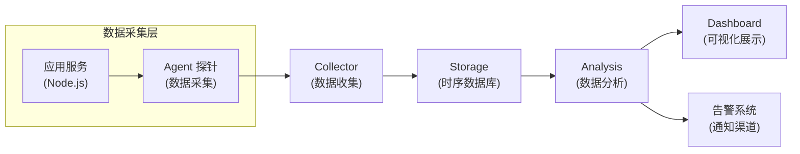
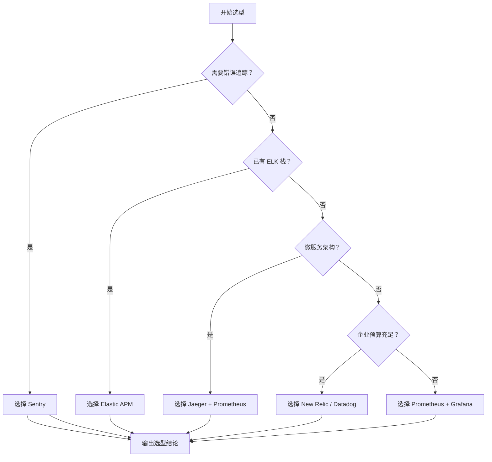
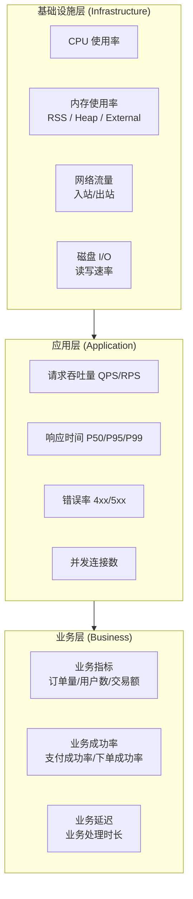
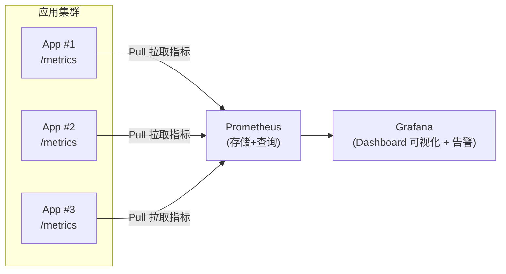
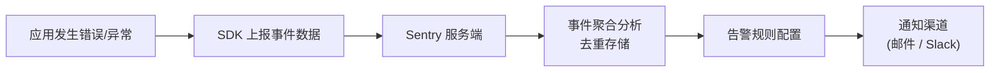
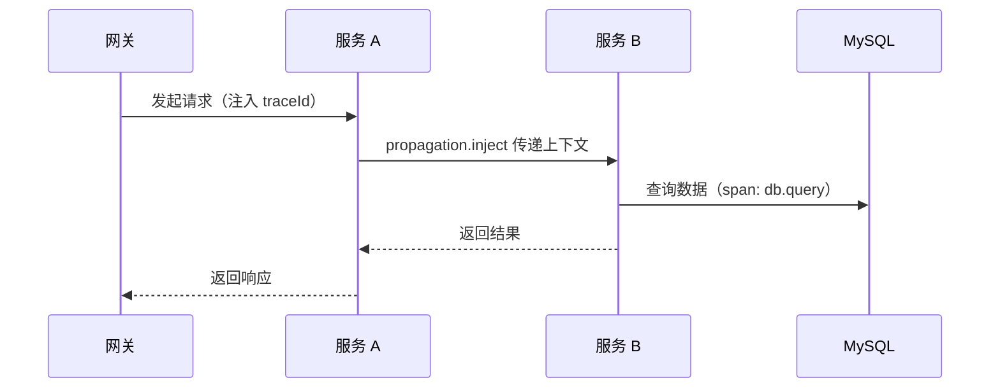
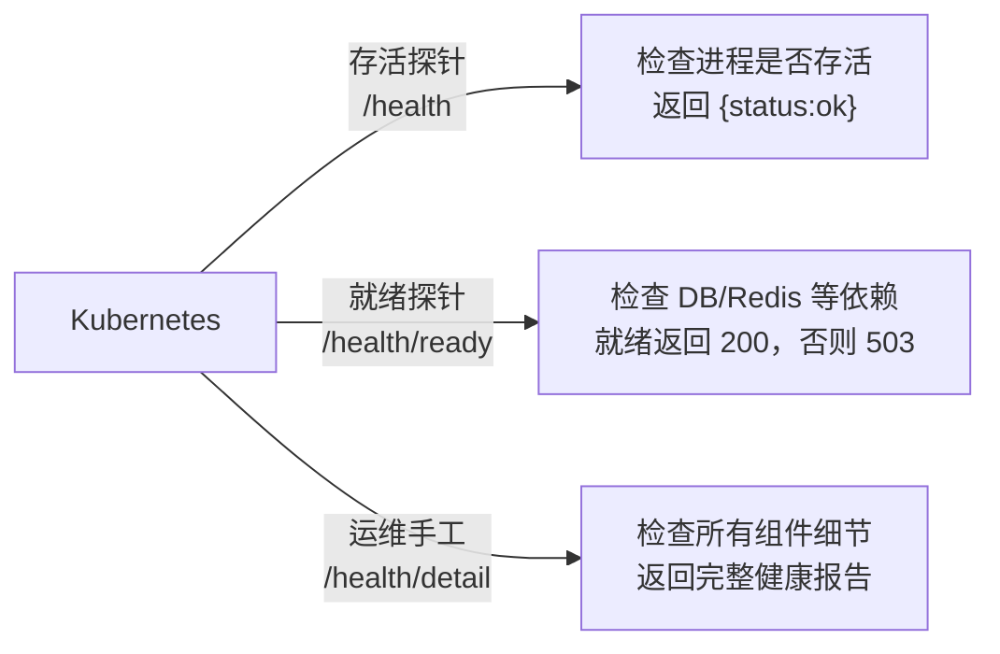
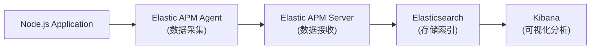

# APM 监控

## ① 模块介绍

APM（Application Performance Monitoring，应用性能监控）是一类用于实时追踪应用性能、诊断问题、优化用户体验的工具。与传统的服务器/网络监控相比，APM 把视角下沉到应用内部：不仅关心"进程是否活着"，更关心"一次请求为什么慢、错在哪一环节"。它可以帮助开发团队：

- **性能追踪（Performance Tracing）**：监控请求响应时间、吞吐量等关键指标；
- **错误诊断（Error Diagnosis）**：自动捕获异常，提供详细的错误上下文；
- **分布式追踪（Distributed Tracing）**：追踪跨服务的请求链路，定位性能瓶颈；
- **资源监控（Resource Monitoring）**：监控系统资源使用情况（CPU、内存、I/O）；
- **告警通知（Alerting）**：基于阈值自动触发告警。

### 核心概念

一个典型的 APM 系统由"应用内探针 → 数据收集 → 存储分析 → 可视化告警"四层组成，可用 mermaid 表达其整体架构：

### 图：APM 系统架构



上图展示了 APM 的完整数据链路：应用服务内嵌 Agent 探针负责采集性能与错误数据，上报给 Collector 统一收集，经时序数据库 Storage 存储后由 Analysis 模块做聚合分析，最终一方面在 Dashboard 上可视化展示，另一方面驱动告警系统发出通知。理解这条链路，是选择与部署 APM 工具的基础。

### 核心指标类型

无论使用哪款 APM 工具，底层都离不开以下几类指标（Metric），它们是衡量应用健康度的基本单元：

| 指标类型 | 说明 | 典型用例 |
|---------|------|---------|
| Counter（计数器） | 只增不减的累计值 | 请求总数、错误总数 |
| Gauge（测量仪） | 可增可减的瞬时值 | 当前连接数、内存使用 |
| Histogram（直方图） | 观测值的分布统计 | 请求延迟分布、响应大小分布 |
| Summary（摘要） | 分位数统计 | P50、P95、P99 延迟 |

---

## ② 核心方法论

### 常用 APM 工具对比

不同团队规模与技术栈下，APM 选型差异很大。下表从类型、特点、场景与成本四个维度对主流工具做横向对比：

| 工具 | 类型 | 特点 | 适用场景 | 成本 |
|------|------|------|---------|------|
| New Relic | SaaS | 功能全面，开箱即用 | 企业级应用 | 付费 |
| Datadog | SaaS | 一体化平台，云原生集成好 | 云原生应用 | 付费 |
| Elastic APM | 开源 | 与 ELK 技术栈深度集成 | 已有 ELK 技术栈 | 免费 |
| Prometheus + Grafana | 开源 | 灵活，生态丰富 | 自建监控、中小规模 | 免费 |
| Sentry | SaaS/开源 | 错误追踪专家 | 错误监控、前端监控 | 免费/付费 |
| Jaeger | 开源 | 分布式追踪专用 | 微服务链路追踪 | 免费 |
| Zipkin | 开源 | 轻量级分布式追踪 | 简单链路追踪 | 免费 |

### 选型方法论

工具繁多时，盲目对比参数容易陷入纠结。推荐的决策路径是先判断自身最紧迫的需求（错误追踪？已有技术栈？是否微服务？预算是否充足），再逐层收敛，其选择逻辑可用 mermaid 表达：

### 图：APM 工具选型决策树



上图是一棵自顶向下的决策树：从"是否需要错误追踪"出发逐层分支，帮助团队根据核心诉求快速收敛到最合适的工具组合。例如小团队通常选择 Sentry（错误监控）+ Prometheus（指标监控）的组合，大型企业则倾向 New Relic 或自建完整的 Prometheus + Jaeger + Grafana 栈。

### 指标阈值参考

健康监控不能只看"有没有数据"，更要看"是否越过红线"。以下是一组通用的阈值参考（具体需结合业务压测校准）：

| 指标 | 说明 | 告警阈值 | 紧急阈值 |
|------|------|---------|---------|
| CPU 使用率 | 进程 CPU 占用 | > 80% 持续 5min | > 95% 持续 1min |
| 内存使用率 | 进程内存占用 | > 85% 持续 5min | > 95% 持续 1min |
| 响应时间 P95 | 请求响应时长 | > 500ms | > 2s |
| 响应时间 P99 | 请求响应时长 | > 1s | > 5s |
| 错误率 | 请求失败比例 | > 1% | > 5% |
| QPS | 每秒请求数 | 突降 50% | 突降 90% |
| 连接池使用率 | 数据库连接数 | > 80% | > 95% |

### 关键监控指标详解

完整的监控指标体系应覆盖"基础设施层 → 应用层 → 业务层"三个层次，各层关注点不同、职责互补：

### 图：三层监控指标体系



上图把监控指标划分为三层：基础设施层回答"机器够不够用"，应用层回答"接口稳不稳定"，业务层回答"用户价值有没有受损"。真正成熟的 APM 方案应当三层齐全，而不是只盯某一层。

---

## ③ 关键流程

### Prometheus + Grafana 数据采集流程

Prometheus 的核心是 Pull（拉取）模式：各应用通过 `/metrics` 端点暴露指标，Prometheus 按采集周期主动抓取，再交由 Grafana 可视化展现。其数据流如下：

### 图：Prometheus + Grafana 数据采集架构



上图展示了典型自建监控链路：多个 Node.js 应用各自暴露 `/metrics` 指标端点，Prometheus 以 Pull 模式周期抓取并存储，Grafana 作为可视化层读取 Prometheus 数据渲染看板并支撑告警。区别于传统"客户端上报"模式，Pull 模式让服务端控制采集节奏，便于水平扩展。

### Sentry 错误监控流程

Sentry 专注"错误从发生到被通知"的完整链路：

### 图：Sentry 错误处理工作流



上图描述一次错误从产生到触达工程师的过程：应用内 SDK 捕获异常并上报事件，Sentry 服务端对海量事件做聚合、去重、归类，按预设告警规则命中后推送到邮件或 Slack 等通知渠道。理解这个流程有助于正确配置采样率与告警阈值，避免"被错误刷屏"。

### 分布式追踪跨服务流程

微服务环境下一次请求会穿过多个服务，靠单机日志无法串起全链路。借助 OpenTelemetry（开放遥测）等标准的 traceId（链路标识）传播，可还原请求经过的每个环节与耗时：

### 图：分布式追踪跨服务调用时序



上图是一个 `服务A → 服务B → 数据库` 的跨服务追踪时序：网关发起请求时生成全局 traceId，服务 A 通过 `propagation.inject` 把追踪上下文写入请求头，服务 B 再以 `propagation.extract` 取出并创建子 span。各服务产生的 span 通过同一 traceId 关联，最终在 Jaeger/Zipkin 等后端拼出完整调用链，从而定位哪个环节拖慢了整体延迟。

### 健康检查流程

健康检查是监控与调度（如 Kubernetes 探针）的"最后一公里"，分为存活（Liveness）、就绪（Readiness）与详细（Detail）检查三种，三者用途截然不同：

### 图：健康检查端点分工



上图说明了三类健康检查的定位：`/health` 仅判断进程存活，决定 K8s（Kubernetes）是否重启容器；`/health/ready` 检查数据库、缓存等外部依赖是否就绪，决定是否转发流量；`/health/detail` 供运维排查时查看全组件详细状态。三者的职责边界必须清晰，否则会出现"进程活着但依赖失联"却仍被分流的隐患。

---

## ④ 工具与实践

### Prometheus + Grafana

#### 安装依赖

在 Node.js 项目中通过 prom-client 暴露指标：

```bash
pnpm add prom-client
```

#### 基础配置

```javascript
const client = require('prom-client')
const express = require('express')

const app = express()

// 启用默认指标（包含 Node.js 运行时指标）
const collectDefaultMetrics = client.collectDefaultMetrics
collectDefaultMetrics({ 
  register: client.register,
  // 自定义前缀
  prefix: 'myapp_',
  // GC 耗时分布桶
  gcDurationBuckets: [0.001, 0.01, 0.1, 1, 2, 5]
})

// 自定义计数器
const httpRequestsTotal = new client.Counter({
  name: 'http_requests_total',
  help: 'Total number of HTTP requests',
  labelNames: ['method', 'route', 'status']
})

// 自定义直方图
const httpRequestDuration = new client.Histogram({
  name: 'http_request_duration_seconds',
  help: 'Duration of HTTP requests in seconds',
  labelNames: ['method', 'route', 'status'],
  buckets: [0.1, 0.3, 0.5, 0.7, 1, 3, 5, 7, 10]
})

// 中间件
app.use((req, res, next) => {
  const start = Date.now()
  
  res.on('finish', () => {
    const duration = (Date.now() - start) / 1000
    const route = req.route ? req.route.path : req.path
    
    httpRequestsTotal.inc({
      method: req.method,
      route: route,
      status: res.statusCode
    })
    
    httpRequestDuration.observe(
      {
        method: req.method,
        route: route,
        status: res.statusCode
      },
      duration
    )
  })
  
  next()
})

// 暴露指标端点
app.get('/metrics', async (req, res) => {
  try {
    res.set('Content-Type', client.register.contentType)
    res.end(await client.register.metrics())
  } catch (error) {
    res.status(500).end(error.message)
  }
})

app.listen(3000, () => {
  console.log('Server running on port 3000')
})
```

#### 自定义指标详解

```javascript
// ==================== Counter 计数器 ====================
// 只增不减，用于累计计数
const ordersTotal = new client.Counter({
  name: 'orders_total',
  help: 'Total number of orders',
  labelNames: ['status', 'payment_method']
})

// 使用方式
ordersTotal.inc()                                    // +1
ordersTotal.inc({ status: 'completed', payment_method: 'credit' })  // 带标签 +1
ordersTotal.inc(10, { status: 'pending' })          // 指定增量

// ==================== Gauge 测量仪 ====================
// 可增可减，用于瞬时值
const activeConnections = new client.Gauge({
  name: 'active_connections',
  help: 'Number of active connections',
  labelNames: ['type']
})

// 使用方式
activeConnections.inc()                              // +1
activeConnections.dec()                              // -1
activeConnections.set(100, { type: 'websocket' })   // 设置为特定值
activeConnections.reset()                            // 重置为 0

// ==================== Histogram 直方图 ====================
// 分布统计，适合延迟、大小等
const responseSizes = new client.Histogram({
  name: 'response_size_bytes',
  help: 'Size of HTTP responses',
  buckets: [100, 500, 1000, 5000, 10000, 50000, 100000]  // 自定义桶
})

// ==================== Summary 摘要 ====================
// 分位数统计，适合 SLA 监控
const requestLatency = new client.Summary({
  name: 'request_latency_seconds',
  help: 'Request latency in seconds',
  percentiles: [0.5, 0.9, 0.95, 0.99],  // P50, P90, P95, P99
  maxAgeSeconds: 600,                    // 时间窗口
  ageBuckets: 5                          // 桶数量
})

// ==================== 实际业务示例 ====================
class MetricsService {
  constructor() {
    // 数据库查询监控
    this.dbQueryDuration = new client.Histogram({
      name: 'db_query_duration_seconds',
      help: 'Database query duration',
      labelNames: ['operation', 'table'],
      buckets: [0.01, 0.05, 0.1, 0.5, 1, 2, 5]
    })

    // 缓存命中率
    this.cacheHits = new client.Counter({
      name: 'cache_hits_total',
      help: 'Cache hit/miss count',
      labelNames: ['result']  // hit | miss
    })

    // 队列大小
    this.queueSize = new client.Gauge({
      name: 'queue_size',
      help: 'Current queue size',
      labelNames: ['queue_name']
    })
  }

  // 记录数据库查询
  async trackDbQuery(operation, table, queryFn) {
    const timer = this.dbQueryDuration.startTimer({ operation, table })
    try {
      const result = await queryFn()
      return result
    } finally {
      timer()
    }
  }

  // 记录缓存命中
  recordCacheHit(isHit) {
    this.cacheHits.inc({ result: isHit ? 'hit' : 'miss' })
  }
}

module.exports = new MetricsService()
```

#### Prometheus 配置

```yaml
# prometheus.yml
global:
  scrape_interval: 15s      # 默认采集间隔
  evaluation_interval: 15s  # 规则评估间隔

# 告警管理器配置
alerting:
  alertmanagers:
    - static_configs:
        - targets:
          - alertmanager:9093

# 告警规则文件
rule_files:
  - "alert.rules.yml"

# 采集目标配置
scrape_configs:
  # Prometheus 自身监控
  - job_name: 'prometheus'
    static_configs:
      - targets: ['localhost:9090']

  # Node.js 应用监控
  - job_name: 'nodejs-app'
    static_configs:
      - targets: ['app1:3000', 'app2:3000', 'app3:3000']
        labels:
          env: 'production'
          service: 'api'

  # 使用服务发现（Kubernetes）
  - job_name: 'kubernetes-pods'
    kubernetes_sd_configs:
      - role: pod
    relabel_configs:
      - source_labels: [__meta_kubernetes_pod_annotation_prometheus_io_scrape]
        action: keep
        regex: true
```

#### Grafana Dashboard 配置

```json
{
  "dashboard": {
    "title": "Node.js APM Dashboard",
    "panels": [
      {
        "title": "Request Rate",
        "type": "timeseries",
        "targets": [
          {
            "expr": "rate(http_requests_total[5m])",
            "legendFormat": "{{method}} {{route}}"
          }
        ]
      },
      {
        "title": "Response Time (P95)",
        "type": "timeseries",
        "targets": [
          {
            "expr": "histogram_quantile(0.95, rate(http_request_duration_seconds_bucket[5m]))",
            "legendFormat": "P95"
          }
        ]
      },
      {
        "title": "Error Rate",
        "type": "timeseries",
        "targets": [
          {
            "expr": "rate(http_requests_total{status=~\"5..\"}[5m]) / rate(http_requests_total[5m])",
            "legendFormat": "Error Rate"
          }
        ]
      },
      {
        "title": "Memory Usage",
        "type": "timeseries",
        "targets": [
          {
            "expr": "process_resident_memory_bytes",
            "legendFormat": "RSS"
          },
          {
            "expr": "nodejs_heap_size_used_bytes",
            "legendFormat": "Heap Used"
          }
        ]
      }
    ]
  }
}
```

#### Docker Compose 部署

```yaml
# docker-compose.yml
services:
  prometheus:
    image: prom/prometheus:latest
    ports:
      - "9090:9090"
    volumes:
      - ./prometheus.yml:/etc/prometheus/prometheus.yml
      - ./alert.rules.yml:/etc/prometheus/alert.rules.yml
      - prometheus_data:/prometheus
    command:
      - '--config.file=/etc/prometheus/prometheus.yml'
      - '--storage.tsdb.path=/prometheus'
      - '--web.enable-lifecycle'

  grafana:
    image: grafana/grafana:latest
    ports:
      - "3001:3000"
    volumes:
      - grafana_data:/var/lib/grafana
    environment:
      - GF_SECURITY_ADMIN_PASSWORD=admin
      - GF_USERS_ALLOW_SIGN_UP=false
    depends_on:
      - prometheus

  alertmanager:
    image: prom/alertmanager:latest
    ports:
      - "9093:9093"
    volumes:
      - ./alertmanager.yml:/etc/alertmanager/alertmanager.yml

  nodejs-app:
    build: .
    ports:
      - "3000:3000"
    environment:
      - NODE_ENV=production

volumes:
  prometheus_data:
  grafana_data:
```

### Sentry 错误监控

Sentry 是专注于错误追踪和性能监控的平台，支持多语言、多框架，提供丰富的错误上下文和分析功能。

#### 安装

```bash
pnpm add @sentry/node @sentry/profiling-node
```

> 注：性能追踪能力已内置于 `@sentry/node`（通过 `tracesSampleRate` 开启），独立的 `@sentry/tracing` 包已被官方弃用，无需再单独安装。

#### 基础配置

```javascript
const Sentry = require('@sentry/node')
const { nodeProfilingIntegration } = require('@sentry/profiling-node')
const express = require('express')

// 在应用启动时初始化（应在引入其他模块之前）
Sentry.init({
  dsn: process.env.SENTRY_DSN,
  environment: process.env.NODE_ENV || 'development',
  
  // 采样率配置
  tracesSampleRate: process.env.NODE_ENV === 'production' ? 0.1 : 1.0,
  profilesSampleRate: 0.1,  // 性能分析采样率
  
  // 集成配置（HTTP / Express 插桩已默认启用，无需手动添加）
  integrations: [
    // 性能分析
    nodeProfilingIntegration(),
  ],
  
  // 忽略特定错误
  ignoreErrors: [
    'NotFoundError',
    'UnauthorizedError',
    /NetworkError/,
  ],
  
  // 过滤事务
  ignoreTransactions: [
    'GET /health',
    'GET /metrics',
  ],
  
  // 发布版本追踪
  release: process.env.APP_VERSION || '1.0.0',
  
  // 服务器名称
  serverName: process.env.SERVER_NAME || 'node-server',
})

const app = express()

// 业务路由
app.get('/', (req, res) => {
  res.send('Hello World')
})

app.get('/error', (req, res) => {
  throw new Error('Test error')
})

// 错误处理中间件（必须放在所有路由之后、其他错误处理中间件之前）
// 请求与追踪上下文由 SDK 自动注入，不再需要单独的 requestHandler / tracingHandler
Sentry.setupExpressErrorHandler(app)

app.listen(3000)
```

#### 错误捕获方式

```javascript
// ==================== 捕获异常 ====================
try {
  riskyOperation()
} catch (error) {
  Sentry.captureException(error)
}

// 异步错误捕获
async function fetchData() {
  try {
    const data = await fetch(url)
    return data
  } catch (error) {
    Sentry.captureException(error, {
      tags: { component: 'data-fetch' },
      extra: { url }
    })
    throw error
  }
}

// ==================== 捕获消息 ====================
// 不同级别的消息
Sentry.captureMessage('Something went wrong', 'warning')
Sentry.captureMessage('Critical error occurred', 'fatal')
Sentry.captureMessage('Info message', 'info')

// ==================== 添加上下文 ====================
// 设置用户信息（会附加到后续所有事件）
Sentry.setUser({ 
  id: '123', 
  username: 'john_doe',
  email: 'user@example.com',
  role: 'admin'
})

// 清除用户信息（如退出登录时）
Sentry.setUser(null)

// 添加标签（用于筛选和聚合）
Sentry.setTag('page', 'checkout')
Sentry.setTag('feature', 'payment')

// 添加额外数据
Sentry.setExtra('orderData', { 
  orderId: '456',
  items: [...],
  total: 99.99
})

// 设置面包屑（事件发生前的操作记录）
Sentry.addBreadcrumb({
  category: 'http',
  message: 'API request',
  level: 'info',
  data: {
    url: '/api/users',
    method: 'GET',
    status_code: 200
  }
})

// ==================== withScope 临时上下文 ====================
Sentry.withScope((scope) => {
  scope.setTag('custom-tag', 'value')
  scope.setExtra('custom-data', { foo: 'bar' })
  scope.setUser({ id: 'temp-user' })
  Sentry.captureException(new Error('Scoped error'))
})
// 离开 withScope 后，以上上下文设置不会影响全局
```

#### 性能监控

```javascript
// ==================== 手动 Span 追踪 ====================
// 旧版 startTransaction API 已移除，统一使用 startSpan 嵌套创建子 Span
await Sentry.startSpan(
  { op: 'task', name: 'Process Order' },
  async () => {
    // 子 Span：数据库查询
    await Sentry.startSpan(
      { op: 'db.query', description: 'SELECT * FROM orders WHERE id = ?' },
      () => queryDatabase()
    )

    // 子 Span：外部 API 调用
    await Sentry.startSpan(
      { op: 'http.client', description: 'POST /payment/process' },
      () => processPayment()
    )

    // 子 Span：发送通知
    await Sentry.startSpan(
      { op: 'notify', description: 'Send order confirmation email' },
      () => sendEmail()
    )
  }
)

// ==================== 使用 Sentry 包装函数 ====================
const result = await Sentry.startSpan(
  {
    op: 'function',
    name: 'calculateTotal',
  },
  async (span) => {
    const total = await calculateOrderTotal()
    span.setAttribute('total_amount', total)
    return total
  }
)

// ==================== Express 中间件性能追踪 ====================
app.get('/api/users/:id', async (req, res) => {
  const span = Sentry.getActiveSpan()
  
  if (span) {
    const dbSpan = span.startChild({
      op: 'db.query',
      description: 'Fetch user by ID'
    })
    
    try {
      const user = await User.findById(req.params.id)
      dbSpan.setAttribute('user.found', !!user)
      res.json(user)
    } finally {
      dbSpan.finish()
    }
  }
})
```

#### Source Maps 配置

对前端压缩代码，上传 Source Maps（源码映射文件）才能把堆栈还原为可读源码：

```javascript
// Source Maps 上传配置（Sentry CLI / @sentry/webpack-plugin 等打包器插件）
module.exports = {
  org: 'your-org',
  project: 'your-project',
  authToken: process.env.SENTRY_AUTH_TOKEN,
  url: 'https://sentry.io/',
  
  // Source Maps 上传配置
  release: {
    name: process.env.APP_VERSION,
    create: true,
    finalize: true,
    setCommits: {
      auto: true,
    },
    dist: process.env.BUILD_ID,
  },
  
  // 上传配置
  include: ['./dist'],
  ignore: ['node_modules'],
  
  // 验证 Source Maps
  rewrite: true,
  stripPrefix: ['webpack:///'],
  urlPrefix: '~/static/',
}
```

```json
// package.json
{
  "scripts": {
    "build": "webpack --mode production && sentry-cli sourcemaps inject ./dist && sentry-cli sourcemaps upload ./dist",
    "release": "sentry-cli releases new $npm_package_version && npm run build && sentry-cli releases finalize $npm_package_version"
  }
}
```

#### 告警规则配置

```yaml
# Sentry 告警规则（在 Sentry 控制台配置）
rules:
  - name: "High Error Rate"
    conditions:
      - type: "event_frequency"
        comparison: "gt"
        value: 100
        timeframe: 1h
    actions:
      - type: "email"
        target: "team@example.com"
      - type: "slack"
        channel: "#alerts"
  
  - name: "New Error Type"
    conditions:
      - type: "new_issue"
    actions:
      - type: "slack"
        channel: "#errors"
```

### Elastic APM

若团队已使用 ELK 技术栈，Elastic APM 可与 Elasticsearch、Kibana 深度集成，省去独立部署的运维成本。其架构为 Node.js 应用内嵌 Agent → APM Server → Elasticsearch 存储 → Kibana 可视化：

### 图：Elastic APM 架构



上图展示 Elastic APM 的组件链路：Node.js 应用在启动最顶部引入 Agent 采集性能与错误数据，发送给 APM Server，APM Server 处理后写入 Elasticsearch 索引，最终通过 Kibana 做可视化分析与检索。由于数据落在 ES 中，可与业务日志、指标在同一平台联合排查。

#### 安装

```bash
pnpm add elastic-apm-node
```

#### 完整配置

```javascript
// 在应用最顶部引入（必须先于其他模块）
const apm = require('elastic-apm-node').start({
  // 服务配置
  serviceName: 'my-nodejs-service',
  serviceVersion: '1.0.0',
  serverUrl: process.env.ELASTIC_APM_SERVER_URL || 'http://localhost:8200',
  
  // 环境配置
  environment: process.env.NODE_ENV || 'development',
  
  // 采样配置
  transactionSampleRate: process.env.NODE_ENV === 'production' ? 0.1 : 1.0,
  
  // 栈追踪深度
  stackTraceLimit: 50,
  
  // 日志配置
  logLevel: 'info',
  logger: require('pino')({ level: 'info' }),
  
  // 忽略特定 URL
  ignoreUrls: ['/health', '/metrics', '/favicon.ico'],
  
  // 忽略特定 User Agent
  ignoreUserAgents: ['curl', 'pingdom'],
  
  // 错误配置
  captureErrorLogStackTraces: 'always',
  captureExceptions: true,
  
  // 性能配置
  metricsInterval: '30s',
  centralConfig: true,
  
  // 云提供商信息（可选）
  cloudProvider: 'aws',
  
  // Secret Token 或 API Key
  secretToken: process.env.ELASTIC_APM_SECRET_TOKEN,
  // apiKey: process.env.ELASTIC_APM_API_KEY,
})

const express = require('express')
const app = express()

app.get('/api/users', async (req, res) => {
  const users = await getUsers()
  res.json(users)
})

app.listen(3000)

// 导出 apm 实例供其他模块使用
module.exports.apm = apm
```

#### 自定义 Span 和事务

```javascript
const apm = require('elastic-apm-node')

// ==================== 自定义事务 ====================
app.get('/api/orders/process', async (req, res) => {
  // 获取当前事务
  const transaction = apm.currentTransaction
  
  if (transaction) {
    // 设置自定义标签
    transaction.setLabel('order_type', 'premium')
    transaction.setLabel('customer_id', req.user.id)
    
    // 设置自定义上下文
    transaction.setCustomContext({
      order: {
        items: req.body.items.length,
        total: req.body.total
      }
    })
  }
  
  // 手动创建事务
  const manualTransaction = apm.startTransaction('Manual Transaction', 'custom')
  try {
    await processOrder()
    manualTransaction.result = 'success'
  } catch (error) {
    manualTransaction.result = 'error'
    apm.captureError(error)
    throw error
  } finally {
    manualTransaction.end()
  }
})

// ==================== 自定义 Span ====================
app.get('/api/orders', async (req, res) => {
  // 数据库查询 Span
  const dbSpan = apm.startSpan('query-orders', 'db')
  dbSpan?.addLabels({ operation: 'SELECT', table: 'orders' })
  
  try {
    const orders = await getOrders()
    dbSpan?.end()
    
    // 外部 API 调用 Span
    const apiSpan = apm.startSpan('validate-payment', 'external')
    await validatePayment(orders)
    apiSpan?.end()
    
    res.json(orders)
  } catch (error) {
    dbSpan?.end()
    apm.captureError(error)
    res.status(500).json({ error: 'Internal error' })
  }
})

// ==================== 错误捕获 ====================
try {
  await riskyOperation()
} catch (error) {
  apm.captureError(error, {
    tags: { component: 'payment' },
    custom: { orderId: '12345' }
  })
}

// 捕获自定义错误消息
apm.captureError(new Error('Something went wrong'), {
  user: {
    id: '123',
    email: 'user@example.com'
  },
  tags: {
    feature: 'checkout'
  },
  custom: {
    cartItems: 5
  }
})
```

#### 与 Elasticsearch 集成查询

```javascript
// 查询慢请求
GET apm-*-transaction*/_search
{
  "query": {
    "range": {
      "transaction.duration.us": {
        "gte": 1000000  // 大于 1 秒
      }
    }
  },
  "size": 10,
  "sort": [
    { "@timestamp": "desc" }
  ]
}

// 查询错误趋势
GET apm-*-error*/_search
{
  "size": 0,
  "aggs": {
    "errors_over_time": {
      "date_histogram": {
        "field": "@timestamp",
        "calendar_interval": "1h"
      }
    }
  }
}
```

### 分布式追踪（OpenTelemetry + Jaeger）

OpenTelemetry 是厂商中立（vendor-neutral）的可观测性标准，统一了指标、日志、追踪三类数据的采集 API，避免被单一厂商锁定。

```javascript
// OpenTelemetry 提供 vendor 中立的追踪方案
const { NodeTracerProvider } = require('@opentelemetry/sdk-trace-node')
const { SimpleSpanProcessor } = require('@opentelemetry/sdk-trace-base')
const { OTLPTraceExporter } = require('@opentelemetry/exporter-trace-otlp-http')
const { Resource } = require('@opentelemetry/resources')
const { SemanticResourceAttributes } = require('@opentelemetry/semantic-conventions')

// 配置 Provider
const provider = new NodeTracerProvider({
  resource: new Resource({
    [SemanticResourceAttributes.SERVICE_NAME]: 'my-service',
    [SemanticResourceAttributes.SERVICE_VERSION]: '1.0.0',
  }),
})

// OTLP 导出器（@opentelemetry/exporter-jaeger 已被官方弃用；Jaeger 1.35+ 原生支持 OTLP）
const exporter = new OTLPTraceExporter({
  url: 'http://localhost:4318/v1/traces',
})

provider.addSpanProcessor(new SimpleSpanProcessor(exporter))
provider.register()

// 在 Express 中使用
const { trace } = require('@opentelemetry/api')

app.get('/api/users/:id', async (req, res) => {
  const tracer = trace.getTracer('my-service')
  const span = tracer.startSpan('fetch-user')
  
  try {
    const user = await User.findById(req.params.id)
    span.setAttributes({ 'user.id': user.id })
    res.json(user)
  } catch (error) {
    span.recordException(error)
    res.status(500).json({ error: error.message })
  } finally {
    span.end()
  }
})
```

#### 跨服务追踪

```javascript
// ==================== 服务 A（发起请求） ====================
const axios = require('axios')
const { trace, context, propagation } = require('@opentelemetry/api')

async function callServiceB() {
  const tracer = trace.getTracer('service-a')
  
  return tracer.startActiveSpan('call-service-b', async (span) => {
    // 注入追踪上下文到请求头
    const headers = {}
    propagation.inject(context.active(), headers)
    
    const response = await axios.get('http://service-b/api/data', { headers })
    
    span.end()
    return response.data
  })
}

// ==================== 服务 B（接收请求） ====================
const express = require('express')
const { trace, context, propagation } = require('@opentelemetry/api')

const app = express()

app.get('/api/data', async (req, res) => {
  // 从请求头提取追踪上下文
  const parentContext = propagation.extract(context.active(), req.headers)
  
  const tracer = trace.getTracer('service-b')
  
  return tracer.startActiveSpan('process-data', {}, context, async (span) => {
    const data = await processData()
    span.setAttribute('data.count', data.length)
    res.json(data)
    span.end()
  })
})
```

### 健康检查

#### 基础健康检查

```javascript
const express = require('express')
const app = express()

// 存活检查 - 仅检查进程是否存活
app.get('/health', (req, res) => {
  res.json({
    status: 'ok',
    timestamp: new Date().toISOString(),
    uptime: Math.floor(process.uptime())
  })
})

// 就绪检查 - 检查服务是否准备好接收流量
app.get('/health/ready', async (req, res) => {
  try {
    // 检查数据库连接
    await db.ping()
    
    // 检查 Redis 连接（可选）
    // await redis.ping()
    
    res.json({ status: 'ready' })
  } catch (error) {
    res.status(503).json({ 
      status: 'not ready',
      reason: error.message 
    })
  }
})
```

#### 详细健康检查

```javascript
// 健康检查服务
class HealthCheckService {
  constructor() {
    this.checks = {
      database: this.checkDatabase.bind(this),
      redis: this.checkRedis.bind(this),
      external: this.checkExternalService.bind(this),
      disk: this.checkDiskSpace.bind(this)
    }
  }

  async checkDatabase() {
    const start = Date.now()
    try {
      await db.raw('SELECT 1')
      return {
        status: 'ok',
        latency: Date.now() - start,
        message: 'Database connection healthy'
      }
    } catch (error) {
      return {
        status: 'error',
        latency: Date.now() - start,
        message: error.message
      }
    }
  }

  async checkRedis() {
    const start = Date.now()
    try {
      await redis.ping()
      return {
        status: 'ok',
        latency: Date.now() - start,
        message: 'Redis connection healthy'
      }
    } catch (error) {
      return {
        status: 'error',
        latency: Date.now() - start,
        message: error.message
      }
    }
  }

  async checkExternalService() {
    const start = Date.now()
    try {
      const response = await axios.get('https://api.example.com/health', {
        timeout: 5000
      })
      return {
        status: response.status === 200 ? 'ok' : 'error',
        latency: Date.now() - start,
        message: 'External service reachable'
      }
    } catch (error) {
      return {
        status: 'error',
        latency: Date.now() - start,
        message: error.message
      }
    }
  }

  async checkDiskSpace() {
    const diskspace = require('diskspace')
    return new Promise((resolve) => {
      diskspace.check('/', (err, result) => {
        if (err) {
          resolve({ status: 'error', message: err.message })
        } else {
          const usedPercent = (result.used / result.total) * 100
          resolve({
            status: usedPercent < 90 ? 'ok' : 'warning',
            used: `${Math.round(usedPercent)}%`,
            free: `${Math.round((result.free / result.total) * 100)}%`
          })
        }
      })
    })
  }

  async runAllChecks() {
    const results = {}
    
    for (const [name, check] of Object.entries(this.checks)) {
      results[name] = await check()
    }
    
    return results
  }
}

const healthService = new HealthCheckService()

// 详细健康检查端点
app.get('/health/detail', async (req, res) => {
  const checks = await healthService.runAllChecks()
  
  const allHealthy = Object.values(checks).every(c => c.status === 'ok')
  const hasWarning = Object.values(checks).some(c => c.status === 'warning')
  
  let status = 'healthy'
  let statusCode = 200
  
  if (!allHealthy && !hasWarning) {
    status = 'unhealthy'
    statusCode = 503
  } else if (hasWarning) {
    status = 'degraded'
    statusCode = 200
  }
  
  res.status(statusCode).json({
    status,
    checks,
    system: {
      memory: process.memoryUsage(),
      uptime: Math.floor(process.uptime()),
      cpuUsage: process.cpuUsage(),
      nodeVersion: process.version,
      platform: process.platform
    },
    timestamp: new Date().toISOString()
  })
})
```

#### Kubernetes 配置

```yaml
# deployment.yaml
apiVersion: apps/v1
kind: Deployment
metadata:
  name: nodejs-app
spec:
  template:
    spec:
      containers:
        - name: app
          image: nodejs-app:latest
          
          # 存活探针
          livenessProbe:
            httpGet:
              path: /health
              port: 3000
            initialDelaySeconds: 30
            periodSeconds: 10
            timeoutSeconds: 5
            failureThreshold: 3
          
          # 就绪探针
          readinessProbe:
            httpGet:
              path: /health/ready
              port: 3000
            initialDelaySeconds: 5
            periodSeconds: 5
            timeoutSeconds: 3
            failureThreshold: 3
```

### 内存与事件循环监控

Node.js 的特性决定它最容易踩两类坑：内存泄漏与事件循环阻塞（Event Loop Blocking）。前者表现为堆内存持续增长，后者表现为卡顿与高延迟，都需专门的指标加以监控：

```javascript
const client = require('prom-client')
const v8 = require('v8')

// 内存指标
const memoryGauge = new client.Gauge({
  name: 'nodejs_memory_usage_bytes',
  help: 'Memory usage in bytes',
  labelNames: ['type']
})

// 堆内存分布
const heapSizeGauge = new client.Gauge({
  name: 'nodejs_heap_space_size_bytes',
  help: 'Heap space size in bytes',
  labelNames: ['space', 'type']  // space: new/old/code/map, type: used/available
})

// 事件循环延迟
const eventLoopLag = new client.Gauge({
  name: 'nodejs_eventloop_lag_seconds',
  help: 'Event loop lag in seconds'
})

// GC 统计
const gcCount = new client.Counter({
  name: 'nodejs_gc_count',
  help: 'Garbage collection count',
  labelNames: ['kind']  // incremental, weak, full
})

const gcDuration = new client.Histogram({
  name: 'nodejs_gc_duration_seconds',
  help: 'Garbage collection duration',
  labelNames: ['kind'],
  buckets: [0.001, 0.01, 0.1, 0.5, 1, 2]
})

// 定期采集内存指标
function collectMemoryMetrics() {
  const mem = process.memoryUsage()
  memoryGauge.set({ type: 'rss' }, mem.rss)
  memoryGauge.set({ type: 'heapTotal' }, mem.heapTotal)
  memoryGauge.set({ type: 'heapUsed' }, mem.heapUsed)
  memoryGauge.set({ type: 'external' }, mem.external)
  memoryGauge.set({ type: 'arrayBuffers' }, mem.arrayBuffers || 0)
  
  // 堆空间详细信息（Node.js 12+）
  if (v8.getHeapSpaceStatistics) {
    const spaces = v8.getHeapSpaceStatistics()
    spaces.forEach(space => {
      const spaceName = space.space_name.toLowerCase().replace(/_/g, '')
      heapSizeGauge.set({ space: spaceName, type: 'used' }, space.space_used_size)
      heapSizeGauge.set({ space: spaceName, type: 'available' }, space.space_available_size)
      heapSizeGauge.set({ space: spaceName, type: 'size' }, space.space_size)
    })
  }
}

// 监控事件循环延迟
function monitorEventLoopLag() {
  const start = process.hrtime.bigint()
  setImmediate(() => {
    const delta = Number(process.hrtime.bigint() - start)
    const lagSeconds = delta / 1e9 - 0.001  // 减去 setImmediate 的理论延迟
    eventLoopLag.set(lagSeconds)
  })
}

// 启动监控
setInterval(collectMemoryMetrics, 10000)      // 每 10 秒
setInterval(monitorEventLoopLag, 1000)       // 每 1 秒
```

### 告警配置

#### Alertmanager 配置

告警产生的数据最终要"找到人、不刷屏、能聚合"，这由 Prometheus 生态的 Alertmanager（告警管理器）承担：

```yaml
# alertmanager.yml
global:
  # 默认通知配置
  resolve_timeout: 5m
  
  # SMTP 配置
  smtp_smarthost: 'smtp.example.com:587'
  smtp_from: 'alerts@example.com'
  smtp_auth_username: 'alerts@example.com'
  smtp_auth_password: 'password'

  # Slack 配置
  slack_api_url: 'https://hooks.slack.com/services/xxx'

# 路由配置
route:
  group_by: ['alertname', 'severity']
  group_wait: 30s        # 等待同组告警聚合
  group_interval: 5m     # 同组新告警间隔
  repeat_interval: 4h    # 重复告警间隔
  
  # 默认接收者
  receiver: 'team-email'
  
  # 子路由
  routes:
    # 严重告警 -> Slack + 邮件
    - matchers:
        - severity="critical"
      receiver: 'critical-alerts'
      continue: true
    
    # 警告级别 -> Slack
    - matchers:
        - severity="warning"
      receiver: 'team-slack'
    
    # 特定服务告警
    - matchers:
        - service="payment"
      receiver: 'payment-team'

# 接收者配置
receivers:
  - name: 'team-email'
    email_configs:
      - to: 'team@example.com'
        send_resolved: true
  
  - name: 'team-slack'
    slack_configs:
      - channel: '#alerts'
        send_resolved: true
        title: '{{ .Status | toUpper }}: {{ .CommonLabels.alertname }}'
        text: >-
          {{ range .Alerts }}
          *Alert:* {{ .Labels.alertname }}
          *Severity:* {{ .Labels.severity }}
          *Description:* {{ .Annotations.description }}
          *Details:*
          {{ range .Labels.SortedPairs }} • *{{ .Name }}:* {{ .Value }}
          {{ end }}
          {{ end }}
  
  - name: 'critical-alerts'
    slack_configs:
      - channel: '#critical-alerts'
        send_resolved: true
    email_configs:
      - to: 'oncall@example.com'
        send_resolved: true
    # Webhook 配置
    webhook_configs:
      - url: 'https://pagerduty.com/webhook'
        send_resolved: true
  
  - name: 'payment-team'
    slack_configs:
      - channel: '#payment-alerts'
    email_configs:
      - to: 'payment-team@example.com'

# 静默配置（临时禁用告警）
inhibit_rules:
  # 当服务不可用时，抑制相关的其他告警
  - source_matchers:
      - severity="critical"
      - alertname="ServiceDown"
    target_matchers:
      - severity="warning"
    equal: ['service']
```

#### Prometheus 告警规则

Alertmanager 只负责"分发"，真正的触发逻辑由 Prometheus 规则（rule）表达：

```yaml
# alert.rules.yml
groups:
  - name: nodejs-alerts
    rules:
      # ==================== 应用层告警 ====================
      
      # 高错误率
      - alert: HighErrorRate
        expr: |
          sum(rate(http_requests_total{status=~"5.."}[5m])) 
          / sum(rate(http_requests_total[5m])) > 0.01
        for: 5m
        labels:
          severity: critical
          service: api
        annotations:
          summary: "High error rate detected"
          description: "Error rate is {{ $value | humanizePercentage }} for more than 5 minutes"
      
      # 响应时间过长
      - alert: HighResponseTime
        expr: |
          histogram_quantile(0.95, 
            sum(rate(http_request_duration_seconds_bucket[5m])) by (le)
          ) > 1
        for: 5m
        labels:
          severity: warning
        annotations:
          summary: "High response time (P95)"
          description: "P95 response time is {{ $value | humanizeDuration }}"
      
      # 请求速率突降
      - alert: LowRequestRate
        expr: |
          sum(rate(http_requests_total[5m])) 
          < sum(rate(http_requests_total[5m] offset 1h)) * 0.5
        for: 5m
        labels:
          severity: warning
        annotations:
          summary: "Request rate dropped significantly"
          description: "Request rate dropped by more than 50%"
      
      # ==================== 资源层告警 ====================
      
      # 高内存使用
      - alert: HighMemoryUsage
        expr: |
          (nodejs_memory_usage_bytes{type="heapUsed"} 
          / nodejs_memory_usage_bytes{type="heapTotal"}) > 0.9
        for: 5m
        labels:
          severity: warning
        annotations:
          summary: "High memory usage"
          description: "Heap usage is {{ $value | humanizePercentage }}"
      
      # 内存泄漏嫌疑
      - alert: PossibleMemoryLeak
        expr: |
          increase(nodejs_memory_usage_bytes{type="heapUsed"}[1h]) > 100000000
        for: 10m
        labels:
          severity: warning
        annotations:
          summary: "Possible memory leak detected"
          description: "Heap usage increased by {{ $value | humanizeBytes }} in the last hour"
      
      # 事件循环阻塞
      - alert: EventLoopBlocked
        expr: nodejs_eventloop_lag_seconds > 0.5
        for: 1m
        labels:
          severity: critical
        annotations:
          summary: "Event loop is blocked"
          description: "Event loop lag is {{ $value | humanizeDuration }}"
      
      # ==================== 基础设施告警 ====================
      
      # 服务不可用
      - alert: ServiceDown
        expr: up{job="nodejs-app"} == 0
        for: 1m
        labels:
          severity: critical
        annotations:
          summary: "Service {{ $labels.instance }} is down"
          description: "Service has been down for more than 1 minute"
      
      # CPU 使用率过高
      - alert: HighCPUUsage
        expr: |
          100 - (avg by(instance) (irate(process_cpu_seconds_total[5m])) * 100) < 20
        for: 5m
        labels:
          severity: warning
        annotations:
          summary: "High CPU usage"
          description: "CPU usage is above 80% for {{ $labels.instance }}"
```

### 日志与指标联动

日志与指标往往是同一问题的两个侧面，可在记录日志的同时同步累加指标计数，让"日志能看到细节、指标能看趋势"：

```javascript
const winston = require('winston')
const client = require('prom-client')

// 日志计数器
const logCounter = new client.Counter({
  name: 'app_logs_total',
  help: 'Total application logs',
  labelNames: ['level', 'component']
})

// Winston 配置
const logger = winston.createLogger({
  level: 'info',
  format: winston.format.combine(
    winston.format.timestamp(),
    winston.format.errors({ stack: true }),
    winston.format.json()
  ),
  defaultMeta: { service: 'my-service' },
  transports: [
    // 控制台输出
    new winston.transports.Console({
      format: winston.format.combine(
        winston.format.colorize(),
        winston.format.simple()
      )
    }),
    
    // 文件输出
    new winston.transports.File({ 
      filename: 'logs/error.log', 
      level: 'error' 
    }),
    new winston.transports.File({ 
      filename: 'logs/combined.log' 
    }),
  ],
})

// 添加日志计数中间件
const originalLog = logger.log
logger.log = function(level, message, meta = {}) {
  logCounter.inc({ level, component: meta.component || 'default' })
  return originalLog.call(this, level, message, meta)
}
```

---

## ⑤ 常见坑点

### Q1: 如何选择 APM 工具？

**A:** 根据团队规模和需求选择：
- **小型团队**：Sentry（错误监控）+ Prometheus（指标监控）
- **中型团队**：Elastic APM 或 Datadog
- **大型企业**：New Relic 或自建 Prometheus + Jaeger + Grafana

### Q2: 指标基数过高怎么办？

**A:** 高基数标签（High-cardinality label）如 `user_id`、`request_id` 会因为取值组合爆炸导致指标爆炸（Metric Explosion），拖垮存储与查询：

```javascript
// ❌ 错误：高基数标签
const counter = new client.Counter({
  name: 'requests_total',
  labelNames: ['user_id']  // 可能有数百万用户
})

// ✅ 正确：使用低基数标签
const counter = new client.Counter({
  name: 'requests_total',
  labelNames: ['method', 'route', 'status']  // 有限的组合
})
```

### Q3: 如何减少监控对性能的影响？

**A:** 
- 降低采样率（生产环境 1-10%）
- 异步上报数据
- 减少不必要的 Span
- 使用 pushgateway 模式或批处理

### Q4: 告警风暴怎么处理？

**A:** 告警风暴（Alert Storm）通常由"一刀切告警 + 缺乏聚合"引起，需通过分组、合并与抑制缓解：

```yaml
# 配置告警聚合
route:
  group_by: ['alertname', 'severity']
  group_wait: 30s      # 等待同组告警
  group_interval: 5m   # 发送间隔
  
# 配置静默规则
inhibit_rules:
  - source_matchers:
      - severity="critical"
    target_matchers:
      - severity="warning"
    equal: ['service']
```

### Q5: Source Maps 上传失败怎么办？

**A:** 检查以下几点：
1. 确认 Sentry CLI 认证 token 正确
2. 检查 release 版本号是否一致
3. 确认 Source Maps 文件路径正确
4. 验证 `urlPrefix` 配置

### Q6: 分布式追踪如何跨语言传递？

**A:** 不同语言/框架间通过标准追踪头（Tracing Header）传递上下文，最常用的三套：

- **W3C Trace Context**: `traceparent`, `tracestate`
- **B3**: `X-B3-TraceId`, `X-B3-SpanId`
- **Jaeger**: `uber-trace-id`

```javascript
// 注入追踪头
const headers = {}
propagation.inject(context.active(), headers)

// 提取追踪头
const extractedContext = propagation.extract(context.active(), headers)
```

---

## ⑥ 进阶扩展与参考

### 监控实施建议

1. **设置合理的采样率**
   ```javascript
   // 开发环境：100% 采样
   tracesSampleRate: process.env.NODE_ENV === 'development' ? 1.0 : 0.1
   
   // 根据流量动态调整
   const dynamicSampleRate = requestRate > 1000 ? 0.01 : 0.1
   ```

2. **区分环境**
   ```javascript
   // 通过环境变量配置
   environment: process.env.NODE_ENV  // development | staging | production
   release: process.env.GIT_SHA       // 追踪版本
   ```

3. **添加上下文信息**
   ```javascript
   // 每个请求添加唯一 ID
   app.use((req, res, next) => {
     req.id = crypto.randomUUID()
     Sentry.setTag('request_id', req.id)
     next()
   })
   ```

4. **配置合理的告警阈值**
   - 避免告警疲劳：分级处理（warning/critical）
   - 设置合理的等待时间（`for: 5m`）
   - 告警聚合和静默

5. **定期审查监控指标**
   - 每周审查告警频率
   - 调整无效告警
   - 优化仪表盘展示

6. **保留适当的日志和追踪数据**
   - 日志保留策略：热数据 7 天，冷数据 90 天
   - 追踪数据采样存储
   - 敏感信息脱敏处理

### 性能优化建议

| 场景 | 建议 |
|-----|------|
| 高流量服务 | 降低采样率，异步上报 |
| 低延迟要求 | 减少 Span 数量，批量上报 |
| 内存敏感 | 控制指标基数，避免高基数标签 |
| 成本控制 | 合理设置保留期，使用聚合数据 |

### 进阶发展方向

完成指标、错误、追踪三大件的基础建设后，可从以下方向做进阶扩展：

- **统一可观测性（Observability）**：以 OpenTelemetry 作为厂商中立的采集标准，统一控制指标、日志、追踪三类数据的采集与导出，避免被单一厂商锁定；
- **告警闭环（Alerting Closed-loop）**：将本节的告警分级、值班编排与发布复盘流程打通，形成"发现 → 定位 → 修复 → 验证"的稳定闭环（详见[告警与值班机制](03-告警与值班机制.md)）；
- **容量规划与告警治理**：根据 P95/P99 趋势做容量预估，用告警去重、分级、抑制治理告警疲劳，让告警真正"少而准"。

### 参考资源

- Prometheus 官方文档：<https://prometheus.io/docs/>
- Grafana 官方文档：<https://grafana.com/docs/>
- Sentry 官方文档：<https://docs.sentry.io/>
- Elastic APM 文档：<https://www.elastic.co/guide/en/apm/agent/nodejs/current/>
- OpenTelemetry 官方文档：<https://opentelemetry.io/docs/>
- Jaeger 官方文档：<https://www.jaegertracing.io/docs/>