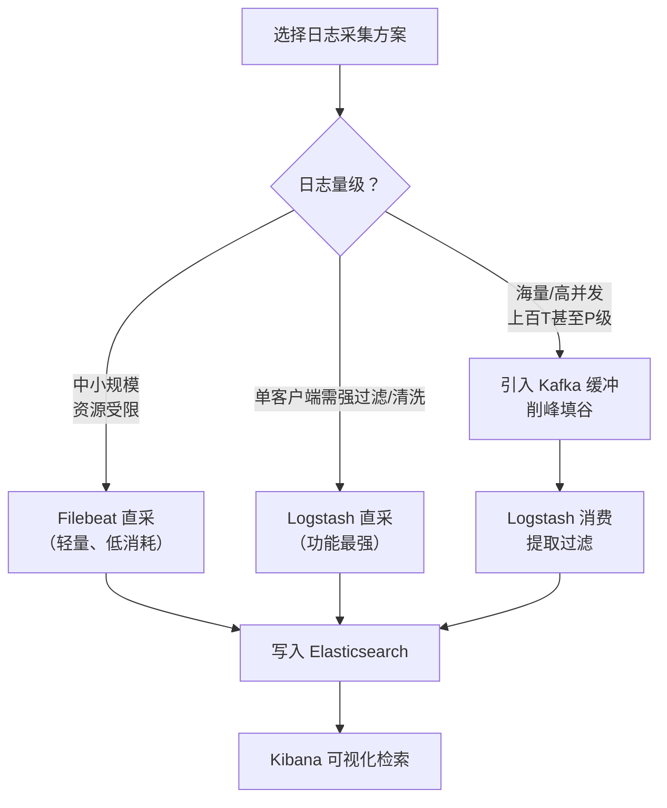

# ELK 构建 MySQL 慢日志收集平台详解

## ① 模块介绍

线上 MySQL 慢查询（Slow Query）是性能排查的高频切入点，但靠登录服务器手工 `grep` 慢日志效率极低、难以沉淀规律。本模块介绍如何通过开源日志检索系统 ELK 构建 MySQL 慢日志收集及分析平台，让慢日志从"手工排查"走向"集中检索、常态化治理"。

### ELK 与 EFK 组件辨析

ELK、EFK 有共同的组件，它们的差异主要体现在日志采集层选用的工具不同：

- **Elasticsearch（ES，弹性搜索）**：实时的全文搜索和分析引擎，提供日志数据的收集、分析、存储三大功能，是整个平台的"大脑"与"仓库"；
- **Kibana**：Web 图形化界面，可视化展示 Elasticsearch 中的日志数据与检索结果。

而缩写中的 L 与 F 代表不同的采集工具：

| 工具 | 定位 | 特点 |
|------|------|------|
| Logstash | 搜集、分析、过滤日志 | 功能强大，资源消耗高 |
| Beats（Filebeat） | 轻量级日志采集器 | 内存 CPU 消耗低，性能好 |
| Fluentd | 日志收集、处理、转发 | 轻量级，生态丰富 |

Beats 家族除 Filebeat 外，还有 Packetbeat（网络数据）、Metricbeat（指标）、Winlogbeat（Windows 日志）等成员，各针对一类数据。Kafka 则是高并发日志场景下附加的关键组件（缩写中的 K），提供分布式消息队列缓冲能力。

### ELK 的优势

- **开源完整**：收集、存储、分析、检索全链路组件齐全，组合即可用，无需额外开发；
- **可视化浏览**：在 Kibana 控制台选择时间范围即可查看报表，快捷方便；
- **广泛平台支持**：可适配 K8s、云原生微服务等架构。

---

## ② 核心方法论

### 采集层选型方法论

"L 还是 F？加不加 K？"是 ELK 搭建最常见的抉择。核心判断依据是数据规模与性能诉求：

### 图：日志采集层选型路径



上图给出了选型决策逻辑：中小规模且资源受限时优先 Filebeat 这类轻量采集器；单客户端需要复杂过滤清洗时可换更强大的 Logstash；一旦日志量达到上百 T 甚至 P 级，就必须在 Filebeat 与 Logstash 之间插入 Kafka 做缓冲削峰，避免高峰期日志洪峰冲垮下游存储。无论走哪条路，最终都汇入 Elasticsearch 存储并由 Kibana 呈现。

### 架构演进思路

从简单到高阶，ELK 通常经历三个演进阶段，各阶段组件与复杂度递增：

1. **方案一：Logstash 直采（中小型）**——每个客户端部署 Logstash 负责日志收集与过滤，服务端由 Elasticsearch + Kibana 组成，实现最简单的日志收集链路。
2. **方案二：Beats 替代 Logstash**——客户端用 Filebeat 代替 Logstash 做日志收集，资源消耗更低、性能更好；需要采集其他类型数据时，选用 Beats 家族对应成员。
3. **方案三：引入 Kafka 缓冲（大中型）**——Filebeat 采集日志后先存入 Kafka 暂存缓冲，再由 Logstash 消费、提取、过滤后写入 ES。ES、Kafka、Logstash 均以集群模式部署，适合存储上百 T 甚至 P 级运维、系统、业务日志的场景。

---

## ③ 关键流程

### 方案三完整数据链路

以引入 Kafka 的中大型架构为例，日志从产生到检索的完整链路如下：

### 图：ELK 完整架构数据流


上图展示了中大型架构的日志流转：Filebeat 从目标节点采集原始日志后先进 Kafka 暂存，起到削峰与解耦作用；Logstash 作为消费者从 Kafka 拉取数据，完成解析、提取与过滤后写入 Elasticsearch；最终用户在 Kibana 上按时间与关键字检索。缓冲层 Kafka 的存在使采集速率与存储吞吐解耦，是海量日志场景下保障平台稳定性的关键。

### MySQL 慢日志采集流程

落到"收集 MySQL 慢日志"这一具体场景，流程可拆解为"MySQL 落地慢日志 → Filebeat 采集 → 写 ES → Kibana 检索"四步：

### 图：MySQL 慢日志采集链路


上图对应本项目的落地链路：先确保 MySQL 开启慢查询并设置阈值与日志路径，让慢语句落地到指定日志文件；Filebeat 通过 `filebeat modules enable mysql` 激活 MySQL 插件并核对 `slowlog` 路径后采集该文件；数据推送至 Elasticsearch 建索引；最后由 Kibana 的 Discover 页面按时间周期加 `slow.query` 过滤器快速检索，从而把慢日志分析从"临时命令和脚本"升级为"可持续回溯的检索系统"。

---

## ④ 工具与实践

### 服务端安装 ES 与 Kibana

```bash
# 1. 导入官方认证 key 并配置官方源
#    在 /etc/yum.repos.d 下新建 elk.repo 配置官方 yum 源

# 2. 安装 Elasticsearch
yum install elasticsearch -y

# 3. 修改网络监听地址（暴露给采集端）
#    编辑 /etc/elasticsearch/elasticsearch.yml
#    将 network.host 改为本地网卡接口地址

# 4. 启动并校验
systemctl start elasticsearch
systemctl status elasticsearch
curl http://<IP>:9200   # 返回包含版本信息的 JSON 即表示运行正常

# 5. 浏览器访问 Kibana 管理界面
#    http://<IP>:5601
```

### 客户端安装 MySQL 与 Filebeat

```bash
# 0. 先配置 Elastic 官方 yum 源（同服务端第 1 步）
# 1. 安装 Filebeat 采集器
yum install filebeat -y

# 2. 修改 filebeat.yml，指定输出方式为 Elasticsearch
#    填写 ES 主机地址（集群模式需写多个主机端口）

# 3. 激活 MySQL 日志插件并确认
filebeat modules enable mysql
filebeat modules list    # 应看到 mysql 模块已启用

# 4. 修改模块配置，让 slowlog 路径与 MySQL 慢日志路径对齐
#    编辑 /etc/filebeat/modules.d/mysql.yml 中的 slowlog 路径

# 5. 在 MySQL 中开启慢查询并设置阈值
set global slow_query_log='ON';          # 开启慢查询
set global long_query_time=1;            # 大于 1 秒的记录
# 并设置慢日志文件路径

# 6. 模拟慢查询验证推送
select sleep(5);                         # 制造一条大于 1 秒的慢查询
# 观察 filebeat 推送窗口出现日志即表示成功推送到 ES
```

### Kibana 检索验证

打开 Kibana 后台的 **Discover** 页面：选择时间周期，添加 filter 过滤器并输入 `slow.query` 关键字，即可查看对应时间周期内的 MySQL 慢日志记录与图表。相比临时命令和脚本分析，检索系统让慢日志分析变得快速、高效、可回溯。

---

## ⑤ 常见坑点

- **慢日志路径不一致**：Filebeat 的 `slowlog` 路径必须与 MySQL 慢日志实际路径完全对齐，路径不一致会直接导致采集不到任何数据，这是本项目最高频的报错点。
- **ES 未暴露给采集端**：`network.host` 若仍为默认的 `localhost`，Filebeat 无法跨主机连上 ES，必须改为本地网卡接口地址并确保端口可通。
- **慢查询未真正开启**：仅修改 `long_query_time` 而未将 `slow_query_log` 置为 `ON`，慢日志文件不会持续生成，导致"以为在采、其实没数据"。
- **Kibana 检索条件未沉淀**：临时在当前页面筛选不会保存，应把常用过滤器保存为检索视图，便于长期复用；否则每次都需重复配置。
- **高资源消耗**：Logstash 在 JVM 上运行、资源占用高，若误把它当作唯一采集器大面积部署在小机器上，可能拖垮被监控节点。
- **未考虑缓冲层**：日志量已到上百 T/P 级却仍用 Filebeat 直连 ES，采集高峰极易压垮存储，应尽早引入 Kafka 缓冲。

---

## ⑥ 进阶扩展与参考

### 落地要点小结

ELK 选型要点：中小规模用 Logstash 或 Filebeat 直采 ES；海量日志必须引入 Kafka 做缓冲削峰。落地上注意三点：Filebeat 的 slowlog 路径要与 MySQL 慢日志路径对齐、ES 的 `network.host` 要暴露给采集端、Kibana 用过滤器沉淀常用检索条件。检索效率提升后，慢日志分析才能从"应急排查"走向"常态化治理"。

### 进阶方向

- **集群化与高可用**：ES、Logstash、Kafka 均按集群模式部署，配合索引模板（Index Template）与生命周期管理（ILM，Index Lifecycle Management）做冷热分层与自动清理；
- **结合 Logstash 过滤**：在 Logstash 阶段用 Grok 正则解析慢日志字段（执行时间、表名、SQL 语句），把非结构化文本转化为结构化字段，便于聚合统计；
- **联动可观测性体系**：将慢日志数量、Top 慢 SQL 等指标接入 Prometheus 告警，与[监控与告警实战](01-监控与告警实战.md)、[告警与值班机制](03-告警与值班机制.md)联动，形成"采集 → 分析 → 告警"闭环。

### 参考资源

- Elasticsearch 官方文档：<https://www.elastic.co/guide/en/elasticsearch/reference/current/>
- Filebeat 官方文档：<https://www.elastic.co/guide/en/beats/filebeat/current/>
- Kibana 官方文档：<https://www.elastic.co/guide/en/kibana/current/>
- MySQL 慢查询日志官方文档：<https://dev.mysql.com/doc/refman/8.0/en/slow-query-log.html>