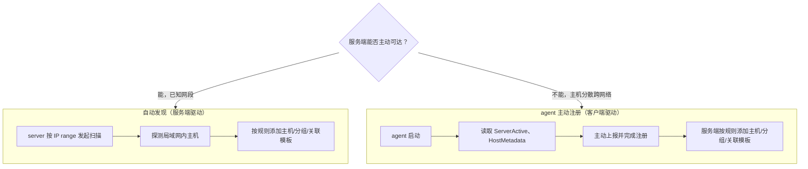
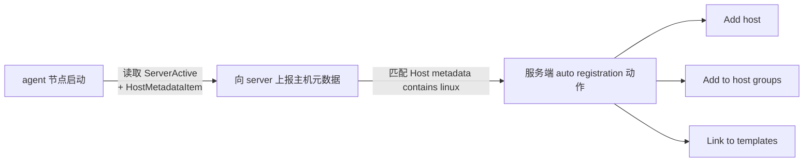

# Zabbix 自动发现和自动注册

## ① 模块介绍

企业规模扩大后，几百上千台主机要一台台手工加入监控系统，既不现实也容易漏配。Zabbix 提供自动发现（AutoDiscovery）和自动注册（AutoRegistration）两种机制，让主机从"发现、添加、配置到监控"全流程自动化。本模块讲解这两种模式的区别、原理与配置方法。

### Zabbix 及其优势

Zabbix 是主流开源企业级监控系统，核心特性：

- **功能丰富**：图形化界面、网络拓扑、自定义面板，自带 CMDB（Configuration Management Database，配置管理数据库）资产管理功能，支持数据聚合分析；
- **高可用**：支持 proxy 代理模式，客户端先上报代理节点再统一汇总到 server，降低 server 压力；server 支持 HA（High Availability，高可用）切换；
- **采集模式多样**：自带 agent，也支持 SNMP（Simple Network Management Protocol，简单网络管理协议）、JMX（Java Management Extensions，Java 管理扩展）等公共协议；支持主动（服务端抓取）与被动（客户端上报）两种模式；可自定义插件（监控脚本、主机模板、主机组模板）；
- **开放集成**：提供完整 API，方便接入企业 DevOps 或运维管理系统。

### 两种自动化纳入模式

Zabbix 对海量主机监控信息的管理高度自动化，有自动发现与 agent 主动注册两种模式：

| 模式 | 触发方 | 原理 | 适用场景 |
|------|--------|------|---------|
| 自动发现 | 服务端 | server 发起扫描，探测局域网内的网络设备、服务器、主机并收集信息 | 已知网段、服务端可主动可达 |
| agent 主动注册 | 客户端 | agent 启动后主动上报主机信息，在服务端完成注册 | 主机分散、跨网络，服务端不易主动扫描 |

---

## ② 核心方法论

### 两种模式的触发机制

从"谁发起"的视角看，两种模式适用场景完全不同，其运作机制可用 mermaid 对比：

### 图：自动发现与自动注册触发机制



上图对比了两种模式的触发方：自动发现由服务端主动扫网段、探测主机后按规则纳管，适合服务端可控、可主动到达的已知网段；agent 主动注册则由客户端启动后主动上报并完成注册，服务端按规则自动处理，适合主机分散、跨网络、服务端不易主动扫描的场景。选型核心就看"服务端能否主动触达到主机"。

### "规则 + 动作 + 模板"三段式配置思想

无论哪种模式，Zabbix 自动纳入的配置都可抽象为同一个三段式框架：先定义**发现规则/注册规则**（识别哪些主机）、再定义**执行动作**（发现后做什么）、最后**关联监控模板**（如何采集与画图）。这三步缺一不可，理解了它就理解了 Zabbix 自动化纳管的所有套路。

---

## ③ 关键流程

### 自动发现配置流程

在 Zabbix 控制台配置自动发现，核心是"发现规则 + 执行动作"两块（菜单路径以 Zabbix 7.x 为例，6.4 起改为 Data collection / Alerts 菜单；6.2 及以前旧版为 Configuration 菜单）：

#### 配置发现规则

按顺序点击 Data collection → Discovery → Create discovery rule，关键配置项：

- **Name**：规则名称；
- **Discovery by proxy**：未使用代理时选 no proxy；
- **IP range**：定义扫描的主机网段；
- **Update interval**：扫描周期；
- **Checks**：监控项检查，如 `system.uname` 获取客户端主机元数据；
- **Device uniqueness**：主机唯一性标识，可选 IP address 或主机元数据。

#### 配置执行动作

在 Alerts → Actions 新建 Discovery 类型 action，包含三部分：

- **Conditions（条件）**：定义匹配条件，如主机 IP 范围，多个条件通过 Type of calculation 设置 and/or 关系；
- **Operations（操作）**：定义满足条件后执行的动作，核心三类：
  - **Add host**：将发现的主机加入主机列表；
  - **Add to host groups**：加入主机组（如默认的 Linux servers）；
  - **Link to templates**：关联监控模板（如 Linux by Zabbix agent，Zabbix 6.0 起模板去掉了旧版 "Template OS" 前缀），此后就能按模板采集数据并画图。

### agent 主动上报配置流程

主动上报模式同样需要配置服务端与客户端两大块：

- **服务端**：Alerts → Actions 新建 auto registration 规则，条件设为 `Host metadata contains linux`（主机元数据包含 Linux），Operations 与自动发现模式相同（Add host、Add to host groups、Link to templates）；
- **客户端**：`zabbix_agentd.conf` 中配置 `ServerActive` 指向服务端，并设置 `HostMetadataItem` 提供元数据。

agent 启动后主动上报，服务端按规则自动完成主机添加、分组和模板关联。

### 图：agent 主动注册流程



上图展示 agent 主动注册的完整链路：agent 启动后读取 `ServerActive` 与 `HostMetadataItem` 配置，主动向服务端上报主机元数据；服务端根据 auto registration 规则的条件（如元数据包含 linux）命中后，依次执行 Add host、Add to host groups、Link to templates 三个动作，从而自动完成主机纳管。

### 客户端配合（自动发现）

自动发现模式下，确认 `zabbix_agentd.conf` 中关键配置：

```bash
Server=172.21.64.12          # zabbix server 的 IP
ServerActive=172.21.64.12    # 主动上报 zabbix server 的 IP
HostMetadataItem=system.uname # 通过 system.uname 动态获取主机元数据
```

重启 agent 后等待扫描周期，在控制台 Monitoring → Discovery 列表或主机列表中即可看到自动添加的新主机。

---

## ④ 工具与实践

### 安装与配置要点

Zabbix 自动纳入的核心操作集中在服务端控制台，配置路径归纳如下：

| 步骤 | 控制台入口 / 配置文件 | 关键操作 |
|------|----------------------|---------|
| 定义发现规则 | Data collection → Discovery | 新建 discovery rule，设置 IP range、Update interval、Checks |
| 定义执行动作 | Alerts → Actions | 新建 Discovery 类型 action，配置 Conditions 与 Operations |
| 定义注册规则 | Alerts → Actions | 新建 auto registration 规则，条件设为 metadata contains linux |
| 客户端（自动发现） | `zabbix_agentd.conf` | 配置 `Server`、`ServerActive`、`HostMetadataItem` |
| 客户端（主动注册） | `zabbix_agentd.conf` | 配置 `ServerActive` 指向服务端 + `HostMetadataItem` 提供元数据 |
| 验证结果 | Monitoring → Discovery / Hosts | 查看自动添加的主机与分组 |

### 验证方法

完成配置后，重启被纳入的 agent，等待扫描周期后到控制台 **Monitoring → Discovery 列表或主机列表**查看是否已自动出现新主机、是否已按模板开始采集与画图。若主机未出现，优先检查 `ServerActive` 指向与 `HostMetadataItem` 是否生效。

---

## ⑤ 常见坑点

- **触发方混淆**：把自动发现（服务端扫网段）用在服务端不可达的分散主机上，会一直扫描不到；此时应改用 agent 主动注册。
- **`ServerActive` 未配置**：主动注册依赖客户端主动上报，若 agent 只配了 `Server` 而未配 `ServerActive`，不会触发主动注册。
- **条件不匹配**：auto registration 规则的条件（如 `Host metadata contains linux`）与客户端 `HostMetadataItem` 返回的元数据不一致时，主机永远不会被纳管。
- **动作未配全**：只 Add host 而未 Add to host groups / Link to templates，会导致主机"进了列表却没分组、没画图"，监控不完整。
- **更新周期过长**：自动发现的 Update interval 设得过大，新主机上线后要很长时间才被纳入，影响及时性。

---

## ⑥ 进阶扩展与参考

### 小结

自动发现适合服务端可控网段内扫描纳管；agent 主动注册适合跨网络、分散部署的主机。两者都只需"规则 + 动作 + 模板"三步配置，配合好后主机录入和监控管理从手工操作变成全自动化。结合[告警与值班机制](03-告警与值班机制.md)讲到的告警分级，Zabbix 的自动纳入能力是海量主机监控体系建设的第一公里。

### 进阶方向

- **Proxy 架构扩展**：使用 Zabbix proxy 分级收拢海量 agent 数据，降低 server 压力，配合 HA 实现更高可用；
- **结合 API 编排**：调用 Zabbix 开放 API，把自动纳入能力接入企业 CMDB 或 DevOps 流水线，实现主机上下线的全自动联动；
- **联动告警闭环**：将自动发现的主机直接关联带告警模板的主机组，让新主机默认获得统一的分级告警，与[监控与告警实战](01-监控与告警实战.md)形成整体闭环。

### 参考资源

- Zabbix 官方文档：<https://www.zabbix.com/documentation/current/>
- 自动发现章节：<https://www.zabbix.com/documentation/current/en/manual/discovery/>
- 自动注册章节：<https://www.zabbix.com/documentation/current/en/manual/discovery/auto_registration/>