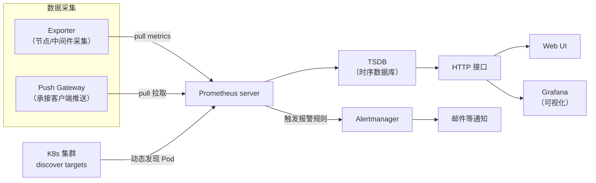
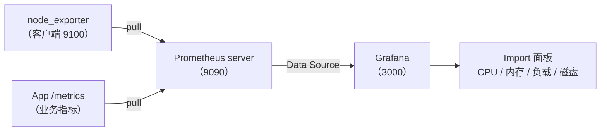

# 容器监控实践：Prometheus、Grafana 方案介绍

## ① 模块介绍

K8s（Kubernetes，容器编排平台）时代监控选型绕不开 Prometheus。本模块先拆解 Prometheus 的核心组件与整体架构，再与 Zabbix 做选型对比，最后演示 Prometheus + Grafana + node_exporter 从数据采集到图表展示的完整链路。

### Prometheus 核心组件

Prometheus 是 Go 语言开发的开源监控系统，继 Kubernetes 之后第二个 CNCF（Cloud Native Computing Foundation，云原生计算基金会）托管项目，官方网站 <https://prometheus.io/>。核心组件如下：

| 组件 | 作用 |
|------|------|
| Prometheus server | 核心组件，拉取监控数据并存入时序数据库，是整个系统的"心脏" |
| 客户端 SDK | 植入监控的应用程序中，完成数据采集 |
| Push Gateway | 中间网关，承接客户端主动推送的监控数据，再供 server 拉取 |
| Exporter | 数据采集组件总称，从目标节点搜集数据并转化为 Prometheus 可抓取的格式 |
| Alertmanager | 告警管理器，统一处理 Prometheus 发出的告警并触发通知 |

---

## ② 核心方法论

### 整体监控架构

Prometheus 采用 **Pull（拉取）模式**：由服务端主动抓取目标指标，这与传统"客户端上报"模式在扩展性上有本质区别。Prometheus server 内部包含三部分：采集模块（Retrieval）、时序数据库 TSDB、对外 HTTP 服务接口。

### 图：Prometheus 整体监控架构



上图展示 Prometheus 的完整监控架构：server 使用 `pull metrics` 方式从两类数据源抓取指标——一是通过 Exporter 采集节点/中间件数据并标准化为通用 metric 接口，二是客户端主动推送数据到 Push Gateway 转换后由 server 再拉取；同时通过动态发现（discover targets）发现 K8s 集群中的 Pod。数据存入 TSDB 后经运算、转换、逻辑处理，通过 HTTP 接口对外提供访问。触发报警规则时告警推送给 Alertmanager 负责发送邮件等通知；可视化方面既可用自带的 Web UI，也可集成 Grafana 做更丰富的展示。

### Prometheus 与 Zabbix 对比

在容器化场景选型时，Prometheus 与老的 Zabbix 常被拿来对比：

| 维度 | Zabbix | Prometheus |
|------|--------|-----------|
| 开发语言 | C（server/agent），Web 前端为 PHP | Go |
| 代码成熟度 | 问世早，更成熟 | 较新，部分代码需加固 |
| 性能 | 关系库存储限制性能 | 自研时序数据库，单节点可达每秒百万级样本写入 |
| K8s/容器支持 | 很晚才兼容动态发现、容器编排 | 原生完美支持 K8s 动态发现 |
| 配置复杂度 | 控制台配置完善，较简单 | 配置项与规则运算多，复杂度更高 |
| 数据获取方式 | 主动/被动均可 | Pull 方式，服务端方便水平扩展 |

**结论**：除配置复杂度外，Prometheus 在性能、K8s 支持、水平扩展方面均占优，是当前 K8s 部署场景下监控系统的首选。

---

## ③ 关键流程

### 从采集到展示的完整链路

将架构落到实践，"数据采集 → 存储 → 查询 → 可视化"的完整链路如下：

### 图：Prometheus + Grafana 完整监控链路



上图对应本项目的实践链路：客户端 host 上启动 `node_exporter`（默认端口 9100）暴露主机指标，Prometheus 按 `scrape_configs` 周期拉取数据存入 TSDB；Grafana 将其作为 Data Source 连接，再通过导入 Node Exporter 面板插件，即可看到 CPU、内存、负载、磁盘等指标的图表化展示。链路每一步都对应明确的配置动作。

---

## ④ 工具与实践

### 4.1 安装 Prometheus

容器方式安装：

```bash
docker run -d -p 9090:9090 \
    -v ~/docker/prometheus/:/etc/prometheus/ \
    prom/prometheus
```

配置文件在挂载目录 `prometheus.yml`，包含两块：`global`（全局配置）和 `scrape_configs`（抓取目标，按需修改）。启动后浏览器访问 `http://<IP>:9090` 进入 Prometheus UI。

### 4.2 安装 Grafana 并配置数据源

```bash
docker run -d -p 3000:3000 grafana/grafana
```

访问 `http://<IP>:3000`，默认账号 admin/admin（首次登录后 Grafana 会要求修改）。登录后在 **Connections → Data sources → Add data source** 中选择 Prometheus（旧版入口为 Configuration → Data Sources），配置：

- **HTTP URL**：Prometheus 服务地址与端口；
- **Scrape interval**：采集间隔，如 15 秒；
- **HTTP Method**：GET 方式请求。

### 4.3 客户端 Exporter 采集

下载解压 node_exporter 后直接执行 `./node_exporter` 启动，它提供 metric 数据接口（默认端口 9100）供服务端拉取。在 Prometheus 的 `scrape_configs` 中填入客户端 IP 与 9100 端口，重启 Prometheus 容器。

### 4.4 验证与图表展示

Prometheus UI 的 **Status** 页面可查看目标节点、状态与采集时间。再到 Grafana 的 **Dashboards → New → Import**，导入 Node Exporter 面板插件，即可看到 CPU、内存、负载、磁盘等指标的图表化展示。

---

## ⑤ 常见坑点

- **scrape_configs 未更新重启**：新增客户端节点后若只改配置而不重启 Prometheus 容器，抓取目标不会刷新，Status 页看不到新节点；
- **Exporter 未启动/端口不通**：node_exporter 必须先在本机启动（默认 9100），且 9100 端口要对 Prometheus server 可达，否则该目标会被标记为 down；
- **Grafana 数据源地址填错**：HTTP URL 应指向 Prometheus 服务地址（如 `http://prometheus:9090` 或实际 IP），填错则面板显示无数据；
- **采集间隔不一致**：Grafana 的 Scrape interval 与 Prometheus 的 `scrape_interval` 不一致，可能导致图表数据稀疏或查询时间范围对不上；
- **误以为配置简单**：与 Zabbix 控制台相比，Prometheus 的规则运算与指标设计复杂度更高，需要团队具备一定的规则与指标设计能力，否则会陷入"数据多但不准"的困境。

---

## ⑥ 进阶扩展与参考

### 小结

Prometheus 以 Pull 模式 + 时序数据库 + 原生 K8s 服务发现取胜，Exporter 生态让采集面覆盖操作系统、中间件、业务应用；Grafana 负责统一可视化。与 Zabbix 相比，Prometheus 更适合动态、容器化的云原生环境，但配置复杂度更高，需要团队具备一定的规则与指标设计能力。监控数据的最终价值在于驱动[告警与值班机制](03-告警与值班机制.md)的告警与值班闭环，而非只是"看得见"。

### 进阶方向

- **K8s 服务发现**：通过 `kubernetes_sd_configs` 自动发现 Pod/Service 并配合 relabel 规则采集带注解的目标，实现容器扩容后自动纳入监控；
- **接入 Alertmanager 告警**：在 Prometheus 中配置告警规则，把告警提交给 Alertmanager 做分级、分组与通道通知，与[告警与值班机制](03-告警与值班机制.md)的告警体系联动；
- **补充 Exporter 生态**：按需部署 cAdvisor、kube-state-metrics、MySQL/pg_exporter 等，把采集面从主机扩展到容器、工作负载与中间件。

### 参考资源

- Prometheus 官方文档：<https://prometheus.io/docs/>
- Grafana 官方文档：<https://grafana.com/docs/>
- node_exporter 仓库：<https://github.com/prometheus/node_exporter>
- Prometheus Kubernetes 服务发现：<https://prometheus.io/docs/prometheus/latest/configuration/configuration/#kubernetes_sd_config>