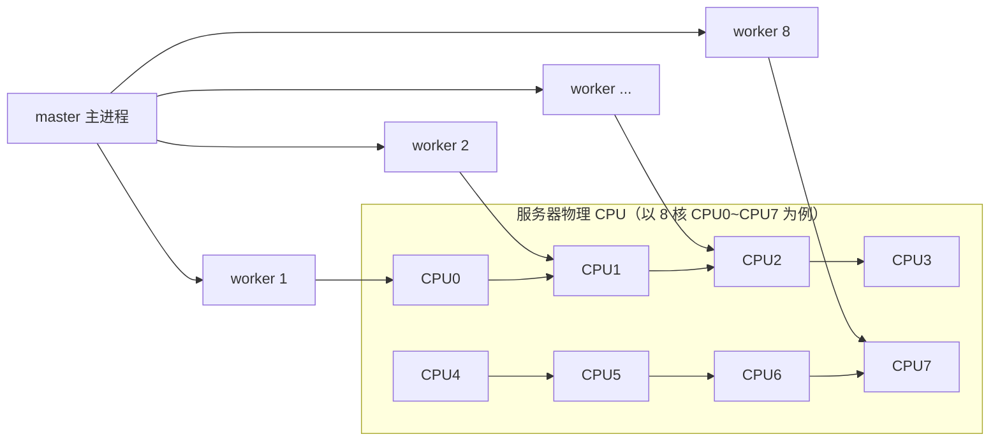

# ① 模块介绍

Nginx 是一款轻量级的开源 Web 服务及代理程序。在它出现之前，市场上主流的两款 Web 服务分别是 Windows 系统上的 IIS 与 Linux 系统上的 Apache；而 Nginx 诞生后，凭借轻量化、支持高并发等特性，逐渐蚕食了这两款产品的市场份额，目前国内大量企业已广泛使用。本文聚焦 Nginx 的**性能优化**专项，涵盖两大区块：

- **基础配置优化**：CPU 亲和性（CPU Affinity）、IO 事件模型（IO Event Model）、零拷贝（Zero Copy）、文件压缩（gzip）。
- **缓存配置优化**：浏览器缓存、HTTPS SSL 会话缓存、打开文件缓存、代理缓存。

学习前提：熟悉 Linux 基础操作，了解 Nginx 安装与基础配置，并对 HTTP 请求过程有一定认识。

> 说明：Nginx 的基础增量配置不属于本文重点，若需基础配置指引见「⑥ 进阶扩展与参考」。

## ② 核心方法论

### 2.1 总原则：把资源调度与数据流转的损耗压到最低

性能优化的本质是减少两类损耗：**CPU 调度损耗**（worker 线程在多核间频繁切换）与**数据传输损耗**（数据在内核态与用户态之间反复拷贝）。围绕这两点展开各项配置。

### 2.2 基础配置四项

| 优化项 | 关键配置 | 作用 |
|--------|----------|------|
| CPU 亲和性 | `worker_cpu_affinity auto` | 让每个 worker 线程固定到具体 CPU 核心，降低频繁调度损耗 |
| IO 流事件模型 | `use epoll` | 采用异步非阻塞事件驱动模型，应对大规模连接 |
| 零拷贝 | `sendfile on` | 静态文件直接在内核态完成转发，避免绕道用户态 |
| 文件压缩 | gzip 系列配置 | 减小发送数据量，降低延迟、提升体验 |

### 2.3 缓存方法论：三级缓存经验

- **缓存越靠前越好**：能放客户端的就放客户端（浏览器缓存），不要下沉到后端频繁请求。
- **缓存的数据越多越好**：本层级缓存越多，对后端请求越少。
- **缓存命中率越高越好**：命中率低会造成缓存穿透，同样打穿到后端。

> 一个网站做了缓存优化，性能提升通常可达数倍。

## ③ 关键流程

### 图：Nginx worker 线程与 CPU 核心绑定的工作示意



文字说明：Nginx 运行时启用 1 个 master 主进程及多个 worker 工作进程，worker 负责处理请求。若 worker 在多核 CPU 上频繁被调度会损耗性能；配置 `worker_cpu_affinity auto` 后，Nginx 自动识别核心数，将 worker 线程一对一绑定到具体 CPU 核心（如 8 核对 8 个 worker），从而降低 CPU 损耗。

### 图：零拷贝（sendfile on）与无零拷贝文件传输对比

```mermaid
sequenceDiagram
    participant App as Nginx 用户态
    participant K as 内核态 Buffer Cache
    participant S as Socket 转发

    Note over App,K,S: 未开启 sendfile（虚线折返路径）
    App->>K: 读入内核态文件
    K->>App: 传递到用户态
    App->>K: 经用户态 Buffer Cache 再传回内核态
    K->>S: 通过 Socket 转发

    Note over App,K,S: 开启 sendfile on（实线直达路径）
    K-->S: 静态文件直接在内核态完成转发
```

文字说明：未开启时，Nginx 处理请求会把文件读入内核态 Buffer Cache，再传到用户态缓冲，最后又传回内核态经 Socket 转发，绕了一大圈。对于无需用户态处理的静态文件，开启 `sendfile on` 后可直接沿内核态路径转发，显著提高效率。

## ④ 工具与实践

### 4.1 CPU 亲和性配置

```11-Nginx基础概述
# 推荐使用 auto，Nginx 自动识别 CPU 核心数并按推荐策略绑定 worker 线程
worker_processes 8;          # 与 CPU 核心数对应
worker_cpu_affinity auto;
```

### 4.2 IO 流事件模型与连接数

```11-Nginx基础概述
events {
    use epoll;               # 使用 epoll 事件驱动模型
    worker_connections 1024; # Nginx 默认 512，高并发场景建议按峰值调大
}
```

**epoll 相比早期 select 模型的优势**（select 模型在 kernel 2.6 之前使用）：

- 线程安全；
- `epoll_wait` 只返回就绪的文件描述符（file descriptor, fd），避免 select 每次调用都要在内核与用户态之间全量拷贝与扫描 fd 集合；
- 基于事件驱动，直接调用 callback（回调函数）处理就绪事件，避免 select 反复扫描 fd 状态；
- 取消 select 单个进程可监视 fd 数量上限 1024 的限制（早期 Apache 请求超 1000 后即出现延迟或报错）。

### 4.3 零拷贝配置

```11-Nginx基础概述
http {
    sendfile on;     # 开启内核对静态文件的内核态零拷贝转发
}
```

### 4.4 gzip 文件压缩典型配置（按需调整）

```11-Nginx基础概述
gzip                on;                          # 开启压缩功能
gzip_buffer         16 8k;                       # 压缩时使用的内容内存空间
gzip_comp_level     6;                           # 压缩等级，推荐 6（过高影响性能、过低无效果）
gzip_http_version   1.1;                         # 仅对 HTTP 1.1 压缩
gzip_min_length     256;                         # 小于 256 字节不压缩
gzip_proxied        any;                         # 反向代理时依据后端返回信息决定压缩策略
gzip_vary           on;                          # 发送 Vary: Accept-Encoding 响应头
gzip_types          text/plain application/json application/vnd.ms-fontobject image/x-icon;
gzip_disable        "msie6";                     # 关闭 IE6 的压缩
```

### 4.5 缓存优化配置

**浏览器缓存**（静态元素缓存到客户端，可配合 Chrome 开发者工具分析请求头/响应头与 body）：

```11-Nginx基础概述
# expires 设置 Expires 与 Cache-Control 响应头，控制浏览器缓存周期
# -1 表示不缓存（Cache-Control: no-cache）；max 表示最长周期缓存（10 年）；也可写具体分钟/天
location ~* \.(css|js|png|jpg)$ {
    expires 1d;
    add_header Cache-Control "public";
}
```

**HTTPS SSL 会话缓存**（减少客户端与服务的重复建连）：

```11-Nginx基础概述
ssl_session_cache shared:SSL:10m;   # 共享内存 10MB，用于缓存 SSL 会话
ssl_session_timeout 10m;            # SessionKey 超时 10 分钟，到期重新建连
```

**打开文件缓存**（缓存静态元素的元数据，如文件路径等索引信息）：

```11-Nginx基础概述
open_file_cache        max=1000 inactive=20s;  # 最多缓存 1000 个文件；20 秒内未被访问的条目会被移出
open_file_cache_valid  30s;                    # 每 30 秒主动检查缓存元信息是否有更新
```

**代理缓存**（反向代理后端动态数据）：

```11-Nginx基础概述
proxy_cache_path /path/to/cache levels=1:2 keys_zone=my_cache:10m max_size=10g inactive=60m;

location / {
    proxy_cache my_cache;   # 通过 location 引用到缓存名称
    ...
}
```

- `proxy_cache_path`：本地分配缓存存储路径；
- `levels=1:2`：缓存文件的分层方式；
- `keys_zone=my_cache:10m`：开辟名为 my_cache 的共享内存区（存放缓存键与元数据）；
- `max_size`：该缓存区的总大小上限，超过后按淘汰策略（近似 LRU）清理。代理缓存不限 `http_proxy`，Nginx 支持的代理模式（uwsgi、SCGI、FastCGI 等）均可设置；且支持动静分离与动静态缓存，能显著提升网站整体并发性能。

## ⑤ 常见坑点

- **文件更新策略**：后端做缓存配置需同时考虑缓存的删除策略与更新策略，保证后端数据更新前端用户能及时感知，避免缓存与源数据长期不一致。
- **缓存命中率失败给后端造成瞬间压力**：前端缓存元素越多、命中率越高，后台压力越小。一旦前端缓存失效、或某节点迁移、头部信息失效，会造成对后端缓存的瞬间冲击，可能引发灾难性后果。设计时需考虑如何避免缓存大规模失效、以及失效时如何保证后端高可用。
- **多节点缓存一致性**：多个前端节点保存相同内容时，需保证数据一致，涉及缓存架构设计与前端缓存节点更新策略。
- **压缩等级权衡**：gzip 压缩等级并非越高越好，过高拖慢性能、过低效果不明显，一般取 6 较合适。

## ⑥ 进阶扩展与参考

- **缓存体系分层**：缓存可分布在客户端（浏览器缓存 + HTTPS 缓存）、代理端（代理缓存，如 Nginx Cache）、后台服务端（程序逻辑 + Memcache / Redis 等 KV 缓存，如将登录状态、连接数等高频数据缓存，降低对关系型数据库的依赖）。服务端富缓存优化多由开发实现，不在本文展开。
- **基础配置**：本目录聚焦「优化/负载均衡/网关/网络专项」，Nginx 增量配置与基础镜像场景见相邻 Nginx 专题，可参考本库 `docs/运维/04-Nginx/`。
- **关联章节**：Nginx 作为入口网关的负载均衡应用与常见问题，见本目录《02-Nginx 负载均衡常见架构及问题解析》。