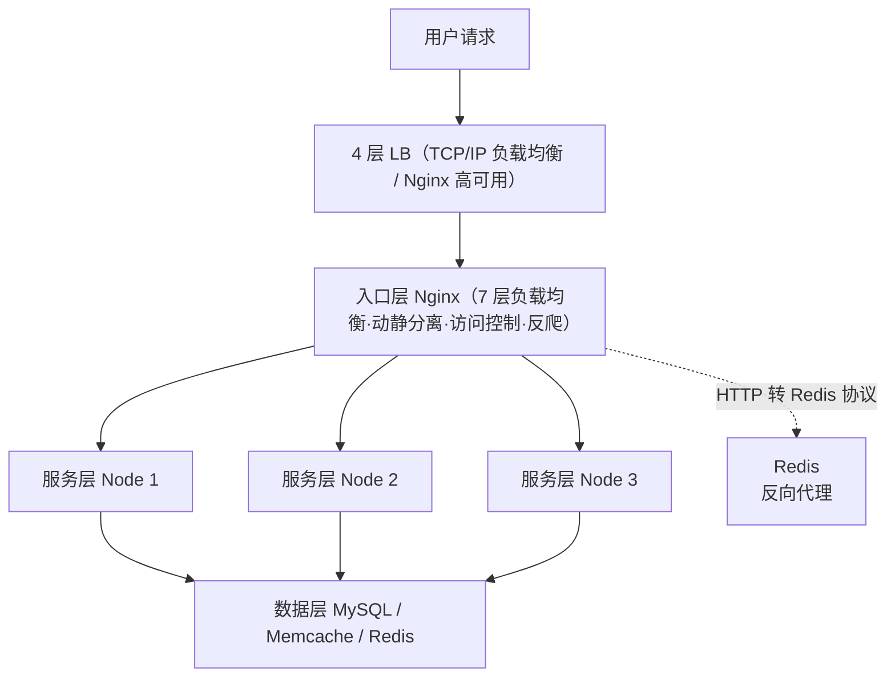
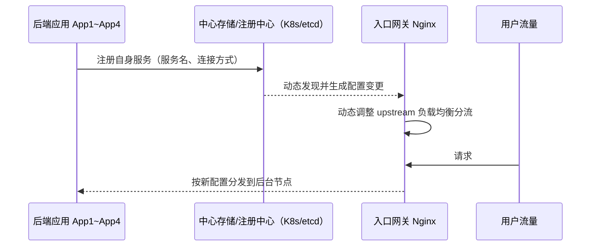

# ① 模块介绍

Nginx 除了承担 HTTP 代理网关角色外，还会应用于**7 层负载均衡（Load Balancing）**。本文系统讲解 Nginx 负载均衡应用的两类主流架构（分层入口代理架构、服务注册发现代理架构），并结合企业实战剖析五个最常见问题：客户端 IP 获取、域名携带、Session 丢失、动态负载均衡、Realserver 状态检测。其中「动态负载均衡」在下一章节（OpenResty 动态 upstream）重点展开，本文仅作引出。

## ② 核心方法论

Nginx 负载均衡应用架构在企业中主要有两种类型：

### 2.1 分层入口代理架构（相对传统）

对整个后台网站服务系统做分层，大体分为三层：

| 层级 | 职责 | Nginx 角色与要点 |
|------|------|------------------|
| 入口层 | 最接近用户请求 | Nginx 作为入口网关承担 7 层 LB；其前还有一套 4 层 LB 保证 Nginx 高可用或承担 TCP/IP 层转发，即「4 层 LB + 7 层 LB」组合 |
| 服务层 | 为用户提供逻辑处理 | Nginx 实现上层请求应答的高可用 |
| 数据层 | 提供真正数据 | Nginx 负载均衡较少见，因数据调用更追求底层效率（协议原生请求，如 Memcache、MySQL），而非上层的 HTTP 请求 |

**方法论要点**：
- 与业务服务相关的功能交给入口层 Nginx 处理：动静分离（静态元素不必要下沉到数据层，由 Nginx 直接分流处理）、用户访问控制、反爬虫规则等。
- 追求 HTTP 可靠性/应用性时可借助 Nginx 负载均衡：例如用 Nginx 反向代理 Redis，把前端 HTTP 请求转换为 Redis 协议请求，从而更好地控制监控、数据一致性，并基于 Hash 算法保障稳定性。

> 随着 K8s、Docker 轻量化虚拟化部署及微服务（Microservices）/ set 化架构演进，传统分层负载均衡被推动改进以支持服务注册与发现，即第二种架构。

### 2.2 服务注册发现代理架构（演进趋势）

在后端应用部署于 K8s / Docker 的背景下，Nginx 仍需作为入口网关，但需支持**动态发现与注册后端服务**。注册指后端应用（App1~App4）向中心存储节点注册自身服务；上报后 Nginx 动态发现并动态生成配置，再对入口网关代理负载均衡分流调整——这就是基于 K8s / Docker 部署模式入口网关所应用的架构。

## ③ 关键流程

### 图：分层入口代理架构概览



文字说明：用户请求先到入口层前的 4 层 LB，负责 Nginx 本身的高可用与 TCP/IP 层转发；流量再进入入口层 Nginx（7 层 LB）做业务相关处理与动静分离。服务层用 Nginx 做负载均衡实现应答高可用；数据层通常走底层协议调用而非 HTTP，仅在需要 HTTP 可靠性/应用性（如 Redis 反代）时才用 Nginx。

### 图：服务注册发现代理架构



文字说明：后端应用向中心存储节点注册服务信息，Nginx 动态发现注册变更并生成动态配置，据此调整 upstream 分流策略。这就构成「注册 + 发现 + 动态调整」的服务注册发现代理架构，也是 K8s 入口网关负载均衡的本质原理。

## ④ 工具与实践

### 4.1 Nginx 基础负载均衡配置回顾

```11-Nginx基础概述
http {
    # ...
    upstream app_servers {
            server ip1:port1;
            server ip2:port2;
            server ip3:port3;
    }
    server {
     # ...
          location / {
                  proxy_pass http://app_servers;
          }
    # ...
    }
}
```

通过 upstream（上游服务器组）配置将入口请求流量分发到后台三个 IP 节点对应的端口服务。

### 4.2 解决客户端 IP 地址获取问题

**问题成因**：加负载均衡后，后端有两种取 IP 方式都会出问题——

- 通过 4 层 TCP 取源 IP：反代会修改客户源地址/源端口的包头，后端只能拿到 Nginx 的 IP；
- 通过 HTTP 标准头 `X-Forwarded-For`：代理层可能改写或丢失用户的请求地址。

**解决办法（两种）**：

```11-Nginx基础概述
# 方式一：X-Forwarded-For（传递标准头）
proxy_set_header X-Forwarded-For $proxy_add_x_forwarded_for;

# 方式二：X-Real-IP（自定义头，用内置变量 remote_addr 直接取四层用户 IP）
proxy_set_header X-Real-IP $remote_addr;
```

**两者优劣**：`$remote_addr` 直接获取与当前代理直连的对端 IP，更准确；但多级代理、用户并非直连最外层代理时，`remote_addr` 取到的是最近一层代理的 IP。`$proxy_add_x_forwarded_for` 会把各层 IP 一层层追加，但前端用户可篡改 HTTP 头，可能影响真实 IP 获取。**建议两者都加，交给后端综合分析。**

### 4.3 解决域名携带问题

用户直接用 IP 而非域名请求时，Host 头为该 IP（早期 HTTP/1.0 客户端甚至不带 Host），若后端校验域名则需要在 Nginx 改写：

```11-Nginx基础概述
http {
    # ...
    upstream app_servers {
            server ip1:port1;
            server ip2:port2;
            server ip3:port3;
    }
    server {
     # ...
          location / {
                proxy_set_header Host $host;                  # 请求带域名则透传标准 Host
                proxy_set_header Host www.example.com;        # 否则指定固定域名满足后端要求
                proxy_pass http://app_servers;
          }
    # ...
    }
}
```

### 4.4 解决 Session 丢失问题

Nginx 默认开启轮询（Round Robin）策略，用户两次请求可能分发到不同后端，若 Session 只保存在 App1 上则 App2 无会话导致需重新登录。三种解决思路：

1. **Session 保持（推荐 Nginx 侧）**：改用 `ip_hash` / URL_hash，让同一用户固定落到同一台后端。

```11-Nginx基础概述
http {
    # ...
    upstream app_servers {
            ip_hash;                       # 方式一：基于用户 IP 的 hash
            server ip1:port1;
            server ip2:port2;
            server ip3:port3;
    }
    server {
     # ...
          location / {
                proxy_pass http://app_servers;
          }
    # ...
    }
}
```

```11-Nginx基础概述
http {
    # ...
    upstream app_servers {
            hash $request_uri;             # 方式二：基于请求 URL 的 hash（URL_hash）
            server ip1:port1;
            server ip2:port2;
            server ip3:port3;
    }
    server {
     # ...
          location / {
                proxy_pass http://app_servers;
          }
    # ...
    }
}
```

2. **Session 复制（Session Replication）**：后台应用间相互复制 Session，使 App1~App3 都有相同会话，轮询不丢。

3. **Session 共享（Session Sharing）**：由应用程序把 Session 放入共享的 KV 存储，不放在本地。

### 4.5 Realserver 状态检测（真后端状态检测）

**默认机制局限**：Nginx 默认基于 TCP（Transmission Control Protocol，传输控制协议）端口与连接方式检测，即只在前端 ping 不通、无法建立 TCP 连接、端口服务完全不可用时才判定不可用；对响应状态/返回状态异常缺乏有效容错。`proxy_next_upstream` 能检测到后端返回的状态码，但无法自动摘除故障节点。

**依赖第三方模块**：`11-Nginx基础概述_upstream_check_module`（淘宝技术团队开发开源，可编译进 Nginx，或直接使用基于 Nginx 1.6 开源的 Tengine）：

```11-Nginx基础概述
check interval=3000 rise=2 fall=5 timeout=1000 type=http;  # 检查间隔/周期/超时时间
check_keepalive_requests 100;                               # 一个连接发送的请求数
check_http_send "HEAD / HTTP/1.1\r\nConnection: keep-alive\r\n\r\n";  # 定义健康检查方式
check_http_expect_alive http_2xx http_3xx;                 # 判断后端返回状态码
```

含义：定义检测间隔（3000ms）、上升/下降阈值（rise=2 次成功置为健康、fall=5 次失败判为故障）、超时（1000ms）与类型；限定单连接请求数；以 HEAD 请求做健康检查；按返回状态码判断后端健康，连续 fall 次返回非 2xx/3xx 即判为不健康并从地址池剔除，避免用户请求到问题节点。

## ⑤ 常见坑点

- **`X-Forwarded-For` 可被伪造**：用户可篡改请求头，导致后端采集到的"用户 IP"不真实；多级代理场景下单靠该头难以还原真实来源。
- **`remote_addr` 多级代理失效**：存在中间 n 层代理时，`remote_addr` 只取最近一层代理的 IP，取不到真实用户 IP。二者常需组合使用。
- **Session 丢失**：默认轮询会把同一用户打到不同后端，需用 ip_hash/URL_hash 或 Session 复制/共享。
- **默认健康检测有遗漏**：Nginx 仅按 TCP 端口/连接判定，对 HTTP 业务层异常（非 200/300）失效，需引入 `11-Nginx基础概述_upstream_check_module` 做真实状态检测。

## ⑥ 进阶扩展与参考

- **动态负载均衡**：服务注册发现架构中的「动态 upstream」实现（OpenResty + Lua / confd / 11-Nginx基础概述-upsync / Kong / Traefik），见本目录《03-入口网关服务注册发现-OpenResty 动态 upstream》。
- **4/7 层入口 SLB 设计**：LVS 四种模式（DR/NAT/TUNNEL/FULLNAT）与 OSPF+ECMP、DPDK 优化方向，见本目录《04-4、7 层入口负载均衡 SLB 如何作才是最佳姿势》。
- **基础配置与性能优化**：本目录聚焦「优化/负载均衡/网关/网络专项」，Nginx 基础配置参考相邻 Nginx 专题，见本库 `docs/运维/04-Nginx/`。