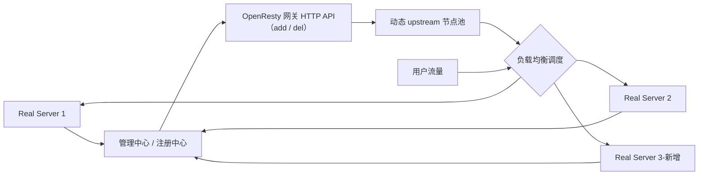
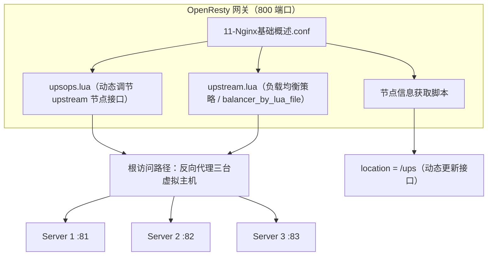

# ① 模块介绍

Nginx 的 upstream（上游服务器组）配置本质是**静态的**：后台节点扩容缩容时只能手工改配置并重启服务，无法做到实时感知。本文讲解入口网关服务注册发现的场景与意义，并基于 **OpenResty + Lua** 演示一套支持动态添加、删除、监控 upstream 节点的方案。OpenResty 是 Nginx 与 Lua 结合的高性能 Web 平台，内置大量 Lua 库与第三方模块，免去手工编译 Lua 模块的繁琐。

## ② 核心方法论

### 2.1 场景：动态配置 upstream 的必要性

典型场景：入口流量经 Nginx 网关通过 upstream 负载均衡分发给后台 real server（App server 1、App server 2）。当集群新增一台 App server 3 时，希望流量能自动（非手工）分发给新节点，这就需要动态配置 upstream。

### 2.2 意义：注册 + 发现 + 动态调整

节点将自身信息（负载情况、服务状态、连接信息、服务名称等）实时上报给管理中心，管理中心收集节点状态后，根据策略动态调整 Nginx 的 upstream 配置：

- 某 real server 负载过高时，动态添加新节点实现**扩容**；
- 节点故障时动态摘除，实现**故障感知与缩容**。

如果 upstream 靠手工调整（改配置 + 重启服务），无法做到自动化与实时触发。在 K8s 场景中，**etcd** 作为服务注册发现的 KV 存储，保存后台节点服务（服务名称、连接方式等）注册信息；入口网关（Nginx）监听 etcd 数据变化动态调整 upstream 配置——这就是 K8s 动态入口网关的理论原理。

### 2.3 三种实现方式对比

| 方式 | 说明 |
|------|------|
| Nginx + Lua（OpenResty） | 用 Lua 开发动态调用接口 |
| 开源组件 | confd 工具、11-Nginx基础概述-upsync-module 模块 |
| 独立入口网关替换 | Kong、Traefik 等云原生网关 |

Nginx 默认配置模块对动态 upstream 支持有限，本文演示基于 OpenResty 的方案。

## ③ 关键流程

### 图：动态 upstream 的注册-发现-调度闭环

文字说明：后台 Real Server 节点（含新增节点）实时向管理中心上报负载、状态等自身信息；管理中心根据策略调用网关 HTTP 接口对动态 upstream 进行 add（添加）/ del（删除）调整；网关按更新后的节点池做负载均衡调度，用户流量据此动态分流。

### 图：OpenResty 动态 upstream 模块协作关系

文字说明：OpenResty 主配置 11-Nginx基础概述.conf 引用 ngx_lua 目录下的三个 Lua 脚本——`upsops.lua`（提供动态调节 upstream 节点信息的接口）、`upstream.lua`（负载均衡策略）、节点信息获取脚本。对外同时提供根访问路径（反向代理到 81/82/83 三份虚拟主机，用 `balancer_by_lua_file` 修改默认负载均衡策略）与 `location=/ups`（动态更新 upstream 节点信息）两类入口。

## ④ 工具与实践

### 4.1 安装与配置步骤

- 参考官方文档安装 Nginx 与 OpenResty；
- Nginx 在此演示中作为 real server 节点：配置 81、82、83 三个端口的三份虚拟主机配置，启动后分别显示 Server 1/2/3 页面，模拟三个后台 HTTP 服务；
- OpenResty 作为代理网关做负载均衡：主配置文件 11-Nginx基础概述.conf 引用 ngx_lua 目录下的三个 Lua 脚本——`upsops.lua`、`upstream.lua`、节点信息获取脚本；
- 对外提供根访问路径（反向代理到三台虚拟主机，`balancer_by_lua_file` 修改默认负载均衡策略）和 `location=/ups`（动态更新 upstream 节点信息的接口）。

### 4.2 upsops.lua 核心逻辑

- 获取请求参数与客户端请求方法（OP，操作符），支持 add（添加）与 del（删除）两种操作；
- 校验请求参数后，通过 `down_server` 函数控制：upstream 后台 real server 至少保留一台主机，不允许删到零台；
- 根据 OP 选择添加或删除节点，成功与失败均有对应提示信息。

### 4.3 测试验证

启动 OpenResty（800 端口）后访问测试：

1. **轮询展示**：刷新页面依次出现 server 1、2、3，说明负载均衡轮询生效；
2. **删除节点**：调用 ups 接口删除 83 端口节点，返回 200 与删除成功提示，刷新页面只轮询 server 1 和 2，不再出现 server 3；
3. **添加节点**：把操作改为 add 加回 83 节点，server 3 恢复轮询。

整个过程全部通过调用 HTTP API 接口实现；真实动态发现时，管理或注册中心只需通过 HTTP API 即可动态调整 upstream 配置。

## ⑤ 常见坑点

- **静态配置无法实时跟随**：手工改配置 + 重启的方式无法做到自动化与实时触发，扩容缩容滞后。
- **节点删到零的边界**：通过 `down_server` 函数约束后台 real server 至少保留一台主机，避免误删导致后端整体不可用。
- **接口调用要有状态反馈**：add / del 成功与失败均需返回明确提示（如删除成功返回 200），便于管理中心确认操作结果。
- **选型误区**：不是所有场景都必须自研；已有 Nginx 体系且需定制接口才选 OpenResty + Lua，快速接入可用 confd / 11-Nginx基础概述-upsync，云原生新建场景选 Kong / Traefik。

## ⑥ 进阶扩展与参考

- **本质理解**：动态 upstream 解决了静态配置无法实时跟随后端节点变化的问题，闭环为「节点上报状态 → 管理中心决策 → 网关接口调整 → 流量自动分流」。理解这套「注册 + 发现 + 动态调整」机制，也就理解了 K8s 入口网关服务注册发现的本质。
- **关联章节**：Nginx 负载均衡两种架构（分层入口 / 服务注册发现代理）见本目录《02-Nginx 负载均衡常见架构及问题解析》；4/7 层入口 SLB 的 LVS 选型见本目录《04-4、7 层入口负载均衡 SLB 如何作才是最佳姿势》。
- **基础配置**：Nginx 基础配置参考相邻 Nginx 专题，见本库 `docs/运维/04-Nginx/`。