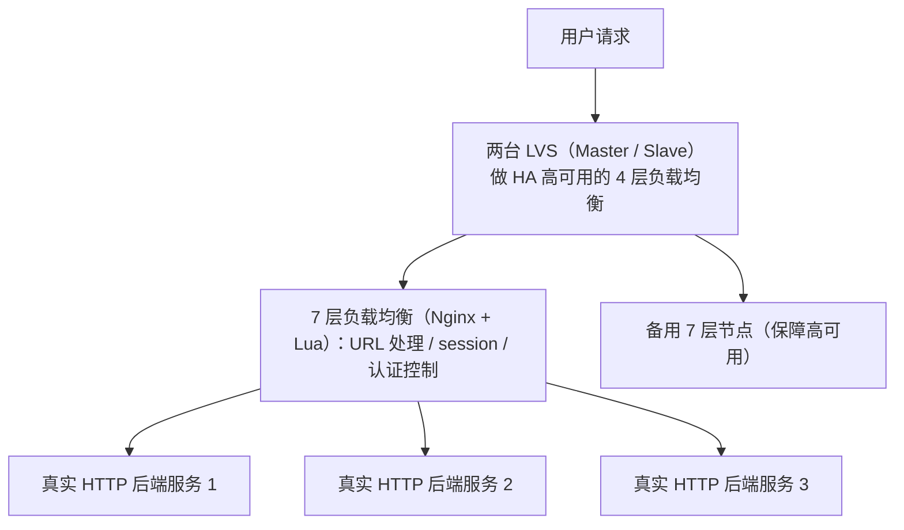
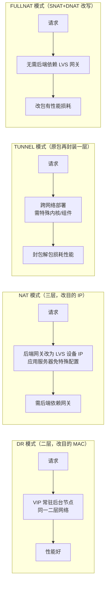

# ① 模块介绍

负载均衡（Load Balancing）把海量请求、并发连接、数据传送分摊到后台多个单元并行处理，避免单点压力过大，同时提升整体可用性。本文系统讲解**4 层与 7 层负载均衡**的分类与结合架构，重点剖析 **LVS** 的四种实现模式（DR / NAT / TUNNEL / FULLNAT）、优化方向与 DPDK 改造思路，给出大规模入口负载均衡（SLB）的选型设计姿势。

## ② 核心方法论

### 2.1 负载均衡分类

按 OSI 网络模型覆盖范围划分：

| 类型 | 工作层次 | 能力 | 典型实现 |
|------|---------|------|---------|
| 4 层负载均衡 | 传输层 | TCP 连接层转发、会话保持，性能好、应用范围广 | LVS |
| 7 层负载均衡 | 应用层 | 针对特定协议（HTTP/HTTPS），URL 转发、session 处理、认证控制 | Nginx、HAProxy |

4 层偏向底层转发，性能更好，上层应用协议都可基于它转发；7 层针对具体协议，支持场景更丰富。**大门户网站通常不二选一，而是结合两者优势整体设计高可用架构。**

### 2.2 最佳姿势总原则

**「4 层保性能与可用性 + 7 层做应用能力」的分层组合**：4 层在最前面做 TCP 层转发分流并保障 7 层服务高可用；7 层（Nginx + Lua）承担 URL 处理、session、认证控制等应用能力；Nginx 最终把请求转发到真实 HTTP 后端服务单元。

### 2.3 大规模场景演进

上亿级访问量下，进一步在核心网络设备用 **OSPF + ECMP** 把数据包更底层打散到多个 LVS 集群节点，并配合 DPDK、NUMA、软中断绑定、flow director 逐项消除瓶颈。

## ③ 关键流程

### 图：4/7 层结合的入口负载均衡架构

文字说明：最前面部署两台 LVS（Master/Slave）做 HA 高可用的 4 层负载均衡，负责 TCP 连接层转发；4 层在前端做一次分流，同时保障后端 7 层负载均衡服务本身的高可用；7 层（Nginx + Lua）实现应用层能力（URL 地址处理、session 处理、基于用户连接信息的判断、认证、控制）；Nginx 最终把请求转发到真实 HTTP 后端服务单元。

### 图：LVS 四种实现模式的工作原理对比

文字说明：四种模式各有优劣。DR（Direct Routing，直接路由）修改目的 MAC 地址二层转发，性能好，但需把 VIP 下放到后台节点且要求 LVS 与后端在同一二层网络；NAT 修改目的 IP，应用服务器无需特殊配置但要把后端网关改为 LVS 设备 IP；TUNNEL 在原有数据包上再封装一层、可跨网络部署，但封包解包损耗性能，需特殊内核或额外组件，使用较少；FULLNAT 结合 SNAT + DNAT 改写，无需后端依赖 LVS 网关，但修改数据包内容有性能损耗。

## ④ 工具与实践

### 4.1 架构层：OSPF + ECMP

**OSPF**（Open Shortest Path First，开放最短路径优先）是动态路由协议，**ECMP**（Equal-Cost Multi-Path，等价多路径）实现多路径转发。在网络核心设备上配置这两个协议：ECMP 把用户请求数据包打散到各个 LVS 集群节点，在更底层实现负载分发，减少单个 LVS 的压力；OSPF 在单个 LVS 故障时动态剔除。这套模式近年应用广泛。

### 4.2 LVS 性能问题清单（上亿级访问量）

- **CPU 硬中断**：中断处理可能导致数据包阻塞，降低整体处理能力；
- **内核协议栈**：LVS 基于 netfilter 内核协议栈，存在优化空间；
- **session 表锁**：FULLNAT 改写源/目的地址导致入出流量 hash 不一致，数据包被分配到不同网卡队列，引起加锁问题；
- **CPU 亲和（CPU Affinity）**：本地内存访问比远端快约 10%，且网卡与 CPU 需要中断亲和性绑定。

### 4.3 对应解决思路

| 问题 | 方案 |
|------|------|
| 中断、内核处理效率 | DPDK：绕过内核的高性能数据包处理基础库 |
| 跨内存调用 | NUMA：控制进程对 CPU 与本地内存的访问 |
| 网卡亲和性 | CPU 与网卡软中断绑定，核心与队列一对一 |
| session 表锁 | 网卡 flow director 特性，按策略把数据包送到指定队列 |

**DPDK**（Data Plane Development Kit，数据平面开发套件）是英特尔开发的高性能网络处理基础库，专注数据包高性能处理。若缺乏研发投入，可直接使用基于 DPDK + LVS 的开源负载均衡软件，如爱奇艺开源的 **DPVS**（4 层，https://github.com/iqiyi/dpvs）；7 层方面有支持 Nginx + DPDK 的开源项目 `ansyun/dpdk-11-Nginx基础概述`，但 Nginx 官方版本默认不支持 DPDK。

## ⑤ 常见坑点

- **DR 模式受网络结构限制**：要求 LVS 与后端在同一二层网络且 VIP 需下放到后台节点，跨网段/跨机房受限。
- **FULLNAT 有额外性能损耗**：SNAT + DNAT 改写数据包内容带来损耗，且会引发 session 表锁问题。
- **TUNNEL 场景窄**：封包解包损耗性能，需特殊内核或额外组件，实际应用较少。
- **单点 LVS 压力过载**：仅靠单 LVS 无法支撑上亿级流量，需 OSPF + ECMP 在核心网络层分发。
- **DPDK 投入大**：Nginx 官方版本默认不支持 DPDK，自研成本高；缺研发投入时应选用成熟开源方案（如 DPVS）。

## ⑥ 进阶扩展与参考

- **选型指引**：先评估网络结构与流量规模再决定是否投入内核级改造；四种模式中 DR 性能最好但受网络结构限制、FULLNAT 部署灵活但有性能损耗；大规模场景用 OSPF + ECMP + DPDK/NUMA/软中断绑定/flow director 逐项消除瓶颈。
- **关联章节**：Nginx 7 层负载均衡架构与常见问题见本目录《02-Nginx 负载均衡常见架构及问题解析》；HTTP/2 应用层协议升级见本目录《05-HTTP2.0 在 Nginx 的实践》；网络层接入方案见本目录《06-分析 Anycast 应用程度及场景》。
- **基础配置**：Nginx 侧的应用层负载均衡与基础配置参考相邻 Nginx 专题，见本库 `docs/运维/04-Nginx/`。