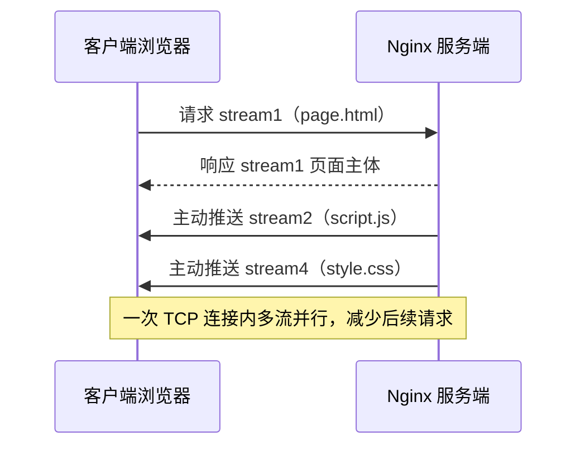

# ① 模块介绍

HTTPS（Secure HTTP，安全超文本传输协议）解决了明文传输的安全问题，却带来了建连次数与性能损耗。**HTTP/2**（本文标题中的「HTTP2.0」是草案期的俗称，正式标准名称为 HTTP/2）通过多路复用（Multiplexing）、头部压缩（HPACK）与服务端推送（Server Push），在不牺牲安全的前提下大幅提升传输效率。本文介绍 HTTP/2 协议特性，并演示 Nginx 的支持配置与效果对比，属于应用层协议升级专项。

## ② 核心方法论

### 2.1 HTTP 协议演进脉络

| 版本 | 核心特征 | 定位 |
|------|----------|------|
| HTTP/1.1 | 明文传输无法加密；一个连接同时只能处理一个请求 | 早期版本，由此引入 HTTPS 加密传输，但带来性能损耗与多次建连 |
| HTTP/2 | Stream（流）概念 + HPACK 头部压缩 + 服务端推送 | 解决连接阻塞，降低建连与头部开销 |
| HTTP/3 | 基于 QUIC 协议（UDP 承载） | 解决 HTTP/2 队头阻塞等缺陷 |

**HTTP/2 关键机制**：引入 Stream（流）概念，一个 TCP 连接分为若干流，每个流可传输若干消息，通过 I/O 复用机制保障请求响应效率；同时采用 **HPACK**（HTTP/2 Header Compression，HTTP/2 头部压缩）机制做头部压缩，服务端建立字典、以增量方式传输报文，减少传送流量。

### 2.2 HTTP1.1 的两大劣势

- **请求阻塞**：一个连接同时只能处理一个请求，浏览器按先进先出（FIFO）优先级处理，某个响应未及时返回时后续请求全部阻塞。前端常用多域名方案缓解，但浏览器对 HTTP1.1 并发连接数有限制，效果有限；
- **明文传输**：数据无加密，易被劫持。

### 2.3 HTTP/2 核心优势

- **多路复用**：一个 TCP 连接内同时发送多个请求流，单连接上多请求-响应并行，解决连接阻塞，减少 TCP 连接数量与慢启动损耗；
- **分帧二进制传输**：请求流中以数据帧（Frame）为最小传输单位，基于 HTTPS 解决安全问题；
- **服务端主动推送**：浏览器请求一个资源时，服务端主动推送关联资源，减少后续请求（注意：该能力现已式微，见 4.2 的说明）。

## ③ 关键流程

### 图：HTTP/2 服务端推送机制



文字说明：客户端请求 stream1（page.html）时，服务端同时响应 stream2、stream4（script.js、style.css），减少多次连接，提升页面响应性能与用户体验。

## ④ 工具与实践

### 4.1 Nginx 启用 HTTP/2

**前提条件**：Nginx 版本大于 1.10，openssl 库版本大于 1.0.2（现代版本建议直接使用 1.25+，其对 TLS 1.3 与 HTTP/3 的支持更完善）。早期配置方式是在监听端口后加 `http2`；Nginx 1.25.1 起推荐使用 `http2 on;` 指令，旧的 `listen ... http2` 写法已被标记废弃：

```11-Nginx基础概述
server {
    listen       443 ssl;
    http2        on;                     # Nginx 1.25.1+ 推荐写法（等价于旧的 listen 443 ssl http2）
    charset      utf-8;
    server_name  www.example.com example.com;
    access_log  /opt/app/jeson/logs/https_access.log  main;
    error_log  /opt/app/jeson/logs/https_error.log;

    ssl_certificate /jeson/key/www.example.com.pem;
    ssl_certificate_key /jeson/key/www.example.com.key;
    ssl_session_timeout 5m;
    ssl_ciphers ECDHE-RSA-AES128-GCM-SHA256:ECDHE:ECDH:AES:HIGH:!NULL:!aNULL:!MD5:!ADH:!RC4;
    ssl_protocols TLSv1.2 TLSv1.3;       # TLSv1.0/1.1 已被现代 OpenSSL 停用，不建议保留
    ssl_prefer_server_ciphers on;
    # ...（其他配置）
}
```

配置完成后重启 Nginx。用浏览器开发者工具对比验证：HTTP/1.1 场景下 Protocol 栏显示 `HTTP/1.1`，页面元素串行加载；HTTP/2 + HTTPS 场景下 Protocol 显示 `h2`，元素并行加载，即使算上 HTTPS 的额外开销，整体加载速度仍明显优于 HTTP/1.1。

### 4.2 Nginx 配置服务端推送

**服务端推送要求 Nginx 版本大于等于 1.13.9**：

::: warning Server Push 能力现状（截至 2026-09）
HTTP/2 Server Push 已被主流浏览器移除支持（Chrome 自 106 起移除），Nginx 自 1.25.1 起也将 `http2_push` 及相关指令标记为 obsolete（官方建议改用 early_hints 指令，基于 103 Early Hints 响应码）。以下配置仅适用于老版本 Nginx 与仍支持推送的客户端，作为原理演示保留。
:::

```11-Nginx基础概述
server_name  www.example.com;
root /test;
index index.html index.htm;
location = /index.html {
    http2_push /css/style.css;
    http2_push /js/main.js;
    http2_push /img/yule.jpg;
    http2_push /img/avatar.jpg;
}
```

用户请求 index.html 时，服务端通过 `http2_push` 主动推送这些资源。浏览器开发者工具中对应元素会以 Push 方式展示，即为服务端主动推送。

### 4.3 HTTP/3 的进一步优化方向

HTTP/3 最大特点是支持 QUIC（Quick UDP Internet Connections，快速 UDP 互联网连接）协议（QUIC 传输协议与 HTTP/3 分别由 RFC 9000 与 RFC 9114 标准化）：

- **0RTT 建连**：客户端缓存 HTTPS 认证会话信息，再次访问时无需重新建立 HTTPS 会话，直接基于原有认证信息建连；
- **解决队头阻塞**：QUIC 不使用 TCP 报文而改用 UDP，一个连接上的多个 stream 之间无依赖，数据包阻塞不影响后续报文传送；
- **弱网重连**：TCP 基于 IP 和端口识别连接，弱网环境切换网络时连接易失败；QUIC 通过 ID 识别连接，只要 ID 不变即可迅速重连。

Nginx 自 1.25.0 起提供 HTTP/3 支持（`ngx_http_v3_module`，编译时需加 `--with-http_v3_module`），生产环境可按客户端分布评估启用。

## ⑤ 常见坑点

- **版本前提**：启用 HTTP/2 需 Nginx > 1.10、openssl > 1.0.2；服务端推送需 Nginx ≥ 1.13.9，低版本配置不生效。1.25.1 起应改用 `http2 on;` 语法。
- **推送资源要精选**：`http2_push` 服务端主动推送若滥用会浪费流量，只推与主资源强关联的高价值资源（且注意 4.2 所述的浏览器支持现状）。
- **HTTP/3 场景判断**：弱网或移动端频繁切换网络场景可关注 QUIC 的连接恢复优势，普通内网/固定网络收益有限。
- **验证靠开发者工具**：Protocol 列需显示 `h2` 且元素并行加载，否则可能是配置未生效或浏览器/代理降级。

## ⑥ 进阶扩展与参考

- **投入产出比极高**：HTTP/2 在 Nginx 上「一行配置」即可启用（新版 `http2 on;`，旧版 `listen 443 ssl http2`），即可获得多路复用、二进制分帧、头部压缩与服务端推送四大能力，是性价比极高的性能优化手段。
- **关联章节**：4/7 层入口负载均衡架构见本目录《04-4、7 层入口负载均衡 SLB 如何作才是最佳姿势》；系统性能验收（Unixbench、FIO 量化评估）见本库《07-系统性能与安全/01-系统性能验收：Unixbench、FIO 性能压测》。
- **基础配置**：Nginx HTTPS/SSL 与会话缓存配置参考相邻 Nginx 专题，见本库 `docs/运维/04-Nginx/`。